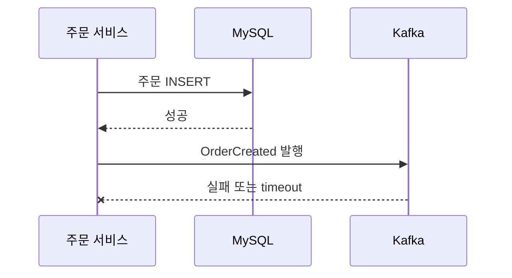
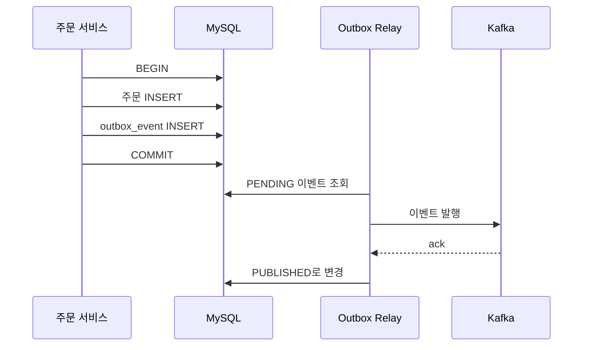
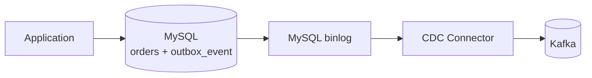

# Transactional Outbox Pattern

<div class="concept-box" markdown="1">

**Transactional Outbox Pattern**: 비즈니스 데이터 변경과 발행할 이벤트를 **같은 DB 트랜잭션**에 저장한 뒤, 별도 Relay가 Outbox 테이블을 읽어 Kafka 같은 메시지 브로커로 발행하는 패턴.

</div>

Outbox 패턴은 "주문 저장은 됐는데 주문 생성 이벤트 발행은 실패했다" 같은 문제를 줄이기 위해 사용합니다. 처음에는 어렵게 보이지만 핵심은 단순합니다.

```text
DB에는 주문도 저장하고, 발행해야 할 이벤트도 같이 저장한다.
Kafka 발행은 요청 처리 흐름에서 바로 하지 않고, 별도 Relay가 나중에 한다.
Relay가 실패해도 Outbox 테이블에 이벤트가 남아 있으므로 다시 시도할 수 있다.
```

## 왜 쓰는지

### 이중 쓰기 문제가 생긴다

서비스에서는 DB 저장과 이벤트 발행을 함께 해야 하는 경우가 많습니다.

```text
1. 주문을 DB에 저장한다.
2. 주문 생성 이벤트를 Kafka에 발행한다.
```

문제는 DB와 Kafka가 서로 다른 시스템이라는 점입니다. 애플리케이션 코드에서는 한 메서드 안에 있어도, 실제로는 **DB write**와 **Kafka publish**라는 두 번의 쓰기가 일어납니다. 이를 보통 **dual write problem, 이중 쓰기 문제**라고 부릅니다.



이 경우 주문은 DB에 있는데, 재고 서비스나 알림 서비스는 주문 생성 사실을 모를 수 있습니다. 반대로 Kafka 발행은 성공했는데 DB 트랜잭션이 rollback되면, 실제로 없는 주문을 다른 서비스가 처리할 수도 있습니다.

| 시나리오 | 결과 |
|----------|------|
| DB 저장 성공, Kafka 발행 실패 | 다른 서비스가 변경 사실을 모름 |
| Kafka 발행 성공, DB 저장 실패 | 실제 없는 데이터를 기준으로 후속 처리 가능 |
| Kafka 발행 성공, 응답 timeout | 성공 여부를 몰라 재시도하면서 중복 발행 가능 |
| 애플리케이션이 중간에 종료 | 어디까지 처리됐는지 추적하기 어려움 |

### 하나의 트랜잭션으로 묶기 어렵다

MySQL 트랜잭션은 MySQL 안의 변경만 원자적으로 묶습니다. Kafka publish까지 MySQL 트랜잭션에 자연스럽게 포함되지는 않습니다.

```text
BEGIN
  INSERT INTO orders ...
COMMIT

kafkaTemplate.send(...)
```

위 코드에서 DB commit과 Kafka send 사이에 장애가 나면 이벤트가 유실됩니다. 그래서 Outbox는 Kafka에 바로 보내지 않고, **보낼 이벤트를 DB에 먼저 남기는 방식**을 선택합니다.



<div class="concept-box" markdown="1">

**핵심**: Outbox는 DB 변경과 Kafka 발행을 한 번에 처리하는 마법이 아니다. DB 변경과 "발행해야 할 이벤트 기록"을 같은 트랜잭션에 넣어, Kafka 발행 실패를 나중에 재시도할 수 있게 만드는 패턴이다.

</div>

## 어떻게 쓰는지

### 1. Outbox 테이블을 만든다

Outbox 테이블은 "아직 브로커로 발행하지 않았거나, 발행 결과를 기록해야 하는 이벤트"를 저장합니다. 아래 예시는 MySQL 기준입니다.

```sql
CREATE TABLE outbox_event (
    id BIGINT AUTO_INCREMENT PRIMARY KEY,
    event_id CHAR(36) NOT NULL,
    aggregate_type VARCHAR(50) NOT NULL,
    aggregate_id VARCHAR(100) NOT NULL,
    event_type VARCHAR(100) NOT NULL,
    event_key VARCHAR(100) NOT NULL,
    payload JSON NOT NULL,
    headers JSON NULL,
    status ENUM('PENDING', 'PUBLISHED', 'FAILED') NOT NULL DEFAULT 'PENDING',
    retry_count INT NOT NULL DEFAULT 0,
    next_attempt_at DATETIME(6) NOT NULL DEFAULT CURRENT_TIMESTAMP(6),
    locked_by VARCHAR(100) NULL,
    locked_at DATETIME(6) NULL,
    published_at DATETIME(6) NULL,
    last_error TEXT NULL,
    created_at DATETIME(6) NOT NULL DEFAULT CURRENT_TIMESTAMP(6),
    updated_at DATETIME(6) NOT NULL DEFAULT CURRENT_TIMESTAMP(6)
        ON UPDATE CURRENT_TIMESTAMP(6),

    UNIQUE KEY uk_outbox_event_id (event_id),
    KEY idx_outbox_pending (status, next_attempt_at, created_at, id),
    KEY idx_outbox_aggregate (aggregate_type, aggregate_id, id)
) ENGINE=InnoDB;
```

| 컬럼 | 의미 |
|------|------|
| `event_id` | 이벤트 전역 고유 ID. 중복 처리 방지에 사용 |
| `aggregate_type` | 이벤트가 발생한 업무 객체 종류. 예: `ORDER`, `PAYMENT` |
| `aggregate_id` | 업무 객체 ID. 예: 주문 ID |
| `event_type` | 이벤트 종류. 예: `ORDER_CREATED` |
| `event_key` | Kafka key로 사용할 값. 순서 보장이 필요한 단위 |
| `payload` | consumer가 읽을 실제 이벤트 내용 |
| `status` | 발행 상태. `PENDING`, `PUBLISHED`, `FAILED` |
| `retry_count` | 발행 재시도 횟수 |
| `next_attempt_at` | 다음 발행 시도 가능 시각 |
| `locked_by`, `locked_at` | 여러 Relay가 동시에 잡지 않기 위한 작업 소유권 |
| `published_at` | 발행 성공 시각 |
| `last_error` | 마지막 실패 원인 |

!!! tip "payload 타입"
    MySQL `JSON` 타입을 쓰면 payload 형식 검증과 일부 조회가 편합니다. 단순 저장만 필요하거나 구버전 MySQL을 사용한다면 `TEXT`로 둘 수도 있습니다.

### 2. 비즈니스 데이터와 Outbox 이벤트를 같은 트랜잭션에 저장한다

주문 생성 요청을 처리할 때 주문만 저장하지 않고, 발행할 이벤트도 같은 트랜잭션에 저장합니다.

```sql
START TRANSACTION;

INSERT INTO orders (
    user_id,
    total_amount,
    status,
    created_at
) VALUES (
    10,
    39000,
    'CREATED',
    NOW(6)
);

SET @order_id = LAST_INSERT_ID();

INSERT INTO outbox_event (
    event_id,
    aggregate_type,
    aggregate_id,
    event_type,
    event_key,
    payload,
    status,
    created_at
) VALUES (
    UUID(),
    'ORDER',
    CAST(@order_id AS CHAR),
    'ORDER_CREATED',
    CAST(@order_id AS CHAR),
    JSON_OBJECT(
        'eventType', 'ORDER_CREATED',
        'schemaVersion', 1,
        'orderId', @order_id,
        'userId', 10,
        'amount', 39000
    ),
    'PENDING',
    NOW(6)
);

COMMIT;
```

Spring 코드로 보면 아래처럼 이해할 수 있습니다.

```java
@Transactional
public Long createOrder(CreateOrderCommand command) {
    Order order = orderRepository.save(Order.create(command));

    OutboxEvent event = OutboxEvent.pending(
            UUID.randomUUID().toString(),
            "ORDER",
            order.getId().toString(),
            "ORDER_CREATED",
            order.getId().toString(),
            OrderCreatedPayload.from(order)
    );

    outboxEventRepository.save(event);
    return order.getId();
}
```

여기서 중요한 점은 `kafkaTemplate.send()`를 호출하지 않는다는 것입니다. 요청 처리 트랜잭션은 DB에 주문과 Outbox 이벤트를 안전하게 남기는 데 집중합니다.

<div class="compare-grid" markdown="1">
<div class="before" markdown="1">
**Bad - DB 저장 후 바로 Kafka 발행**

```java
@Transactional
public void createOrder(...) {
    Order order = orderRepository.save(...);
    kafkaTemplate.send("order-events", order.getId(), event);
}
```

DB commit과 Kafka 발행 성공이 원자적으로 묶이지 않습니다.
</div>
<div class="after" markdown="1">
**Good - Outbox에 이벤트 기록**

```java
@Transactional
public void createOrder(...) {
    Order order = orderRepository.save(...);
    outboxRepository.save(eventFrom(order));
}
```

주문과 발행 대상 이벤트가 같은 DB 트랜잭션에 남습니다.
</div>
</div>

### 3. Relay가 PENDING 이벤트를 가져간다

Relay는 Outbox 테이블을 읽어 메시지 브로커로 발행하는 별도 프로세스입니다. 같은 애플리케이션 안의 스케줄러일 수도 있고, 별도 worker 서비스일 수도 있습니다.

여러 Relay가 동시에 실행될 수 있으므로 먼저 작은 배치 단위로 이벤트를 "내가 처리하겠다"고 표시합니다.

```sql
UPDATE outbox_event
SET locked_by = 'relay-1',
    locked_at = NOW(6)
WHERE status = 'PENDING'
  AND next_attempt_at <= NOW(6)
  AND (
      locked_at IS NULL
      OR locked_at < DATE_SUB(NOW(6), INTERVAL 5 MINUTE)
  )
ORDER BY created_at, id
LIMIT 100;
```

그 다음 자신이 잡은 이벤트를 조회합니다.

```sql
SELECT id,
       event_id,
       event_type,
       event_key,
       payload
FROM outbox_event
WHERE status = 'PENDING'
  AND locked_by = 'relay-1'
ORDER BY created_at, id
LIMIT 100;
```

!!! warning "Relay 락"
    `locked_by`, `locked_at`은 여러 Relay가 같은 row를 동시에 발행하는 일을 줄이기 위한 장치입니다. Relay가 죽을 수 있으므로 `locked_at` timeout 기준으로 다시 잡을 수 있게 둡니다.

### 4. Kafka 발행 성공 후 상태를 바꾼다

Kafka 발행이 성공하면 Outbox row를 `PUBLISHED`로 변경합니다.

```sql
UPDATE outbox_event
SET status = 'PUBLISHED',
    published_at = NOW(6),
    locked_by = NULL,
    locked_at = NULL,
    last_error = NULL
WHERE id = 1001
  AND status = 'PENDING';
```

발행이 실패하면 재시도 정보를 갱신합니다.

```sql
UPDATE outbox_event
SET retry_count = retry_count + 1,
    next_attempt_at = DATE_ADD(NOW(6), INTERVAL 30 SECOND),
    locked_by = NULL,
    locked_at = NULL,
    last_error = 'Kafka timeout'
WHERE id = 1001
  AND status = 'PENDING';
```

실무에서는 실패 횟수에 따라 backoff를 늘립니다.

| 실패 횟수 | 다음 시도 예시 |
|-----------|----------------|
| 1회 | 10초 뒤 |
| 2회 | 30초 뒤 |
| 3회 | 1분 뒤 |
| 4회 이상 | 5분 뒤 또는 FAILED 격리 |

반복 실패하는 이벤트는 무한 재시도하지 말고 `FAILED`로 격리한 뒤 원인을 확인합니다.

```sql
UPDATE outbox_event
SET status = 'FAILED',
    locked_by = NULL,
    locked_at = NULL,
    last_error = 'schema validation failed'
WHERE id = 1001;
```

### 5. Consumer는 멱등하게 만든다

Outbox는 이벤트 유실을 줄여주지만, 중복 발행 가능성을 완전히 없애지는 않습니다.

```text
1. Relay가 Kafka 발행 성공
2. Relay가 PUBLISHED 업데이트 전에 장애
3. 다음 Relay가 같은 Outbox 이벤트를 다시 발행
```

그래서 consumer는 같은 `event_id`가 다시 와도 결과가 한 번만 반영되게 만들어야 합니다.

```sql
CREATE TABLE processed_event (
    event_id CHAR(36) PRIMARY KEY,
    consumer_name VARCHAR(100) NOT NULL,
    processed_at DATETIME(6) NOT NULL DEFAULT CURRENT_TIMESTAMP(6)
) ENGINE=InnoDB;
```

처리 흐름은 아래처럼 잡습니다.

```text
1. 이벤트를 받는다.
2. processed_event에 event_id insert를 시도한다.
3. 이미 있으면 중복 이벤트이므로 skip한다.
4. 없으면 업무 처리를 수행한다.
5. Kafka offset을 commit한다.
```

<div class="warning-box" markdown="1">

**주의**: Outbox의 기본 전달 모델은 보통 at-least-once입니다. 즉 "최소 한 번은 보내자"에 가깝고, "무조건 정확히 한 번만 처리"가 아닙니다.

</div>

## Polling과 CDC

Outbox 이벤트를 브로커로 보내는 방식은 크게 Polling과 CDC로 나눌 수 있습니다.

| 방식 | 설명 | 장점 | 단점 |
|------|------|------|------|
| Polling | Relay가 Outbox 테이블을 주기적으로 조회 | 구현이 직관적이고 디버깅 쉬움 | 조회 부하와 약간의 발행 지연 |
| CDC | DB binlog 변경을 Debezium 같은 도구가 읽어 Kafka로 발행 | 애플리케이션 polling 부하 감소 | 운영 난도와 인프라 구성 증가 |

### Polling 방식

처음 도입할 때는 Polling 방식이 이해하기 쉽습니다.

```text
매 1초마다:
  PENDING 이벤트 100개 조회
  Kafka 발행
  성공하면 PUBLISHED
  실패하면 retry_count 증가
```

Polling은 단순하지만 테이블이 커지면 인덱스와 정리 작업이 중요합니다. `status`, `next_attempt_at`, `created_at` 기준 인덱스 없이 조회하면 Outbox 테이블이 병목이 될 수 있습니다.

### CDC 방식

CDC는 DB 변경 로그를 읽어서 이벤트로 내보내는 방식입니다. 대표적으로 Debezium이 MySQL binlog를 읽고 Kafka로 전달하는 구조를 사용할 수 있습니다.



CDC 방식은 Outbox row가 INSERT되는 순간 변경 로그를 통해 Kafka로 흘려보낼 수 있습니다. 다만 binlog 설정, connector 운영, schema 변경, 장애 복구 기준까지 함께 관리해야 합니다.

## 언제 쓰는지

| 상황 | 적합도 | 이유 |
|------|--------|------|
| 주문 생성 후 재고, 알림, 검색 색인에 이벤트 전달 | 높음 | DB 변경 사실이 유실되면 후속 시스템이 틀어짐 |
| 결제 완료 후 정산, 포인트, 알림 처리 | 높음 | 결제 상태 변경과 이벤트 발행 정합성이 중요 |
| MSA에서 서비스 간 최종 일관성 유지 | 높음 | 각 서비스가 이벤트를 받아 자기 DB를 갱신 |
| 캐시 무효화 이벤트 발행 | 중간 | 유실 영향이 크면 적합, 단순 캐시면 TTL로도 완화 가능 |
| 단순 이메일 발송 실패 허용 | 낮음 | 운영 복잡도 대비 이득이 작을 수 있음 |
| 사용자 요청 안에서 즉시 결과가 필요 | 낮음 | Outbox는 비동기 최종 일관성 패턴 |
| 단일 DB 안에서만 처리되는 업무 | 낮음 | DB 트랜잭션만으로 충분할 수 있음 |

## 장점

| 장점 | 설명 |
|------|------|
| 이벤트 유실 방지 | 비즈니스 데이터와 발행 대상 이벤트가 같은 DB 트랜잭션에 저장 |
| 재시도 가능 | Kafka 장애나 네트워크 장애가 있어도 Outbox row가 남음 |
| 장애 추적 쉬움 | 어떤 이벤트가 `PENDING`, `FAILED`인지 DB에서 확인 가능 |
| 요청 응답 안정화 | Kafka 발행 지연을 사용자 요청 흐름에서 분리 가능 |
| 최종 일관성 구현 | 서비스 간 데이터 동기화를 이벤트 기반으로 처리 |
| 감사 로그 활용 | 어떤 이벤트를 언제 만들고 발행했는지 추적 가능 |

## 단점

| 단점 | 설명 |
|------|------|
| 구현 요소 증가 | Outbox 테이블, Relay, 재시도, 정리 배치가 필요 |
| 발행 지연 | Polling 주기나 Relay 처리량에 따라 이벤트가 늦게 발행될 수 있음 |
| 중복 발행 가능 | 발행 성공 후 상태 업데이트 실패 시 같은 이벤트가 다시 나갈 수 있음 |
| Consumer 멱등성 필요 | downstream 서비스가 중복 이벤트를 견뎌야 함 |
| 테이블 관리 필요 | 오래된 row를 삭제하거나 아카이빙해야 함 |
| 운영 지표 필요 | pending 증가, failed 증가, relay 중단을 감시해야 함 |

## 특징

### DB 트랜잭션을 기준으로 안정성을 확보한다

Outbox는 Kafka를 DB 트랜잭션에 넣는 방식이 아닙니다. DB가 잘하는 원자적 저장을 활용해 "발행할 이벤트가 있었다"는 사실을 안전하게 남깁니다.

### 최종 일관성 패턴이다

주문 API가 성공한 직후 재고 서비스가 아직 이벤트를 처리하지 않았을 수 있습니다. 시간이 지나 Relay와 consumer가 처리하면 시스템들이 같은 방향으로 수렴합니다.

```text
T1: 주문 DB 저장 완료
T2: Outbox Relay가 Kafka 발행
T3: 재고 Consumer가 재고 차감
T4: 알림 Consumer가 문자 발송
```

### 최소 한 번 전달을 기본으로 본다

Outbox는 유실을 줄이는 대신 중복 가능성을 받아들입니다. 따라서 `event_id`, unique key, 상태 전이 검증 같은 멱등성 설계가 함께 필요합니다.

### 순서 보장은 key 설계와 함께 봐야 한다

같은 주문의 이벤트 순서가 중요하면 `event_key`를 `orderId`로 두고 Kafka key로 사용합니다. 그래야 같은 주문 이벤트가 같은 partition으로 들어가 순서 보장에 유리합니다.

## 주의할 점

<div class="danger-box" markdown="1">

**Outbox는 중복을 없애는 패턴이 아닙니다.** 발행 성공 후 상태 업데이트 실패, Relay timeout, consumer 재처리 때문에 같은 이벤트가 다시 갈 수 있습니다.

</div>

<div class="warning-box" markdown="1">

**Kafka 발행을 DB 트랜잭션 안에서 오래 기다리지 않습니다.** 외부 시스템 호출을 트랜잭션 안에 넣으면 DB lock 시간이 길어지고, 장애 시 요청 처리까지 같이 느려질 수 있습니다.

</div>

<div class="warning-box" markdown="1">

**Outbox row 정리를 설계해야 합니다.** `PUBLISHED` 이벤트를 무기한 보관하면 테이블과 인덱스가 계속 커집니다.

</div>

| 주의 | 설명 |
|------|------|
| consumer 멱등성 없이 도입하지 않기 | 중복 이벤트가 정상 시나리오이기 때문 |
| `event_id` 없이 payload만 보내지 않기 | 추적과 중복 방지가 어려움 |
| Relay가 잡은 row를 영구 lock하지 않기 | Relay 장애 시 다시 잡을 수 있어야 함 |
| PENDING lag를 방치하지 않기 | 이벤트 발행 지연이 서비스 간 데이터 불일치로 이어짐 |
| FAILED를 수동으로만 보지 않기 | 알림과 재처리 절차가 필요 |
| payload에 민감정보를 무심코 넣지 않기 | Kafka와 Outbox DB 양쪽에 남음 |
| 모든 이벤트를 하나의 타입으로 뭉개지 않기 | consumer 분기와 schema 관리가 어려워짐 |

## 베스트 프랙티스

| 권장 방식 | 이유 |
|-----------|------|
| 비즈니스 데이터와 Outbox insert를 같은 트랜잭션에 넣기 | 둘 중 하나만 저장되는 상황 방지 |
| `event_id`를 전역 고유값으로 생성 | 발행 추적과 consumer 멱등성의 기준 |
| `event_key`를 업무 순서 기준으로 정하기 | Kafka partition 순서 보장에 영향 |
| payload에 `schemaVersion` 포함 | consumer 호환성 관리 |
| `status`, `next_attempt_at`, `created_at` 인덱스 생성 | Relay 조회 성능 확보 |
| 작은 batch로 발행 | 긴 lock과 대량 실패를 피함 |
| retry backoff 적용 | Kafka 장애 시 무한 빠른 재시도로 장애 확대 방지 |
| FAILED 또는 DLQ 운영 | poison event를 정상 이벤트와 분리 |
| PENDING 개수와 최대 지연 시간 모니터링 | Relay 장애나 Kafka 장애 조기 감지 |
| PUBLISHED row 삭제/아카이빙 | 테이블 비대화 방지 |
| consumer에서 unique key, upsert 활용 | 중복 이벤트를 안전하게 처리 |

## 실무에서는?

### 주문 생성 이벤트

주문 생성은 DB 저장과 이벤트 발행이 둘 다 중요합니다. 주문은 생성됐는데 재고 서비스가 모르면 overselling이나 재고 불일치가 생길 수 있습니다.

```text
OrderService
  -> orders INSERT
  -> outbox_event INSERT(ORDER_CREATED)
  -> COMMIT

OutboxRelay
  -> ORDER_CREATED 발행

InventoryConsumer
  -> event_id 중복 확인
  -> 재고 차감
```

### 결제 완료 이벤트

결제 완료 후 정산, 포인트, 영수증, 알림이 이어질 수 있습니다. 결제 상태 변경은 DB 트랜잭션으로 확정하고, 후속 처리는 Outbox 이벤트로 분리합니다.

| 후속 처리 | Outbox를 쓰는 이유 |
|-----------|--------------------|
| 정산 요청 | 결제 완료 이벤트 유실 방지 |
| 포인트 적립 | 중복 적립 방지를 위해 `event_id` 기반 멱등성 필요 |
| 알림 발송 | 결제 응답과 알림 발송 지연 분리 |
| 영수증 생성 | 실패 시 재시도 가능 |

### 검색 색인 갱신

상품이나 게시글이 변경되면 검색 색인도 갱신해야 합니다. 검색 색인은 원본 DB에서 다시 만들 수 있는 파생 데이터인 경우가 많으므로 Outbox와 잘 맞습니다.

```text
게시글 수정 -> DB 저장 + POST_UPDATED outbox
Relay -> Kafka 발행
Search Consumer -> Elasticsearch 색인 갱신
```

### 캐시 무효화

DB 변경 후 Redis cache를 지워야 할 때도 Outbox를 사용할 수 있습니다. 다만 캐시는 TTL이나 Cache Aside로 완화할 수 있으므로, 유실 영향이 큰지 먼저 판단합니다.

## 처음 볼 때 자주 헷갈리는 점

| 헷갈리는 생각 | 실제로는 |
|---------------|----------|
| Outbox를 쓰면 Kafka까지 한 트랜잭션이다 | Kafka 발행은 나중에 하며, DB에는 발행할 이벤트를 안전하게 남긴다 |
| Outbox를 쓰면 중복이 사라진다 | 중복은 가능하므로 consumer 멱등성이 필요하다 |
| Outbox 테이블은 로그라서 계속 쌓아도 된다 | 운영 DB에 두면 인덱스와 용량 관리가 필요하다 |
| Relay는 하나만 두면 된다 | 고가용성을 위해 여러 개 둘 수 있고, 그 경우 lock 설계가 필요하다 |
| 이벤트 payload는 아무렇게나 넣어도 된다 | consumer 계약이므로 schema와 version을 관리해야 한다 |
| PENDING이 조금 쌓여도 괜찮다 | 오래 쌓이면 서비스 간 데이터 불일치 시간이 길어진다 |

## 정리

| 항목 | 설명 |
|------|------|
| 해결 문제 | DB 저장과 메시지 발행 사이의 이중 쓰기 문제 |
| 핵심 아이디어 | 비즈니스 데이터와 Outbox 이벤트를 같은 DB 트랜잭션에 저장 |
| 발행 담당 | Outbox Relay 또는 CDC Connector |
| 전달 보장 | 보통 at-least-once |
| 반드시 필요한 것 | consumer 멱등성, 재시도, 실패 격리, 모니터링 |
| 주의할 점 | 중복 가능성, 발행 지연, Outbox 테이블 비대화 |
| 실무 기준 | 유실은 Outbox로 줄이고, 중복은 consumer 멱등성으로 견딘다 |

---

**관련 파일:**
- [Kafka](../infra/kafka.md) — 메시지 브로커 기반 이벤트 발행
- [MSA](msa.md) — 서비스 간 최종 일관성
- [모니터링](../operations/monitoring.md) — lag와 실패 이벤트 관찰
