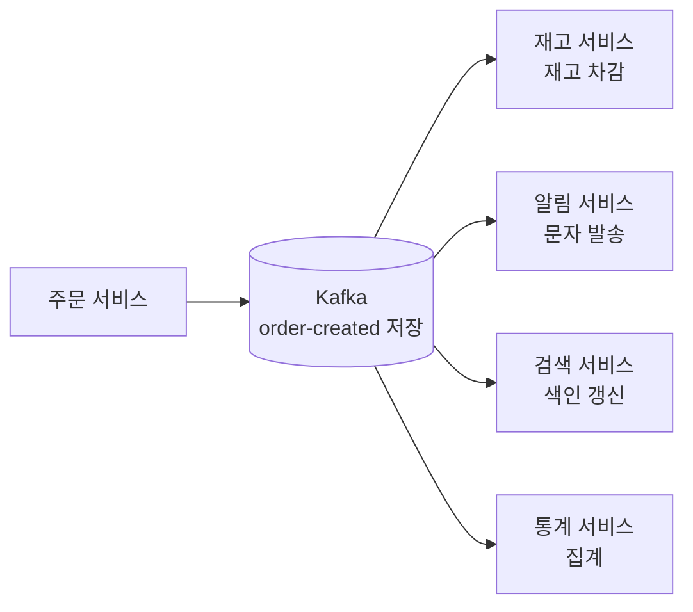

# Kafka

Kafka 학습 노트의 입구입니다. 개념 설명은 [Kafka란?](./kafka/kafka란.md)에서 보고, 필요한 주제는 아래 카테고리로 바로 이동하면 됩니다.

## 먼저 잡을 그림

Kafka는 단순히 "메시지를 잠깐 전달하는 큐"라기보다, **서비스에서 일어난 일을 로그로 남겨두고 여러 시스템이 각자 필요한 속도로 읽게 해주는 중간 저장소**에 가깝습니다.

예를 들어 주문이 생성되면 주문 서비스가 재고, 알림, 검색, 통계 서비스를 모두 직접 호출할 수도 있습니다. 하지만 호출 대상 중 하나가 느리거나 장애가 나면 주문 처리까지 영향을 받을 수 있습니다.



이때 Kafka의 역할은 "재고를 차감해주는 것"이 아닙니다. Kafka는 **주문이 생성되었다는 이벤트를 안전하게 받아서 보관**하고, 각 consumer가 자기 책임에 맞게 읽어가도록 도와줍니다.

| 관점 | 직접 API 호출 | Kafka 사용 |
|------|---------------|------------|
| 서비스 관계 | 호출하는 쪽이 호출 대상과 강하게 연결됨 | producer와 consumer가 느슨하게 연결됨 |
| 장애 영향 | 호출 대상 지연이 요청 흐름에 전파되기 쉬움 | 이벤트를 보관하고 consumer가 나중에 따라잡을 수 있음 |
| 같은 데이터 활용 | 필요한 곳마다 호출 로직 추가 | 여러 consumer group이 같은 이벤트를 독립적으로 읽음 |
| 다시 처리 | 별도 저장 없으면 어려움 | retention 안에서 offset 기준으로 재처리 가능 |

처음에는 아래 흐름만 기억하면 됩니다.

```text
Producer는 "무슨 일이 일어났는지" 이벤트를 발행한다.
Kafka는 이벤트를 topic과 partition에 순서대로 저장한다.
Consumer group은 자기 offset을 기준으로 읽고 처리한다.
처리에 실패하면 commit된 offset 이후부터 다시 읽을 수 있다.
```

## 학습 카테고리

| 순서 | 카테고리 | 바로가기 |
|------|----------|----------|
| 1 | Kafka란? | [Kafka란?](./kafka/kafka란.md) |
| 2 | 기본 개념과 구조 | [기본 개념과 구조](./kafka/기본개념.md) |
| 3 | 토픽과 파티션 설계 | [토픽과 파티션 설계](./kafka/토픽파티션설계.md) |
| 4 | Producer와 이벤트 설계 | [Producer와 이벤트 설계](./kafka/producer.md) |
| 5 | Consumer와 전달 보장 | [Consumer와 전달 보장](./kafka/consumer.md) |
| 6 | Key 설계와 순서 보장 | [Key 설계와 순서 보장](./kafka/키순서설계.md) |
| 7 | Schema 관리와 이벤트 버전 | [Schema 관리와 이벤트 버전](./kafka/스키마관리.md) |
| 8 | Transaction과 Exactly-once | [Transaction과 Exactly-once](./kafka/트랜잭션정확히한번.md) |
| 9 | 운영 구조와 고가용성 | [운영 구조와 고가용성](./kafka/운영구조와고가용성.md) |
| 10 | Spring Boot 연동 | [Spring Boot Kafka 연동](./kafka/springboot.md) |
| 11 | 실무 유즈케이스 | [실무 유즈케이스](./kafka/실무유즈케이스.md) |
| 12 | 성능 최적화 | [성능 최적화](./kafka/성능최적화.md) |
| 13 | 장애 대응 | [장애 대응과 트러블슈팅](./kafka/운영장애대응.md) |
| 14 | 모니터링과 보안 | [모니터링과 보안](./kafka/모니터링보안.md) |
| 15 | 비교와 선택 기준 | [비교와 선택 기준](./kafka/비교선택.md) |
| 16 | 베스트 프랙티스 | [베스트 프랙티스](./kafka/베스트프랙티스.md) |

## 빠른 선택

| 상황 | 먼저 볼 문서 |
|------|--------------|
| Kafka가 무엇인지 처음 잡고 싶음 | [Kafka란?](./kafka/kafka란.md) |
| topic, partition, offset을 이해하고 싶음 | [기본 개념과 구조](./kafka/기본개념.md) |
| topic을 몇 개, partition을 몇 개로 만들지 고민됨 | [토픽과 파티션 설계](./kafka/토픽파티션설계.md) |
| 이벤트 발행 안정성을 잡고 싶음 | [Producer와 이벤트 설계](./kafka/producer.md) |
| 중복 소비와 offset commit이 헷갈림 | [Consumer와 전달 보장](./kafka/consumer.md) |
| 순서 보장이 필요한 이벤트를 설계해야 함 | [Key 설계와 순서 보장](./kafka/키순서설계.md) |
| 이벤트 필드 변경이 걱정됨 | [Schema 관리와 이벤트 버전](./kafka/스키마관리.md) |
| Spring Boot에서 Kafka를 써야 함 | [Spring Boot Kafka 연동](./kafka/springboot.md) |
| lag, poison pill, broker 장애를 봐야 함 | [장애 대응과 트러블슈팅](./kafka/운영장애대응.md) |
| Kafka가 맞는 도구인지 비교하고 싶음 | [비교와 선택 기준](./kafka/비교선택.md) |

---

**관련 파일:**
- [Backend 개요](../backend.md)
- [Redis](./redis.md)
- [아웃박스 패턴](../architecture/outbox.md)

--8<-- "includes/kafka/core.md"
--8<-- "includes/kafka/producer-consumer.md"
--8<-- "includes/kafka/operations.md"
--8<-- "includes/kafka/comparison.md"
