# Kafka

## 왜 쓰는지

서비스가 다른 서비스에 직접 API를 호출하면 호출 대상 장애, 응답 지연, 일시적 트래픽 증가가 호출한 쪽까지 전파됩니다. Kafka는 이벤트를 중간에 저장해 생산자와 소비자를 분리하고, 소비자가 자기 속도에 맞춰 처리할 수 있게 합니다.

<div class="concept-box" markdown="1">

**핵심**: Kafka는 이벤트를 토픽에 append-only log로 저장하고, 여러 소비자가 offset을 기준으로 독립적으로 읽어가는 분산 이벤트 스트리밍 플랫폼이다.

</div>

Kafka를 큐로만 이해하면 장애 대응이 어려워집니다. 실무에서는 Kafka를 **보존 가능한 이벤트 로그**로 보고, producer·broker·consumer·저장소 사이의 실패 지점을 각각 나누어 설계해야 합니다.

### 전체 그림

Kafka는 producer가 이벤트를 넣고, broker가 이벤트를 보관하고, consumer group이 각자 필요한 속도로 읽어가는 구조입니다.

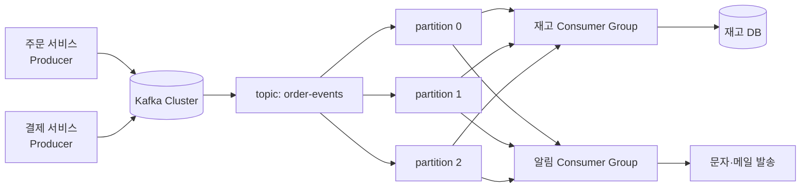

그림을 이렇게 읽으면 됩니다.

| 구성요소 | 쉬운 설명 |
|----------|-----------|
| Producer | 이벤트를 Kafka에 넣는 쪽 |
| Topic | 이벤트를 종류별로 담는 이름 |
| Partition | topic 안에서 실제로 쌓이는 로그 파일 같은 단위 |
| Consumer Group | 같은 일을 나눠 처리하는 소비자 묶음 |
| Offset | consumer group이 어디까지 읽었는지 표시하는 책갈피 |

Kafka를 처음 배울 때 가장 중요한 문장입니다.

```text
Producer는 topic에 쓴다.
Kafka는 partition에 순서대로 보관한다.
Consumer group은 offset을 기억하며 읽는다.
서로 다른 consumer group은 같은 이벤트를 따로 읽을 수 있다.
```

## 어떻게 쓰는지

### 토픽 생성

운영 기준 토픽은 보통 replication factor를 3으로 두고, `acks=all`과 함께 `min.insync.replicas=2`를 사용합니다.

```bash
kafka-topics.sh \
  --bootstrap-server kafka-1:9092,kafka-2:9092,kafka-3:9092 \
  --create \
  --topic order-created \
  --partitions 6 \
  --replication-factor 3 \
  --config min.insync.replicas=2 \
  --config retention.ms=604800000
```

| 설정 | 의미 | 기준 |
|------|------|------|
| `partitions` | 병렬 처리와 순서 보장 단위 | 처리량, key 분포, consumer 수 기준 |
| `replication-factor` | 파티션 복제본 수 | 운영은 보통 3 이상 |
| `min.insync.replicas` | 성공 쓰기에 필요한 ISR 수 | RF 3이면 2를 자주 사용 |
| `retention.ms` | 메시지 보관 시간 | 재처리 가능 기간 기준 |

토픽을 만들면 내부적으로는 여러 partition이 생깁니다.

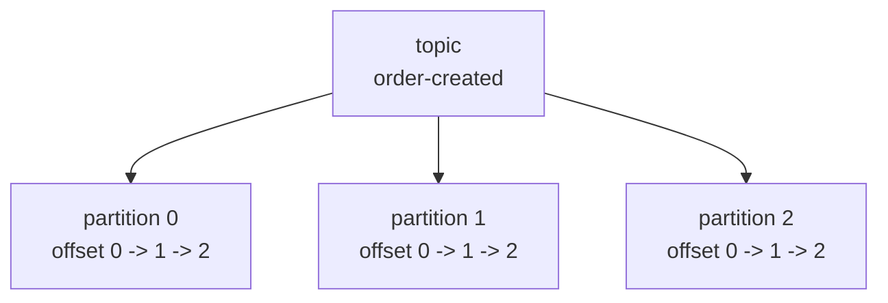

여기서 partition 수는 "동시에 몇 줄로 처리할 수 있는가"를 정합니다. partition이 6개면 같은 consumer group 안에서 최대 6개 consumer가 각 partition을 하나씩 맡아 병렬 처리할 수 있습니다.

### 이벤트 설계

이벤트는 나중에 재처리하고 추적할 수 있어야 합니다.

```json
{
  "eventId": "evt-20260425-000001",
  "eventType": "ORDER_CREATED",
  "schemaVersion": 1,
  "occurredAt": "2026-04-25T10:15:00Z",
  "aggregateType": "ORDER",
  "aggregateId": "order-1001",
  "producer": "order-service",
  "payload": {
    "orderId": 1001,
    "userId": 10,
    "amount": 39000
  }
}
```

| 필드 | 이유 |
|------|------|
| `eventId` | 중복 처리 방지, 추적 |
| `eventType` | 소비자가 이벤트 의미를 판단 |
| `schemaVersion` | 스키마 변경 대응 |
| `occurredAt` | 이벤트 발생 시각 |
| `aggregateId` | 순서 보장 key 후보 |
| `producer` | 장애 추적 |

이벤트는 단순 데이터 덩어리가 아니라 "나중에 다시 봐도 무슨 일이 있었는지 알 수 있는 기록"이어야 합니다.

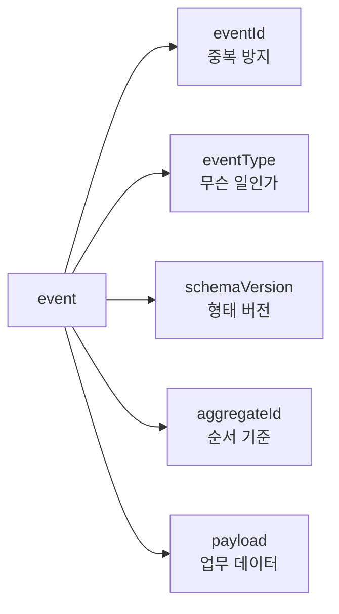

신입이 이벤트를 설계할 때 `payload`부터 채우는 경우가 많습니다. 실무에서는 `eventId`, `eventType`, `schemaVersion`, `aggregateId`처럼 운영과 장애 대응에 필요한 필드가 먼저 안정적으로 잡혀야 합니다.

### Producer 설정

중요 이벤트는 유실보다 중복이 낫습니다. producer는 재시도와 멱등성을 켜고, consumer는 중복을 견디게 설계합니다.

```properties
bootstrap.servers=kafka-1:9092,kafka-2:9092,kafka-3:9092
acks=all
enable.idempotence=true
retries=2147483647
delivery.timeout.ms=120000
request.timeout.ms=30000
linger.ms=5
batch.size=32768
compression.type=lz4
max.in.flight.requests.per.connection=5
```

| 설정 | 의미 | 주의 |
|------|------|------|
| `acks=all` | leader가 ISR 복제를 기다림 | `min.insync.replicas`와 같이 봐야 함 |
| `enable.idempotence=true` | producer 재시도 중 broker log 중복 기록 방지 | consumer 중복 처리까지 없애는 것은 아님 |
| `retries` | 일시 장애 재시도 | `delivery.timeout.ms` 안에서 동작 |
| `delivery.timeout.ms` | 발행 전체 제한 시간 | 너무 짧으면 일시 장애에 취약 |
| `linger.ms` | 배치를 위해 잠깐 기다림 | 처리량과 지연의 trade-off |
| `batch.size` | 배치 크기 | 너무 크면 지연과 메모리 증가 |
| `compression.type` | 압축 | CPU와 네트워크 절충 |

Producer는 메시지를 바로 네트워크에 하나씩 던지는 것이 아니라, 내부 버퍼에 모았다가 batch로 보냅니다.

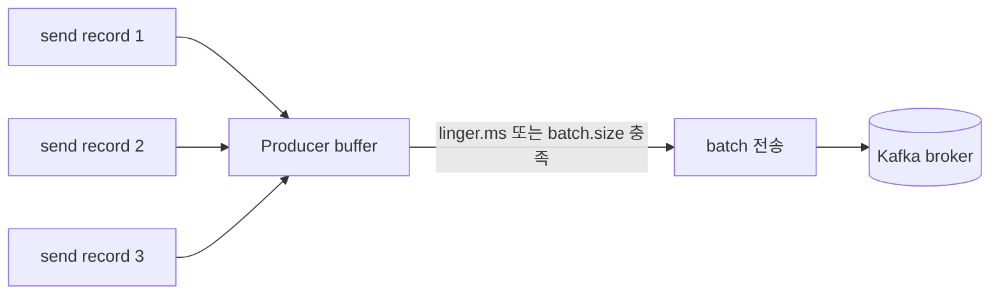

그래서 `linger.ms`를 조금 주면 처리량은 좋아질 수 있지만, 그만큼 각 메시지가 잠깐 기다릴 수 있습니다. 실시간성이 중요한 알림과 대량 로그 수집은 producer 설정 기준이 달라질 수 있습니다.

### Key 선택

Kafka의 순서는 토픽 전체가 아니라 **파티션 안에서만** 보장됩니다. 같은 업무 단위의 순서가 필요하면 같은 key를 사용해야 합니다.

```text
topic: order-events
key: order-1001
value: ORDER_CREATED

topic: order-events
key: order-1001
value: ORDER_PAID
```

| key 후보 | 장점 | 단점 |
|----------|------|------|
| `orderId` | 주문별 순서 보장 | 특정 주문 폭주 시 hot partition 가능 |
| `userId` | 사용자별 순서 보장 | 큰 사용자 편차가 있으면 불균등 |
| 랜덤 key | 분산이 좋음 | 업무 순서 보장 어려움 |
| key 없음 | round-robin 분산 | 같은 엔티티 순서 보장 없음 |

key는 partition을 고르는 기준입니다.

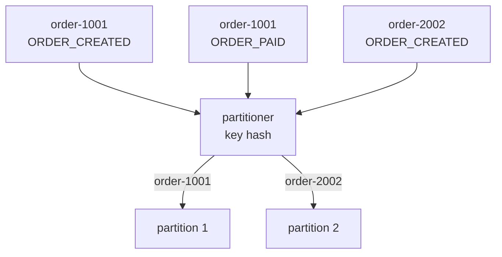

같은 주문의 이벤트가 같은 key를 쓰면 같은 partition으로 들어갑니다. 그러면 consumer는 그 partition 안에서 `ORDER_CREATED -> ORDER_PAID -> ORDER_CANCELED` 순서를 지킬 수 있습니다.

### Consumer 처리 흐름

가장 기본은 **처리 성공 후 offset commit**입니다. 그러면 장애 시 같은 메시지를 다시 읽을 수 있으므로 consumer 로직은 멱등해야 합니다.

```text
while running:
    records = poll()

    for record in records:
        if already_processed(record.eventId):
            continue

        process_business_logic(record)
        save_processed_event_id(record.eventId)

    commit_offset()
```

| 순서 | 의미 |
|------|------|
| `poll` | broker에서 메시지 가져오기 |
| 처리 | DB 저장, 외부 API 호출, 캐시 갱신 등 |
| 처리 기록 | `eventId` 저장으로 멱등성 확보 |
| commit | 다음 시작 위치를 Kafka에 저장 |

offset commit은 책갈피를 옮기는 일입니다.

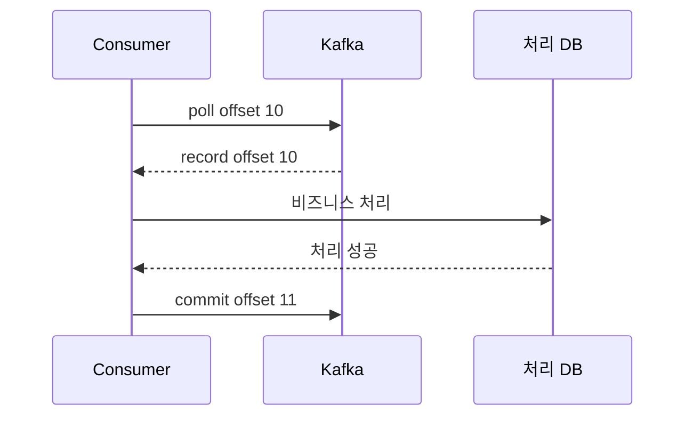

`offset 10`을 처리하고 나면 다음에 읽을 위치인 `offset 11`을 commit합니다. 처리 전에 commit하면 장애 시 메시지를 잃을 수 있고, 처리 후 commit하면 장애 시 같은 메시지를 다시 읽을 수 있습니다. 그래서 consumer는 중복 처리를 견뎌야 합니다.

Consumer 주요 설정입니다.

```properties
group.id=inventory-service
enable.auto.commit=false
auto.offset.reset=earliest
max.poll.records=500
max.poll.interval.ms=300000
session.timeout.ms=45000
heartbeat.interval.ms=3000
isolation.level=read_committed
```

| 설정 | 의미 | 주의 |
|------|------|------|
| `group.id` | 같은 일을 나눠 처리하는 consumer 묶음 | 바꾸면 새 그룹처럼 다시 읽음 |
| `enable.auto.commit=false` | 처리 후 직접 commit | 자동 commit은 유실 위험 증가 |
| `auto.offset.reset` | 저장 offset 없을 때 시작점 | `earliest`, `latest` 의미를 정확히 알아야 함 |
| `max.poll.records` | 한 번에 가져올 메시지 수 | 처리 시간이 길면 줄임 |
| `max.poll.interval.ms` | poll 사이 최대 간격 | 초과하면 rebalance |
| `session.timeout.ms` | heartbeat 끊김 감지 시간 | 너무 짧으면 불안정 |
| `heartbeat.interval.ms` | heartbeat 주기 | 보통 session timeout보다 충분히 짧게 |

## 언제 쓰는지

| 상황 | Kafka 적합도 | 이유 |
|------|--------------|------|
| 서비스 간 비동기 연동 | 높음 | 직접 호출 결합 감소 |
| 이벤트 기반 아키텍처 | 높음 | 여러 소비자가 같은 이벤트 활용 |
| 대용량 로그·클릭 스트림 | 높음 | 파티션 기반 높은 처리량 |
| 재처리 필요 | 높음 | offset 조정으로 과거 이벤트 재소비 |
| 외부 API 호출 완충 | 높음 | consumer 속도 조절 가능 |
| 즉시 응답이 필요한 동기 조회 | 낮음 | 요청-응답 모델이 아님 |
| 강한 단일 트랜잭션 | 낮음 | 기본은 최종 일관성 |
| 아주 작은 서비스의 단순 비동기 | 조건부 | 운영 비용이 더 클 수 있음 |

## 장점

| 장점 | 설명 |
|------|------|
| 느슨한 결합 | producer와 consumer가 서로 직접 알 필요가 적음 |
| 높은 처리량 | 파티션과 배치 기반 처리 |
| 이벤트 보존 | 소비 후에도 retention 동안 메시지 유지 |
| 재처리 가능 | offset을 바꿔 다시 읽을 수 있음 |
| 수평 확장 | 파티션과 consumer group으로 확장 |
| 장애 흡수 | consumer 장애 중에도 broker가 메시지를 보관 |

## 단점

| 단점 | 설명 |
|------|------|
| 운영 복잡도 | broker, partition, replica, lag, rebalance 관리 필요 |
| 중복 처리 가능성 | 재시도·commit 실패·rebalance 중 중복 소비 가능 |
| 순서 보장 제한 | 파티션 내부 순서만 보장 |
| 스키마 관리 필요 | 이벤트 변경이 여러 consumer에 영향 |
| 최종 일관성 | producer 처리와 consumer 반영 사이 지연 존재 |
| 장애 원인 분산 | producer, broker, consumer, sink DB를 함께 봐야 함 |

## 특징

### Topic, Partition, Offset

Topic은 이벤트의 논리적 분류이고, Partition은 topic을 나누어 저장하는 append-only log입니다. Offset은 partition 안에서 메시지 위치를 나타냅니다.

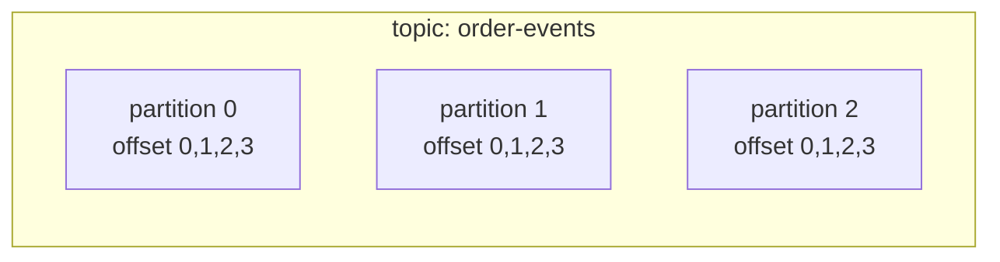

| 개념 | 설명 |
|------|------|
| Topic | 이벤트 종류 |
| Partition | 병렬 처리와 순서 보장 단위 |
| Offset | partition 안의 위치 |
| Record | key, value, headers, timestamp를 가진 메시지 |

조금 더 실제 로그처럼 보면 아래와 같습니다.

```text
partition 0
offset: 0        1        2        3
        A -----> B -----> C -----> D
                         ^
                         consumer group offset
```

consumer group offset이 `2`라면 보통 "다음에 offset 2부터 읽는다"는 의미입니다. 이미 처리한 마지막 메시지 번호가 아니라, 다음에 읽을 위치를 저장한다고 이해하면 헷갈림이 줄어듭니다.

### Broker, Leader, Follower, ISR

Kafka cluster는 여러 broker로 구성됩니다. 각 partition에는 leader replica가 있고, follower replica가 leader를 따라갑니다.

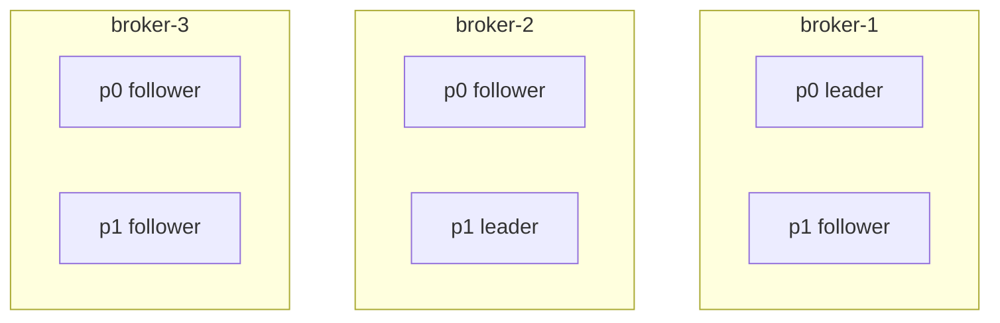

| 개념 | 설명 |
|------|------|
| Leader | producer write와 consumer read를 담당하는 replica |
| Follower | leader 데이터를 복제 |
| ISR | leader와 충분히 동기화된 replica 집합 |
| High Watermark | consumer에게 노출 가능한 안전한 offset 경계 |
| Controller | partition leader 선출과 metadata 관리 |

`acks=all`은 producer가 leader에게 보낸 메시지가 ISR 조건을 만족할 때 성공으로 봅니다. `min.insync.replicas=2`인데 ISR이 leader 1개뿐이면 producer는 실패를 받습니다. 이것은 장애가 아니라 **유실을 막기 위해 쓰기를 거부하는 정상 보호 동작**일 수 있습니다.

정상 쓰기와 쓰기 거부를 나누면 이렇게 볼 수 있습니다.

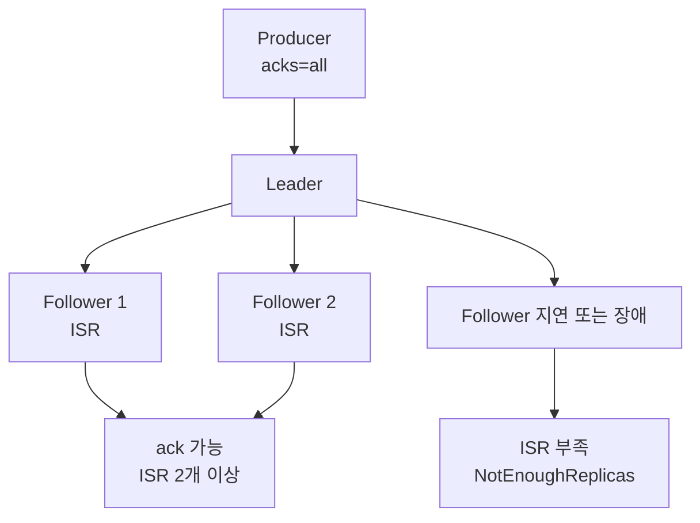

`NotEnoughReplicas`가 보이면 무조건 설정을 낮춰서 성공시키는 것이 답은 아닙니다. Kafka가 "지금은 안전하게 복제할 수 없으니 쓰기를 실패시키겠다"고 알려주는 신호일 수 있습니다.

### Producer 전송 흐름

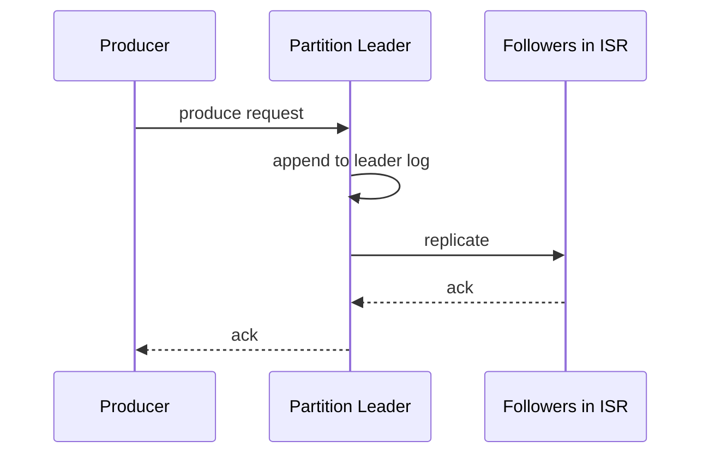

Producer 성능은 하나씩 보내는 것이 아니라 batch, compression, linger로 묶어 보내는 방식에서 나옵니다. 처리량이 중요하면 배치를 키우고, 지연이 중요하면 linger와 batch를 줄입니다.

### Consumer Group과 Rebalance

같은 consumer group 안에서는 partition이 consumer들에게 나누어 배정됩니다.

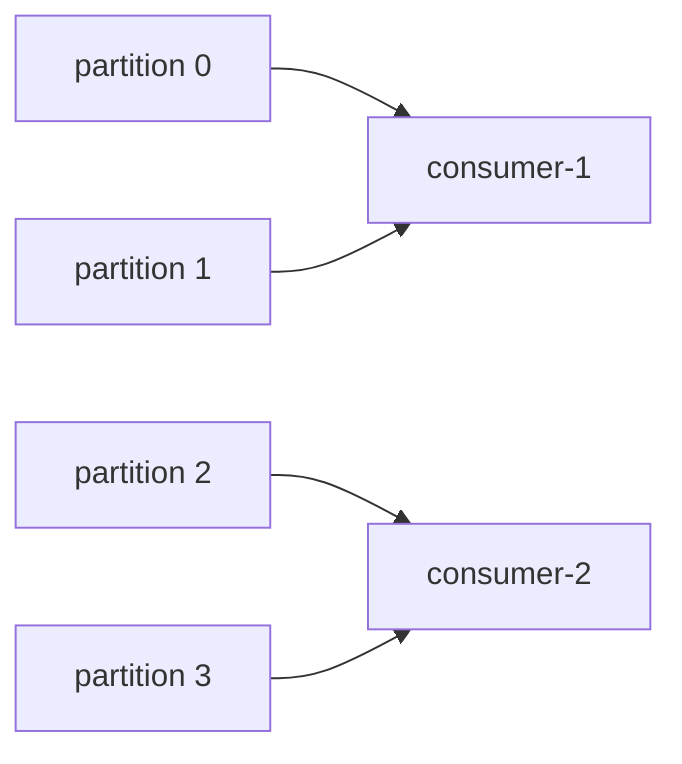

| 상황 | 결과 |
|------|------|
| consumer 추가 | partition 재분배 |
| consumer 종료 | 다른 consumer가 partition 인계 |
| `max.poll.interval.ms` 초과 | 느린 consumer가 실패로 간주될 수 있음 |
| heartbeat 끊김 | group에서 제거되고 rebalance |

Rebalance 중에는 일시적으로 소비가 멈추거나 중복 처리가 발생할 수 있습니다. 처리 시간이 긴 작업은 `max.poll.records`를 줄이고, 메시지 처리를 별도 워커로 넘길 때는 offset commit 순서를 특히 조심해야 합니다.

consumer 수와 partition 수의 관계도 중요합니다.

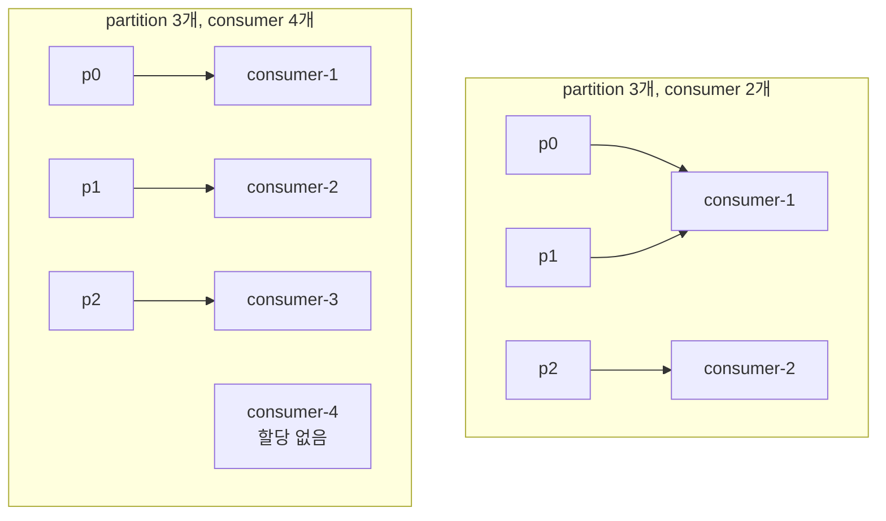

같은 consumer group에서는 partition 하나를 동시에 여러 consumer가 처리하지 않습니다. 그래서 consumer만 무작정 늘려도 partition 수보다 많아지면 놀고 있는 consumer가 생깁니다.

### Offset Commit

Offset commit은 "여기까지 처리했다"는 소비자 그룹의 체크포인트입니다.

| 방식 | 설명 | 위험 |
|------|------|------|
| 처리 전 commit | 빠름 | 처리 실패 시 메시지 유실 |
| 처리 후 commit | 안전한 기본값 | 장애 시 중복 처리 |
| 자동 commit | 구현 편함 | 처리 성공과 commit 시점이 어긋남 |
| 수동 commit | 제어 가능 | 구현 난도 증가 |

실무 기본은 **처리 후 수동 commit + consumer 멱등성**입니다.

### Retention과 Compaction

Kafka는 소비했다고 메시지를 바로 지우지 않습니다. 보관 정책에 따라 지웁니다.

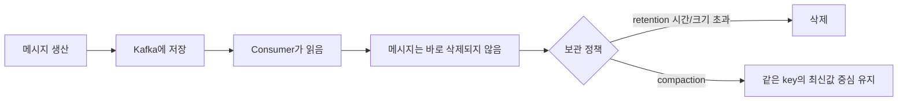

이 점이 일반 큐와 크게 다릅니다. consumer가 읽었다고 Kafka 메시지가 사라지는 것이 아니기 때문에, 장애 후 offset을 되돌려 재처리할 수 있습니다. 대신 retention 기간이 지나 삭제된 메시지는 다시 읽을 수 없습니다.

| 정책 | 설명 | 사용처 |
|------|------|--------|
| `delete` | 시간 또는 크기 기준 삭제 | 일반 이벤트, 로그 |
| `compact` | 같은 key의 최신 값 중심 유지 | 상태 변경 최신값, 설정, CDC 일부 |
| `delete,compact` | 둘을 함께 사용 | 최신값 유지 + 오래된 tombstone 정리 |

Retention을 너무 짧게 잡으면 장애 복구 전에 메시지가 사라질 수 있고, 너무 길게 잡으면 디스크가 위험해집니다.

### 전달 보장

| 방식 | 의미 | 만드는 방법 |
|------|------|-------------|
| At-most-once | 최대 한 번 처리, 유실 가능 | 처리 전 commit |
| At-least-once | 최소 한 번 처리, 중복 가능 | 처리 후 commit |
| Exactly-once | 특정 조건에서 결과 중복을 막음 | transaction, idempotent producer, sink 연동 필요 |

<div class="warning-box" markdown="1">

**주의**: `enable.idempotence=true`는 producer 재시도로 같은 record batch가 broker log에 중복 기록되는 것을 막는 기능이다. consumer가 DB에 같은 이벤트를 두 번 반영하는 문제까지 자동으로 해결하지 않는다.

</div>

## 주의할 점

### 중복 메시지는 정상 시나리오다

다음 상황에서는 같은 메시지를 다시 처리할 수 있습니다.

| 상황 | 설명 |
|------|------|
| 처리 성공 후 commit 전 장애 | 재시작 후 같은 offset부터 다시 읽음 |
| commit 성공 응답을 받기 전 네트워크 장애 | 성공했는지 몰라 재시도 |
| rebalance 중 partition 인계 | 이전 consumer 처리 결과와 겹칠 수 있음 |
| producer 재시도 | 멱등 설정이 없으면 log 중복 가능 |

대응은 `eventId` 기반 중복 처리 방지, DB unique 제약, upsert, 상태 전이 검증입니다.

### 순서는 partition 안에서만 보장된다

주문 생성, 결제, 취소 순서가 중요하면 같은 `orderId` key로 보내야 합니다. 다른 partition으로 흩어지면 소비 순서가 바뀔 수 있습니다.

### Poison Pill

특정 메시지가 계속 실패하면 consumer가 같은 offset에서 멈춰 lag가 계속 증가합니다.

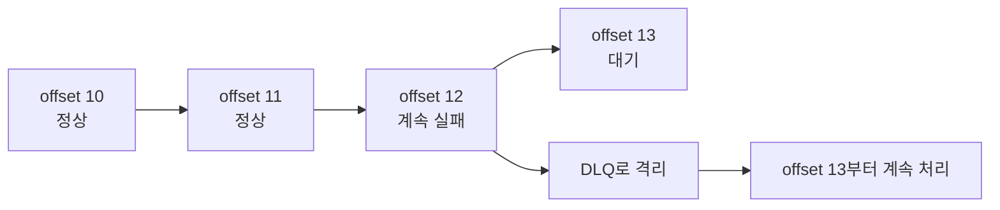

대응은 재시도 횟수 제한, DLQ, 실패 원인 기록, 스키마 검증입니다.

### Lag는 원인이 아니라 결과다

Lag는 consumer가 producer 속도를 따라가지 못한다는 신호입니다. 원인은 consumer 처리 지연, sink DB 지연, broker 지연, hot partition, poison pill, rebalance 등 다양합니다.

```text
lag = LOG-END-OFFSET - CURRENT-OFFSET

LOG-END-OFFSET: Kafka partition의 최신 위치
CURRENT-OFFSET: consumer group이 commit한 위치
```

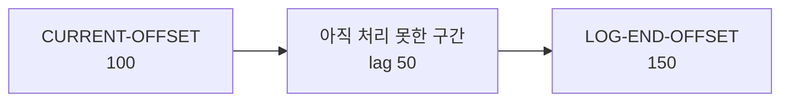

lag가 높다는 말은 "Kafka가 느리다"가 아니라 "생산된 속도보다 소비 후 commit하는 속도가 느리다"는 뜻입니다. 먼저 partition별 lag를 보고, 한 partition만 높은지 전체가 높은지 나누어 봐야 합니다.

### Schema Evolution

이벤트는 여러 consumer가 읽습니다. producer가 필드를 지우거나 타입을 바꾸면 일부 consumer가 바로 깨질 수 있습니다.

| 변경 | 안전성 |
|------|--------|
| optional 필드 추가 | 비교적 안전 |
| 필수 필드 추가 | 기존 consumer 위험 |
| 필드 삭제 | 위험 |
| 타입 변경 | 위험 |
| enum 값 추가 | consumer 처리 로직 확인 필요 |

## 장애 대응 Runbook

### 1. Producer timeout 또는 발행 실패

| 단계 | 확인 |
|------|------|
| 증상 | send timeout, `NotEnoughReplicas`, `TimeoutException`, 이벤트 발행 지연 |
| 즉시 확인 | topic ISR, broker 상태, producer error rate, network |
| 의심 원인 | ISR 부족, leader 장애, broker disk/network 병목, 잘못된 `bootstrap.servers` |
| 완화 | producer 재시도 유지, 비핵심 이벤트 임시 차단, broker 복구 |
| 재발 방지 | RF 3, `min.insync.replicas=2`, producer timeout/alert, outbox |

```bash
kafka-topics.sh \
  --bootstrap-server kafka-1:9092 \
  --describe \
  --topic order-created
```

확인할 부분입니다.

```text
Leader: 정상 broker인가
Replicas: 기대 복제본 수인가
Isr: min.insync.replicas 이상인가
```

### 2. Broker 한 대 장애

| 단계 | 확인 |
|------|------|
| 증상 | under-replicated partition 증가, leader election, producer 지연 |
| 즉시 확인 | 장애 broker, offline partition, controller log |
| 의심 원인 | 프로세스 다운, 디스크 full, 네트워크 분리 |
| 완화 | broker 복구, leader 재분배 확인, ISR 회복 대기 |
| 재발 방지 | disk alert, rack awareness, graceful shutdown, capacity 여유 |

```bash
kafka-topics.sh --bootstrap-server kafka-1:9092 --describe
```

운영에서 특히 봐야 할 지표입니다.

| 지표 | 의미 |
|------|------|
| UnderReplicatedPartitions | follower가 leader를 못 따라감 |
| OfflinePartitionsCount | leader가 없어 읽기/쓰기 불가 |
| ActiveControllerCount | controller가 정확히 1개인지 |
| RequestHandlerAvgIdlePercent | broker 처리 여유 |

### 3. Consumer lag 급증

| 단계 | 확인 |
|------|------|
| 증상 | 알림 지연, 이벤트 반영 지연, lag 증가 |
| 즉시 확인 | group lag, partition별 lag, consumer 처리 시간, sink DB |
| 의심 원인 | consumer 처리 느림, DB 병목, poison pill, hot partition, rebalance |
| 완화 | consumer 임시 증설, `max.poll.records` 조정, 실패 메시지 격리 |
| 재발 방지 | 처리 시간 지표, DLQ, 파티션/key 재설계, backpressure |

```bash
kafka-consumer-groups.sh \
  --bootstrap-server kafka-1:9092 \
  --describe \
  --group inventory-service
```

| 컬럼 | 의미 |
|------|------|
| `CURRENT-OFFSET` | consumer가 commit한 위치 |
| `LOG-END-OFFSET` | partition 최신 위치 |
| `LAG` | 아직 처리하지 못한 메시지 수 |

### 4. Rebalance가 반복됨

| 단계 | 확인 |
|------|------|
| 증상 | 소비가 자주 멈춤, 중복 처리 증가, lag 톱니 패턴 |
| 즉시 확인 | consumer restart, heartbeat 실패, poll interval 초과 |
| 의심 원인 | 처리 시간이 `max.poll.interval.ms` 초과, consumer 불안정, deploy 반복 |
| 완화 | consumer 수 안정화, 처리량 제한, 긴 작업 분리 |
| 재발 방지 | static membership, cooperative rebalance, poll/processing 분리 |

확인할 설정입니다.

```properties
max.poll.interval.ms=300000
max.poll.records=500
session.timeout.ms=45000
heartbeat.interval.ms=3000
```

처리 시간이 길면 `max.poll.records`를 줄여 한 poll 안에서 처리하는 총 시간을 줄입니다.

### 5. Poison Pill로 특정 offset에서 멈춤

| 단계 | 확인 |
|------|------|
| 증상 | 특정 partition lag만 증가, 같은 에러 로그 반복 |
| 즉시 확인 | 실패 offset, message key/value, deserialization error |
| 의심 원인 | 깨진 메시지, 스키마 불일치, 비즈니스 검증 실패 |
| 완화 | 메시지를 DLQ로 보내고 offset 진행, 임시 skip은 승인 후 수행 |
| 재발 방지 | schema compatibility, DLQ 표준, 재처리 도구 |

```bash
kafka-console-consumer.sh \
  --bootstrap-server kafka-1:9092 \
  --topic order-created \
  --partition 2 \
  --offset 15320 \
  --max-messages 1 \
  --property print.key=true \
  --property print.headers=true
```

<div class="danger-box" markdown="1">

**위험**: offset을 강제로 넘기면 메시지를 처리하지 않고 버리는 것이다. 결제, 재고, 포인트 같은 이벤트는 DLQ 저장과 보정 계획 없이 skip하면 안 된다.

</div>

DLQ를 쓰는 흐름은 아래처럼 잡습니다.

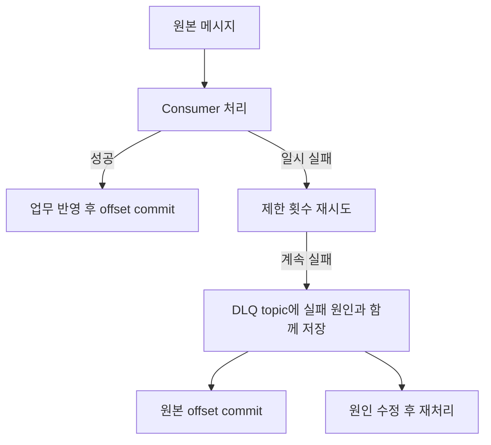

DLQ는 실패 메시지를 버리는 곳이 아니라 **전체 소비를 멈추지 않기 위해 격리하는 곳**입니다. DLQ에 넣을 때 원본 topic, partition, offset, key, 에러 메시지를 함께 남겨야 나중에 복구할 수 있습니다.

### 6. 중복 소비 발생

| 단계 | 확인 |
|------|------|
| 증상 | 같은 주문 알림 2번, 재고 중복 차감, 포인트 중복 적립 |
| 즉시 확인 | 같은 `eventId` 처리 로그, commit 실패, rebalance 시각 |
| 의심 원인 | 처리 후 commit 전 장애, 멱등성 누락, producer 중복 |
| 완화 | DB unique로 추가 중복 차단, 보정 쿼리, 재처리 중지 |
| 재발 방지 | processed event table, idempotency key, 상태 전이 검증 |

예시 멱등성 테이블입니다.

```sql
CREATE TABLE processed_event (
    event_id VARCHAR(100) PRIMARY KEY,
    consumer_name VARCHAR(100) NOT NULL,
    processed_at DATETIME NOT NULL
);
```

처리 흐름입니다.

```text
1. transaction 시작
2. processed_event에 eventId insert
3. 이미 있으면 처리하지 않고 성공으로 간주
4. 비즈니스 변경 저장
5. transaction commit
6. Kafka offset commit
```

중복 소비는 아래 시나리오에서 자주 발생합니다.

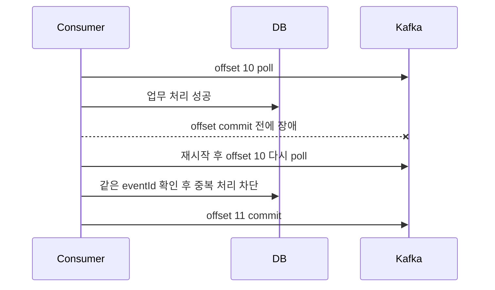

그래서 "Kafka를 쓰면 한 번만 처리된다"가 아니라, "다시 와도 같은 결과가 되게 만든다"가 실무 기준입니다.

### 7. 순서가 깨진 것처럼 보임

| 단계 | 확인 |
|------|------|
| 증상 | 취소 이벤트가 생성 이벤트보다 먼저 반영 |
| 즉시 확인 | 두 이벤트의 key, partition, offset, occurredAt |
| 의심 원인 | key 불일치, 여러 producer 시각 차이, consumer 병렬 처리 |
| 완화 | 해당 aggregate 처리 일시 중지, 순서 보정 |
| 재발 방지 | key 표준화, partition 내 순차 처리, 상태 전이 검증 |

### 8. Disk full 또는 retention 문제

| 단계 | 확인 |
|------|------|
| 증상 | broker write 실패, segment 삭제 지연, controller 불안정 |
| 즉시 확인 | broker disk usage, topic별 log size, retention 설정 |
| 의심 원인 | retention 과다, compact 지연, consumer 중단과 무관한 장기 보관 |
| 완화 | 불필요 topic retention 축소, broker disk 확장, 오래된 topic 정리 |
| 재발 방지 | topic 생성 기준, disk alert, capacity planning |

```bash
kafka-configs.sh \
  --bootstrap-server kafka-1:9092 \
  --entity-type topics \
  --entity-name order-created \
  --describe
```

### 9. Hot Partition

| 단계 | 확인 |
|------|------|
| 증상 | 특정 partition lag만 높음, 특정 broker network/CPU 높음 |
| 즉시 확인 | key 분포, partition별 bytes in/out, lag |
| 의심 원인 | 특정 key에 이벤트 집중, partition 수 부족, 잘못된 key |
| 완화 | consumer 처리 최적화, 해당 key 별도 토픽, 임시 backpressure |
| 재발 방지 | key sharding, partition 증설, 도메인별 topic 분리 |

<div class="warning-box" markdown="1">

**주의**: partition을 늘리면 새 메시지의 key 배치가 달라질 수 있다. key 기반 순서 보장과 기존 운영 도구 영향을 확인한 뒤 변경한다.

</div>

### 10. Schema 불일치

| 단계 | 확인 |
|------|------|
| 증상 | deserialization 실패, 특정 consumer만 실패 |
| 즉시 확인 | schema version, 배포 시각, 실패 필드 |
| 의심 원인 | 필수 필드 추가, 타입 변경, enum 추가 미대응 |
| 완화 | producer rollback, consumer hotfix, 실패 메시지 DLQ |
| 재발 방지 | backward/forward compatibility 검사, contract test |

### 11. Offset reset 사고

| 단계 | 확인 |
|------|------|
| 증상 | 과거 메시지 대량 재처리 또는 메시지 건너뜀 |
| 즉시 확인 | group offset 변경 로그, reset 명령 시각, lag 변화 |
| 의심 원인 | 잘못된 `group.id`, `auto.offset.reset`, 운영 명령 실수 |
| 완화 | consumer 중지, offset을 안전 지점으로 재설정, 중복 보정 |
| 재발 방지 | 운영 명령 승인 절차, dry-run, group naming 규칙 |

```bash
kafka-consumer-groups.sh \
  --bootstrap-server kafka-1:9092 \
  --group inventory-service \
  --topic order-created \
  --reset-offsets \
  --to-datetime 2026-04-25T10:00:00.000 \
  --dry-run
```

`--execute`는 dry-run 결과를 확인한 뒤에만 사용합니다.

### 12. Consumer가 메시지를 못 읽음

| 단계 | 확인 |
|------|------|
| 증상 | consumer 시작은 됐지만 처리 로그 없음 |
| 즉시 확인 | topic 이름, group id, ACL, offset 위치, `auto.offset.reset` |
| 의심 원인 | 이미 latest에 offset 있음, 권한 없음, 다른 group과 착각 |
| 완화 | console consumer로 직접 확인, group offset 확인 |
| 재발 방지 | topic/group 명명 규칙, 권한 점검 체크리스트 |

## 관찰 지표와 명령

### Topic 상태

```bash
kafka-topics.sh \
  --bootstrap-server kafka-1:9092 \
  --describe \
  --topic order-created
```

| 항목 | 확인 |
|------|------|
| partition 수 | consumer 병렬성 충분한가 |
| leader | 특정 broker에 몰리지 않았는가 |
| replicas | replication factor가 맞는가 |
| ISR | 복제가 정상인가 |

### Consumer Group 상태

```bash
kafka-consumer-groups.sh \
  --bootstrap-server kafka-1:9092 \
  --describe \
  --group inventory-service
```

| 지표 | 의미 |
|------|------|
| lag | 처리 지연 |
| records-lag-max | consumer가 가진 partition 중 최대 lag |
| poll duration | 처리 루프가 poll 제한 안에 도는지 |
| commit rate/error | offset 저장 문제 |
| rebalance count | group 안정성 |

### Broker 지표

| 지표 | 위험 신호 |
|------|-----------|
| UnderReplicatedPartitions | 복제 지연 또는 broker 장애 |
| OfflinePartitionsCount | 읽기/쓰기 불가 partition |
| RequestQueueSize | 요청 처리 밀림 |
| Produce/Fetch request latency | broker 지연 |
| NetworkProcessorAvgIdlePercent | 네트워크 처리 여유 부족 |
| RequestHandlerAvgIdlePercent | 요청 처리 thread 부족 |
| disk usage | retention·segment 삭제 위험 |
| bytes in/out | 트래픽 급증 |

### Producer 지표

| 지표 | 의미 |
|------|------|
| record-send-rate | 발행량 |
| record-error-rate | 발행 실패 |
| record-retry-rate | 재시도 |
| request-latency-avg/p99 | broker 응답 지연 |
| buffer-available-bytes | producer 내부 버퍼 여유 |
| batch-size-avg | 배치 효율 |

### Consumer 지표

| 지표 | 의미 |
|------|------|
| records-consumed-rate | 소비량 |
| records-lag-max | 최대 lag |
| fetch-latency-avg/p99 | broker fetch 지연 |
| commit-latency-avg | offset commit 지연 |
| poll idle ratio | consumer가 놀고 있는지 |
| processing time | 비즈니스 처리 지연 |

## 베스트 프랙티스

| 권장 방식 | 이유 |
|-----------|------|
| 중요한 이벤트는 `acks=all` | leader 단독 저장 후 유실 방지 |
| RF 3, `min.insync.replicas=2` | broker 1대 장애에도 내구성 확보 |
| producer idempotence 활성화 | 재시도 중 log 중복 감소 |
| consumer는 멱등하게 구현 | at-least-once의 중복 처리 대비 |
| offset은 처리 후 commit | 처리 전 commit으로 인한 유실 방지 |
| DLQ와 재처리 도구 준비 | poison pill로 전체 소비 중단 방지 |
| key 설계를 먼저 결정 | 순서 보장과 partition 분산에 영향 |
| schema version 포함 | 이벤트 변경 추적 |
| lag 알림은 partition별로 | hot partition을 놓치지 않음 |
| topic retention을 업무 기준으로 설정 | 복구 가능 기간과 disk 균형 |
| 운영 명령은 dry-run 우선 | offset reset 사고 방지 |
| outbox 패턴 고려 | DB 저장과 이벤트 발행 불일치 완화 |

## 실무에서는?

| 사용처 | 설계 기준 |
|--------|-----------|
| 주문 이벤트 전파 | `orderId` key, consumer 멱등성, DLQ |
| 알림 비동기 처리 | 중복 발송 방지 key, 재시도 제한 |
| 재고 차감 | 상태 전이 검증, DB unique, 순서 보장 |
| 검색 색인 갱신 | 재처리 가능하게 retention 확보 |
| 로그 수집 | 처리량 중심, 압축, 긴 retention 또는 별도 저장소 연계 |
| CDC | schema evolution, compaction, 순서 보장 확인 |
| 외부 API 연동 | retry/backoff, DLQ, rate limit |

### 운영 체크리스트

| 체크 | 질문 |
|------|------|
| Topic | partition, RF, retention, min ISR 기준이 있는가 |
| Producer | `acks`, idempotence, timeout, retry 정책이 명확한가 |
| Consumer | 수동 commit, 멱등성, DLQ가 준비됐는가 |
| Key | 순서 보장 단위와 hot partition 위험을 검토했는가 |
| Schema | 호환성 규칙과 version이 있는가 |
| Lag | group/partition별 알림이 있는가 |
| 장애 | broker 1대 다운, consumer 중단, poison pill을 훈련했는가 |
| 보안 | 인증, 권한, 암호화, topic 접근 제어가 있는가 |
| 운영 명령 | offset reset, retention 변경에 승인과 dry-run이 있는가 |

## 정리

| 항목 | 설명 |
|------|------|
| Kafka | 분산 이벤트 스트리밍 플랫폼 |
| 핵심 단위 | Topic, Partition, Offset, Consumer Group |
| 강점 | 비동기 처리, 높은 처리량, 이벤트 보존, 재처리 |
| 주의 | 중복 처리, 파티션 순서, schema 변경, lag, rebalance |
| 운영 핵심 | ISR, acks, offset commit, DLQ, lag, retention |

---

**관련 파일:**
- [아웃박스 패턴](../architecture/outbox.md) — DB 변경과 이벤트 발행 정합성
- [MSA](../architecture/msa.md) — 서비스 간 비동기 통신
- [모니터링](../operations/monitoring.md) — lag와 처리량 관찰
