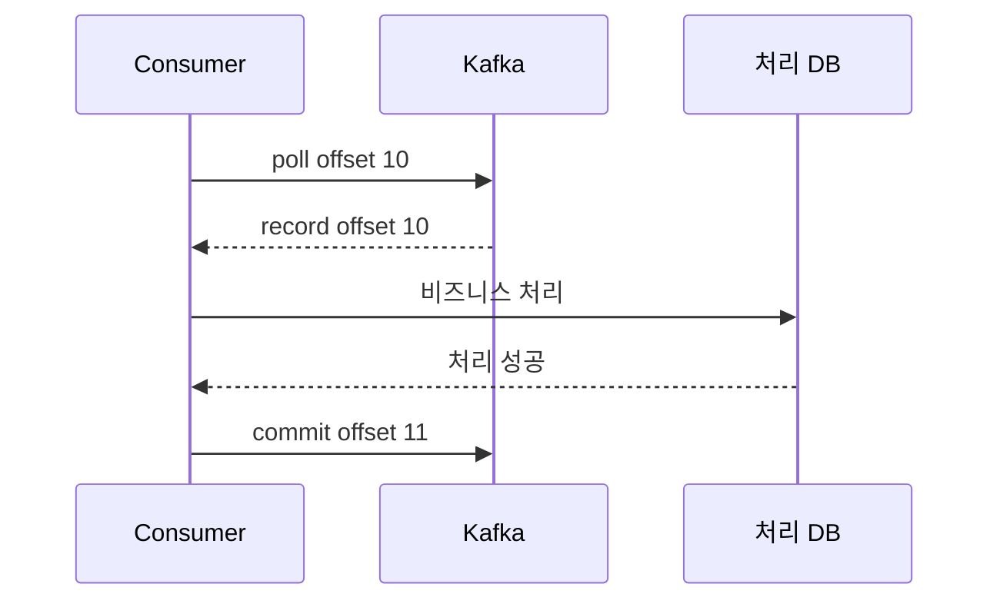
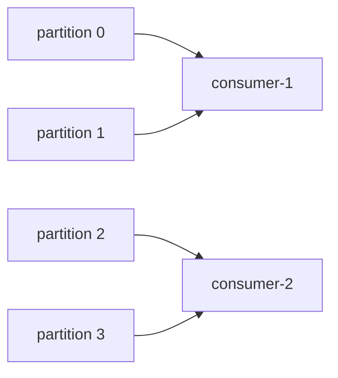
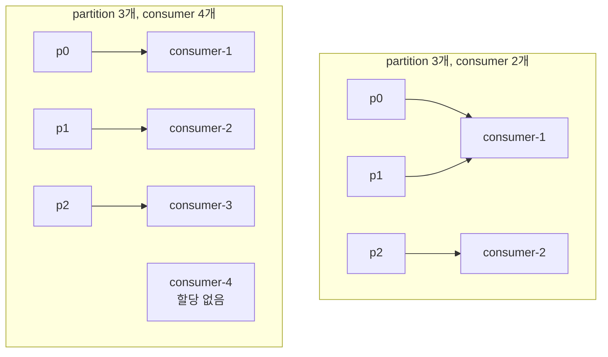
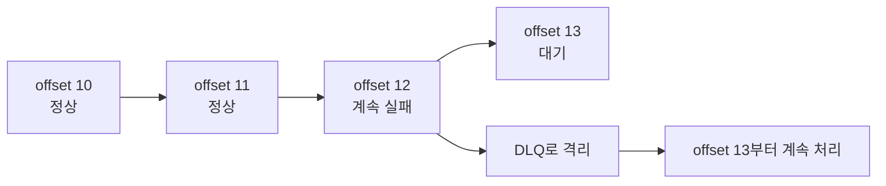
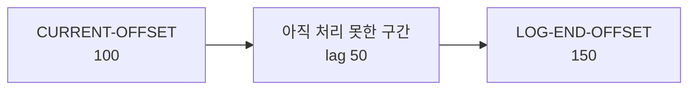

# Kafka Consumer와 전달 보장

Consumer 설계의 기본값은 **처리 성공 후 offset commit**입니다. 장애가 나면 같은 메시지를 다시 읽을 수 있으므로, consumer 로직은 중복 처리를 견디도록 멱등하게 만들어야 합니다.

## Consumer 처리 흐름

기본 흐름은 `poll -> 업무 처리 -> 처리 기록 -> offset commit`입니다.

```text
while running:
    records = poll()

    for record in records:
        if already_processed(record.eventId):
            continue

        process_business_logic(record)
        save_processed_event_id(record.eventId)

    commit_offset()
```

| 순서 | 의미 |
|------|------|
| `poll` | broker에서 메시지 가져오기 |
| 처리 | DB 저장, 외부 API 호출, 캐시 갱신 등 |
| 처리 기록 | `eventId` 저장으로 멱등성 확보 |
| commit | 다음 시작 위치를 Kafka에 저장 |

offset commit은 책갈피를 옮기는 일입니다.



`offset 10`을 처리하고 나면 다음에 읽을 위치인 `offset 11`을 commit합니다. 처리 전에 commit하면 장애 시 메시지를 잃을 수 있고, 처리 후 commit하면 장애 시 같은 메시지를 다시 읽을 수 있습니다. 그래서 consumer는 중복 처리를 견뎌야 합니다.

Consumer 주요 설정입니다.

```properties
group.id=inventory-service
enable.auto.commit=false
auto.offset.reset=earliest
max.poll.records=500
max.poll.interval.ms=300000
session.timeout.ms=45000
heartbeat.interval.ms=3000
isolation.level=read_committed
```

| 설정 | 의미 | 주의 |
|------|------|------|
| `group.id` | 같은 일을 나눠 처리하는 consumer 묶음 | 바꾸면 새 그룹처럼 다시 읽음 |
| `enable.auto.commit=false` | 처리 후 직접 commit | 자동 commit은 유실 위험 증가 |
| `auto.offset.reset` | 저장 offset 없을 때 시작점 | `earliest`, `latest` 의미를 정확히 알아야 함 |
| `max.poll.records` | 한 번에 가져올 메시지 수 | 처리 시간이 길면 줄임 |
| `max.poll.interval.ms` | poll 사이 최대 간격 | 초과하면 rebalance |
| `session.timeout.ms` | heartbeat 끊김 감지 시간 | 너무 짧으면 불안정 |
| `heartbeat.interval.ms` | heartbeat 주기 | 보통 session timeout보다 충분히 짧게 |

## Consumer Group과 Rebalance

같은 consumer group 안에서는 partition이 consumer들에게 나누어 배정됩니다.



| 상황 | 결과 |
|------|------|
| consumer 추가 | partition 재분배 |
| consumer 종료 | 다른 consumer가 partition 인계 |
| `max.poll.interval.ms` 초과 | 느린 consumer가 실패로 간주될 수 있음 |
| heartbeat 끊김 | group에서 제거되고 rebalance |

Rebalance 중에는 일시적으로 소비가 멈추거나 중복 처리가 발생할 수 있습니다. 처리 시간이 긴 작업은 `max.poll.records`를 줄이고, 메시지 처리를 별도 워커로 넘길 때는 offset commit 순서를 특히 조심해야 합니다.

consumer 수와 partition 수의 관계도 중요합니다.



같은 consumer group에서는 partition 하나를 동시에 여러 consumer가 처리하지 않습니다. 그래서 consumer만 무작정 늘려도 partition 수보다 많아지면 놀고 있는 consumer가 생깁니다.

## Offset Commit

Offset commit은 "여기까지 처리했다"는 소비자 그룹의 체크포인트입니다.

| 방식 | 설명 | 위험 |
|------|------|------|
| 처리 전 commit | 빠름 | 처리 실패 시 메시지 유실 |
| 처리 후 commit | 안전한 기본값 | 장애 시 중복 처리 |
| 자동 commit | 구현 편함 | 처리 성공과 commit 시점이 어긋남 |
| 수동 commit | 제어 가능 | 구현 난도 증가 |

실무 기본은 **처리 후 수동 commit + consumer 멱등성**입니다.

## 전달 보장

| 방식 | 의미 | 만드는 방법 |
|------|------|-------------|
| At-most-once | 최대 한 번 처리, 유실 가능 | 처리 전 commit |
| At-least-once | 최소 한 번 처리, 중복 가능 | 처리 후 commit |
| Exactly-once | 특정 조건에서 결과 중복을 막음 | transaction, idempotent producer, sink 연동 필요 |

<div class="warning-box" markdown="1">

**주의**: `enable.idempotence=true`는 producer 재시도로 같은 record batch가 broker log에 중복 기록되는 것을 막는 기능이다. consumer가 DB에 같은 이벤트를 두 번 반영하는 문제까지 자동으로 해결하지 않는다.

</div>

## 중복 메시지는 정상 시나리오다

다음 상황에서는 같은 메시지를 다시 처리할 수 있습니다.

| 상황 | 설명 |
|------|------|
| 처리 성공 후 commit 전 장애 | 재시작 후 같은 offset부터 다시 읽음 |
| commit 성공 응답을 받기 전 네트워크 장애 | 성공했는지 몰라 재시도 |
| rebalance 중 partition 인계 | 이전 consumer 처리 결과와 겹칠 수 있음 |
| producer 재시도 | 멱등 설정이 없으면 log 중복 가능 |

대응은 `eventId` 기반 중복 처리 방지, DB unique 제약, upsert, 상태 전이 검증입니다.

## 순서는 partition 안에서만 보장된다

주문 생성, 결제, 취소 순서가 중요하면 같은 `orderId` key로 보내야 합니다. 다른 partition으로 흩어지면 소비 순서가 바뀔 수 있습니다.

## Poison Pill

특정 메시지가 계속 실패하면 consumer가 같은 offset에서 멈춰 lag가 계속 증가합니다.



대응은 재시도 횟수 제한, DLQ, 실패 원인 기록, 스키마 검증입니다.

## Lag는 원인이 아니라 결과다

Lag는 consumer가 producer 속도를 따라가지 못한다는 신호입니다. 원인은 consumer 처리 지연, sink DB 지연, broker 지연, hot partition, poison pill, rebalance 등 다양합니다.

```text
lag = LOG-END-OFFSET - CURRENT-OFFSET

LOG-END-OFFSET: Kafka partition의 최신 위치
CURRENT-OFFSET: consumer group이 commit한 위치
```



lag가 높다는 말은 "Kafka가 느리다"가 아니라 "생산된 속도보다 소비 후 commit하는 속도가 느리다"는 뜻입니다. 먼저 partition별 lag를 보고, 한 partition만 높은지 전체가 높은지 나누어 봐야 합니다.

## Schema Evolution

이벤트는 여러 consumer가 읽습니다. producer가 필드를 지우거나 타입을 바꾸면 일부 consumer가 바로 깨질 수 있습니다.

| 변경 | 안전성 |
|------|--------|
| optional 필드 추가 | 비교적 안전 |
| 필수 필드 추가 | 기존 consumer 위험 |
| 필드 삭제 | 위험 |
| 타입 변경 | 위험 |
| enum 값 추가 | consumer 처리 로직 확인 필요 |

## 베스트 프랙티스

| 권장 방식 | 이유 |
|-----------|------|
| 처리 성공 후 수동 commit | 처리 전 commit으로 인한 유실 방지 |
| consumer 로직을 멱등하게 작성 | 장애 후 같은 이벤트 재처리 대비 |
| `eventId` unique 제약 사용 | DB 중복 반영 차단 |
| retry 횟수 제한과 DLQ 구성 | poison pill 격리 |
| partition별 lag 관찰 | hot partition과 전체 처리 지연 구분 |
| schema version 처리 | 오래된 이벤트와 새 이벤트를 함께 처리 |

---

**관련 파일:**
- [Kafka 개요](../kafka.md)
- [Producer와 이벤트 설계](./producer.md)
- [Key 설계와 순서 보장](./키순서설계.md)
- [Transaction과 Exactly-once](./트랜잭션정확히한번.md)
- [Spring Boot Kafka 연동](./springboot.md)
- [운영과 장애 대응](./운영장애대응.md)

--8<-- "includes/kafka/producer-consumer.md"
