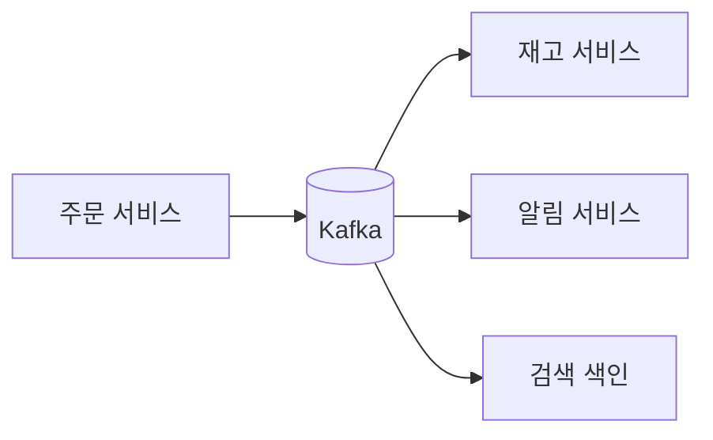
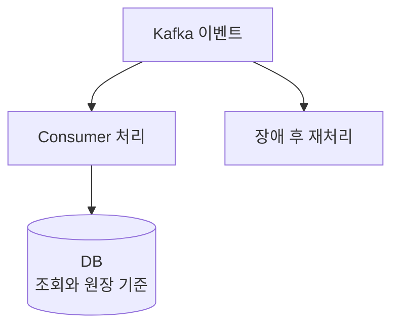

# Kafka란?

<div class="concept-box" markdown="1">

**Kafka**: 이벤트를 topic에 append-only log로 저장하고, consumer group이 offset을 기준으로 독립적으로 읽어가는 분산 이벤트 스트리밍 플랫폼. 서비스 간 비동기 처리, 이벤트 기반 아키텍처, 로그 수집, 재처리에 자주 사용한다.

</div>

Kafka를 처음 볼 때는 "메시지 큐"라고 이해하기 쉽습니다. 하지만 실무에서는 Kafka를 **소비자가 각자 원하는 속도로 다시 읽을 수 있는 이벤트 로그**로 보는 편이 안전합니다.

## 용어

| 용어 | 뜻 | 쉽게 말하면 |
|------|----|-------------|
| Producer | 이벤트를 Kafka에 쓰는 쪽 | 발행자 |
| Consumer | 이벤트를 Kafka에서 읽는 쪽 | 소비자 |
| Topic | 이벤트를 종류별로 나누는 논리 이름 | 게시판 |
| Partition | topic을 나누어 저장하는 로그 단위 | 게시판 안의 줄 |
| Offset | partition 안에서 메시지 위치 | 책갈피 |
| Consumer Group | 같은 일을 나눠 처리하는 consumer 묶음 | 작업 팀 |
| Broker | Kafka 서버 한 대 | 저장 서버 |
| Replication | partition 복제 | 사본 만들기 |
| Retention | 메시지 보관 기간 | 다시 읽을 수 있는 기간 |
| Lag | consumer가 아직 처리하지 못한 양 | 밀린 일 |

## 질문

### Kafka는 왜 쓰는가?

서비스가 다른 서비스에 직접 API를 호출하면 호출 대상의 장애, 지연, 트래픽 증가가 호출한 서비스까지 전파됩니다. Kafka는 이벤트를 중간에 저장해 producer와 consumer를 분리합니다.



핵심은 직접 호출을 줄이고 이벤트를 기준으로 흐름을 나누는 것입니다.

```text
Producer는 이벤트를 남긴다.
Kafka는 이벤트를 보관한다.
Consumer는 자기 속도에 맞춰 처리한다.
장애가 나면 offset 기준으로 다시 읽을 수 있다.
```

### Kafka는 큐와 무엇이 다른가?

일반적인 큐는 메시지를 꺼내 처리하면 사라지는 모델로 이해하는 경우가 많습니다. Kafka는 consumer가 읽었다고 메시지를 바로 지우지 않습니다. retention 기간 동안 로그를 보관하므로, 다른 consumer group이 같은 이벤트를 따로 읽거나 장애 후 다시 읽을 수 있습니다.

| 구분 | 일반 큐 관점 | Kafka |
|------|--------------|-------|
| 메시지 처리 | 소비하면 제거되는 모델이 많음 | 소비해도 retention까지 보관 |
| 소비자 | 보통 한 작업 흐름 중심 | 여러 consumer group이 독립 소비 |
| 재처리 | 별도 저장 필요 | offset 조정으로 가능 |
| 순서 | 큐 단위 순서 기대 | partition 안에서만 순서 보장 |
| 강점 | 작업 분배, 명령 처리 | 이벤트 로그, 재처리, 대량 스트림 |

### Kafka는 DB를 대체할 수 있는가?

대부분의 서비스에서는 대체하지 않습니다. Kafka는 이벤트 로그를 보관하지만, 사용자 조회 화면이나 원장 데이터의 최종 상태를 질의하기 위한 저장소는 보통 DB가 맡습니다.



| 데이터 | Kafka 단독 저장 가능성 | 이유 |
|--------|------------------------|------|
| 주문 생성 이벤트 | 조건부 | 이벤트 로그로 보관 가능하지만 조회 모델은 별도 필요 |
| 검색 색인 갱신 이벤트 | 가능 | 재처리로 다시 만들 수 있음 |
| 결제 원장 | 낮음 | 트랜잭션, 감사, 정합성 기준은 DB나 원장 시스템이 적합 |
| 클릭 로그 | 높음 | 대량 수집과 후처리에 적합 |
| 사용자 프로필 최신 상태 조회 | 낮음 | key-value 조회 저장소가 더 적합 |

## 어떻게 쓰는지

Kafka는 아래 흐름으로 자주 사용합니다.

```text
1. Producer가 업무 이벤트를 만든다.
2. 이벤트 key를 정해 topic에 발행한다.
3. Kafka는 partition에 순서대로 저장한다.
4. Consumer group이 poll로 이벤트를 읽는다.
5. 업무 처리에 성공하면 offset을 commit한다.
6. 장애가 나면 commit된 offset 이후부터 다시 처리한다.
```

```bash
# topic 생성 예시
kafka-topics.sh \
  --bootstrap-server kafka-1:9092 \
  --create \
  --topic order-events \
  --partitions 6 \
  --replication-factor 3 \
  --config retention.ms=604800000

# consumer group lag 확인
kafka-consumer-groups.sh \
  --bootstrap-server kafka-1:9092 \
  --describe \
  --group inventory-service
```

## 언제 쓰는지

| 상황 | 적합도 | 이유 |
|------|--------|------|
| 서비스 간 비동기 연동 | 높음 | 직접 API 호출 결합과 장애 전파를 줄임 |
| 이벤트 기반 아키텍처 | 높음 | 여러 consumer group이 같은 이벤트를 각자 활용 |
| 대용량 로그·클릭 스트림 | 높음 | partition, batch, compression 기반 처리량 확장 |
| 장애 후 재처리 필요 | 높음 | retention 안에서 offset 조정으로 다시 읽을 수 있음 |
| 여러 시스템으로 같은 변경 전파 | 높음 | 검색, 알림, 통계, 감사 consumer를 분리 가능 |
| 즉시 응답이 필요한 단건 조회 | 낮음 | 요청-응답 저장소가 아님 |
| 강한 단일 트랜잭션 | 낮음 | 기본은 최종 일관성이고 중복 처리가 필요 |
| 짧은 임시 캐시 | 낮음 | Redis 같은 캐시 저장소가 더 적합 |

## 장점

| 장점 | 설명 |
|------|------|
| 느슨한 결합 | producer와 consumer가 직접 의존하지 않음 |
| 높은 처리량 | partition, batch, sequential write로 대량 이벤트 처리 |
| 이벤트 보존 | 소비 후에도 retention 기간 동안 재처리 가능 |
| 수평 확장 | partition과 consumer group 기준으로 처리량 확장 |
| 장애 흡수 | consumer가 느려져도 Kafka가 중간에서 버퍼 역할 |
| 다중 소비 | 같은 이벤트를 여러 consumer group이 독립적으로 사용 |

## 단점

| 단점 | 설명 |
|------|------|
| 운영 복잡도 | broker, partition, replication, retention, lag 관리 필요 |
| 중복 처리 가능성 | at-least-once 처리에서는 같은 이벤트가 다시 올 수 있음 |
| 순서 보장 제한 | topic 전체가 아니라 partition 안에서만 순서 보장 |
| 최종 일관성 | 즉시 동기 반영보다 설계와 보정 로직이 중요 |
| schema 관리 필요 | 여러 consumer가 읽으므로 필드 변경이 장애로 이어질 수 있음 |
| 작은 시스템에는 과함 | 단순 비동기 작업에는 운영 비용이 더 클 수 있음 |

## 특징

| 특징 | 설명 |
|------|------|
| Append-only log | 메시지를 뒤에 계속 추가하는 로그 구조 |
| Pull 기반 소비 | consumer가 poll로 가져가며 속도를 조절 |
| Consumer Group | 같은 일을 나눠 처리하고 group별 offset을 가짐 |
| Partition 단위 병렬성 | partition 수가 처리 병렬성의 큰 경계를 만듦 |
| Retention 기반 재처리 | 저장 기간 안에서는 다시 읽을 수 있음 |
| Replication | broker 장애에 대비해 partition을 복제 |

## 주의할 점

| 주의 | 설명 |
|------|------|
| 한 번만 처리된다고 믿지 않기 | consumer는 멱등하게 만들어야 함 |
| key 없이 순서 기대 금지 | 같은 key가 같은 partition으로 가야 순서가 유지됨 |
| partition을 쉽게 늘리지 않기 | key 배치가 달라져 순서와 운영 도구에 영향 |
| retention을 너무 짧게 잡지 않기 | 장애 복구 전에 이벤트가 삭제될 수 있음 |
| lag만 보고 원인 단정 금지 | consumer, DB, broker, hot partition을 나눠 봐야 함 |
| DB 저장과 이벤트 발행 정합성 고려 | [아웃박스 패턴](../../architecture/outbox.md)을 검토 |

## 베스트 프랙티스

| 권장 방식 | 이유 |
|-----------|------|
| 중요한 이벤트는 `acks=all` 검토 | leader 단독 저장 후 유실 위험 감소 |
| producer idempotence 활성화 | 재시도 중 broker log 중복 기록 감소 |
| consumer는 처리 후 offset commit | 처리 전 commit으로 인한 유실 방지 |
| `eventId`로 멱등성 확보 | 중복 소비를 정상 시나리오로 대응 |
| key 설계를 먼저 결정 | 순서 보장과 partition 분산에 영향 |
| DLQ와 재처리 절차 준비 | poison pill로 전체 소비가 멈추지 않게 함 |
| schema version 포함 | 이벤트 변경 추적과 호환성 관리 |
| lag 알림은 partition별로 | hot partition을 놓치지 않음 |

## 실무에서는?

| 사용처 | 설계 기준 |
|--------|-----------|
| 주문 이벤트 전파 | `orderId` key, 멱등 consumer, DLQ |
| 알림 비동기 처리 | 중복 발송 방지 key, retry/backoff |
| 재고 반영 | 상태 전이 검증, DB unique, 순서 보장 |
| 검색 색인 갱신 | 재처리 가능한 retention 확보 |
| 로그 수집 | 처리량 중심, batch, compression |
| CDC 연동 | schema evolution, compaction, 순서 보장 확인 |
| 외부 API 연동 | rate limit, timeout, DLQ, 보정 작업 |

## 정리

| 항목 | 설명 |
|------|------|
| Kafka | 분산 이벤트 스트리밍 플랫폼 |
| 핵심 단위 | Topic, Partition, Offset, Consumer Group |
| 핵심 용도 | 비동기 연동, 이벤트 전파, 로그 수집, 재처리 |
| 가장 큰 강점 | 높은 처리량과 이벤트 보존 |
| 가장 큰 주의점 | 중복 처리, partition 단위 순서, schema 변경, lag |
| 실무 기준 | 유실보다 중복을 견디는 설계를 기본으로 둠 |

---

**관련 파일:**
- [Kafka 개요](../kafka.md)
- [기본 개념과 구조](./기본개념.md)
- [Producer와 이벤트 설계](./producer.md)

--8<-- "includes/kafka/core.md"
--8<-- "includes/kafka/producer-consumer.md"
