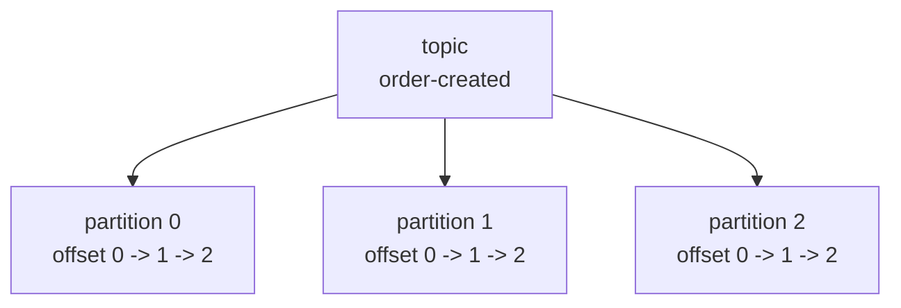
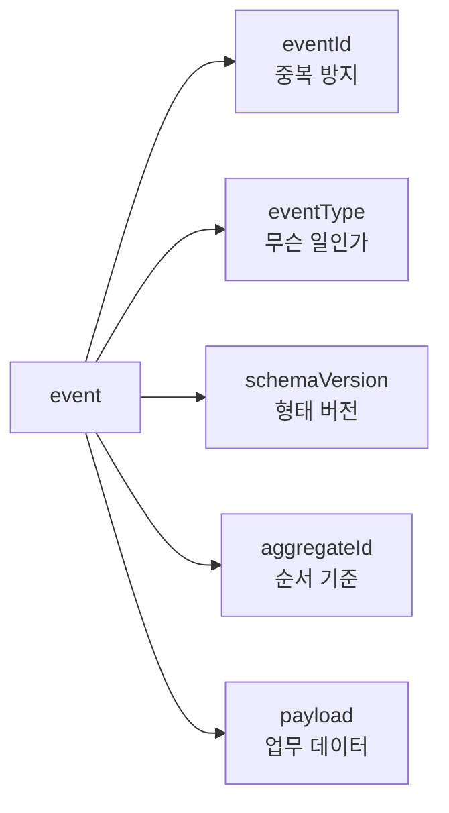
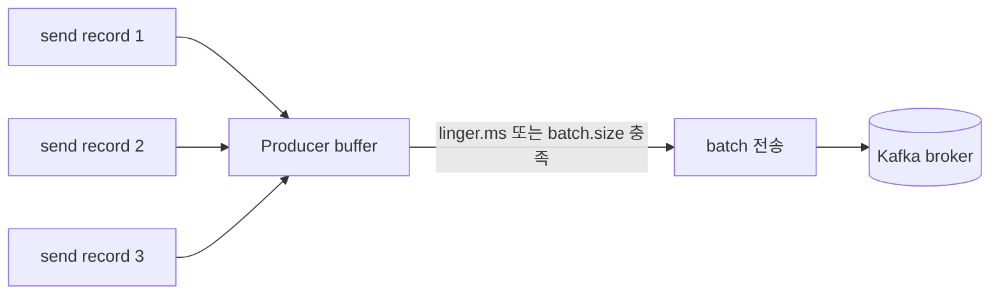
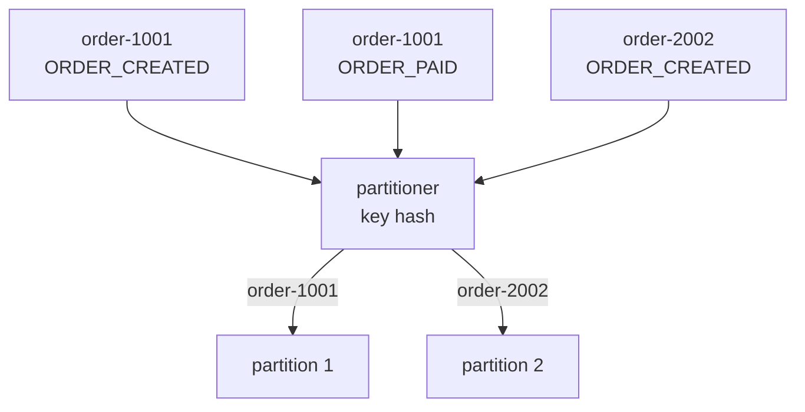

# Kafka Producer와 이벤트 설계

Producer 쪽 설계의 핵심은 **유실보다 중복이 낫다**는 기준을 잡고, 이벤트 자체가 나중에 추적·재처리될 수 있게 만드는 것입니다.

## 토픽 생성

운영 기준 토픽은 보통 replication factor를 3으로 두고, `acks=all`과 함께 `min.insync.replicas=2`를 사용합니다.

```bash
kafka-topics.sh \
  --bootstrap-server kafka-1:9092,kafka-2:9092,kafka-3:9092 \
  --create \
  --topic order-created \
  --partitions 6 \
  --replication-factor 3 \
  --config min.insync.replicas=2 \
  --config retention.ms=604800000
```

| 설정 | 의미 | 기준 |
|------|------|------|
| `partitions` | 병렬 처리와 순서 보장 단위 | 처리량, key 분포, consumer 수 기준 |
| `replication-factor` | 파티션 복제본 수 | 운영은 보통 3 이상 |
| `min.insync.replicas` | 성공 쓰기에 필요한 ISR 수 | RF 3이면 2를 자주 사용 |
| `retention.ms` | 메시지 보관 시간 | 재처리 가능 기간 기준 |

토픽을 만들면 내부적으로는 여러 partition이 생깁니다.



여기서 partition 수는 "동시에 몇 줄로 처리할 수 있는가"를 정합니다. partition이 6개면 같은 consumer group 안에서 최대 6개 consumer가 각 partition을 하나씩 맡아 병렬 처리할 수 있습니다.

## 이벤트 설계

이벤트는 나중에 재처리하고 추적할 수 있어야 합니다.

```json
{
  "eventId": "evt-20260425-000001",
  "eventType": "ORDER_CREATED",
  "schemaVersion": 1,
  "occurredAt": "2026-04-25T10:15:00Z",
  "aggregateType": "ORDER",
  "aggregateId": "order-1001",
  "producer": "order-service",
  "payload": {
    "orderId": 1001,
    "userId": 10,
    "amount": 39000
  }
}
```

| 필드 | 이유 |
|------|------|
| `eventId` | 중복 처리 방지, 추적 |
| `eventType` | 소비자가 이벤트 의미를 판단 |
| `schemaVersion` | 스키마 변경 대응 |
| `occurredAt` | 이벤트 발생 시각 |
| `aggregateId` | 순서 보장 key 후보 |
| `producer` | 장애 추적 |

이벤트는 단순 데이터 덩어리가 아니라 "나중에 다시 봐도 무슨 일이 있었는지 알 수 있는 기록"이어야 합니다.



신입이 이벤트를 설계할 때 `payload`부터 채우는 경우가 많습니다. 실무에서는 `eventId`, `eventType`, `schemaVersion`, `aggregateId`처럼 운영과 장애 대응에 필요한 필드가 먼저 안정적으로 잡혀야 합니다.

## Producer 설정

중요 이벤트는 유실보다 중복이 낫습니다. producer는 재시도와 멱등성을 켜고, consumer는 중복을 견디게 설계합니다.

```properties
bootstrap.servers=kafka-1:9092,kafka-2:9092,kafka-3:9092
acks=all
enable.idempotence=true
retries=2147483647
delivery.timeout.ms=120000
request.timeout.ms=30000
linger.ms=5
batch.size=32768
compression.type=lz4
max.in.flight.requests.per.connection=5
```

| 설정 | 의미 | 주의 |
|------|------|------|
| `acks=all` | leader가 ISR 복제를 기다림 | `min.insync.replicas`와 같이 봐야 함 |
| `enable.idempotence=true` | producer 재시도 중 broker log 중복 기록 방지 | consumer 중복 처리까지 없애는 것은 아님 |
| `retries` | 일시 장애 재시도 | `delivery.timeout.ms` 안에서 동작 |
| `delivery.timeout.ms` | 발행 전체 제한 시간 | 너무 짧으면 일시 장애에 취약 |
| `linger.ms` | 배치를 위해 잠깐 기다림 | 처리량과 지연의 trade-off |
| `batch.size` | 배치 크기 | 너무 크면 지연과 메모리 증가 |
| `compression.type` | 압축 | CPU와 네트워크 절충 |

Producer는 메시지를 바로 네트워크에 하나씩 던지는 것이 아니라, 내부 버퍼에 모았다가 batch로 보냅니다.



그래서 `linger.ms`를 조금 주면 처리량은 좋아질 수 있지만, 그만큼 각 메시지가 잠깐 기다릴 수 있습니다. 실시간성이 중요한 알림과 대량 로그 수집은 producer 설정 기준이 달라질 수 있습니다.

## Key 선택

Kafka의 순서는 토픽 전체가 아니라 **파티션 안에서만** 보장됩니다. 같은 업무 단위의 순서가 필요하면 같은 key를 사용해야 합니다.

```text
topic: order-events
key: order-1001
value: ORDER_CREATED

topic: order-events
key: order-1001
value: ORDER_PAID
```

| key 후보 | 장점 | 단점 |
|----------|------|------|
| `orderId` | 주문별 순서 보장 | 특정 주문 폭주 시 hot partition 가능 |
| `userId` | 사용자별 순서 보장 | 큰 사용자 편차가 있으면 불균등 |
| 랜덤 key | 분산이 좋음 | 업무 순서 보장 어려움 |
| key 없음 | round-robin 분산 | 같은 엔티티 순서 보장 없음 |

key는 partition을 고르는 기준입니다.



같은 주문의 이벤트가 같은 key를 쓰면 같은 partition으로 들어갑니다. 그러면 consumer는 그 partition 안에서 `ORDER_CREATED -> ORDER_PAID -> ORDER_CANCELED` 순서를 지킬 수 있습니다.

---

**관련 파일:**
- [Kafka 개요](../kafka.md)
- [Kafka 기본 개념과 구조](./기본개념.md)
- [아웃박스 패턴](../../architecture/outbox.md)
