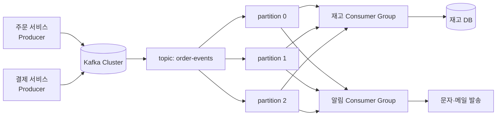
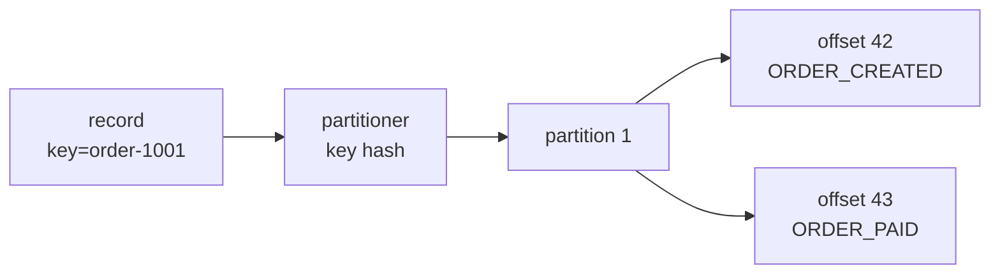
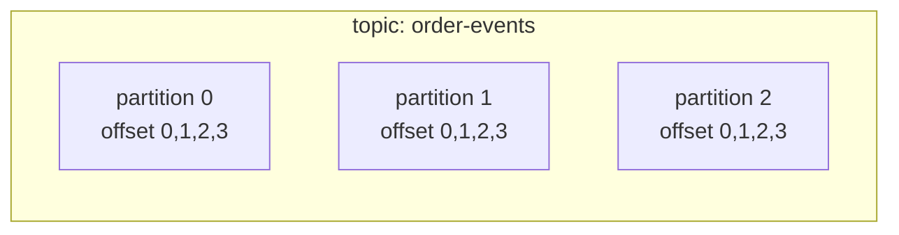
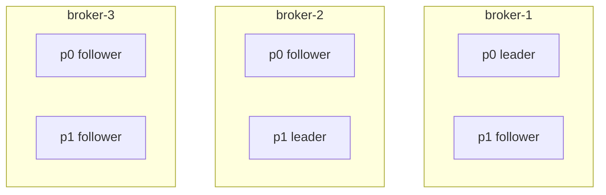
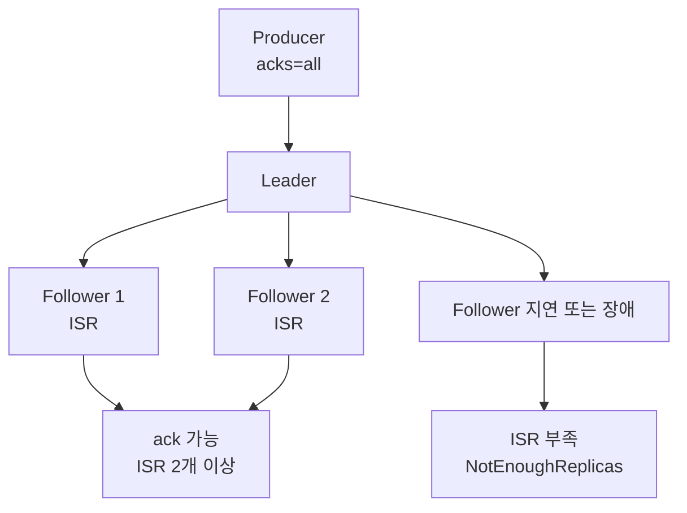
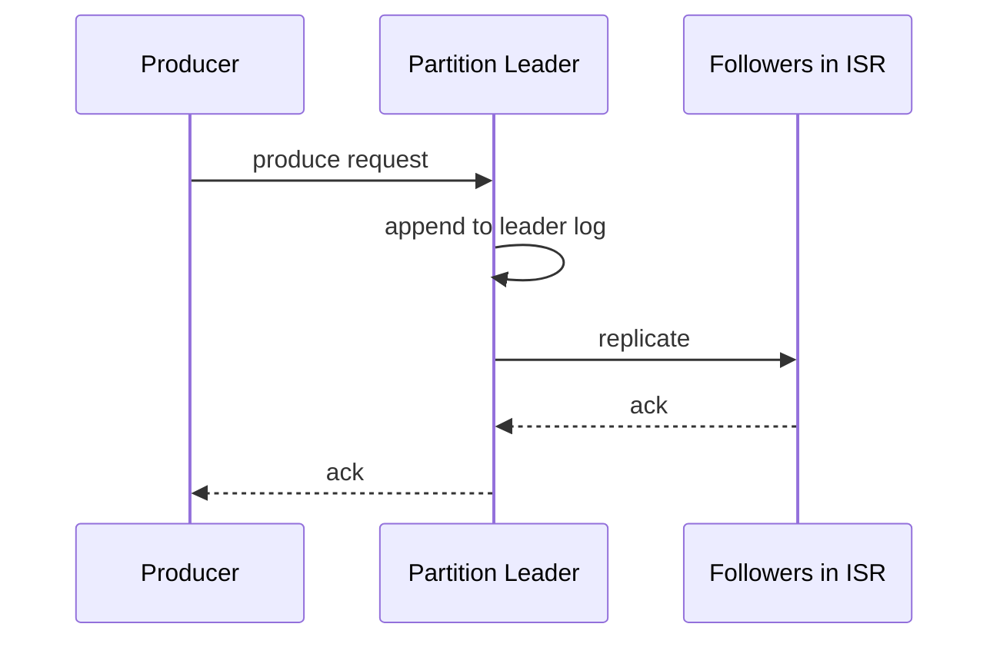
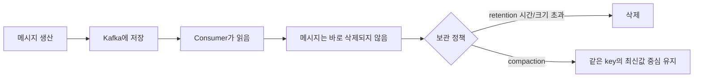

# Kafka 기본 개념과 구조

Kafka를 이해할 때는 "메시지를 꺼내면 사라지는 큐"보다 **여러 consumer가 각자 offset으로 읽는 이벤트 로그**로 보는 편이 안전합니다.

## 전체 그림

Kafka는 producer가 이벤트를 넣고, broker가 이벤트를 보관하고, consumer group이 각자 필요한 속도로 읽어가는 구조입니다.



그림을 이렇게 읽으면 됩니다.

| 구성요소 | 쉬운 설명 |
|----------|-----------|
| Producer | 이벤트를 Kafka에 넣는 쪽 |
| Topic | 이벤트를 종류별로 담는 이름 |
| Partition | topic 안에서 실제로 쌓이는 로그 파일 같은 단위 |
| Consumer Group | 같은 일을 나눠 처리하는 소비자 묶음 |
| Offset | consumer group이 어디까지 읽었는지 표시하는 책갈피 |

Kafka를 처음 배울 때 가장 중요한 문장입니다.

```text
Producer는 topic에 쓴다.
Kafka는 partition에 순서대로 보관한다.
Consumer group은 offset을 기억하며 읽는다.
서로 다른 consumer group은 같은 이벤트를 따로 읽을 수 있다.
```

## 이벤트 한 건의 이동 경로

`order-created` 이벤트 한 건이 들어온다고 가정해봅니다.

```text
topic: order-events
key: order-1001
value: ORDER_CREATED
```

Kafka는 먼저 topic을 보고 이벤트 종류를 구분합니다. 그 다음 key를 기준으로 어느 partition에 넣을지 정합니다. 같은 key가 계속 같은 partition으로 가면, 같은 주문에 대한 이벤트 순서를 지키기 쉬워집니다.



consumer group은 partition에서 record를 읽고, 처리에 성공하면 "다음에 어디서부터 읽을지"를 offset으로 저장합니다.

```text
partition 1
offset 42: ORDER_CREATED
offset 43: ORDER_PAID
offset 44: ORDER_SHIPPED

inventory-service group offset: 44
notification-service group offset: 43
```

위 상태는 재고 서비스는 다음에 `44`부터 읽고, 알림 서비스는 다음에 `43`부터 읽는다는 뜻입니다. 같은 topic을 읽더라도 consumer group마다 offset이 다르기 때문에 각 시스템이 자기 속도로 처리할 수 있습니다.

| 질문 | 답 |
|------|----|
| 이벤트는 어디에 저장되는가? | topic 안의 partition |
| 순서는 어디까지 보장되는가? | 같은 partition 안 |
| consumer는 어디까지 읽었는지 어떻게 아는가? | consumer group offset |
| 다른 consumer group도 같은 이벤트를 읽을 수 있는가? | 가능하다. group별 offset이 따로 있기 때문 |
| 장애 후 다시 읽을 수 있는가? | retention 안에 남아 있고 offset을 조정할 수 있으면 가능 |

## Topic, Partition, Offset

Topic은 이벤트의 논리적 분류이고, Partition은 topic을 나누어 저장하는 append-only log입니다. Offset은 partition 안에서 메시지 위치를 나타냅니다.



| 개념 | 설명 |
|------|------|
| Topic | 이벤트 종류 |
| Partition | 병렬 처리와 순서 보장 단위 |
| Offset | partition 안의 위치 |
| Record | key, value, headers, timestamp를 가진 메시지 |

조금 더 실제 로그처럼 보면 아래와 같습니다.

```text
partition 0
offset: 0        1        2        3
        A -----> B -----> C -----> D
                         ^
                         consumer group offset
```

consumer group offset이 `2`라면 보통 "다음에 offset 2부터 읽는다"는 의미입니다. 이미 처리한 마지막 메시지 번호가 아니라, 다음에 읽을 위치를 저장한다고 이해하면 헷갈림이 줄어듭니다.

## Broker, Leader, Follower, ISR

Kafka cluster는 여러 broker로 구성됩니다. 각 partition에는 leader replica가 있고, follower replica가 leader를 따라갑니다.



| 개념 | 설명 |
|------|------|
| Leader | producer write와 consumer read를 담당하는 replica |
| Follower | leader 데이터를 복제 |
| ISR | leader와 충분히 동기화된 replica 집합 |
| High Watermark | consumer에게 노출 가능한 안전한 offset 경계 |
| Controller | partition leader 선출과 metadata 관리 |

새 cluster는 KRaft metadata mode 기준으로 이해하는 편이 좋습니다. 기존 환경에서는 ZooKeeper 기반 Kafka가 남아 있을 수 있으므로, 운영 중인 cluster가 어떤 metadata mode인지 먼저 확인합니다.

`acks=all`은 producer가 leader에게 보낸 메시지가 ISR 조건을 만족할 때 성공으로 봅니다. `min.insync.replicas=2`인데 ISR이 leader 1개뿐이면 producer는 실패를 받습니다. 이것은 장애가 아니라 **유실을 막기 위해 쓰기를 거부하는 정상 보호 동작**일 수 있습니다.

정상 쓰기와 쓰기 거부를 나누면 이렇게 볼 수 있습니다.



`NotEnoughReplicas`가 보이면 무조건 설정을 낮춰서 성공시키는 것이 답은 아닙니다. Kafka가 "지금은 안전하게 복제할 수 없으니 쓰기를 실패시키겠다"고 알려주는 신호일 수 있습니다.

## Producer 전송 흐름



Producer 성능은 하나씩 보내는 것이 아니라 batch, compression, linger로 묶어 보내는 방식에서 나옵니다. 처리량이 중요하면 배치를 키우고, 지연이 중요하면 linger와 batch를 줄입니다.

## Retention과 Compaction

Kafka는 소비했다고 메시지를 바로 지우지 않습니다. 보관 정책에 따라 지웁니다.



이 점이 일반 큐와 크게 다릅니다. consumer가 읽었다고 Kafka 메시지가 사라지는 것이 아니기 때문에, 장애 후 offset을 되돌려 재처리할 수 있습니다. 대신 retention 기간이 지나 삭제된 메시지는 다시 읽을 수 없습니다.

| 정책 | 설명 | 사용처 |
|------|------|--------|
| `delete` | 시간 또는 크기 기준 삭제 | 일반 이벤트, 로그 |
| `compact` | 같은 key의 최신 값 중심 유지 | 상태 변경 최신값, 설정, CDC 일부 |
| `delete,compact` | 둘을 함께 사용 | 최신값 유지 + 오래된 tombstone 정리 |

Retention을 너무 짧게 잡으면 장애 복구 전에 메시지가 사라질 수 있고, 너무 길게 잡으면 디스크가 위험해집니다.

---

**관련 파일:**
- [Kafka 개요](../kafka.md)
- [Kafka란?](./kafka란.md)
- [토픽과 파티션 설계](./토픽파티션설계.md)
- [Producer와 이벤트 설계](./producer.md)
- [Consumer와 전달 보장](./consumer.md)
- [운영 구조와 고가용성](./운영구조와고가용성.md)

--8<-- "includes/kafka/core.md"
--8<-- "includes/kafka/operations.md"
