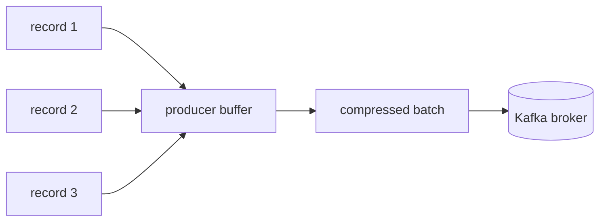

# Kafka 성능 최적화

Kafka 성능 최적화는 **producer batch, compression, partition 분산, consumer 처리 시간, broker disk/network**를 함께 보는 작업입니다. Kafka 자체가 빠르더라도 consumer의 DB 저장이 느리면 lag는 계속 증가합니다.

## 왜 쓰는지

Kafka는 대량 이벤트 처리에 강하지만 기본 설정만으로 모든 상황이 최적은 아닙니다. 처리량을 높이면 지연이 늘 수 있고, 지연을 줄이면 batch 효율이 낮아질 수 있습니다.

```text
처리량을 높이고 싶다 -> batch, compression, partition, consumer 병렬성
지연을 줄이고 싶다 -> linger, batch 크기, consumer 처리 시간
안정성을 높이고 싶다 -> acks, ISR, retry, DLQ
```

## Producer 최적화

| 설정 | 효과 | 주의 |
|------|------|------|
| `linger.ms` | batch를 모아 처리량 증가 | 값이 커지면 개별 메시지 지연 증가 |
| `batch.size` | batch 크기 증가 | 너무 크면 메모리와 지연 증가 |
| `compression.type` | network 사용량 감소 | CPU 사용량 증가 |
| `acks` | 내구성 기준 | `acks=all`은 안전하지만 지연이 늘 수 있음 |
| `buffer.memory` | producer 내부 버퍼 | 부족하면 send가 막힐 수 있음 |
| `delivery.timeout.ms` | 전송 전체 제한 | 너무 짧으면 일시 장애에 취약 |

```properties
acks=all
enable.idempotence=true
linger.ms=5
batch.size=32768
compression.type=lz4
buffer.memory=33554432
```

Producer는 메시지를 하나씩 바로 보내는 것이 아니라 buffer에 모아 batch로 전송합니다.



## Consumer 최적화

| 설정/방법 | 효과 | 주의 |
|-----------|------|------|
| `max.poll.records` 조정 | 한 번에 처리할 양 제어 | 처리 시간이 길면 줄임 |
| batch 처리 | DB insert, API 호출 효율 증가 | 실패 시 재처리 범위 증가 |
| consumer 수 증가 | partition 병렬 처리 | partition 수보다 많으면 효과 없음 |
| 처리 로직 최적화 | lag 감소 | sink DB 병목 확인 |
| `fetch.min.bytes` | 큰 batch fetch | 지연 증가 가능 |
| `max.poll.interval.ms` | 긴 처리 허용 | 너무 길면 장애 감지가 늦음 |

```properties
enable.auto.commit=false
max.poll.records=500
max.poll.interval.ms=300000
fetch.min.bytes=1
fetch.max.wait.ms=500
```

Consumer 성능 병목은 Kafka가 아니라 DB나 외부 API인 경우가 많습니다.

```text
consumer poll은 빠름
DB bulk insert가 느림
offset commit이 늦음
lag 증가
```

## Partition과 Key 분산

Partition 수가 너무 적으면 consumer를 늘려도 병렬 처리가 늘지 않습니다. 반대로 partition이 너무 많으면 broker metadata, file handle, recovery 비용이 늘어납니다.

| 증상 | 의심 |
|------|------|
| 특정 partition lag만 높음 | hot key, hot partition |
| 전체 partition lag가 높음 | consumer 처리량 부족, sink 병목 |
| broker 한 대만 CPU/network 높음 | leader 쏠림, partition 배치 불균형 |
| producer latency 증가 | broker 지연, ISR 부족, batch 설정 |

## Broker 최적화

| 영역 | 확인 |
|------|------|
| Disk | 사용률, I/O wait, segment 삭제 지연 |
| Network | bytes in/out, request latency |
| CPU | compression, request handler 여유 |
| Page Cache | disk read/write 효율 |
| Partition 배치 | broker별 leader/replica 균형 |
| Retention | 불필요한 장기 보관으로 disk 압박 여부 |

Kafka는 순차 write와 page cache 활용에 강합니다. 하지만 disk full, network 병목, partition 과다는 성능을 크게 떨어뜨립니다.

## 언제 어떤 최적화를 하는지

| 목표 | 우선 확인 |
|------|-----------|
| producer 처리량 증가 | batch, linger, compression |
| producer 지연 감소 | linger 축소, broker latency |
| consumer lag 감소 | 처리 시간, sink DB, partition별 lag |
| hot partition 완화 | key 분포, sharding, topic 분리 |
| broker 지연 감소 | disk/network, leader 분산 |
| 비용 절감 | retention, compression, topic 정리 |

## 장점

| 장점 | 설명 |
|------|------|
| 처리량 증가 | batch와 compression으로 network 효율 개선 |
| 지연 감소 | 불필요한 대기와 병목 제거 |
| 안정성 증가 | lag, retry, broker 지표로 장애 전조 파악 |
| 비용 절감 | retention과 compression으로 disk/network 비용 관리 |

## 단점

| 단점 | 설명 |
|------|------|
| trade-off 존재 | 처리량과 지연, 안정성과 속도 사이 균형 필요 |
| 설정 복잡도 | producer, consumer, broker를 함께 봐야 함 |
| 잘못된 최적화 위험 | batch 과대, partition 과다, retry 과다 |
| 업무 영향 | latency 목표와 재처리 범위를 업무와 맞춰야 함 |

## 특징

| 특징 | 설명 |
|------|------|
| batch 친화 | 작은 메시지를 묶을수록 효율이 좋아짐 |
| partition 병렬성 | partition 수가 consumer 병렬성의 큰 경계 |
| broker보다 sink 병목이 흔함 | DB/API 처리 속도가 lag를 만든다 |
| 압축 효과 큼 | 반복 필드가 많은 JSON 이벤트에서 network 절감 |
| 지표 기반 접근 필요 | 감으로 설정을 바꾸면 부작용이 큼 |

## 주의할 점

| 주의 | 설명 |
|------|------|
| `acks`를 낮춰서 성능만 올리지 않기 | 유실 위험이 커짐 |
| consumer만 늘려서 해결하려 하지 않기 | partition 수와 sink 병목 확인 |
| batch를 너무 키우지 않기 | 지연, 메모리, 실패 재처리 범위 증가 |
| lag 원인을 Kafka로 단정하지 않기 | DB, 외부 API, hot key 확인 |
| partition 과다 생성 금지 | broker recovery와 metadata 비용 증가 |
| retry 폭주 방지 | backoff와 DLQ 필요 |

## 베스트 프랙티스

| 권장 방식 | 이유 |
|-----------|------|
| p95/p99 latency와 throughput을 같이 본다 | 평균만 보면 장애를 놓침 |
| producer, broker, consumer 지표를 함께 본다 | 병목 위치 분리 |
| partition별 lag를 본다 | hot partition 탐지 |
| batch 변경은 부하 테스트 후 적용 | 지연과 메모리 부작용 확인 |
| compression은 CPU 여유와 함께 판단 | network 절감과 CPU 비용 균형 |
| consumer 처리는 멱등하게 만든다 | batch 실패 후 재처리 대비 |

## 실무에서는?

| 증상 | 먼저 볼 것 |
|------|------------|
| 발행 latency 증가 | broker request latency, ISR, producer buffer |
| lag 급증 | partition별 lag, consumer 처리 시간, DB latency |
| 특정 partition만 밀림 | key 분포, hot key |
| broker disk 압박 | topic별 size, retention, compact 지연 |
| API 응답까지 느려짐 | producer send 동기 대기, timeout, outbox 여부 |
| 배포 후 rebalance 증가 | consumer restart, poll interval, 처리 시간 |

## 정리

| 항목 | 설명 |
|------|------|
| producer 핵심 | batch, linger, compression, ack |
| consumer 핵심 | 처리 시간, commit, batch, partition 병렬성 |
| broker 핵심 | disk, network, leader 분산, retention |
| 가장 큰 주의점 | 처리량 최적화가 지연과 안정성을 해칠 수 있음 |
| 실무 기준 | lag가 아니라 병목 위치를 먼저 찾는다 |

---

**관련 파일:**
- [Producer와 이벤트 설계](./producer.md)
- [Consumer와 전달 보장](./consumer.md)
- [모니터링과 보안](./모니터링보안.md)

--8<-- "includes/kafka/core.md"
--8<-- "includes/kafka/producer-consumer.md"
