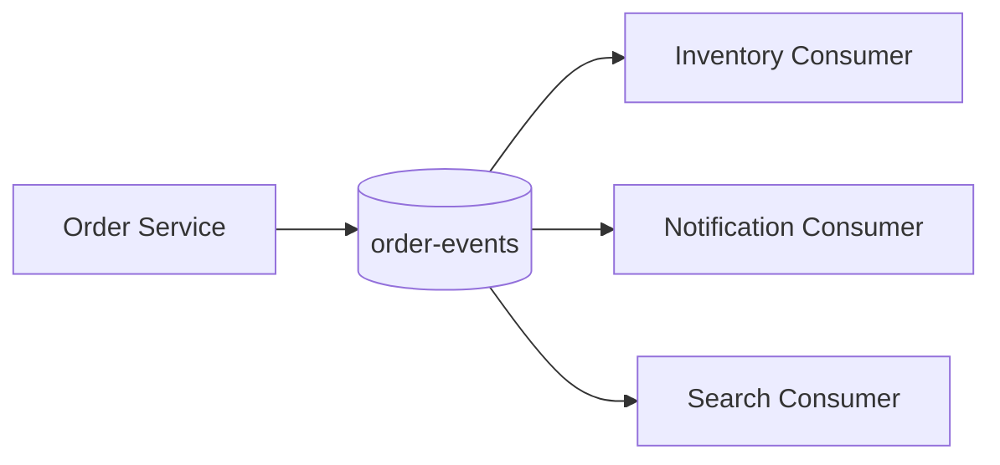

# Kafka 실무 유즈케이스

Kafka 유즈케이스는 대부분 **서비스 간 이벤트 전파, 대량 로그 수집, 비동기 후처리, 재처리 가능한 파이프라인**으로 나뉩니다. 핵심은 "지금 즉시 응답해야 하는가"보다 "이벤트를 남겨 여러 곳에서 안정적으로 처리해야 하는가"입니다.

## 왜 쓰는지

Kafka는 producer와 consumer를 분리하고, consumer가 장애나 지연을 겪어도 이벤트를 일정 기간 보관합니다. 그래서 서비스 간 직접 호출보다 장애 전파를 줄이고, 같은 이벤트를 여러 용도로 활용하기 좋습니다.

## 대표 유즈케이스

| 유즈케이스 | 설명 | 설계 기준 |
|------------|------|-----------|
| 주문 이벤트 전파 | 주문 생성, 결제, 취소를 다른 서비스에 전달 | `orderId` key, 멱등 consumer |
| 알림 비동기 처리 | 문자, 메일, push 발송 | 중복 발송 방지, DLQ |
| 검색 색인 갱신 | 상품/게시글 변경을 검색 엔진에 반영 | 재처리 가능 retention |
| 로그 수집 | 클릭, 노출, API 로그 수집 | 처리량, 압축, batch |
| 통계 집계 | 이벤트 기반 실시간/준실시간 집계 | window, late event 정책 |
| CDC | DB 변경 내역을 이벤트로 전파 | schema evolution, 순서 보장 |
| Saga 보조 | 서비스 간 상태 변경 이벤트 연결 | 보상 트랜잭션, 상태 전이 검증 |

## 어떻게 쓰는지

### 주문 이벤트 전파



| 항목 | 기준 |
|------|------|
| topic | `order-events` |
| key | `orderId` |
| event | `ORDER_CREATED`, `ORDER_PAID`, `ORDER_CANCELED` |
| consumer | 재고, 알림, 검색, 통계 |
| 주의 | DB 저장과 이벤트 발행 사이 정합성 |

DB 저장과 Kafka 발행 사이의 불일치가 걱정되면 [아웃박스 패턴](../../architecture/outbox.md)을 사용합니다.

### 알림 비동기 처리

알림은 사용자 요청 응답과 분리하기 좋습니다. 다만 같은 이벤트를 여러 번 처리할 수 있으므로 중복 발송 방지 key가 필요합니다.

```text
notificationKey = eventId + channel + receiver
```

| 실패 | 대응 |
|------|------|
| 일시적 API 오류 | retry/backoff |
| 계속 실패 | DLQ |
| 중복 이벤트 | idempotency key로 발송 차단 |
| 외부 API rate limit | consumer 처리량 제한 |

### 검색 색인 갱신

검색 엔진은 DB와 완전 동기화되기보다 이벤트로 결국 따라가는 구조가 많습니다.

| 기준 | 설명 |
|------|------|
| key | document id |
| retention | 장애 후 재처리 가능한 기간 |
| consumer | batch bulk indexing |
| 주의 | 삭제 이벤트와 업데이트 순서 |

### 로그 수집

클릭, 노출, API 로그는 순서보다 처리량과 보관이 중요합니다.

| 기준 | 설명 |
|------|------|
| key | 없거나 분산 key |
| producer | batch, compression 중심 |
| consumer | 적재 sink 단위 batch |
| retention | 분석 저장소 적재 지연을 고려 |

## 언제 쓰는지

| 상황 | Kafka 적합도 | 이유 |
|------|-------------|------|
| 같은 이벤트를 여러 서비스가 써야 함 | 높음 | consumer group별 독립 소비 |
| 장애 후 재처리가 필요 | 높음 | offset 기반 재처리 |
| 대량 이벤트를 받아야 함 | 높음 | partition과 batch 기반 확장 |
| 외부 API 호출을 요청 흐름에서 분리 | 높음 | 비동기 후처리 |
| 단순 예약 작업 몇 개 | 낮음 | scheduler나 queue가 더 단순 |
| 즉시 응답이 필요한 조회 | 낮음 | DB/Redis가 적합 |
| 강한 동기 트랜잭션 | 낮음 | Kafka는 최종 일관성 중심 |

## 장점

| 장점 | 설명 |
|------|------|
| 장애 격리 | consumer 장애가 producer 요청을 바로 막지 않음 |
| 확장성 | consumer group과 partition으로 처리량 확장 |
| 재처리 | retention 안에서 과거 이벤트 재처리 |
| 다중 활용 | 하나의 이벤트를 알림, 검색, 통계에 재사용 |
| 감사 추적 | 이벤트 흐름을 topic/partition/offset으로 추적 |

## 단점

| 단점 | 설명 |
|------|------|
| 최종 일관성 | 이벤트 반영 지연을 허용해야 함 |
| 중복 처리 | consumer 멱등성 필요 |
| 순서 제한 | partition 기준 순서만 보장 |
| 운영 비용 | broker, lag, DLQ, schema 관리 필요 |
| 설계 과함 | 작은 서비스에는 복잡도가 비용이 될 수 있음 |

## 특징

| 특징 | 설명 |
|------|------|
| 이벤트 보존 | 소비와 삭제가 분리됨 |
| 다중 consumer group | 같은 이벤트를 여러 용도로 소비 |
| key 기반 순서 | aggregate 단위 순서 보장 가능 |
| batch 친화 | 대량 로그와 색인 적재에 유리 |
| replay 가능 | 장애 후 offset 조정으로 다시 처리 |

## 주의할 점

| 주의 | 설명 |
|------|------|
| 요청 응답 대체로 쓰지 않기 | Kafka는 조회 저장소가 아님 |
| 원장 정합성을 Kafka에만 맡기지 않기 | DB transaction과 보정 필요 |
| 중복 발송 방지 없이 알림 consumer 만들지 않기 | 같은 알림이 여러 번 갈 수 있음 |
| retry 무한 반복 금지 | poison pill은 DLQ로 격리 |
| 이벤트 의미를 불명확하게 만들지 않기 | `UPDATED`만 남발하면 consumer가 판단하기 어려움 |

## 베스트 프랙티스

| 권장 방식 | 이유 |
|-----------|------|
| 유즈케이스별 topic owner 지정 | 장애와 schema 책임 명확화 |
| eventId와 aggregateId 포함 | 멱등성과 추적 |
| 소비자는 재처리 가능하게 작성 | 장애 복구와 replay 대응 |
| DLQ와 보정 프로세스 준비 | 실패 메시지 운영 가능 |
| lag 기준을 업무 지연 기준과 연결 | 단순 숫자보다 사용자 영향 파악 |
| Kafka가 필요 없는 경우도 명확히 함 | 과한 인프라 도입 방지 |

## 실무 판단표

| 요구사항 | 추천 |
|----------|------|
| "주문 생성 후 알림/재고/검색을 비동기로 처리" | Kafka 적합 |
| "API 요청에 즉시 사용자 정보를 조회" | DB/Redis 적합 |
| "클릭 로그를 초당 대량 수집" | Kafka 적합 |
| "작업 하나를 백그라운드에서 한 번 실행" | Queue/Scheduler 검토 |
| "이벤트를 다시 읽어 검색 색인을 복구" | Kafka 적합 |
| "결제 승인과 포인트 차감을 한 transaction으로 처리" | DB transaction 중심, Kafka는 후속 이벤트 |

## 정리

| 항목 | 설명 |
|------|------|
| 핵심 유즈케이스 | 이벤트 전파, 로그 수집, 비동기 후처리, 재처리 |
| 가장 큰 장점 | producer와 consumer 분리 |
| 가장 큰 주의점 | 최종 일관성과 중복 처리 |
| 실무 기준 | "다시 와도 같은 결과"와 "나중에 다시 처리 가능"을 설계 |

---

**관련 파일:**
- [Kafka란?](./kafka란.md)
- [Producer와 이벤트 설계](./producer.md)
- [Consumer와 전달 보장](./consumer.md)

--8<-- "includes/kafka/core.md"
--8<-- "includes/kafka/producer-consumer.md"
