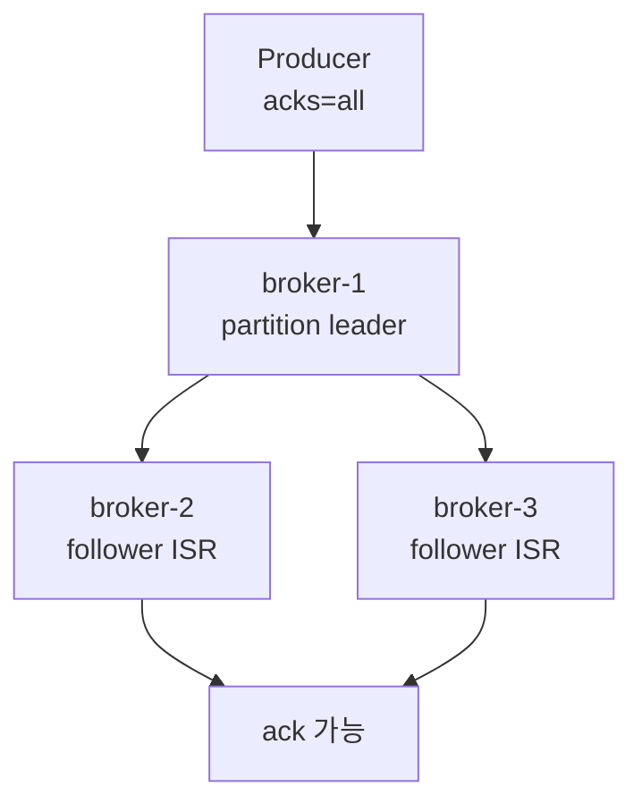

# Kafka 운영 구조와 고가용성

Kafka 운영 구조는 **broker 여러 대에 partition replica를 분산하고, leader 장애 시 follower가 이어받게 만드는 구조**입니다. 고가용성은 replication factor만 높인다고 끝나지 않고, producer `acks`, `min.insync.replicas`, rack 배치, disk 여유, controller 안정성을 함께 봐야 합니다.

<div class="concept-box" markdown="1">

**고가용성**은 broker 한 대가 장애 나도 topic의 읽기와 쓰기를 계속할 수 있게 만드는 설계입니다. Kafka에서는 partition replica, ISR, leader election이 핵심입니다.

</div>

## 왜 쓰는지

Kafka는 이벤트가 여러 서비스의 기준 흐름이 되는 경우가 많습니다. broker 한 대 장애로 주문, 알림, 검색 색인, 통계 파이프라인이 모두 멈추면 장애 영향이 큽니다.

```text
Replication factor는 사본 수를 정한다.
ISR은 현재 안전하게 동기화된 사본을 나타낸다.
min.insync.replicas는 쓰기 성공에 필요한 최소 동기화 사본 수를 정한다.
acks=all은 producer가 ISR 복제를 기다리게 한다.
```

## 구성요소

| 구성요소 | 역할 |
|----------|------|
| Broker | record를 저장하고 producer/consumer 요청 처리 |
| Controller | partition leader 선출과 metadata 관리 |
| Metadata Quorum | KRaft 모드에서 controller들이 metadata를 합의로 관리 |
| Leader Replica | partition의 읽기와 쓰기를 담당 |
| Follower Replica | leader 데이터를 복제 |
| ISR | leader와 충분히 동기화된 replica 집합 |

Kafka 4.0 이후 ZooKeeper 모드는 제거되었으므로 새 cluster는 KRaft 기준으로 이해하는 편이 좋습니다. 다만 기존 회사 환경에서는 legacy ZooKeeper 기반 Kafka를 만날 수 있으므로 운영 구조를 확인해야 합니다.

## 어떻게 구성하는지

### Replication과 ISR



운영에서 자주 쓰는 조합입니다.

| 설정 | 예시 | 의미 |
|------|------|------|
| `replication.factor` | `3` | partition 사본 3개 |
| `min.insync.replicas` | `2` | ISR 2개 이상일 때 쓰기 성공 |
| producer `acks` | `all` | ISR 복제 성공까지 대기 |

RF 3, min ISR 2, `acks=all`이면 broker 한 대가 죽어도 나머지 2대가 ISR이면 쓰기를 계속할 수 있습니다. 하지만 broker 2대 이상 문제가 생겨 ISR이 1개가 되면 producer 쓰기는 실패할 수 있습니다. 이것은 유실을 막기 위한 보호 동작입니다.

### Rack Awareness

broker가 서로 다른 rack 또는 availability zone에 있다면 replica를 분산합니다.

```properties
broker.rack=az-a
```

Rack awareness는 한 zone 장애가 전체 replica를 동시에 잃는 위험을 줄입니다.

## 언제 어떤 구조를 쓰는지

| 상황 | 권장 구조 |
|------|-----------|
| 개발 로컬 환경 | 단일 broker 가능 |
| 사내 테스트 환경 | 3 broker, RF 2~3 검토 |
| 운영 핵심 이벤트 | 3 broker 이상, RF 3, min ISR 2 |
| zone 장애까지 고려 | rack awareness, multi-AZ 배치 |
| 매우 큰 처리량 | broker 수, partition 수, disk/network 분리 계획 |
| 감사성 장기 보관 | Kafka retention만 믿지 말고 별도 저장소 연계 검토 |

## 장점

| 장점 | 설명 |
|------|------|
| broker 장애 흡수 | follower가 leader를 이어받아 처리 지속 |
| 유실 위험 감소 | ISR과 `acks=all`로 안전한 쓰기 기준 확보 |
| 수평 확장 | broker와 partition을 늘려 처리량 확장 |
| 운영 가시성 | leader, ISR, lag 지표로 장애 위치 파악 |

## 단점

| 단점 | 설명 |
|------|------|
| 운영 난도 증가 | broker, disk, network, controller, ISR 관리 필요 |
| 비용 증가 | replication factor만큼 저장 공간과 네트워크 복제 비용 증가 |
| 잘못된 설정 위험 | `acks=1`, min ISR 부족 등으로 유실 위험 증가 |
| partition 과다 비용 | metadata, file handle, recovery 시간이 늘어남 |

## 특징

| 특징 | 설명 |
|------|------|
| leader 중심 처리 | producer write와 consumer read는 leader replica 중심 |
| follower 복제 | follower가 leader log를 따라감 |
| ISR 기반 안정성 | follower가 너무 늦으면 ISR에서 빠짐 |
| controller 관리 | leader election과 metadata를 관리 |
| disk 중심 운영 | Kafka 성능과 안정성은 disk 여유와 I/O에 크게 영향 |

## 주의할 점

| 주의 | 설명 |
|------|------|
| RF만 높이고 `acks=all`을 빼먹지 않기 | producer가 복제를 기다리지 않으면 유실 위험이 남음 |
| min ISR을 너무 낮게 잡지 않기 | leader 단독 쓰기를 허용할 수 있음 |
| unclean leader election 주의 | 동기화 안 된 replica가 leader가 되면 데이터 유실 가능 |
| disk full 방치 금지 | broker 쓰기 실패와 cluster 불안정으로 이어짐 |
| broker 재시작을 동시에 하지 않기 | ISR 부족과 offline partition 위험 |
| controller 지표 확인 | metadata 불안정은 전체 cluster 영향 |

## 베스트 프랙티스

| 권장 방식 | 이유 |
|-----------|------|
| 운영 topic은 RF 3 이상 검토 | broker 한 대 장애 대비 |
| `acks=all`과 min ISR을 함께 설계 | 내구성 기준 명확화 |
| broker disk 사용률 알림 | retention 삭제 지연과 write 실패 예방 |
| rack awareness 적용 | zone/rack 장애 영향 감소 |
| rolling restart 절차 사용 | ISR 회복을 확인하며 순차 재시작 |
| topic별 owner와 SLA 문서화 | 장애 시 의사결정 속도 향상 |
| capacity planning 주기화 | traffic 증가와 retention 증가 대응 |

## 실무에서는?

| 상황 | 확인 |
|------|------|
| broker 한 대 장애 | offline partition 여부, ISR 회복, leader 재분배 |
| producer `NotEnoughReplicas` | ISR 수, min ISR, 장애 broker 확인 |
| disk 사용률 급증 | topic별 log size, retention, compact 지연 |
| consumer lag 증가 | broker 문제인지 consumer/sink 문제인지 분리 |
| 신규 topic 생성 | RF, partition, retention, owner, ACL 확인 |
| cluster 확장 | broker leader 분산과 partition reassignment 확인 |

## 정리

| 항목 | 설명 |
|------|------|
| 고가용성 핵심 | replication, ISR, leader election |
| 운영 핵심 설정 | RF, min ISR, producer `acks` |
| 가장 큰 장점 | broker 장애에도 이벤트 흐름 유지 |
| 가장 큰 주의점 | 안전한 쓰기 기준과 disk 여유를 같이 봐야 함 |
| 실무 기준 | RF 3, min ISR 2, `acks=all`을 기본 후보로 검토 |

---

**관련 파일:**
- [기본 개념과 구조](./기본개념.md)
- [토픽과 파티션 설계](./토픽파티션설계.md)
- [장애 대응과 트러블슈팅](./운영장애대응.md)

--8<-- "includes/kafka/core.md"
--8<-- "includes/kafka/operations.md"
