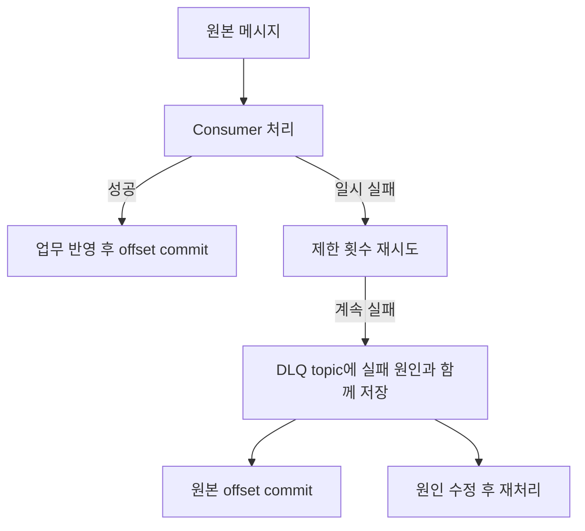
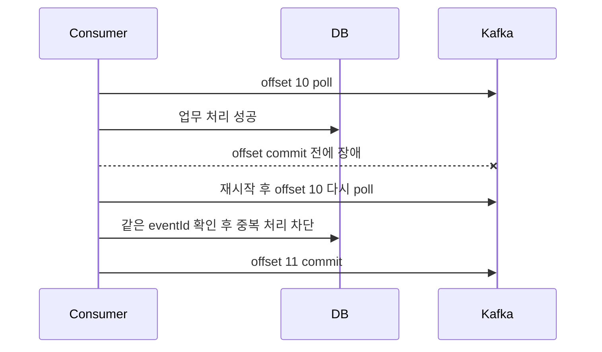

# Kafka 운영과 장애 대응

Kafka 장애 대응은 producer, broker, consumer, sink DB를 한 덩어리로 보지 않고 **어느 지점에서 지연·유실·중복·정합성 문제가 생겼는지** 나누어 확인하는 것이 중요합니다.

## 장애 대응 Runbook

### 1. Producer timeout 또는 발행 실패

| 단계 | 확인 |
|------|------|
| 증상 | send timeout, `NotEnoughReplicas`, `TimeoutException`, 이벤트 발행 지연 |
| 즉시 확인 | topic ISR, broker 상태, producer error rate, network |
| 의심 원인 | ISR 부족, leader 장애, broker disk/network 병목, 잘못된 `bootstrap.servers` |
| 완화 | producer 재시도 유지, 비핵심 이벤트 임시 차단, broker 복구 |
| 재발 방지 | RF 3, `min.insync.replicas=2`, producer timeout/alert, outbox |

```bash
kafka-topics.sh \
  --bootstrap-server kafka-1:9092 \
  --describe \
  --topic order-created
```

확인할 부분입니다.

```text
Leader: 정상 broker인가
Replicas: 기대 복제본 수인가
Isr: min.insync.replicas 이상인가
```

### 2. Broker 한 대 장애

| 단계 | 확인 |
|------|------|
| 증상 | under-replicated partition 증가, leader election, producer 지연 |
| 즉시 확인 | 장애 broker, offline partition, controller log |
| 의심 원인 | 프로세스 다운, 디스크 full, 네트워크 분리 |
| 완화 | broker 복구, leader 재분배 확인, ISR 회복 대기 |
| 재발 방지 | disk alert, rack awareness, graceful shutdown, capacity 여유 |

```bash
kafka-topics.sh --bootstrap-server kafka-1:9092 --describe
```

운영에서 특히 봐야 할 지표입니다.

| 지표 | 의미 |
|------|------|
| UnderReplicatedPartitions | follower가 leader를 못 따라감 |
| OfflinePartitionsCount | leader가 없어 읽기/쓰기 불가 |
| ActiveControllerCount | controller가 정확히 1개인지 |
| RequestHandlerAvgIdlePercent | broker 처리 여유 |

### 3. Consumer lag 급증

| 단계 | 확인 |
|------|------|
| 증상 | 알림 지연, 이벤트 반영 지연, lag 증가 |
| 즉시 확인 | group lag, partition별 lag, consumer 처리 시간, sink DB |
| 의심 원인 | consumer 처리 느림, DB 병목, poison pill, hot partition, rebalance |
| 완화 | consumer 임시 증설, `max.poll.records` 조정, 실패 메시지 격리 |
| 재발 방지 | 처리 시간 지표, DLQ, 파티션/key 재설계, backpressure |

```bash
kafka-consumer-groups.sh \
  --bootstrap-server kafka-1:9092 \
  --describe \
  --group inventory-service
```

| 컬럼 | 의미 |
|------|------|
| `CURRENT-OFFSET` | consumer가 commit한 위치 |
| `LOG-END-OFFSET` | partition 최신 위치 |
| `LAG` | 아직 처리하지 못한 메시지 수 |

### 4. Rebalance가 반복됨

| 단계 | 확인 |
|------|------|
| 증상 | 소비가 자주 멈춤, 중복 처리 증가, lag 톱니 패턴 |
| 즉시 확인 | consumer restart, heartbeat 실패, poll interval 초과 |
| 의심 원인 | 처리 시간이 `max.poll.interval.ms` 초과, consumer 불안정, deploy 반복 |
| 완화 | consumer 수 안정화, 처리량 제한, 긴 작업 분리 |
| 재발 방지 | static membership, cooperative rebalance, poll/processing 분리 |

확인할 설정입니다.

```properties
max.poll.interval.ms=300000
max.poll.records=500
session.timeout.ms=45000
heartbeat.interval.ms=3000
```

처리 시간이 길면 `max.poll.records`를 줄여 한 poll 안에서 처리하는 총 시간을 줄입니다.

### 5. Poison Pill로 특정 offset에서 멈춤

| 단계 | 확인 |
|------|------|
| 증상 | 특정 partition lag만 증가, 같은 에러 로그 반복 |
| 즉시 확인 | 실패 offset, message key/value, deserialization error |
| 의심 원인 | 깨진 메시지, 스키마 불일치, 비즈니스 검증 실패 |
| 완화 | 메시지를 DLQ로 보내고 offset 진행, 임시 skip은 승인 후 수행 |
| 재발 방지 | schema compatibility, DLQ 표준, 재처리 도구 |

```bash
kafka-console-consumer.sh \
  --bootstrap-server kafka-1:9092 \
  --topic order-created \
  --partition 2 \
  --offset 15320 \
  --max-messages 1 \
  --property print.key=true \
  --property print.headers=true
```

<div class="danger-box" markdown="1">

**위험**: offset을 강제로 넘기면 메시지를 처리하지 않고 버리는 것이다. 결제, 재고, 포인트 같은 이벤트는 DLQ 저장과 보정 계획 없이 skip하면 안 된다.

</div>

DLQ를 쓰는 흐름은 아래처럼 잡습니다.



DLQ는 실패 메시지를 버리는 곳이 아니라 **전체 소비를 멈추지 않기 위해 격리하는 곳**입니다. DLQ에 넣을 때 원본 topic, partition, offset, key, 에러 메시지를 함께 남겨야 나중에 복구할 수 있습니다.

### 6. 중복 소비 발생

| 단계 | 확인 |
|------|------|
| 증상 | 같은 주문 알림 2번, 재고 중복 차감, 포인트 중복 적립 |
| 즉시 확인 | 같은 `eventId` 처리 로그, commit 실패, rebalance 시각 |
| 의심 원인 | 처리 후 commit 전 장애, 멱등성 누락, producer 중복 |
| 완화 | DB unique로 추가 중복 차단, 보정 쿼리, 재처리 중지 |
| 재발 방지 | processed event table, idempotency key, 상태 전이 검증 |

예시 멱등성 테이블입니다.

```sql
CREATE TABLE processed_event (
    event_id VARCHAR(100) PRIMARY KEY,
    consumer_name VARCHAR(100) NOT NULL,
    processed_at DATETIME NOT NULL
);
```

처리 흐름입니다.

```text
1. transaction 시작
2. processed_event에 eventId insert
3. 이미 있으면 처리하지 않고 성공으로 간주
4. 비즈니스 변경 저장
5. transaction commit
6. Kafka offset commit
```

중복 소비는 아래 시나리오에서 자주 발생합니다.



그래서 "Kafka를 쓰면 한 번만 처리된다"가 아니라, "다시 와도 같은 결과가 되게 만든다"가 실무 기준입니다.

### 7. 순서가 깨진 것처럼 보임

| 단계 | 확인 |
|------|------|
| 증상 | 취소 이벤트가 생성 이벤트보다 먼저 반영 |
| 즉시 확인 | 두 이벤트의 key, partition, offset, occurredAt |
| 의심 원인 | key 불일치, 여러 producer 시각 차이, consumer 병렬 처리 |
| 완화 | 해당 aggregate 처리 일시 중지, 순서 보정 |
| 재발 방지 | key 표준화, partition 내 순차 처리, 상태 전이 검증 |

### 8. Disk full 또는 retention 문제

| 단계 | 확인 |
|------|------|
| 증상 | broker write 실패, segment 삭제 지연, controller 불안정 |
| 즉시 확인 | broker disk usage, topic별 log size, retention 설정 |
| 의심 원인 | retention 과다, compact 지연, consumer 중단과 무관한 장기 보관 |
| 완화 | 불필요 topic retention 축소, broker disk 확장, 오래된 topic 정리 |
| 재발 방지 | topic 생성 기준, disk alert, capacity planning |

```bash
kafka-configs.sh \
  --bootstrap-server kafka-1:9092 \
  --entity-type topics \
  --entity-name order-created \
  --describe
```

### 9. Hot Partition

| 단계 | 확인 |
|------|------|
| 증상 | 특정 partition lag만 높음, 특정 broker network/CPU 높음 |
| 즉시 확인 | key 분포, partition별 bytes in/out, lag |
| 의심 원인 | 특정 key에 이벤트 집중, partition 수 부족, 잘못된 key |
| 완화 | consumer 처리 최적화, 해당 key 별도 토픽, 임시 backpressure |
| 재발 방지 | key sharding, partition 증설, 도메인별 topic 분리 |

<div class="warning-box" markdown="1">

**주의**: partition을 늘리면 새 메시지의 key 배치가 달라질 수 있다. key 기반 순서 보장과 기존 운영 도구 영향을 확인한 뒤 변경한다.

</div>

### 10. Schema 불일치

| 단계 | 확인 |
|------|------|
| 증상 | deserialization 실패, 특정 consumer만 실패 |
| 즉시 확인 | schema version, 배포 시각, 실패 필드 |
| 의심 원인 | 필수 필드 추가, 타입 변경, enum 추가 미대응 |
| 완화 | producer rollback, consumer hotfix, 실패 메시지 DLQ |
| 재발 방지 | backward/forward compatibility 검사, contract test |

### 11. Offset reset 사고

| 단계 | 확인 |
|------|------|
| 증상 | 과거 메시지 대량 재처리 또는 메시지 건너뜀 |
| 즉시 확인 | group offset 변경 로그, reset 명령 시각, lag 변화 |
| 의심 원인 | 잘못된 `group.id`, `auto.offset.reset`, 운영 명령 실수 |
| 완화 | consumer 중지, offset을 안전 지점으로 재설정, 중복 보정 |
| 재발 방지 | 운영 명령 승인 절차, dry-run, group naming 규칙 |

```bash
kafka-consumer-groups.sh \
  --bootstrap-server kafka-1:9092 \
  --group inventory-service \
  --topic order-created \
  --reset-offsets \
  --to-datetime 2026-04-25T10:00:00.000 \
  --dry-run
```

`--execute`는 dry-run 결과를 확인한 뒤에만 사용합니다.

### 12. Consumer가 메시지를 못 읽음

| 단계 | 확인 |
|------|------|
| 증상 | consumer 시작은 됐지만 처리 로그 없음 |
| 즉시 확인 | topic 이름, group id, ACL, offset 위치, `auto.offset.reset` |
| 의심 원인 | 이미 latest에 offset 있음, 권한 없음, 다른 group과 착각 |
| 완화 | console consumer로 직접 확인, group offset 확인 |
| 재발 방지 | topic/group 명명 규칙, 권한 점검 체크리스트 |

## 관찰 지표와 명령

### Topic 상태

```bash
kafka-topics.sh \
  --bootstrap-server kafka-1:9092 \
  --describe \
  --topic order-created
```

| 항목 | 확인 |
|------|------|
| partition 수 | consumer 병렬성 충분한가 |
| leader | 특정 broker에 몰리지 않았는가 |
| replicas | replication factor가 맞는가 |
| ISR | 복제가 정상인가 |

### Consumer Group 상태

```bash
kafka-consumer-groups.sh \
  --bootstrap-server kafka-1:9092 \
  --describe \
  --group inventory-service
```

| 지표 | 의미 |
|------|------|
| lag | 처리 지연 |
| records-lag-max | consumer가 가진 partition 중 최대 lag |
| poll duration | 처리 루프가 poll 제한 안에 도는지 |
| commit rate/error | offset 저장 문제 |
| rebalance count | group 안정성 |

### Broker 지표

| 지표 | 위험 신호 |
|------|-----------|
| UnderReplicatedPartitions | 복제 지연 또는 broker 장애 |
| OfflinePartitionsCount | 읽기/쓰기 불가 partition |
| RequestQueueSize | 요청 처리 밀림 |
| Produce/Fetch request latency | broker 지연 |
| NetworkProcessorAvgIdlePercent | 네트워크 처리 여유 부족 |
| RequestHandlerAvgIdlePercent | 요청 처리 thread 부족 |
| disk usage | retention·segment 삭제 위험 |
| bytes in/out | 트래픽 급증 |

### Producer 지표

| 지표 | 의미 |
|------|------|
| record-send-rate | 발행량 |
| record-error-rate | 발행 실패 |
| record-retry-rate | 재시도 |
| request-latency-avg/p99 | broker 응답 지연 |
| buffer-available-bytes | producer 내부 버퍼 여유 |
| batch-size-avg | 배치 효율 |

### Consumer 지표

| 지표 | 의미 |
|------|------|
| records-consumed-rate | 소비량 |
| records-lag-max | 최대 lag |
| fetch-latency-avg/p99 | broker fetch 지연 |
| commit-latency-avg | offset commit 지연 |
| poll idle ratio | consumer가 놀고 있는지 |
| processing time | 비즈니스 처리 지연 |

## 베스트 프랙티스

| 권장 방식 | 이유 |
|-----------|------|
| 중요한 이벤트는 `acks=all` | leader 단독 저장 후 유실 방지 |
| RF 3, `min.insync.replicas=2` | broker 1대 장애에도 내구성 확보 |
| producer idempotence 활성화 | 재시도 중 log 중복 감소 |
| consumer는 멱등하게 구현 | at-least-once의 중복 처리 대비 |
| offset은 처리 후 commit | 처리 전 commit으로 인한 유실 방지 |
| DLQ와 재처리 도구 준비 | poison pill로 전체 소비 중단 방지 |
| key 설계를 먼저 결정 | 순서 보장과 partition 분산에 영향 |
| schema version 포함 | 이벤트 변경 추적 |
| lag 알림은 partition별로 | hot partition을 놓치지 않음 |
| topic retention을 업무 기준으로 설정 | 복구 가능 기간과 disk 균형 |
| 운영 명령은 dry-run 우선 | offset reset 사고 방지 |
| outbox 패턴 고려 | DB 저장과 이벤트 발행 불일치 완화 |

## 실무에서는?

| 사용처 | 설계 기준 |
|--------|-----------|
| 주문 이벤트 전파 | `orderId` key, consumer 멱등성, DLQ |
| 알림 비동기 처리 | 중복 발송 방지 key, 재시도 제한 |
| 재고 차감 | 상태 전이 검증, DB unique, 순서 보장 |
| 검색 색인 갱신 | 재처리 가능하게 retention 확보 |
| 로그 수집 | 처리량 중심, 압축, 긴 retention 또는 별도 저장소 연계 |
| CDC | schema evolution, compaction, 순서 보장 확인 |
| 외부 API 연동 | retry/backoff, DLQ, rate limit |

### 운영 체크리스트

| 체크 | 질문 |
|------|------|
| Topic | partition, RF, retention, min ISR 기준이 있는가 |
| Producer | `acks`, idempotence, timeout, retry 정책이 명확한가 |
| Consumer | 수동 commit, 멱등성, DLQ가 준비됐는가 |
| Key | 순서 보장 단위와 hot partition 위험을 검토했는가 |
| Schema | 호환성 규칙과 version이 있는가 |
| Lag | group/partition별 알림이 있는가 |
| 장애 | broker 1대 다운, consumer 중단, poison pill을 훈련했는가 |
| 보안 | 인증, 권한, 암호화, topic 접근 제어가 있는가 |
| 운영 명령 | offset reset, retention 변경에 승인과 dry-run이 있는가 |

---

**관련 파일:**
- [Kafka 개요](../kafka.md)
- [Consumer와 전달 보장](./consumer.md)
- [모니터링](../../operations/monitoring.md)
