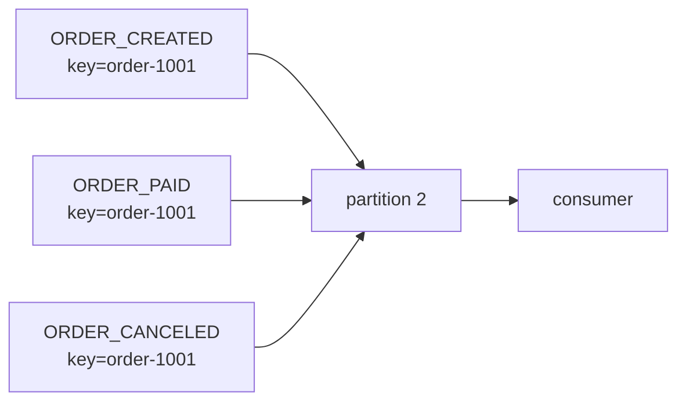

# Kafka Key 설계와 순서 보장

Kafka에서 key는 단순 식별자가 아니라 **record를 어느 partition에 넣을지 결정하는 기준**입니다. 순서 보장이 필요한 이벤트는 같은 key로 같은 partition에 들어가야 합니다.

<div class="concept-box" markdown="1">

Kafka는 topic 전체 순서를 보장하지 않습니다. **같은 partition 안의 순서만 보장**하므로, 같은 업무 단위의 이벤트는 같은 key를 사용해야 합니다.

</div>

## 왜 쓰는지

주문 생성, 결제, 취소 이벤트가 서로 다른 partition으로 흩어지면 consumer가 취소를 먼저 처리할 수 있습니다. Kafka key 설계는 이런 문제를 줄이고, 동시에 partition 분산을 통해 처리량을 확보하기 위해 필요합니다.

```text
같은 key -> 같은 partition -> partition 안에서 순서 유지
다른 key -> 여러 partition 분산 -> 병렬 처리 가능
```

## 어떻게 쓰는지

### 업무 단위 key 선택

순서가 중요한 aggregate를 key로 잡습니다.

```text
topic: order-events
key: order-1001
value: ORDER_CREATED

topic: order-events
key: order-1001
value: ORDER_PAID

topic: order-events
key: order-1001
value: ORDER_CANCELED
```



### key 후보 비교

| key 후보 | 적합한 경우 | 장점 | 단점 |
|----------|-------------|------|------|
| `orderId` | 주문별 상태 전이 순서가 중요 | 주문 단위 순서 보장 | 특정 주문 폭주 시 hot partition |
| `userId` | 사용자별 이벤트 순서가 중요 | 사용자 단위 흐름 보장 | heavy user가 있으면 불균등 |
| `sellerId` | 판매자별 정산, 상품 이벤트 | 판매자 단위 순서 보장 | 대형 판매자 쏠림 가능 |
| sharded key | 특정 key가 너무 뜨거움 | 분산 개선 | 단일 aggregate 순서 보장 약화 |
| key 없음 | 순서가 중요하지 않은 로그 | 분산이 쉬움 | 같은 엔티티 순서 보장 없음 |

## 언제 어떤 key를 쓰는지

| 상황 | 추천 key |
|------|---------|
| 주문 생성 -> 결제 -> 취소 순서가 중요 | `orderId` |
| 사용자 활동 이벤트를 사용자별로 순서 처리 | `userId` |
| 상품별 재고 이벤트 순서가 중요 | `productId` 또는 `skuId` |
| 알림 발송 이벤트에서 중복 방지만 중요 | 발송 id 또는 idempotency key |
| 클릭 로그처럼 순서가 중요하지 않음 | key 없음 또는 분산 key |
| 특정 key가 너무 뜨거움 | 업무 영향 검토 후 key sharding |

## 순서가 깨지는 대표 상황

| 상황 | 원인 | 대응 |
|------|------|------|
| 취소가 생성보다 먼저 처리됨 | key 불일치 또는 다른 topic 처리 | key 표준화, 상태 전이 검증 |
| 일부 이벤트만 늦게 도착 | producer 시간 차이, retry | `occurredAt`, version, sequence 검토 |
| consumer 병렬 처리 중 순서 변경 | partition 안 record를 여러 worker가 동시에 처리 | 같은 key 단위 직렬화 또는 commit 순서 제어 |
| partition 증설 후 key 배치 변화 | partition 수 변경 | 변경 전 영향 분석, 재처리 도구 확인 |
| compacted topic에서 중간 상태가 안 보임 | compaction은 최신값 중심 유지 | 모든 상태 변화가 필요하면 delete retention topic 사용 |

## 장점

| 장점 | 설명 |
|------|------|
| 업무 순서 보장 | 같은 aggregate 이벤트를 같은 partition에서 처리 |
| 처리 병렬성 확보 | 다른 key는 여러 partition에 분산 |
| 장애 분석 쉬움 | key 기준으로 topic, partition, offset 추적 |
| 멱등 처리 기준 제공 | `eventId`, aggregate id와 함께 중복 방지에 활용 |

## 단점

| 단점 | 설명 |
|------|------|
| hot partition 위험 | 특정 key에 이벤트가 몰리면 partition 하나가 병목 |
| key 변경 비용 | 기존 consumer, 재처리, 보정 로직 영향 |
| 전역 순서 보장 아님 | topic 전체 순서는 보장하지 않음 |
| partition 증설 영향 | key-to-partition 매핑이 달라질 수 있음 |

## 특징

| 특징 | 설명 |
|------|------|
| key hash 기반 분배 | 같은 key는 보통 같은 partition으로 감 |
| 순서는 partition 내부 기준 | partition이 다르면 순서 비교가 어려움 |
| null key는 분산 중심 | 업무 순서가 필요하지 않을 때 적합 |
| key는 운영 단서 | 장애 시 특정 aggregate의 흐름을 추적하는 기준 |

## 주의할 점

| 주의 | 설명 |
|------|------|
| key 없는 이벤트에 순서 기대 금지 | 같은 엔티티 이벤트가 다른 partition으로 갈 수 있음 |
| `occurredAt`만으로 처리 순서 결정 금지 | producer 서버 시간 차이와 지연이 있음 |
| hot key를 방치하지 않기 | partition별 lag와 bytes in/out을 봐야 함 |
| consumer 내부 병렬화 조심 | partition 순서를 깨뜨릴 수 있음 |
| key sharding은 신중히 사용 | 분산은 좋아지지만 순서 보장을 잃을 수 있음 |
| 재처리 시 같은 key 기준 유지 | 보정 consumer도 순서 기준을 맞춰야 함 |

## 베스트 프랙티스

| 권장 방식 | 이유 |
|-----------|------|
| aggregate id를 우선 key 후보로 검토 | 업무 순서와 추적 기준이 명확 |
| key 선택 근거를 topic 문서에 남김 | producer가 제각각 key를 쓰는 문제 방지 |
| partition별 lag를 관찰 | hot partition 탐지 |
| 상태 전이 검증을 consumer에 둠 | 순서 지연이나 중복에도 안전 |
| `eventId`와 key를 함께 기록 | 추적과 멱등 처리에 필요 |
| key 변경은 배포 계획으로 다룸 | 순서, 재처리, 운영 도구 영향이 큼 |

## 실무에서는?

| 사용처 | key 설계 |
|--------|----------|
| 주문 이벤트 | `orderId`로 상태 전이 순서 보장 |
| 재고 이벤트 | `skuId`로 같은 상품 재고 변경 순서 보장 |
| 알림 이벤트 | idempotency key로 중복 발송 방지 |
| 검색 색인 | document id로 최신 상태 반영 |
| 사용자 행동 로그 | 순서보다 처리량이 중요하면 null key 또는 분산 key |
| 대형 셀러 정산 | `sellerId` 쏠림을 보고 sharding 여부 검토 |

## 정리

| 항목 | 설명 |
|------|------|
| key의 역할 | partition 선택 기준 |
| 순서 보장 범위 | topic 전체가 아니라 partition 내부 |
| 좋은 key | 순서가 필요한 업무 aggregate id |
| 가장 큰 주의점 | hot partition과 partition 증설 영향 |
| 실무 기준 | 순서가 필요한 단위와 분산이 필요한 단위를 같이 본다 |

---

**관련 파일:**
- [토픽과 파티션 설계](./토픽파티션설계.md)
- [Producer와 이벤트 설계](./producer.md)
- [Consumer와 전달 보장](./consumer.md)

--8<-- "includes/kafka/core.md"
--8<-- "includes/kafka/producer-consumer.md"
