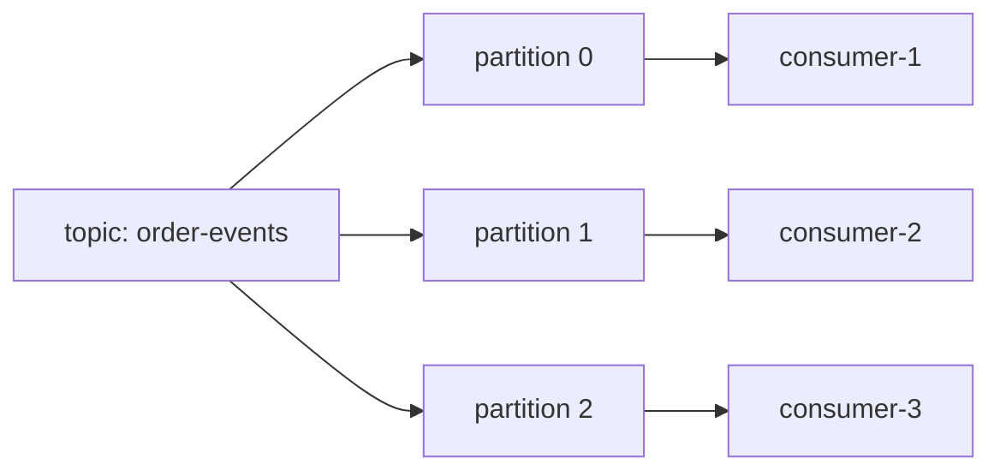

# Kafka 토픽과 파티션 설계

Kafka topic과 partition 설계는 **이벤트를 어떤 단위로 나누고, 어떤 속도로 처리하며, 어디까지 순서를 보장할지**를 정하는 작업입니다. 처음 만들 때 대충 정하면 consumer 확장, retention, 권한, 재처리에서 계속 비용을 냅니다.

<div class="concept-box" markdown="1">

**Topic**은 이벤트의 논리적 분류이고, **Partition**은 topic을 나누어 저장하는 append-only log 단위입니다. Kafka의 병렬 처리와 순서 보장은 대부분 partition 설계에서 결정됩니다.

</div>

## 왜 쓰는지

Topic을 나누는 이유는 단순히 이름을 예쁘게 만들기 위해서가 아닙니다. topic은 보관 기간, 권한, schema, 처리 주체, 장애 영향 범위를 나누는 운영 단위입니다.

Partition은 처리량과 순서 보장의 균형을 잡기 위해 씁니다.

```text
topic은 이벤트의 업무 경계를 정한다.
partition은 처리 병렬성과 순서 보장 범위를 정한다.
retention은 재처리 가능한 시간을 정한다.
replication은 broker 장애 시 유실 가능성을 줄인다.
```

## 용어

| 용어 | 설명 |
|------|------|
| Topic | 이벤트를 분류하는 논리 이름 |
| Partition | topic 안에서 실제 record가 쌓이는 로그 단위 |
| Replication Factor | partition 복제본 수 |
| `min.insync.replicas` | 성공 쓰기에 필요한 동기화 replica 수 |
| Retention | record 보관 시간 또는 크기 |
| Cleanup Policy | 오래된 record를 삭제할지, key 기준으로 compact할지 결정 |

## 어떻게 설계하는지

### 1. Topic 경계 정하기

Topic은 보통 **업무 이벤트 종류 + 소유 서비스 + 소비 패턴**을 기준으로 나눕니다.

| 기준 | 나누는 편이 좋은 경우 | 합치는 편이 좋은 경우 |
|------|----------------------|----------------------|
| 업무 의미 | 주문, 결제, 배송처럼 lifecycle이 다름 | 같은 aggregate의 상태 변경 흐름 |
| 보관 기간 | 감사 이벤트는 길고 알림 이벤트는 짧음 | 보관 정책이 같음 |
| 권한 | 민감 정보 접근 주체가 다름 | 같은 팀과 같은 권한 |
| schema | payload 구조가 크게 다름 | eventType으로 구분 가능하고 호환 규칙이 같음 |
| 장애 영향 | 특정 consumer 장애가 다른 흐름을 막으면 안 됨 | 같은 처리 파이프라인 |

```text
좋은 예:
order-events
payment-events
search-index-events

주의가 필요한 예:
all-events
misc-events
service-a-topic
```

`all-events`처럼 모든 이벤트를 한 topic에 넣으면 처음에는 편하지만 retention, 권한, schema, hot partition 문제가 한 덩어리로 묶입니다.

### 2. Partition 수 정하기

Partition 수는 "동시에 몇 줄로 처리할 수 있는가"를 정합니다.



| 질문 | 의미 |
|------|------|
| peak traffic은 어느 정도인가? | partition별 처리량 추정 |
| consumer를 최대 몇 개까지 늘릴 것인가? | 같은 group의 최대 병렬성 |
| 순서 보장 key가 있는가? | key 분포와 hot partition 위험 |
| 나중에 partition을 늘려도 되는가? | key 배치 변경 영향 |
| broker 수와 운영 여유는 충분한가? | partition이 너무 많으면 metadata와 file handle 비용 증가 |

Partition은 늘릴 수 있지만 줄이기 어렵습니다. 또 partition을 늘리면 새 record의 key-to-partition 매핑이 달라질 수 있으므로, key 기반 순서 보장과 재처리 도구 영향을 확인해야 합니다.

### 3. Topic 생성 예시

```bash
kafka-topics.sh \
  --bootstrap-server kafka-1:9092,kafka-2:9092,kafka-3:9092 \
  --create \
  --topic order-events \
  --partitions 6 \
  --replication-factor 3 \
  --config min.insync.replicas=2 \
  --config retention.ms=604800000 \
  --config cleanup.policy=delete
```

| 설정 | 의미 | 실무 기준 |
|------|------|-----------|
| `partitions` | 병렬 처리 단위 | 처리량, consumer 수, key 분포 기준 |
| `replication-factor` | partition 복제본 수 | 운영은 보통 3 이상 검토 |
| `min.insync.replicas` | 성공 쓰기에 필요한 ISR 수 | RF 3이면 2를 자주 사용 |
| `retention.ms` | 보관 시간 | 재처리와 장애 복구 가능 기간 기준 |
| `cleanup.policy` | 삭제 또는 compaction | 이벤트 로그는 `delete`, 최신 상태 로그는 `compact` 검토 |

## 언제 어떻게 나누는지

| 상황 | 설계 |
|------|------|
| 주문 생성, 결제, 취소가 한 흐름으로 소비됨 | `order-events` 하나에 eventType으로 구분 |
| 결제 이벤트는 권한과 감사 기준이 다름 | `payment-events` 별도 topic |
| 알림 발송만 위한 임시 이벤트 | 짧은 retention의 별도 topic |
| 최신 설정값만 필요 | compacted topic 검토 |
| consumer group별 처리 속도가 크게 다름 | topic은 같아도 group을 분리 |
| 같은 topic에서 특정 eventType만 너무 많음 | 별도 topic 분리 검토 |

## 장점

| 설계 | 장점 |
|------|------|
| 업무 기준 topic | 소유권, schema, 권한, retention 관리가 쉬움 |
| 충분한 partition | consumer 병렬 처리와 처리량 확장 가능 |
| 적절한 replication | broker 장애 시 내구성 확보 |
| 업무 기준 retention | 장애 후 재처리 가능 기간 명확 |
| compacted topic | key별 최신 상태 전달에 유리 |

## 단점

| 설계 실수 | 문제 |
|----------|------|
| topic이 너무 큼 | 권한, schema, retention, 장애 영향이 섞임 |
| topic이 너무 많음 | 운영 관리와 모니터링 비용 증가 |
| partition이 너무 적음 | consumer를 늘려도 병렬 처리 한계 |
| partition이 너무 많음 | broker metadata, open file, recovery 비용 증가 |
| retention이 너무 짧음 | 장애 복구 전에 메시지 삭제 |
| retention이 너무 김 | disk 사용량과 복구 시간이 증가 |

## 특징

| 특징 | 설명 |
|------|------|
| topic 단위 설정 | retention, cleanup policy, 권한을 topic 단위로 관리 |
| partition 단위 순서 | 같은 partition 안에서만 record 순서가 유지 |
| consumer group 병렬성 | 같은 group에서는 partition 하나를 consumer 하나가 맡음 |
| replication 단위 | partition replica가 broker에 분산됨 |
| 변경 비용 | partition 증설과 retention 변경은 운영 영향 검토 필요 |

## 주의할 점

| 주의 | 설명 |
|------|------|
| `all-events` 남용 금지 | 권한과 schema, retention이 뒤섞임 |
| partition을 처리량만 보고 늘리지 않기 | 순서 보장, key 배치, broker 비용 영향 |
| retention을 장애 복구 시간보다 짧게 잡지 않기 | 복구 전에 record가 사라질 수 있음 |
| compaction을 큐처럼 쓰지 않기 | key 최신값 보관 정책이지 모든 이벤트 보존 정책이 아님 |
| replication만 믿지 않기 | producer `acks`와 `min.insync.replicas`를 같이 봐야 함 |
| 테스트 topic과 운영 topic 혼용 금지 | consumer group offset과 권한 사고 위험 |

## 베스트 프랙티스

| 권장 방식 | 이유 |
|-----------|------|
| topic naming 규칙을 먼저 정함 | 운영 중 검색, 권한, 알림 설정이 쉬움 |
| topic 생성 기준을 문서화 | 임의 topic 증가 방지 |
| partition 수는 peak와 consumer 확장 기준으로 산정 | 과소/과대 설계 방지 |
| RF와 min ISR을 함께 설계 | 장애 시 쓰기 성공 기준 명확화 |
| retention은 재처리 SLA 기준으로 결정 | 복구 가능한 기간을 업무와 맞춤 |
| topic별 owner를 둠 | schema, 장애, 권한 책임 명확화 |
| 변경 전 dry-run과 영향 범위 확인 | partition 증설, retention 변경 사고 방지 |

## 실무에서는?

| 사용처 | 설계 기준 |
|--------|-----------|
| 주문 이벤트 | `order-events`, `orderId` key, 재처리 가능한 retention |
| 결제 이벤트 | 별도 topic, 긴 retention, 엄격한 권한 |
| 알림 이벤트 | 짧은 retention, DLQ, 중복 발송 방지 |
| 검색 색인 이벤트 | 재처리 가능한 retention, batch consumer |
| CDC topic | table 또는 aggregate 기준 topic, schema evolution 관리 |
| 설정 변경 전파 | compacted topic, key별 최신값 유지 |

## 정리

| 항목 | 설명 |
|------|------|
| topic 설계 기준 | 업무 경계, owner, 권한, retention, schema |
| partition 설계 기준 | 처리량, consumer 병렬성, key 분포, 순서 보장 |
| 가장 큰 장점 | 이벤트 흐름과 운영 책임을 분리할 수 있음 |
| 가장 큰 주의점 | partition 증설과 retention 변경은 운영 영향이 큼 |
| 실무 기준 | topic은 업무 경계로, partition은 처리량과 순서 기준으로 정함 |

---

**관련 파일:**
- [Kafka란?](./kafka란.md)
- [Key 설계와 순서 보장](./키순서설계.md)
- [운영 구조와 고가용성](./운영구조와고가용성.md)

--8<-- "includes/kafka/core.md"
--8<-- "includes/kafka/operations.md"
