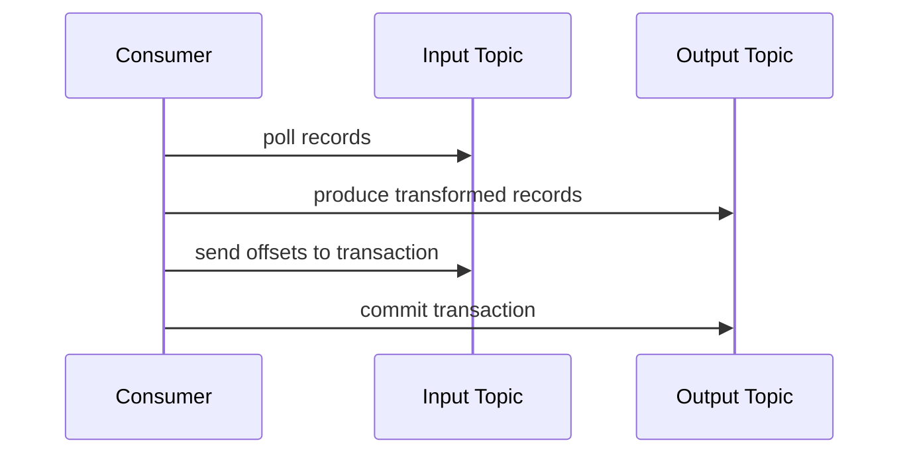

# Kafka Transaction과 Exactly-once

Kafka의 Exactly-once는 "세상 모든 처리가 무조건 한 번만 실행된다"는 뜻이 아닙니다. Kafka log와 Kafka 간 consume-process-produce 흐름에서 중복 결과를 줄이기 위한 기능이며, DB나 외부 API까지 포함하려면 별도 멱등성과 정합성 설계가 필요합니다.

<div class="warning-box" markdown="1">

**주의**: `enable.idempotence=true`는 producer 재시도 중 같은 batch가 broker log에 중복 기록되는 것을 줄이는 기능이다. consumer가 DB에 같은 이벤트를 두 번 반영하는 문제까지 자동으로 해결하지 않는다.

</div>

## 왜 쓰는지

Producer가 timeout을 만나 재시도하면 broker에는 이미 기록됐는지 애매할 수 있습니다. Consumer도 처리 후 offset commit 전에 죽으면 같은 메시지를 다시 읽을 수 있습니다.

Kafka transaction은 이런 상황에서 **Kafka에 쓰는 결과와 offset commit을 하나의 원자적 단위로 묶기 위해** 사용합니다.



## 개념 구분

| 개념 | 해결하는 문제 | 해결하지 못하는 문제 |
|------|---------------|----------------------|
| Idempotent Producer | producer 재시도 중 Kafka log 중복 감소 | consumer DB 중복 반영 |
| Kafka Transaction | Kafka output record와 input offset commit을 함께 처리 | 외부 DB/API 트랜잭션 |
| Consumer 멱등성 | 같은 이벤트 재처리 시 결과 중복 방지 | producer 발행 유실 |
| Outbox Pattern | DB 저장과 이벤트 발행 불일치 완화 | consumer 처리 중복 자체 |

## 어떻게 쓰는지

### Producer 설정

Transaction을 쓰려면 `transactional.id`가 필요합니다. 이 값은 producer instance를 식별하므로 중복 사용하면 fencing 문제가 생길 수 있습니다.

```properties
enable.idempotence=true
acks=all
transactional.id=order-stream-processor-1
```

개념 흐름은 아래와 같습니다.

```text
1. transaction 시작
2. output topic에 record produce
3. input topic offset을 transaction에 포함
4. transaction commit
5. 실패하면 abort
```

Consumer는 committed transaction만 읽도록 설정할 수 있습니다.

```properties
isolation.level=read_committed
```

### DB와 함께 쓸 때

Kafka transaction은 Kafka 내부 작업을 묶습니다. DB 변경과 Kafka offset commit을 하나의 완전한 분산 트랜잭션으로 자동 묶어주지는 않습니다.

DB에 반영하는 consumer는 보통 아래처럼 멱등성을 둡니다.

```sql
CREATE TABLE processed_event (
    event_id VARCHAR(100) PRIMARY KEY,
    consumer_name VARCHAR(100) NOT NULL,
    processed_at DATETIME NOT NULL
);
```

```text
1. DB transaction 시작
2. processed_event에 eventId insert
3. 이미 있으면 성공으로 간주
4. 업무 데이터 변경
5. DB transaction commit
6. Kafka offset commit
```

DB 저장 후 이벤트 발행이 필요한 producer는 [아웃박스 패턴](../../architecture/outbox.md)을 검토합니다.

## 언제 쓰는지

| 상황 | 적합도 | 이유 |
|------|--------|------|
| Kafka topic을 읽고 다른 Kafka topic에 결과를 씀 | 높음 | output record와 offset을 transaction으로 묶기 좋음 |
| Kafka Streams 처리 | 높음 | exactly-once processing 보장을 활용하기 좋음 |
| DB에 저장하는 일반 consumer | 조건부 | DB 멱등성 설계가 더 중요 |
| 외부 API 호출 consumer | 낮음 | 외부 API는 Kafka transaction에 포함되지 않음 |
| 단순 알림 발송 | 낮음 | 중복 발송 방지 key와 retry/DLQ가 더 현실적 |
| 결제 원장 처리 | 조건부 | Kafka transaction만으로 원장 정합성을 보장하지 않음 |

## 장점

| 장점 | 설명 |
|------|------|
| Kafka 내부 중복 결과 감소 | consume-process-produce 흐름에서 offset과 output을 묶음 |
| 재시도 안정성 증가 | producer idempotence와 transaction으로 log 중복 위험 감소 |
| read isolation 제공 | `read_committed` consumer가 aborted record를 보지 않음 |
| 스트림 처리에 적합 | input offset과 output topic을 함께 관리 |

## 단점

| 단점 | 설명 |
|------|------|
| 개념 난도 높음 | idempotence, transaction, offset commit을 함께 이해해야 함 |
| 성능 비용 | transaction coordinator와 commit 비용이 추가 |
| 외부 시스템 한계 | DB, Redis, 외부 API 작업은 자동 포함되지 않음 |
| 운영 주의 필요 | `transactional.id`, fencing, timeout 관리 필요 |
| 오해 위험 | "정말 모든 것이 한 번"이라고 착각하기 쉬움 |

## 특징

| 특징 | 설명 |
|------|------|
| Producer idempotence 기반 | transaction 사용 시 idempotence가 핵심 전제 |
| `transactional.id` 필요 | producer instance 식별과 fencing에 사용 |
| offset 포함 가능 | consume한 input offset을 transaction에 넣을 수 있음 |
| `read_committed` | commit된 transaction record만 읽음 |
| Kafka 내부 중심 | Kafka log와 offset에 강하고 외부 side effect는 별도 설계 필요 |

## 주의할 점

| 주의 | 설명 |
|------|------|
| DB 중복 반영까지 해결한다고 믿지 않기 | DB unique, processed_event, 상태 전이 검증 필요 |
| 외부 API 호출을 transaction 안에 넣었다고 착각 금지 | API는 이미 호출되면 되돌릴 수 없음 |
| `transactional.id`를 여러 instance가 공유하지 않기 | fencing과 예기치 않은 실패 가능 |
| transaction timeout 확인 | 긴 처리 작업은 abort될 수 있음 |
| consumer isolation 설정 확인 | `read_uncommitted`면 aborted record를 볼 수 있음 |
| 성능 민감 경로에 남용 금지 | batch와 commit 비용을 측정해야 함 |

## 베스트 프랙티스

| 권장 방식 | 이유 |
|-----------|------|
| 먼저 at-least-once + 멱등성을 기본으로 설계 | 대부분의 업무 consumer에 현실적 |
| Kafka-to-Kafka 처리에 transaction 우선 검토 | 기능이 가장 잘 맞음 |
| DB side effect는 eventId unique로 보호 | 중복 소비 대비 |
| producer `acks=all`과 idempotence 확인 | 유실과 중복 위험 감소 |
| transaction 적용 전 처리량 테스트 | commit 비용 확인 |
| DLQ와 보정 절차 유지 | transaction이 모든 실패를 없애지는 않음 |

## 실무에서는?

| 사용처 | 설계 기준 |
|--------|-----------|
| 이벤트 정제 후 다른 topic 발행 | Kafka transaction, `read_committed` |
| Kafka Streams 집계 | exactly-once 설정 검토 |
| 주문 이벤트를 DB에 반영 | processed_event, DB unique, 처리 후 commit |
| 결제 API 호출 | idempotency key, 재시도 제한, 보정 프로세스 |
| DB 변경 후 Kafka 발행 | outbox pattern |

## 정리

| 항목 | 설명 |
|------|------|
| Idempotent Producer | producer 재시도 중 Kafka log 중복 감소 |
| Kafka Transaction | output record와 offset commit을 묶음 |
| Exactly-once 범위 | Kafka 내부 처리 경로 중심 |
| 가장 큰 주의점 | DB와 외부 API side effect는 별도 멱등성 필요 |
| 실무 기준 | "한 번만 온다"가 아니라 "다시 와도 같은 결과"로 설계 |

---

**관련 파일:**
- [Consumer와 전달 보장](./consumer.md)
- [Producer와 이벤트 설계](./producer.md)
- [아웃박스 패턴](../../architecture/outbox.md)

--8<-- "includes/kafka/producer-consumer.md"
