# Redis

## 왜 쓰는지

DB는 디스크, 트랜잭션, 인덱스, 락, 영속성을 책임지기 때문에 모든 요청을 DB로만 처리하면 응답 속도와 처리량에 한계가 옵니다. Redis는 자주 읽는 데이터, 짧게 살아도 되는 상태, 빠른 원자 연산을 메모리에서 처리해 DB와 애플리케이션의 부담을 줄입니다.

<div class="concept-box" markdown="1">

**핵심**: Redis는 메모리 기반 Key-Value 저장소이며, 캐시·세션·분산 락·카운터·랭킹·큐·스트림 같은 빠른 상태 저장에 사용한다.

</div>

Redis를 처음 배울 때는 "빠른 DB"로 생각하기 쉽지만 실무에서는 **원본 저장소가 아니라 보조 저장소**로 보는 것이 안전합니다. 장애가 나도 복구할 기준 데이터는 DB나 이벤트 로그처럼 더 강한 저장소에 있어야 합니다.

### 전체 그림

Redis는 보통 애플리케이션과 DB 사이에 놓입니다. 모든 데이터를 Redis에 넣는 것이 아니라, **빨리 읽어야 하거나 짧게 보관해도 되는 데이터**만 Redis에 둡니다.

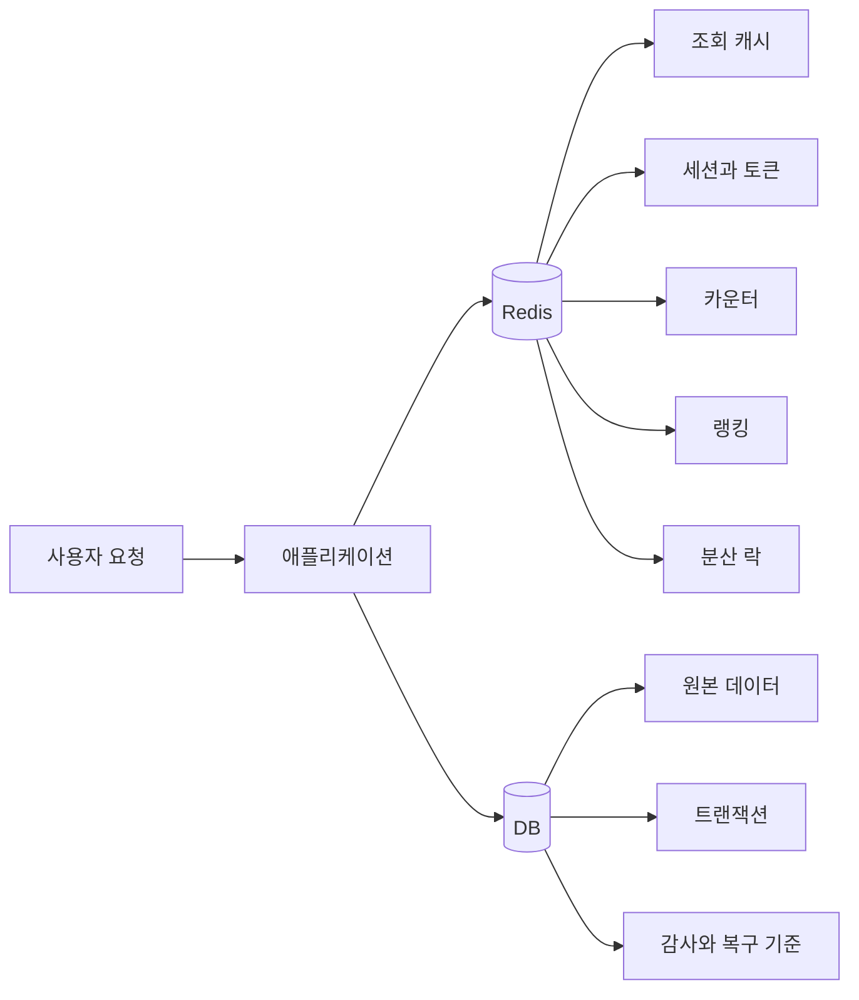

그림을 이렇게 읽으면 됩니다.

| 위치 | 역할 |
|------|------|
| 애플리케이션 | Redis와 DB를 언제 볼지 결정 |
| Redis | 빠른 임시 저장소, 캐시, 원자 연산 담당 |
| DB | 원본 데이터, 트랜잭션, 복구 기준 담당 |

신입 개발자가 가장 먼저 잡아야 하는 감각은 이것입니다.

```text
Redis에 있으면 빠르게 응답한다.
Redis에 없으면 DB에서 가져와 다시 채운다.
Redis가 비어도 DB 기준으로 복구할 수 있어야 한다.
```

## 어떻게 쓰는지

### 기본 명령

```bash
# 값 저장
SET user:1:name "kim"

# 값 조회
GET user:1:name

# TTL과 함께 저장
SET auth:token:abc "user-1" EX 3600

# 만료 시간 부여
EXPIRE user:1:name 60

# 남은 TTL 확인
TTL user:1:name

# 삭제
DEL user:1:name
```

| 명령 | 의미 | 주의 |
|------|------|------|
| `SET` | 값을 저장 | 기본은 TTL 없음 |
| `GET` | 값을 조회 | 없는 키는 `nil` |
| `EXPIRE` | 만료 시간 지정 | 갱신 시 TTL이 사라지는 명령이 있으므로 확인 필요 |
| `TTL` | 남은 만료 시간 확인 | `-1`은 TTL 없음, `-2`는 키 없음 |
| `DEL` | 키 삭제 | 큰 키 삭제는 지연을 만들 수 있어 `UNLINK` 고려 |

Redis의 저장 단위는 아래처럼 단순하게 보면 됩니다.

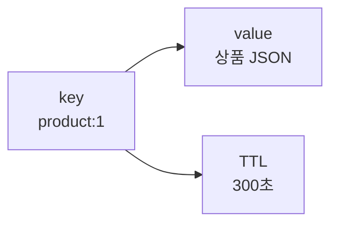

`key`는 사물함 번호, `value`는 사물함 안의 물건, `TTL`은 사물함을 자동으로 비우는 타이머라고 생각하면 됩니다. `TTL`이 없으면 누군가 지우기 전까지 계속 남을 수 있으니 캐시 키에는 기본적으로 TTL을 붙이는 습관이 좋습니다.

### 키 이름 규칙

Redis는 키 이름이 설계의 절반입니다. 키만 봐도 소유 도메인, 데이터 의미, 식별자, TTL 여부를 추측할 수 있어야 합니다.

```text
user:{userId}:profile
user:{userId}:sessions
order:{orderId}:summary
rate-limit:login:{userId}
lock:coupon:{couponId}
rank:daily:{yyyyMMdd}
```

| 규칙 | 예시 | 이유 |
|------|------|------|
| `:`로 계층 구분 | `user:10:profile` | 검색과 운영이 쉬움 |
| 식별자는 명확히 포함 | `order:9001:summary` | 충돌 방지 |
| 용도를 앞에 둠 | `lock:coupon:1` | 장애 시 키 성격 파악 |
| TTL 키는 도메인별로 통일 | `auth:token:*` | 만료 정책 관리 |
| Cluster 다중 키는 hash tag 사용 | `cart:{user-1}:items` | 같은 hash slot 배치 |

### 자료구조 선택

| 자료구조 | 대표 명령 | 언제 쓰는지 | 예시 |
|----------|-----------|-------------|------|
| String | `GET`, `SET`, `INCR` | 단일 값, JSON 문자열, 카운터 | 조회 결과 캐시, 인증 토큰 |
| Hash | `HGET`, `HSET`, `HINCRBY` | 한 객체의 여러 필드 | 사용자 프로필 일부 필드 |
| List | `LPUSH`, `RPOP`, `BRPOP` | 간단한 FIFO/LIFO 큐 | 짧은 작업 큐 |
| Set | `SADD`, `SISMEMBER` | 중복 없는 집합 | 좋아요 사용자 목록 |
| Sorted Set | `ZADD`, `ZRANGE` | 점수 기반 정렬 | 랭킹, 우선순위 |
| Stream | `XADD`, `XREADGROUP` | Redis 내부 이벤트 로그 | 소규모 이벤트 처리 |
| Bitmap | `SETBIT`, `GETBIT` | boolean 대량 저장 | 출석 체크 |
| HyperLogLog | `PFADD`, `PFCOUNT` | 대략적인 고유 수 | UV 추정 |

자료구조는 "무엇을 저장하느냐"보다 **어떤 방식으로 꺼낼 것인가**를 기준으로 고릅니다.

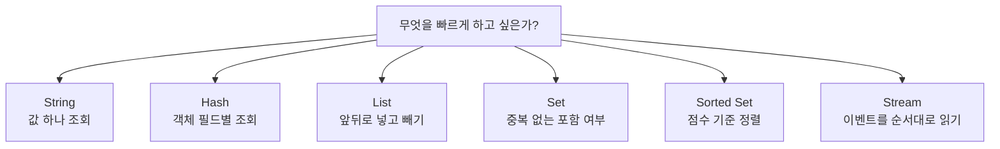

예를 들어 `user:1` 전체 객체를 매번 통째로 읽으면 String JSON도 괜찮습니다. 반대로 `name`, `grade`, `point`처럼 필드 일부만 자주 바꾸면 Hash가 더 읽기 쉽습니다. 랭킹처럼 "점수로 정렬해서 상위 100명"을 봐야 한다면 Sorted Set이 자연스럽습니다.

<div class="warning-box" markdown="1">

**주의**: Redis 자료구조는 편하지만 큰 컬렉션 하나에 데이터를 끝없이 넣으면 장애 지점이 된다. 한 키의 크기와 한 명령의 처리 시간이 커지는 순간 Redis 전체 지연으로 번질 수 있다.

</div>

### Cache Aside 패턴

가장 흔한 캐시 사용 방식입니다. 애플리케이션이 캐시를 먼저 보고, 없으면 DB에서 읽은 뒤 Redis에 저장합니다.

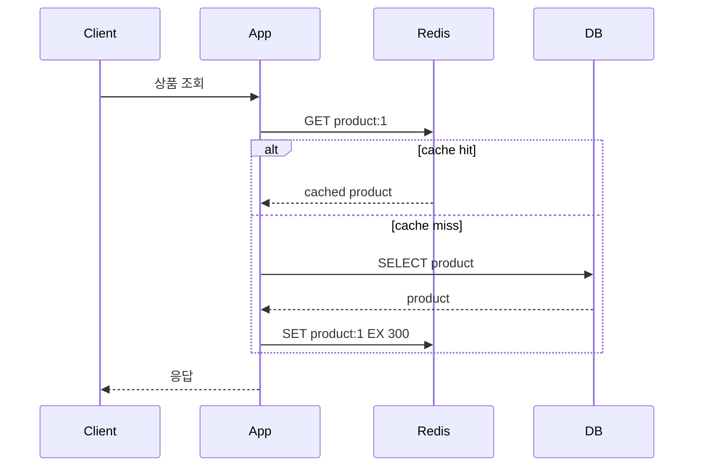

```text
1. Redis에서 조회한다.
2. 값이 있으면 그대로 응답한다.
3. 값이 없으면 DB에서 조회한다.
4. DB 결과를 Redis에 TTL과 함께 저장한다.
5. 다음 요청부터 Redis에서 응답한다.
```

캐시 무효화는 보통 쓰기 시점에 처리합니다.

```text
DB update 성공
-> 관련 Redis key 삭제
-> 다음 조회에서 DB 기준으로 다시 캐시 생성
```

조회 캐시의 핵심은 hit와 miss를 구분하는 것입니다.

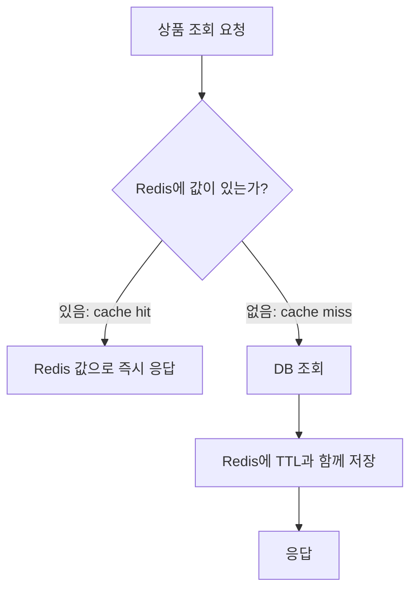

처음 요청은 느릴 수 있습니다. 대신 다음 요청부터는 DB를 거치지 않습니다. 그래서 Redis 캐시는 "첫 요청을 빠르게"가 아니라 **반복 조회를 빠르게** 만드는 기술입니다.

### 카운터와 Rate Limit

`INCR`는 단일 명령으로 원자적으로 증가합니다. 로그인 실패 횟수, API 호출 횟수 같은 짧은 카운터에 적합합니다.

```bash
INCR rate-limit:login:user-1
EXPIRE rate-limit:login:user-1 60
```

다만 `INCR`와 `EXPIRE`를 따로 호출하면 중간 실패로 TTL 없는 키가 남을 수 있습니다. 실무에서는 Lua 스크립트나 트랜잭션으로 묶습니다.

```lua
local current = redis.call("INCR", KEYS[1])
if current == 1 then
  redis.call("EXPIRE", KEYS[1], ARGV[1])
end
return current
```

### 분산 락

여러 서버가 같은 자원을 동시에 처리하면 Redis의 `SET NX PX`를 이용해 짧은 락을 만들 수 있습니다.

```bash
SET lock:coupon:100 request-uuid NX PX 3000
```

| 옵션 | 의미 |
|------|------|
| `NX` | 키가 없을 때만 저장 |
| `PX 3000` | 3초 뒤 자동 만료 |
| `request-uuid` | 락 소유자를 구분하는 값 |

해제할 때는 반드시 **내가 잡은 락인지 확인한 뒤 삭제**해야 합니다.

```lua
if redis.call("GET", KEYS[1]) == ARGV[1] then
  return redis.call("DEL", KEYS[1])
else
  return 0
end
```

<div class="danger-box" markdown="1">

**위험**: 분산 락은 트랜잭션을 대신하지 않는다. 락 만료 시간이 작업 시간보다 짧으면 다른 서버가 같은 락을 다시 잡을 수 있고, 네트워크 지연·프로세스 정지·failover 상황에서는 중복 실행이 발생할 수 있다.

</div>

## 언제 쓰는지

| 상황 | Redis 적합도 | 이유 |
|------|--------------|------|
| 자주 읽지만 자주 바뀌지 않는 데이터 | 높음 | DB 조회를 줄이고 응답 속도 개선 |
| 세션, 인증 토큰 같은 짧은 상태 | 높음 | TTL로 자동 만료 가능 |
| 카운터, 조회수, Rate Limit | 높음 | 원자 증가 연산이 빠름 |
| 랭킹, 점수 정렬 | 높음 | Sorted Set이 적합 |
| 짧은 분산 락 | 조건부 | 단기 중복 실행 방지에 사용 |
| 반드시 유실되면 안 되는 원장 데이터 | 낮음 | Redis 장애·failover·설정 오류에 취약 |
| 복잡한 조인과 검색 | 낮음 | 관계형 조회나 검색 엔진 역할이 아님 |
| 긴 작업 큐의 유일 저장소 | 낮음 | 메시지 내구성, 재처리, 추적은 전용 브로커가 더 적합 |

## 장점

| 장점 | 설명 |
|------|------|
| 빠른 응답 | 메모리 기반이라 단순 조회·갱신이 빠름 |
| 다양한 자료구조 | String뿐 아니라 Hash, Set, Sorted Set, Stream 지원 |
| TTL 지원 | 임시 데이터 자동 삭제 가능 |
| 원자 명령 | `INCR`, `SET NX`, Lua로 경쟁 조건 감소 |
| 운영 기능 | replication, Sentinel, Cluster, persistence 제공 |

## 단점

| 단점 | 설명 |
|------|------|
| 메모리 비용 | 데이터가 커질수록 비용이 빠르게 증가 |
| 유실 가능성 | AOF/RDB 설정과 장애 타이밍에 따라 최근 데이터 손실 가능 |
| 단일 명령 지연 영향 | 느린 명령 하나가 전체 지연으로 이어질 수 있음 |
| 캐시 정합성 문제 | DB와 Redis 값이 일시적으로 달라질 수 있음 |
| 운영 난도 | eviction, big key, hot key, replication lag, failover 관리 필요 |

## 특징

### 메모리 기반 처리

Redis는 대부분의 명령을 메모리에서 처리합니다. 그래서 빠르지만, 메모리 사용량이 곧 비용과 장애 한계가 됩니다.

| 확인 항목 | 의미 |
|-----------|------|
| `used_memory` | Redis가 할당한 메모리 |
| `used_memory_rss` | OS가 실제로 잡고 있는 메모리 |
| `mem_fragmentation_ratio` | 메모리 단편화 비율 |
| `maxmemory` | Redis가 사용할 최대 메모리 |
| `evicted_keys` | 메모리 부족으로 제거된 키 수 |

메모리는 데이터 크기만큼만 쓰이지 않습니다. 키 이름, 자료구조 메타데이터, TTL 정보, replication buffer, client buffer, allocator 단편화까지 포함됩니다.

### 단일 스레드처럼 보이는 명령 실행

Redis는 명령 실행 경로가 이벤트 루프 중심이라 한 명령이 오래 걸리면 뒤의 요청도 밀립니다. 최신 Redis는 I/O, persistence, lazy free 등 일부 작업에 별도 스레드를 활용할 수 있지만, **느린 명령이 전체 지연을 만든다**는 운영 감각은 그대로 중요합니다.

```text
빠른 명령 1ms
빠른 명령 1ms
큰 키 삭제 500ms
빠른 명령 1ms  -> 앞의 큰 키 삭제 때문에 대기
```

피해야 하는 패턴입니다.

```bash
# 운영 환경에서 전체 키 스캔 위험
KEYS *

# 큰 컬렉션 전체 조회 위험
LRANGE big:list 0 -1
SMEMBERS big:set
HGETALL huge:hash
```

대신 점진적으로 나누어 처리합니다.

```bash
SCAN 0 MATCH user:* COUNT 100
HSCAN user:1:profile 0 COUNT 100
SSCAN active-users 0 COUNT 100
```

### TTL과 Eviction

TTL은 키별 만료 시간이고, eviction은 `maxmemory`에 도달했을 때 Redis가 키를 제거하는 정책입니다. 둘은 다릅니다.

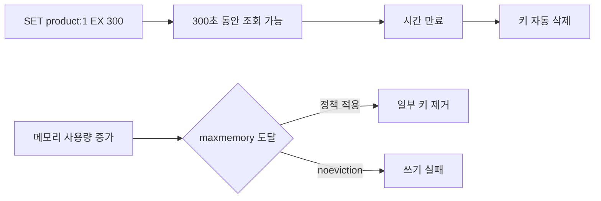

`TTL`은 "시간이 지나서 사라지는 것"이고, `eviction`은 "메모리가 부족해서 쫓겨나는 것"입니다. TTL을 길게 줬더라도 메모리가 부족하고 eviction 정책이 허용하면 그 전에 삭제될 수 있습니다.

| 구분 | 설명 |
|------|------|
| TTL | 시간이 지나면 키 삭제 |
| Eviction | 메모리가 부족할 때 정책에 따라 키 삭제 |

주요 eviction 정책입니다.

| 정책 | 제거 대상 | 언제 고려 |
|------|-----------|-----------|
| `noeviction` | 제거하지 않음 | 쓰기 실패를 감수하고 데이터 삭제를 막을 때 |
| `allkeys-lru` | 전체 키 중 덜 최근에 사용한 키 | 일반 캐시 |
| `allkeys-lfu` | 전체 키 중 덜 자주 사용한 키 | 인기 데이터가 뚜렷할 때 |
| `volatile-lru` | TTL 있는 키 중 덜 최근에 사용한 키 | TTL 없는 키를 보호해야 할 때 |
| `volatile-lfu` | TTL 있는 키 중 덜 자주 사용한 키 | TTL 기반 캐시 |
| `volatile-ttl` | TTL이 짧은 키 | 곧 만료될 키 우선 제거 |
| `allkeys-random` | 전체 키 중 랜덤 | 접근 패턴 예측이 어려울 때 |

<div class="warning-box" markdown="1">

**주의**: `volatile-*` 정책은 TTL이 있는 키만 제거한다. TTL이 없는 키가 많으면 메모리 부족 상황에서 기대처럼 제거되지 않고 쓰기 실패가 날 수 있다.

</div>

### Persistence: RDB와 AOF

Redis는 메모리 저장소지만 디스크에 복구용 데이터를 남길 수 있습니다.

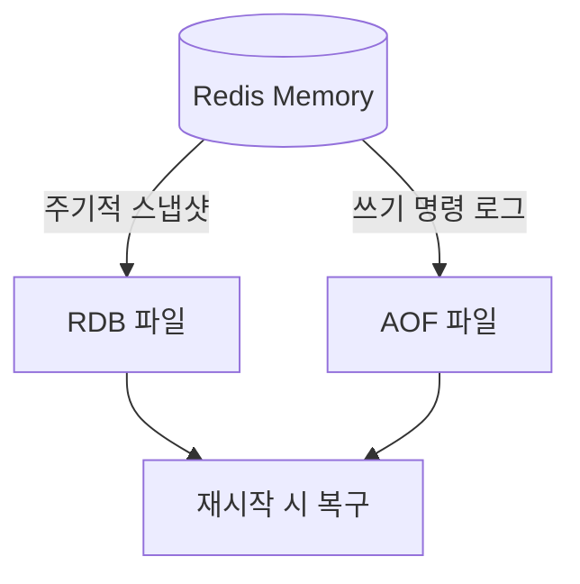

RDB는 사진처럼 특정 시점의 전체 모습을 저장합니다. AOF는 가계부처럼 쓰기 명령을 계속 적어둡니다. RDB는 복구 파일이 단순하고 빠르지만 마지막 사진 이후 변경이 사라질 수 있고, AOF는 더 촘촘히 복구할 수 있지만 파일 관리와 rewrite 비용이 생깁니다.

| 방식 | 설명 | 장점 | 단점 |
|------|------|------|------|
| RDB | 특정 시점 스냅샷 | 파일이 작고 복구가 빠름 | 마지막 스냅샷 이후 데이터 유실 가능 |
| AOF | 쓰기 명령 로그 | 더 적은 유실 가능 | 파일 증가, rewrite 비용 |
| RDB + AOF | 둘 다 사용 | 복구 안정성 향상 | 운영 비용 증가 |

AOF fsync 정책입니다.

| 설정 | 의미 | 장애 시 |
|------|------|---------|
| `appendfsync always` | 매 쓰기마다 fsync | 가장 안전하지만 느림 |
| `appendfsync everysec` | 보통 1초마다 fsync | 성능과 안전성 균형, 최근 약 1초 유실 가능 |
| `appendfsync no` | OS flush에 맡김 | 빠르지만 유실 범위가 커질 수 있음 |

Redis를 캐시로만 쓰면 persistence를 끌 수도 있습니다. 하지만 세션, 락, 카운터처럼 장애 후 상태가 중요하면 RDB/AOF 정책과 백업을 명확히 정해야 합니다.

### Replication과 Sentinel

Redis replication은 master가 replica에 변경 명령을 전달하는 방식입니다. 기본은 비동기 복제입니다.

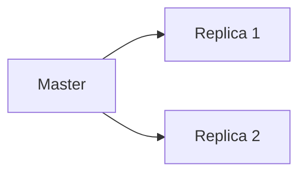

| 항목 | 설명 |
|------|------|
| master | 쓰기를 받는 노드 |
| replica | master 데이터를 복제 |
| async replication | master가 매 쓰기마다 replica 적용을 기다리지 않음 |
| replication lag | replica가 master보다 늦은 정도 |
| failover | master 장애 시 replica를 새 master로 승격 |

Sentinel은 master 장애를 감지하고 failover를 자동화하는 구성입니다.

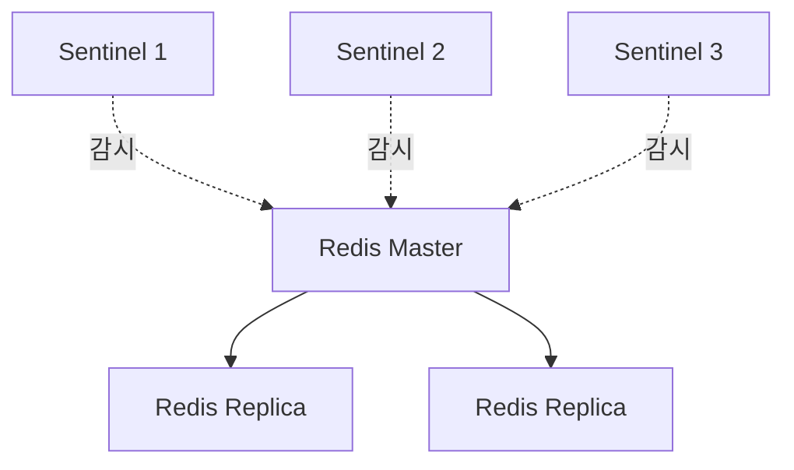

<div class="warning-box" markdown="1">

**주의**: 비동기 복제에서는 master가 성공 응답을 보낸 직후 장애가 나고, 그 쓰기가 replica에 도달하지 않았다면 failover 후 데이터가 사라질 수 있다.

</div>

failover는 아래 흐름으로 이해하면 됩니다.

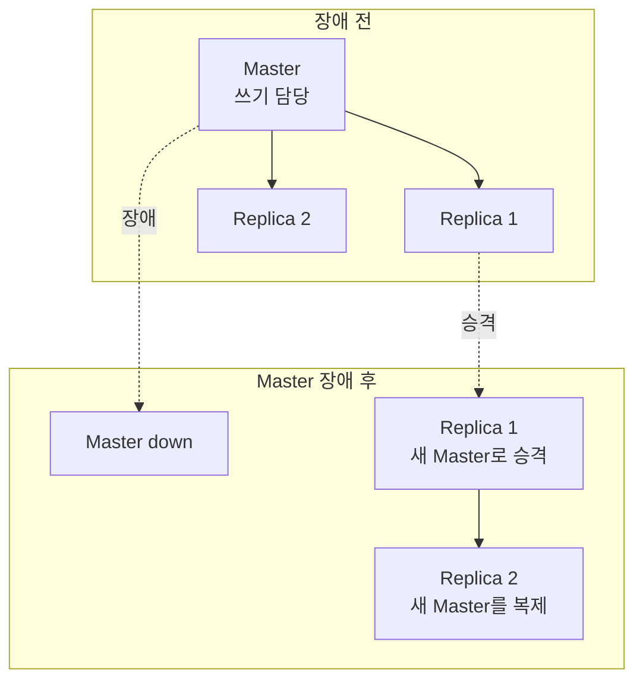

여기서 중요한 점은 "승격은 자동일 수 있지만 데이터가 항상 완벽히 같다는 뜻은 아니다"입니다. 기본 복제가 비동기라 master가 방금 받은 쓰기가 replica에 도착하기 전에 장애가 나면 새 master에는 그 쓰기가 없을 수 있습니다.

### Cluster와 Hash Slot

Redis Cluster는 데이터를 여러 master에 나누어 저장합니다. Redis Cluster는 16384개의 hash slot을 사용하고, 각 키는 하나의 slot에 배치됩니다.

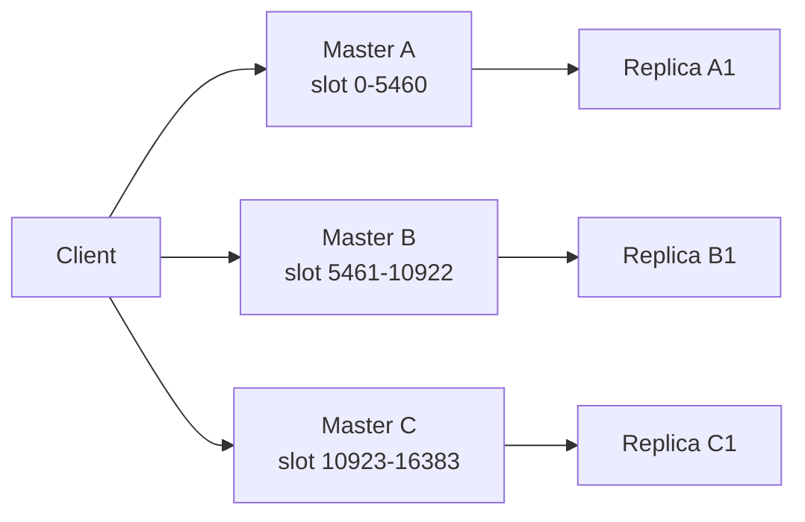

| 개념 | 설명 |
|------|------|
| hash slot | 키가 배치되는 논리 슬롯 |
| `MOVED` | 키의 slot 담당 노드가 바뀌었으니 새 노드로 가라는 응답 |
| `ASK` | slot 이동 중 임시로 다른 노드에 물어보라는 응답 |
| hash tag | `{}` 안의 문자열만 hash해 여러 키를 같은 slot에 배치 |

다중 키 명령은 같은 slot에 있어야 합니다.

```text
가능:
cart:{user-1}:items
cart:{user-1}:summary

불가능할 수 있음:
cart:user-1:items
cart:user-1:summary
```

Cluster에서 클라이언트는 키를 보고 담당 노드를 찾아갑니다.

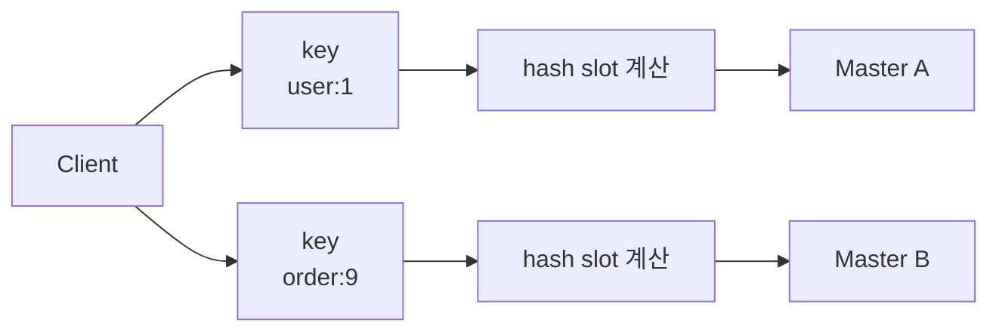

그래서 Cluster에서는 "명령 하나에 포함된 여러 키가 같은 노드에 있는가"가 중요합니다. 장바구니처럼 여러 키를 한 번에 다뤄야 하면 `cart:{user-1}:items`, `cart:{user-1}:summary`처럼 `{user-1}`을 공통 hash tag로 둡니다.

## 주의할 점

### Redis를 원본 저장소로 착각하지 않기

Redis가 장애로 비어도 다시 만들 수 있어야 안전합니다.

| 데이터 | Redis 단독 저장 가능성 | 이유 |
|--------|------------------------|------|
| 상품 상세 캐시 | 가능 | DB에서 다시 만들 수 있음 |
| 로그인 세션 | 조건부 | 로그아웃, 만료, 보안 정책 필요 |
| 쿠폰 발급 원장 | 낮음 | 유실되면 금전/재고 문제 |
| 결제 상태 | 낮음 | 강한 정합성과 감사 로그 필요 |
| 랭킹 중간 집계 | 조건부 | 재계산 가능하면 OK |

### Cache Stampede

인기 키가 동시에 만료되면 많은 요청이 한 번에 DB로 몰립니다.

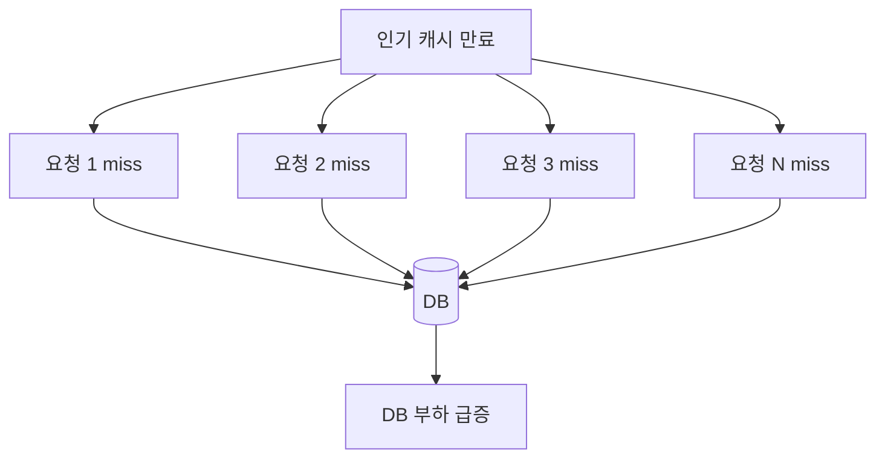

```text
인기 상품 캐시 만료
-> 요청 1,000개가 동시에 miss
-> DB 조회 1,000번
-> DB 지연
-> 애플리케이션 타임아웃
```

대응 방법입니다.

| 방법 | 설명 |
|------|------|
| TTL jitter | TTL에 랜덤 값을 섞어 동시에 만료되지 않게 함 |
| mutex lock | miss 시 한 요청만 DB 조회, 나머지는 대기 또는 stale 응답 |
| stale cache | 만료된 값이라도 잠시 응답하고 백그라운드 갱신 |
| pre-warming | 배포·이벤트 전 인기 키 미리 적재 |

### Cache Penetration

존재하지 않는 값을 계속 조회해 캐시를 우회하는 문제입니다.

```text
GET product:-1 -> miss
DB 조회 -> 없음
다음 요청도 miss
DB 조회 반복
```

대응 방법입니다.

| 방법 | 설명 |
|------|------|
| null cache | 없는 결과도 짧은 TTL로 캐시 |
| 입력 검증 | 말이 안 되는 ID를 DB까지 보내지 않음 |
| Bloom Filter | 존재 가능성이 없는 키를 빠르게 차단 |

### Cache Avalanche

많은 키가 비슷한 시간에 만료되어 DB로 트래픽이 쏠리는 문제입니다.

대응 방법은 TTL 분산, 대량 키 갱신 속도 제한, 사전 적재, fallback 응답입니다.

### Hot Key

하나의 키에 요청이 몰리면 특정 Redis 노드 또는 단일 명령 경로가 병목이 됩니다.

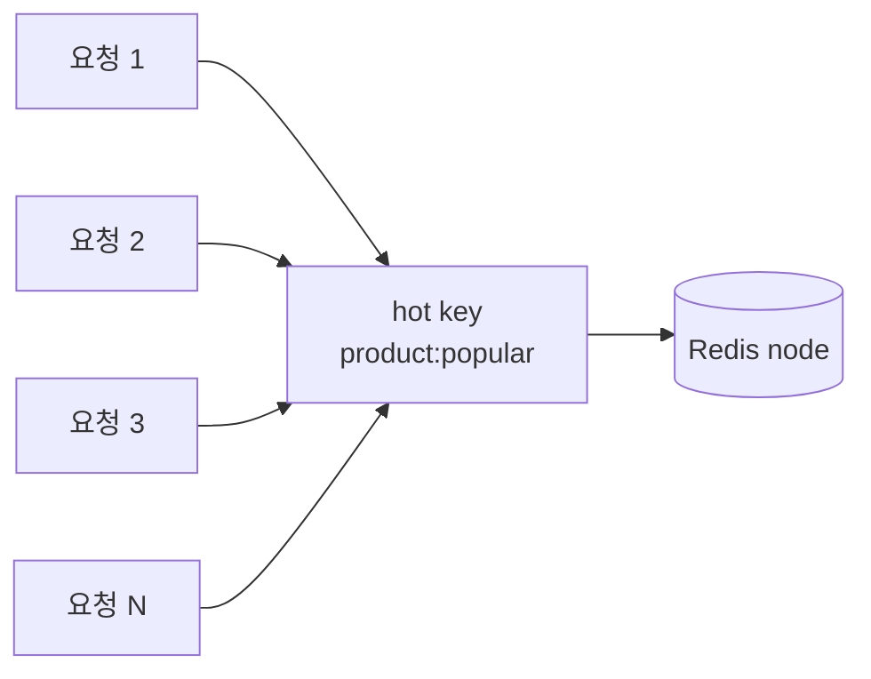

Hot Key는 데이터가 큰 문제가 아니라 **너무 자주 읽히거나 쓰이는 것**이 문제입니다. 키 하나가 Redis 한 노드에 몰리기 때문에 Cluster를 써도 그 키의 부하는 자동으로 분산되지 않습니다.

| 대응 | 설명 |
|------|------|
| local cache | 아주 짧은 로컬 메모리 캐시로 Redis 요청 감소 |
| key sharding | `hot:key:0..N`으로 나누어 부하 분산 |
| replica read | 읽기 전용 트래픽을 replica로 분산 |
| TTL 조정 | 너무 짧은 TTL로 반복 재생성되지 않게 함 |

### Big Key

한 키의 값이 너무 크면 네트워크 전송, 삭제, 복제, 백업, failover가 모두 느려집니다.

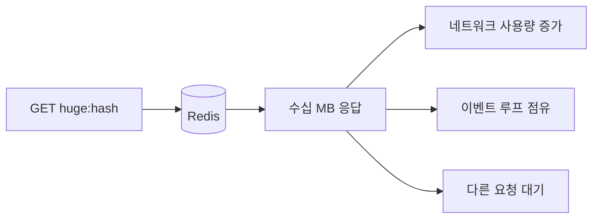

Big Key는 자주 접근하지 않아도 위험합니다. 한 번 조회하거나 삭제하는 순간 Redis가 오래 붙잡힐 수 있고, 복제나 백업 때도 큰 덩어리가 그대로 이동합니다.

| Big Key 예시 | 문제 |
|--------------|------|
| 수십 MB String | 조회 한 번에 네트워크와 이벤트 루프 점유 |
| 필드 수백만 Hash | `HGETALL`이 전체 지연 유발 |
| 원소 수백만 Set | 삭제와 복제가 오래 걸림 |
| 긴 List | pop/push는 괜찮아도 전체 조회가 위험 |

대응 방법은 키 분할, 페이지 단위 조회, `UNLINK` 사용, 자료구조 재설계입니다.

## 장애 대응 Runbook

장애 대응은 "증상 확인 -> 영향 범위 파악 -> 완화 -> 원인 제거 -> 재발 방지" 순서로 움직입니다.

### 1. Redis 지연이 급증함

| 단계 | 확인 |
|------|------|
| 증상 | API 응답 지연, Redis timeout, connection pool 대기 증가 |
| 즉시 확인 | `SLOWLOG GET`, `LATENCY DOCTOR`, `INFO commandstats`, CPU, 네트워크 |
| 의심 원인 | big key 조회/삭제, `KEYS`, 큰 `HGETALL`, AOF rewrite, fork 비용, swap |
| 완화 | 느린 명령 중단, 트래픽 제한, timeout 조정, 큰 키 접근 차단 |
| 재발 방지 | big key 탐지, `SCAN` 사용, 명령별 timeout, slowlog 알림 |

```bash
redis-cli SLOWLOG GET 20
redis-cli LATENCY DOCTOR
redis-cli INFO commandstats
redis-cli --bigkeys
```

### 2. 메모리 부족 또는 쓰기 실패

| 단계 | 확인 |
|------|------|
| 증상 | `OOM command not allowed`, write 실패, `evicted_keys` 증가 |
| 즉시 확인 | `INFO memory`, `CONFIG GET maxmemory`, `CONFIG GET maxmemory-policy` |
| 의심 원인 | TTL 없는 키 증가, big key, eviction 정책 부적합, 메모리 단편화 |
| 완화 | 불필요 키 삭제, TTL 부여, 임시 scale up, write traffic 제한 |
| 재발 방지 | 메모리 알림, 키 수 추적, 도메인별 TTL 표준화, 용량 산정 |

```bash
redis-cli INFO memory
redis-cli INFO stats | grep evicted_keys
redis-cli CONFIG GET maxmemory
redis-cli CONFIG GET maxmemory-policy
```

### 3. Cache Stampede 발생

| 단계 | 확인 |
|------|------|
| 증상 | 특정 캐시 miss 후 DB QPS 폭증 |
| 즉시 확인 | DB slow query, Redis `keyspace_misses`, 특정 key TTL |
| 의심 원인 | 인기 키 동시 만료, 배포 후 캐시 초기화 |
| 완화 | 임시 TTL 연장, stale 응답 허용, 요청 제한 |
| 재발 방지 | TTL jitter, mutex, pre-warming, null cache |

```bash
redis-cli TTL product:popular:1
redis-cli INFO stats | grep keyspace
```

### 4. Hot Key로 특정 노드만 과부하

| 단계 | 확인 |
|------|------|
| 증상 | Cluster 일부 노드 CPU·network만 높음 |
| 즉시 확인 | key별 QPS, `MONITOR`는 짧게만 사용, 애플리케이션 로그 |
| 의심 원인 | 인기 상품, 공통 설정 키, 짧은 TTL |
| 완화 | local cache, read replica, 임시 TTL 증가 |
| 재발 방지 | hot key sharding, 캐시 계층화, 인기 키 별도 정책 |

`MONITOR`는 Redis에 부하를 줄 수 있으므로 운영에서는 짧게만 사용합니다.

### 5. Big Key가 발견됨

| 단계 | 확인 |
|------|------|
| 증상 | 특정 명령만 느림, network output 급증, failover 지연 |
| 즉시 확인 | `--bigkeys`, `MEMORY USAGE`, 자료구조 길이 |
| 의심 원인 | 무제한 컬렉션, 전체 객체 캐시, 삭제 누락 |
| 완화 | 큰 키 접근 차단, `UNLINK`, 배치 분할 |
| 재발 방지 | 키 크기 제한, 페이지 단위 저장, 만료 정책 |

```bash
redis-cli --bigkeys
redis-cli MEMORY USAGE some:key
redis-cli HLEN some:hash
redis-cli SCARD some:set
redis-cli ZCARD some:zset
```

### 6. 커넥션 폭증

| 단계 | 확인 |
|------|------|
| 증상 | `max number of clients reached`, timeout, 연결 생성 지연 |
| 즉시 확인 | `INFO clients`, `CLIENT LIST`, 애플리케이션 인스턴스 수 |
| 의심 원인 | connection leak, pool 과다, 장애 재시도 폭주 |
| 완화 | 클라이언트 재시작, pool 제한, 재시도 backoff 적용 |
| 재발 방지 | connection pool 표준, idle timeout, circuit breaker |

```bash
redis-cli INFO clients
redis-cli CLIENT LIST
redis-cli CONFIG GET maxclients
```

### 7. Master 장애와 failover

| 단계 | 확인 |
|------|------|
| 증상 | write 실패, `READONLY` 에러, 짧은 장애 후 데이터 일부 누락 |
| 즉시 확인 | Sentinel/Cluster 상태, `INFO replication`, client topology 갱신 |
| 의심 원인 | master 다운, 네트워크 분리, replica lag |
| 완화 | client가 새 master를 보도록 갱신, 쓰기 재시도, 장애 노드 격리 |
| 재발 방지 | replica lag 알림, Sentinel quorum 점검, client timeout·retry 정책 |

```bash
redis-cli INFO replication
redis-cli ROLE
redis-cli SENTINEL masters
redis-cli CLUSTER INFO
redis-cli CLUSTER NODES
```

### 8. Replica lag 증가

| 단계 | 확인 |
|------|------|
| 증상 | replica read에서 오래된 값 조회, failover 후 데이터 유실 의심 |
| 즉시 확인 | `master_repl_offset`, `slave_repl_offset`, network, big key |
| 의심 원인 | 네트워크 지연, replica 성능 부족, 큰 쓰기, full resync |
| 완화 | replica read 중단, master read로 전환, 쓰기량 제한 |
| 재발 방지 | lag 기준 알림, replica sizing, 큰 키 제거 |

### 9. AOF rewrite 또는 디스크 문제

| 단계 | 확인 |
|------|------|
| 증상 | 지연 증가, disk full, AOF 파일 급증, 재시작 실패 |
| 즉시 확인 | `INFO persistence`, 디스크 사용량, fork 실패 로그 |
| 의심 원인 | AOF rewrite 중 disk I/O, 디스크 부족, 파일 손상 |
| 완화 | 디스크 확보, rewrite 중복 방지, 백업 확인 |
| 재발 방지 | AOF rewrite 기준 조정, 디스크 알림, 백업 복구 훈련 |

```bash
redis-cli INFO persistence
redis-cli BGREWRITEAOF
redis-check-aof --fix appendonly.aof
```

### 10. Cluster `MOVED`, `ASK`, `CROSSSLOT`

| 단계 | 확인 |
|------|------|
| 증상 | Cluster client 에러, 다중 키 명령 실패 |
| 즉시 확인 | client가 cluster mode 지원인지, key hash slot |
| 의심 원인 | resharding, topology cache 미갱신, hash tag 누락 |
| 완화 | client topology refresh, 같은 slot 키로 재시도 |
| 재발 방지 | hash tag 설계, cluster 지원 client 사용, resharding 절차화 |

```bash
redis-cli CLUSTER KEYSLOT cart:{user-1}:items
redis-cli CLUSTER KEYSLOT cart:{user-1}:summary
```

### 11. 캐시 값이 DB와 다름

| 단계 | 확인 |
|------|------|
| 증상 | 사용자가 오래된 정보 조회 |
| 즉시 확인 | 해당 key TTL, DB updated_at, 캐시 갱신 로그 |
| 의심 원인 | DB update 후 cache delete 실패, write 순서 문제 |
| 완화 | 해당 key 삭제, 도메인 캐시 일괄 무효화 |
| 재발 방지 | cache aside 표준화, outbox 기반 무효화 이벤트, 짧은 TTL |

### 12. 분산 락 중복 실행

| 단계 | 확인 |
|------|------|
| 증상 | 같은 주문·쿠폰·배치가 두 번 처리됨 |
| 즉시 확인 | 락 TTL, 작업 수행 시간, 프로세스 중단 여부 |
| 의심 원인 | TTL보다 작업이 길었음, 락 해제 시 소유자 확인 누락 |
| 완화 | 중복 처리 보정, idempotency key로 재처리 차단 |
| 재발 방지 | 작업 시간보다 긴 TTL, fencing token, DB unique 제약 |

## 관찰 지표

### Redis 명령

| 명령 | 볼 것 |
|------|-------|
| `INFO memory` | 메모리 사용량, 단편화 |
| `INFO stats` | hit/miss, evicted, expired |
| `INFO clients` | 연결 수, blocked client |
| `INFO replication` | master/replica 상태, lag |
| `INFO persistence` | RDB/AOF 상태 |
| `SLOWLOG GET` | 느린 명령 |
| `LATENCY DOCTOR` | 지연 이벤트 |
| `MEMORY USAGE key` | 키별 메모리 |
| `CLIENT LIST` | 클라이언트 연결 |
| `CLUSTER INFO` | 클러스터 상태 |

### 알림 기준 예시

| 지표 | 위험 신호 |
|------|-----------|
| `used_memory / maxmemory` | 80~90% 이상 지속 |
| `evicted_keys` | 예상하지 않은 증가 |
| `keyspace_misses` | 갑작스러운 증가 |
| `connected_clients` | 평소 대비 급증 |
| `blocked_clients` | 0보다 큼 |
| `rejected_connections` | 증가 |
| `master_link_status` | `down` |
| replication lag | 기준 초과 |
| slowlog count | 특정 시간 내 급증 |
| command latency p95/p99 | SLO 초과 |

## 베스트 프랙티스

| 권장 방식 | 이유 |
|-----------|------|
| 모든 캐시에 TTL 부여 | 무한 증가 방지 |
| TTL에 jitter 추가 | 동시 만료 방지 |
| 원본 데이터는 DB에 유지 | Redis 유실·초기화 대응 |
| 큰 키 금지 | 지연, 복제, failover 리스크 감소 |
| `KEYS` 대신 `SCAN` 사용 | 전체 blocking 방지 |
| 삭제는 큰 키면 `UNLINK` 고려 | 비동기 free로 지연 감소 |
| hot key는 local cache 또는 sharding | 단일 키 병목 완화 |
| 분산 락은 idempotency와 함께 사용 | 락 실패·중복 실행 대비 |
| `maxmemory`와 eviction 정책 명시 | 메모리 장애 동작 예측 가능 |
| slowlog와 latency 알림 설정 | 장애 전조 조기 감지 |
| failover 훈련 | client 재연결, 데이터 유실 범위 확인 |

## 실무에서는?

| 사용처 | 설계 기준 |
|--------|-----------|
| 조회 캐시 | Cache Aside, 짧은 TTL, 갱신 시 삭제 |
| 세션 저장 | TTL 필수, 로그아웃 시 삭제, 장애 시 재로그인 허용 여부 결정 |
| API Rate Limit | `INCR` + TTL, Lua로 원자 처리 |
| 랭킹 | Sorted Set, 기간별 key 분리, 오래된 key 만료 |
| 분산 락 | `SET NX PX`, 소유자 확인 삭제, DB unique와 함께 사용 |
| 이벤트 중간 버퍼 | Stream 사용 가능, 장기 내구성이 필요하면 메시지 브로커 고려 |
| 설정 캐시 | 짧은 TTL 또는 pub/sub 무효화, 기본값 준비 |

### 운영 체크리스트

| 체크 | 질문 |
|------|------|
| 용량 | 최대 키 수, 평균 value 크기, peak memory를 계산했는가 |
| TTL | 무기한 키가 필요한 이유가 명확한가 |
| 장애 | Redis가 비어도 서비스가 복구 가능한가 |
| 정합성 | DB 변경 후 캐시 무효화가 보장되는가 |
| 복제 | replica lag가 어느 정도까지 허용되는가 |
| failover | client가 새 master로 자동 전환되는가 |
| 보안 | 외부 노출 차단, 인증, TLS, 명령 제한을 적용했는가 |
| 백업 | RDB/AOF 백업과 복구를 실제로 해봤는가 |
| 알림 | memory, latency, evictions, replication, connections 알림이 있는가 |

## 정리

| 항목 | 설명 |
|------|------|
| Redis | 메모리 기반 Key-Value 저장소 |
| 핵심 용도 | 캐시, TTL 상태, 카운터, 랭킹, 분산 락 |
| 가장 큰 장점 | 빠른 응답과 다양한 자료구조 |
| 가장 큰 위험 | 메모리 한계, big key, hot key, 캐시 정합성, 비동기 복제 |
| 운영 핵심 | TTL, eviction, persistence, replication, slowlog, failover |

---

**관련 파일:**
- [동시성 제어](../operations/concurrency.md) — 분산 락과 중복 실행 방지
- [모니터링](../operations/monitoring.md) — 지표와 알림 설계
- [Kafka](./kafka.md) — 메시지 기반 비동기 처리
