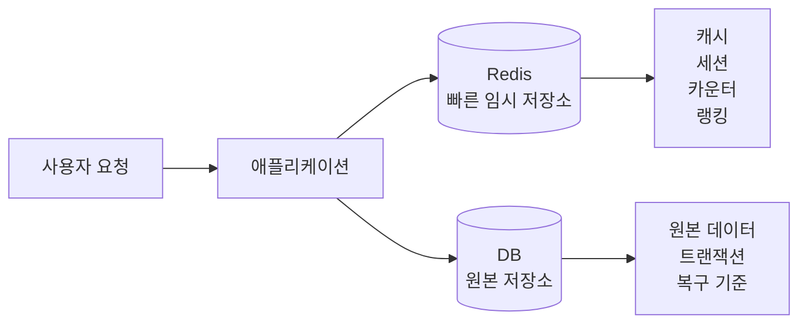
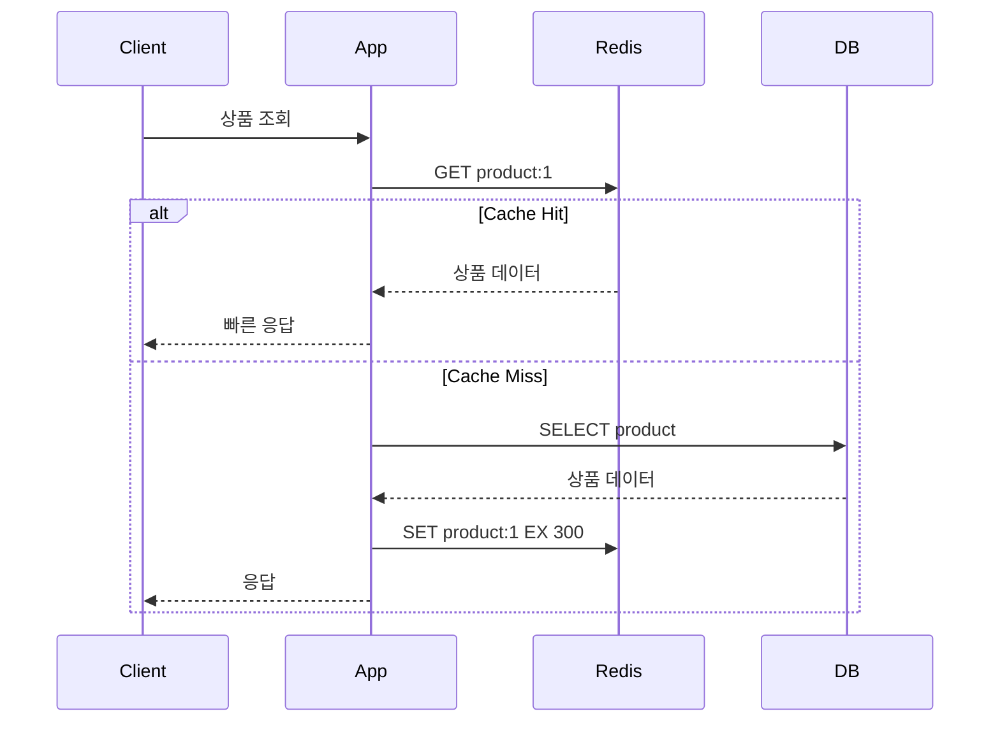
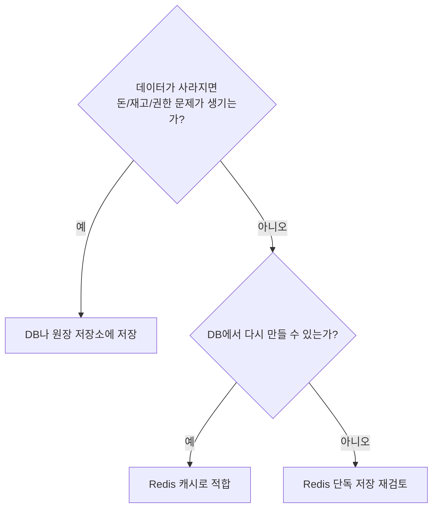
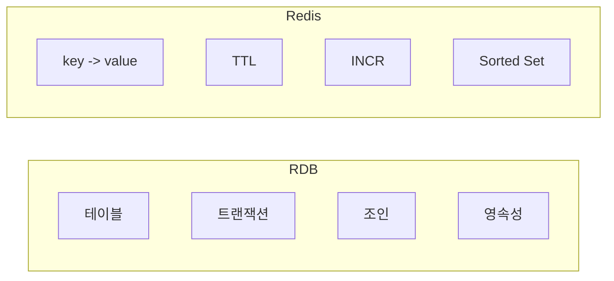

# Redis란?

<div class="concept-box" markdown="1">

**Redis**: 메모리에 데이터를 저장하는 Key-Value 저장소. 캐시, 세션, 인증번호, 카운터, 랭킹, 분산 락처럼 **빠르게 읽고 쓰거나 짧게 보관할 상태**에 자주 사용한다.

</div>

Redis를 처음 볼 때는 "빠른 DB"라고 이해하기 쉽습니다. 하지만 실무에서는 Redis를 **원본 DB를 보조하는 빠른 저장소**로 보는 편이 안전합니다. Redis가 비어도 DB, 이벤트 로그, 외부 원장 같은 기준 데이터로 다시 만들 수 있어야 합니다.

## 용어

| 용어 | 뜻 | 쉽게 말하면 |
|------|----|-------------|
| Key | Redis에서 데이터를 찾는 이름 | 사물함 번호 |
| Value | key에 저장된 값 | 사물함 안의 물건 |
| In-Memory | 디스크보다 메모리 중심으로 처리 | 빠르지만 메모리 비용이 큼 |
| Cache | 반복 조회를 빠르게 하기 위한 임시 저장 | DB 앞의 빠른 임시 보관함 |
| Cache Hit | Redis에 값이 있어서 Redis만 보고 응답 | 빠른 길로 성공 |
| Cache Miss | Redis에 값이 없어 DB까지 조회 | 돌아서 DB까지 감 |
| TTL | key가 자동 삭제되기까지 남은 시간 | 자동 삭제 타이머 |
| Eviction | 메모리가 부족할 때 Redis가 key를 제거 | 자리 부족해서 내보냄 |
| Persistence | RDB/AOF로 Redis 데이터를 디스크에 남김 | 재시작 복구용 저장 |

## 질문

### Redis는 왜 쓰는가?

DB는 원본 데이터를 안전하게 저장하기 위해 많은 일을 합니다. 디스크 저장, 트랜잭션, 인덱스, 락, 복구, 감사 가능성을 책임집니다. 그래서 모든 요청을 DB로만 처리하면 자주 읽히는 데이터에서 병목이 생길 수 있습니다.

Redis는 이런 반복 조회나 짧은 상태를 메모리에서 빠르게 처리해 DB 부담을 줄입니다.



핵심은 역할 분리입니다.

```text
DB는 원본을 안전하게 보관한다.
Redis는 자주 쓰는 상태를 빠르게 처리한다.
Redis가 비어도 DB 기준으로 복구할 수 있어야 한다.
```

### Redis와 DB를 둘 다 조회하면 더 느린 것 아닌가?

Cache Miss가 나면 Redis를 먼저 보고, 없으면 DB까지 조회합니다. 이 첫 요청만 보면 DB만 조회하는 것보다 네트워크 I/O가 하나 더 생길 수 있습니다.

그래도 Redis를 쓰는 이유는 **첫 요청 비용을 감수하고 이후 반복 요청을 훨씬 빠르게 만들기 위해서**입니다.



| 상황 | 흐름 | 의미 |
|------|------|------|
| DB만 사용 | App -> DB | 모든 요청이 DB 부하가 됨 |
| Cache Miss | App -> Redis -> DB -> Redis 저장 | 첫 조회는 느릴 수 있지만 다음 hit 준비 |
| Cache Hit | App -> Redis | DB를 거치지 않아 빠르고 DB 부하 감소 |

첫 요청도 느리면 안 되는 핵심 데이터는 [Cache Warming](./캐시패턴.md#cache-warming)으로 미리 Redis에 넣어둘 수 있습니다.

### Redis는 DB를 대체할 수 있는가?

대부분의 서비스에서는 대체하지 않습니다. Redis는 빠르지만 메모리 비용, 유실 가능성, 캐시 정합성 문제가 있습니다.



| 데이터 | Redis 단독 저장 가능성 | 이유 |
|--------|------------------------|------|
| 상품 상세 캐시 | 가능 | DB에서 다시 만들 수 있음 |
| 인증번호 | 가능 | 짧은 TTL 상태로 적합 |
| 로그인 세션 | 조건부 | 장애 시 재로그인 정책 필요 |
| 조회수 중간 집계 | 조건부 | 유실 허용 범위와 보정 필요 |
| 결제 상태 | 낮음 | 감사와 정합성이 중요 |
| 쿠폰 발급 원장 | 낮음 | 중복 발급·유실 위험 |

## RDB vs Redis

| 구분 | RDB | Redis |
|------|-----|-------|
| 저장 위치 | 주로 디스크 | 주로 메모리 |
| 데이터 모델 | 테이블, 행, 컬럼 | Key-Value와 여러 자료구조 |
| 강점 | 트랜잭션, 조인, 영속성, 정합성 | 빠른 조회·갱신, TTL, 원자 명령 |
| 주 사용처 | 원본 데이터 | 캐시, 짧은 상태, 카운터, 랭킹 |
| 장애 기준 | 데이터 보존과 복구가 핵심 | 비어도 다시 만들 수 있는지 확인 |



Redis는 RDB를 대체하기보다 RDB 앞에서 **반복 조회와 짧은 상태 처리 비용을 줄이는 역할**로 쓰는 경우가 많습니다.

## 어떻게 쓰는지

Redis는 아래 흐름으로 가장 많이 사용합니다.

```text
1. 애플리케이션이 Redis를 먼저 조회한다.
2. 값이 있으면 Redis 값으로 응답한다.
3. 값이 없으면 DB를 조회한다.
4. DB 결과를 Redis에 TTL과 함께 저장한다.
5. 다음 요청부터 Redis에서 빠르게 응답한다.
```

```bash
# 상품 상세 캐시 저장
SET product:1001:summary "{...}" EX 300

# 상품 상세 캐시 조회
GET product:1001:summary

# 조회수 증가
INCR product:1001:view-count

# 인증번호 저장
SET auth:email:user-1 "123456" EX 180
```

## 언제 쓰는지

| 상황 | 적합도 | 이유 |
|------|--------|------|
| 자주 읽지만 자주 바뀌지 않는 데이터 | 높음 | DB 조회를 줄이고 응답 속도 개선 |
| 세션, 인증 토큰 같은 짧은 상태 | 높음 | TTL로 자동 만료 가능 |
| 인증번호, 임시 코드 | 높음 | 짧은 시간만 필요 |
| 카운터, 조회수, Rate Limit | 높음 | 원자 증가 연산이 빠름 |
| 랭킹, 점수 정렬 | 높음 | Sorted Set이 적합 |
| 짧은 분산 락 | 조건부 | 단기 중복 실행 방지에 사용하되 멱등성 필요 |
| 반드시 유실되면 안 되는 원장 데이터 | 낮음 | Redis 장애·failover·설정 오류에 취약 |
| 복잡한 조인과 검색 | 낮음 | RDBMS나 검색 엔진 역할이 아님 |

## 장점

| 장점 | 설명 |
|------|------|
| 빠른 응답 | 메모리 기반이라 단순 조회·갱신이 빠름 |
| DB 부하 감소 | 반복 조회를 Redis가 대신 처리 |
| 다양한 자료구조 | String, Hash, Set, Sorted Set, Stream 등을 지원 |
| TTL 지원 | 임시 데이터를 자동 삭제할 수 있음 |
| 원자 명령 | `INCR`, `SET NX`, Lua로 경쟁 조건을 줄일 수 있음 |
| 운영 기능 | replication, Sentinel, Cluster, persistence 제공 |

## 단점

| 단점 | 설명 |
|------|------|
| 메모리 비용 | 데이터가 커질수록 비용이 빠르게 증가 |
| 유실 가능성 | AOF/RDB 설정과 장애 타이밍에 따라 최근 데이터 손실 가능 |
| 캐시 정합성 문제 | DB와 Redis 값이 일시적으로 다를 수 있음 |
| 느린 명령 영향 | 큰 key나 O(N) 명령 하나가 전체 지연으로 이어질 수 있음 |
| 운영 난도 | eviction, big key, hot key, replication lag, failover 관리 필요 |

## 특징

| 특징 | 설명 |
|------|------|
| Key-Value | key로 value를 바로 찾는 구조 |
| In-Memory | 대부분의 데이터를 메모리에서 처리 |
| 자료구조 제공 | 단순 문자열뿐 아니라 랭킹, 집합, 이벤트 로그까지 표현 가능 |
| TTL | key별 만료 시간을 설정 가능 |
| 원자 명령 | 단일 명령은 중간에 끼어들지 않고 실행 |
| 단일 스레드 기반 명령 실행 | 구조는 단순하지만 느린 명령에 취약 |

## 주의할 점

| 주의 | 설명 |
|------|------|
| 원본 저장소로 착각하지 않기 | Redis가 비어도 DB 기준으로 복구 가능해야 함 |
| TTL 없는 캐시 방치 금지 | 메모리 증가로 장애가 날 수 있음 |
| Big Key 조심 | 조회·삭제·복제·failover가 느려짐 |
| Hot Key 조심 | 특정 노드와 key에 부하가 몰림 |
| Cache Stampede 대비 | 인기 key 만료 시 DB로 트래픽이 몰릴 수 있음 |
| 장애 전파 막기 | timeout, fallback, circuit breaker를 준비 |

## 베스트 프랙티스

| 권장 방식 | 이유 |
|-----------|------|
| 캐시에는 TTL 부여 | 무한 증가 방지 |
| TTL에 랜덤 값을 섞음 | 많은 key가 동시에 만료되는 문제 완화 |
| 원본 데이터는 DB에 유지 | Redis 유실·초기화 대응 |
| key prefix 표준화 | 운영 중 추적과 삭제가 쉬움 |
| `KEYS` 대신 `SCAN` 사용 | 전체 blocking 방지 |
| 없는 결과도 짧게 캐시 | Cache Penetration 완화 |
| Hit Ratio와 latency 관찰 | 캐시 효과와 장애 전조 확인 |

## 실무에서는?

| 사용처 | 설계 기준 |
|--------|-----------|
| 조회 캐시 | Cache Aside, 짧은 TTL, 갱신 시 삭제 |
| 세션 저장 | TTL 필수, 로그아웃 시 삭제 |
| 인증번호 | 짧은 TTL, 검증 횟수 제한 |
| 랭킹 | Sorted Set, 기간별 key 분리 |
| 조회수 | `INCR`, DB 반영 주기와 유실 허용 범위 결정 |
| 분산 락 | `SET NX PX`, 소유자 확인 삭제, DB unique와 함께 사용 |
| Rate Limit | `INCR` + TTL, Lua로 원자 처리 |

## 정리

| 항목 | 설명 |
|------|------|
| Redis | 메모리 기반 Key-Value 저장소 |
| 핵심 용도 | 캐시, TTL 상태, 카운터, 랭킹, 분산 락, 메시징 |
| 가장 큰 강점 | 빠른 응답과 다양한 자료구조 |
| 가장 큰 주의점 | 메모리 한계, big key, hot key, 캐시 정합성, 비동기 복제 |
| 실무 기준 | Redis가 비어도 복구 가능한지 먼저 확인 |

---

**관련 파일:**
- [Redis 개요](../redis.md)
- [기본 사용과 자료구조](./기본사용.md)
- [캐시 전략과 정합성](./캐시패턴.md)
