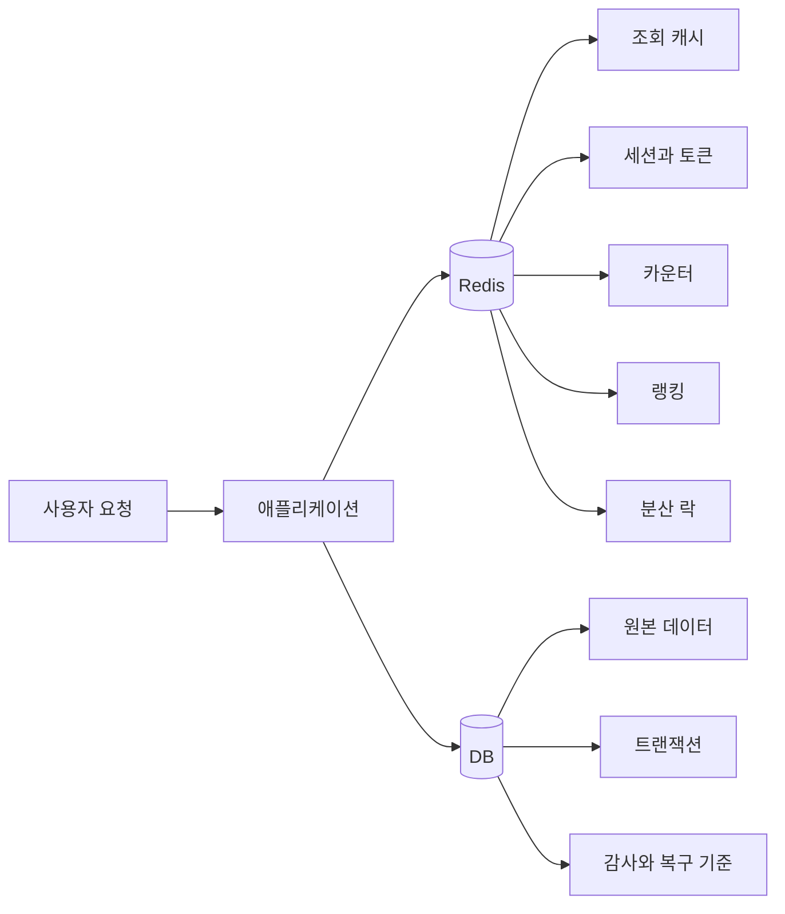

# Redis란?

<div class="concept-box" markdown="1">

**Redis**: 메모리 기반 Key-Value 저장소이며, 캐시·세션·분산 락·카운터·랭킹·메시징 같은 빠른 상태 저장에 사용한다.

</div>

## 왜 쓰는지

DB는 디스크, 트랜잭션, 인덱스, 락, 영속성을 책임지기 때문에 모든 요청을 DB로만 처리하면 응답 속도와 처리량에 한계가 옵니다. Redis는 자주 읽는 데이터, 짧게 살아도 되는 상태, 빠른 원자 연산을 메모리에서 처리해 DB와 애플리케이션의 부담을 줄입니다.

Redis를 "빠른 DB"로만 이해하면 위험합니다. 실무에서는 Redis를 **원본 저장소가 아니라 보조 저장소**로 보는 것이 안전합니다. Redis가 비어도 복구할 기준 데이터는 DB, 이벤트 로그, 외부 원장처럼 더 강한 저장소에 있어야 합니다.

## 어떻게 쓰는지

Redis는 보통 애플리케이션과 DB 사이에서 반복 조회를 빠르게 만듭니다.

```text
Redis에 있으면 빠르게 응답한다.
Redis에 없으면 DB에서 가져와 다시 채운다.
Redis가 비어도 DB 기준으로 복구할 수 있어야 한다.
```



## RDB vs Redis

| 구분 | RDB | Redis |
|------|-----|-------|
| 저장 위치 | 주로 디스크 | 주로 메모리 |
| 강점 | 트랜잭션, 조인, 영속성, 정합성 | 빠른 단순 조회·갱신, TTL, 원자 명령 |
| 주 사용처 | 원본 데이터 | 캐시, 짧은 상태, 카운터, 랭킹 |
| 장애 기준 | 데이터 보존과 복구가 핵심 | 비어도 다시 만들 수 있는지 확인 |

Redis는 RDB를 대체하기보다 RDB 앞에서 **반복 조회와 짧은 상태 처리 비용을 줄이는 역할**로 쓰는 경우가 많습니다.

## 언제 쓰는지

| 상황 | 적합도 | 이유 |
|------|--------|------|
| 자주 읽지만 자주 바뀌지 않는 데이터 | 높음 | DB 조회를 줄이고 응답 속도 개선 |
| 세션, 인증 토큰 같은 짧은 상태 | 높음 | TTL로 자동 만료 가능 |
| 카운터, 조회수, Rate Limit | 높음 | 원자 증가 연산이 빠름 |
| 랭킹, 점수 정렬 | 높음 | Sorted Set이 적합 |
| 짧은 분산 락 | 조건부 | 단기 중복 실행 방지에 사용하되 멱등성 필요 |
| 반드시 유실되면 안 되는 원장 데이터 | 낮음 | Redis 장애·failover·설정 오류에 취약 |
| 복잡한 조인과 검색 | 낮음 | RDBMS나 검색 엔진 역할이 아님 |

## 장점

| 장점 | 설명 |
|------|------|
| 빠른 응답 | 메모리 기반이라 단순 조회·갱신이 빠름 |
| 다양한 자료구조 | String, Hash, Set, Sorted Set, Stream 등을 지원 |
| TTL 지원 | 임시 데이터를 자동 삭제할 수 있음 |
| 원자 명령 | `INCR`, `SET NX`, Lua로 경쟁 조건을 줄일 수 있음 |
| 운영 기능 | replication, Sentinel, Cluster, persistence 제공 |

## 단점

| 단점 | 설명 |
|------|------|
| 메모리 비용 | 데이터가 커질수록 비용이 빠르게 증가 |
| 유실 가능성 | AOF/RDB 설정과 장애 타이밍에 따라 최근 데이터 손실 가능 |
| 캐시 정합성 문제 | DB와 Redis 값이 일시적으로 다를 수 있음 |
| 느린 명령 영향 | 큰 key나 O(N) 명령 하나가 전체 지연으로 이어질 수 있음 |
| 운영 난도 | eviction, big key, hot key, replication lag, failover 관리 필요 |

## 특징

| 특징 | 설명 |
|------|------|
| Key-Value | key로 value를 바로 찾는 구조 |
| In-Memory | 대부분의 데이터를 메모리에서 처리 |
| Single Thread 기반 명령 실행 | 명령 실행 경로가 단순하지만 느린 명령에 취약 |
| TTL | key별 만료 시간을 설정 가능 |
| 자료구조 제공 | 단순 문자열뿐 아니라 랭킹, 집합, 이벤트 로그까지 표현 가능 |

## 주의할 점

| 주의 | 설명 |
|------|------|
| 원본 저장소로 착각하지 않기 | Redis가 비어도 DB 기준으로 복구 가능해야 함 |
| TTL 없는 캐시 방치 금지 | 메모리 증가로 장애가 날 수 있음 |
| Big Key 조심 | 조회·삭제·복제·failover가 느려짐 |
| Hot Key 조심 | 특정 노드와 key에 부하가 몰림 |
| 장애 전파 막기 | timeout, fallback, circuit breaker를 준비 |

## 베스트 프랙티스

| 권장 방식 | 이유 |
|-----------|------|
| 캐시에는 TTL 부여 | 무한 증가 방지 |
| 원본 데이터는 DB에 유지 | Redis 유실·초기화 대응 |
| key prefix 표준화 | 운영 중 추적과 삭제가 쉬움 |
| `KEYS` 대신 `SCAN` 사용 | 전체 blocking 방지 |
| Hit Ratio와 latency 관찰 | 캐시 효과와 장애 전조 확인 |

## 실무에서는?

| 사용처 | 설계 기준 |
|--------|-----------|
| 조회 캐시 | Cache Aside, 짧은 TTL, 갱신 시 삭제 |
| 세션 저장 | TTL 필수, 로그아웃 시 삭제 |
| 인증번호 | 짧은 TTL, 검증 횟수 제한 |
| 랭킹 | Sorted Set, 기간별 key 분리 |
| 분산 락 | `SET NX PX`, 소유자 확인 삭제, DB unique와 함께 사용 |
| Rate Limit | `INCR` + TTL, Lua로 원자 처리 |

## 정리

| 항목 | 설명 |
|------|------|
| Redis | 메모리 기반 Key-Value 저장소 |
| 핵심 용도 | 캐시, TTL 상태, 카운터, 랭킹, 분산 락, 메시징 |
| 가장 큰 강점 | 빠른 응답과 다양한 자료구조 |
| 가장 큰 주의점 | 메모리 한계, big key, hot key, 캐시 정합성, 비동기 복제 |

---

**관련 파일:**
- [Redis 개요](../redis.md)
- [기본 사용과 자료구조](./기본사용.md)
- [캐시 전략과 정합성](./캐시패턴.md)
