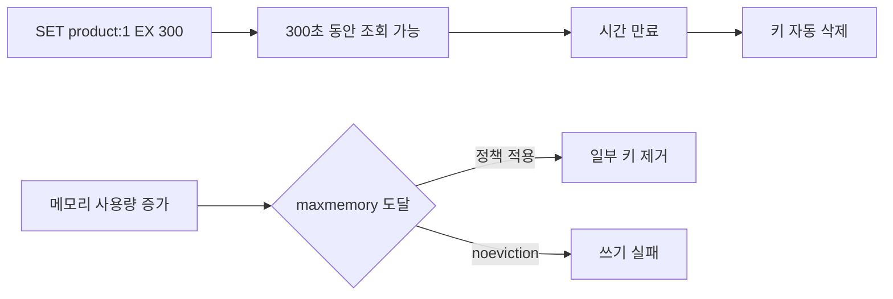
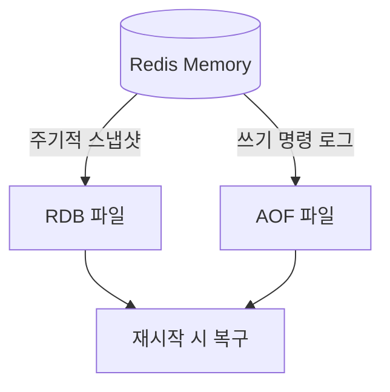
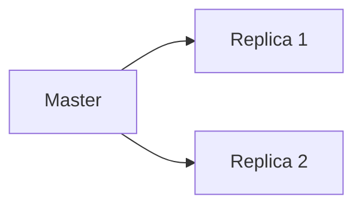
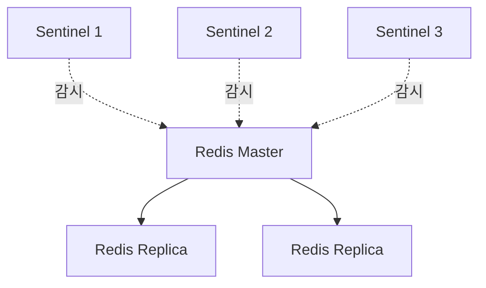
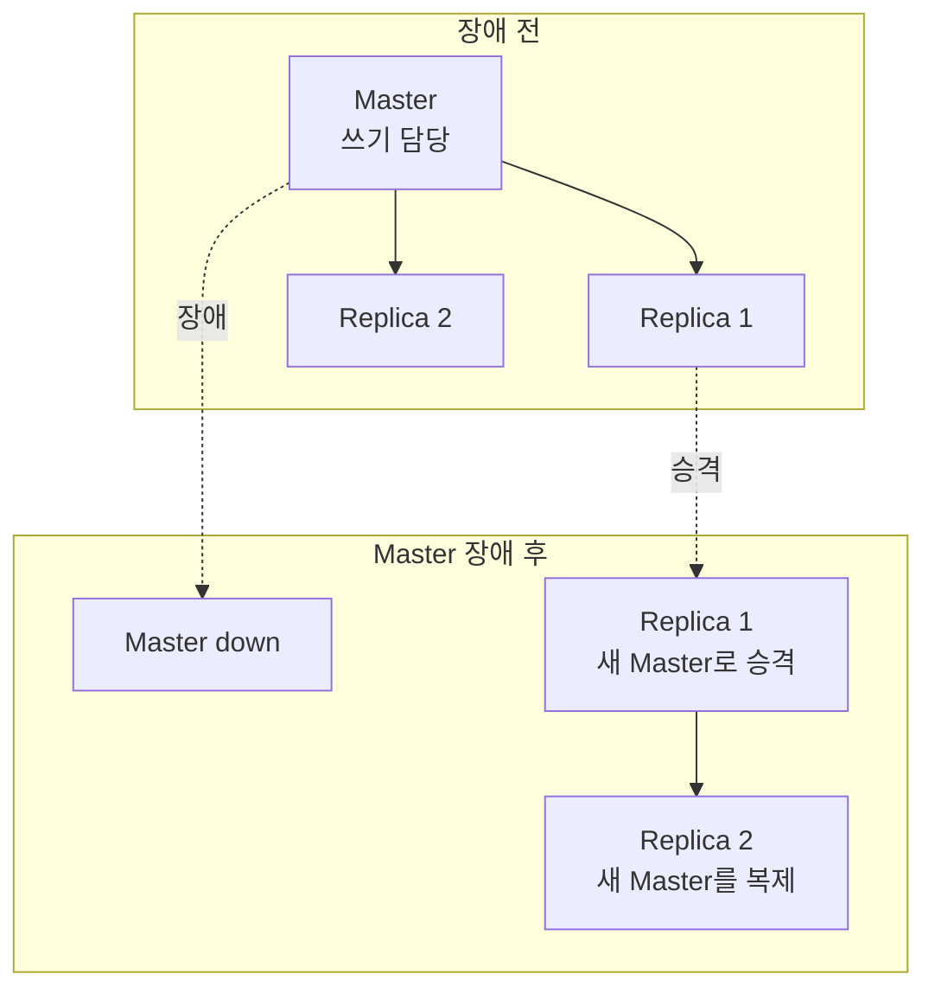
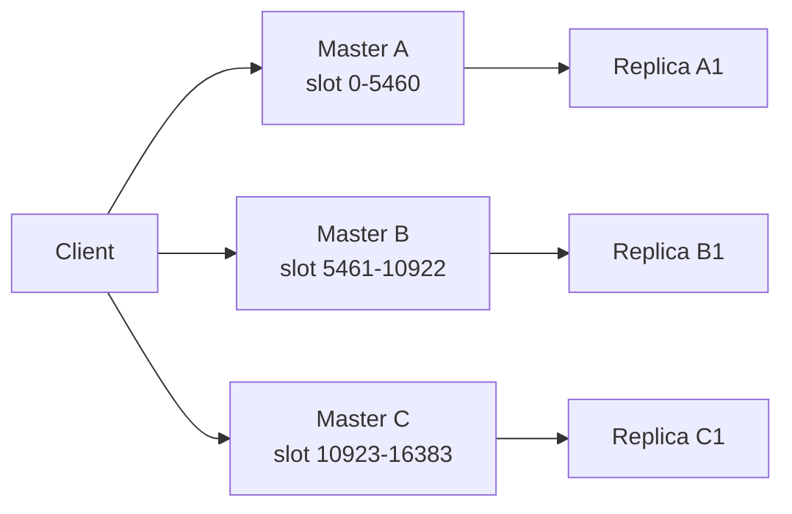
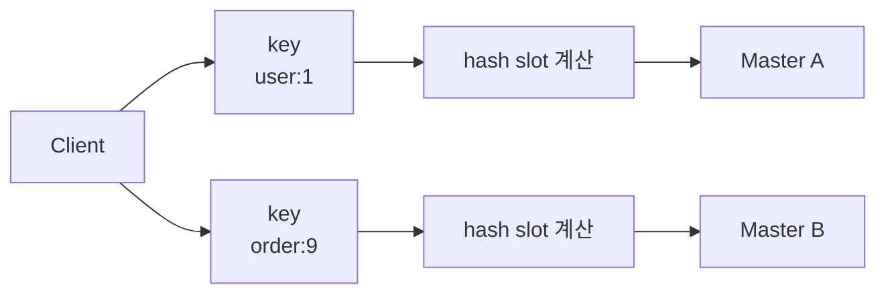
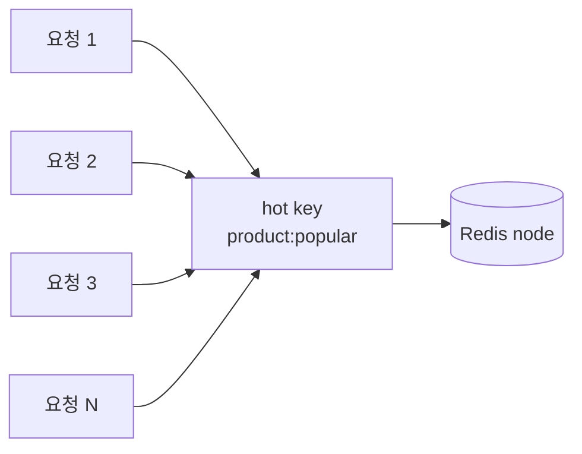
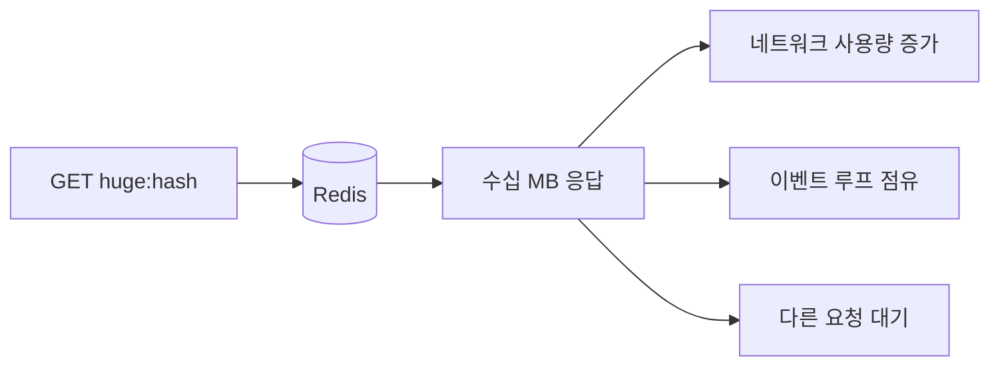

# Redis 구조와 운영 특성

Redis는 메모리 기반이라 빠르지만, 메모리 사용량·큰 키·느린 명령·복제 지연이 곧 운영 리스크가 됩니다. 구조를 알면 장애 원인을 훨씬 빨리 좁힐 수 있습니다.

## 메모리 기반 처리

Redis는 대부분의 명령을 메모리에서 처리합니다. 그래서 빠르지만, 메모리 사용량이 곧 비용과 장애 한계가 됩니다.

| 확인 항목 | 의미 |
|-----------|------|
| `used_memory` | Redis가 할당한 메모리 |
| `used_memory_rss` | OS가 실제로 잡고 있는 메모리 |
| `mem_fragmentation_ratio` | 메모리 단편화 비율 |
| `maxmemory` | Redis가 사용할 최대 메모리 |
| `evicted_keys` | 메모리 부족으로 제거된 키 수 |

메모리는 데이터 크기만큼만 쓰이지 않습니다. 키 이름, 자료구조 메타데이터, TTL 정보, replication buffer, client buffer, allocator 단편화까지 포함됩니다.

## 단일 스레드처럼 보이는 명령 실행

Redis는 명령 실행 경로가 이벤트 루프 중심이라 한 명령이 오래 걸리면 뒤의 요청도 밀립니다. 최신 Redis는 I/O, persistence, lazy free 등 일부 작업에 별도 스레드를 활용할 수 있지만, **느린 명령이 전체 지연을 만든다**는 운영 감각은 그대로 중요합니다.

```text
빠른 명령 1ms
빠른 명령 1ms
큰 키 삭제 500ms
빠른 명령 1ms  -> 앞의 큰 키 삭제 때문에 대기
```

피해야 하는 패턴입니다.

```bash
# 운영 환경에서 전체 키 스캔 위험
KEYS *

# 큰 컬렉션 전체 조회 위험
LRANGE big:list 0 -1
SMEMBERS big:set
HGETALL huge:hash
```

대신 점진적으로 나누어 처리합니다.

```bash
SCAN 0 MATCH user:* COUNT 100
HSCAN user:1:profile 0 COUNT 100
SSCAN active-users 0 COUNT 100
```

## TTL과 Eviction

TTL은 키별 만료 시간이고, eviction은 `maxmemory`에 도달했을 때 Redis가 키를 제거하는 정책입니다. 둘은 다릅니다.



`TTL`은 "시간이 지나서 사라지는 것"이고, `eviction`은 "메모리가 부족해서 쫓겨나는 것"입니다. TTL을 길게 줬더라도 메모리가 부족하고 eviction 정책이 허용하면 그 전에 삭제될 수 있습니다.

| 구분 | 설명 |
|------|------|
| TTL | 시간이 지나면 키 삭제 |
| Eviction | 메모리가 부족할 때 정책에 따라 키 삭제 |

주요 eviction 정책입니다.

| 정책 | 제거 대상 | 언제 고려 |
|------|-----------|-----------|
| `noeviction` | 제거하지 않음 | 쓰기 실패를 감수하고 데이터 삭제를 막을 때 |
| `allkeys-lru` | 전체 키 중 덜 최근에 사용한 키 | 일반 캐시 |
| `allkeys-lfu` | 전체 키 중 덜 자주 사용한 키 | 인기 데이터가 뚜렷할 때 |
| `volatile-lru` | TTL 있는 키 중 덜 최근에 사용한 키 | TTL 없는 키를 보호해야 할 때 |
| `volatile-lfu` | TTL 있는 키 중 덜 자주 사용한 키 | TTL 기반 캐시 |
| `volatile-ttl` | TTL이 짧은 키 | 곧 만료될 키 우선 제거 |
| `allkeys-random` | 전체 키 중 랜덤 | 접근 패턴 예측이 어려울 때 |

<div class="warning-box" markdown="1">

**주의**: `volatile-*` 정책은 TTL이 있는 키만 제거한다. TTL이 없는 키가 많으면 메모리 부족 상황에서 기대처럼 제거되지 않고 쓰기 실패가 날 수 있다.

</div>

## Persistence: RDB와 AOF

Redis는 메모리 저장소지만 디스크에 복구용 데이터를 남길 수 있습니다.



RDB는 사진처럼 특정 시점의 전체 모습을 저장합니다. AOF는 가계부처럼 쓰기 명령을 계속 적어둡니다. RDB는 복구 파일이 단순하고 빠르지만 마지막 사진 이후 변경이 사라질 수 있고, AOF는 더 촘촘히 복구할 수 있지만 파일 관리와 rewrite 비용이 생깁니다.

| 방식 | 설명 | 장점 | 단점 |
|------|------|------|------|
| RDB | 특정 시점 스냅샷 | 파일이 작고 복구가 빠름 | 마지막 스냅샷 이후 데이터 유실 가능 |
| AOF | 쓰기 명령 로그 | 더 적은 유실 가능 | 파일 증가, rewrite 비용 |
| RDB + AOF | 둘 다 사용 | 복구 안정성 향상 | 운영 비용 증가 |

AOF fsync 정책입니다.

| 설정 | 의미 | 장애 시 |
|------|------|---------|
| `appendfsync always` | 매 쓰기마다 fsync | 가장 안전하지만 느림 |
| `appendfsync everysec` | 보통 1초마다 fsync | 성능과 안전성 균형, 최근 약 1초 유실 가능 |
| `appendfsync no` | OS flush에 맡김 | 빠르지만 유실 범위가 커질 수 있음 |

Redis를 캐시로만 쓰면 persistence를 끌 수도 있습니다. 하지만 세션, 락, 카운터처럼 장애 후 상태가 중요하면 RDB/AOF 정책과 백업을 명확히 정해야 합니다.

## Replication과 Sentinel

Redis replication은 master가 replica에 변경 명령을 전달하는 방식입니다. 기본은 비동기 복제입니다.



| 항목 | 설명 |
|------|------|
| master | 쓰기를 받는 노드 |
| replica | master 데이터를 복제 |
| async replication | master가 매 쓰기마다 replica 적용을 기다리지 않음 |
| replication lag | replica가 master보다 늦은 정도 |
| failover | master 장애 시 replica를 새 master로 승격 |

Sentinel은 master 장애를 감지하고 failover를 자동화하는 구성입니다.



<div class="warning-box" markdown="1">

**주의**: 비동기 복제에서는 master가 성공 응답을 보낸 직후 장애가 나고, 그 쓰기가 replica에 도달하지 않았다면 failover 후 데이터가 사라질 수 있다.

</div>

failover는 아래 흐름으로 이해하면 됩니다.



여기서 중요한 점은 "승격은 자동일 수 있지만 데이터가 항상 완벽히 같다는 뜻은 아니다"입니다. 기본 복제가 비동기라 master가 방금 받은 쓰기가 replica에 도착하기 전에 장애가 나면 새 master에는 그 쓰기가 없을 수 있습니다.

## Cluster와 Hash Slot

Redis Cluster는 데이터를 여러 master에 나누어 저장합니다. Redis Cluster는 16384개의 hash slot을 사용하고, 각 키는 하나의 slot에 배치됩니다.



| 개념 | 설명 |
|------|------|
| hash slot | 키가 배치되는 논리 슬롯 |
| `MOVED` | 키의 slot 담당 노드가 바뀌었으니 새 노드로 가라는 응답 |
| `ASK` | slot 이동 중 임시로 다른 노드에 물어보라는 응답 |
| hash tag | `{}` 안의 문자열만 hash해 여러 키를 같은 slot에 배치 |

다중 키 명령은 같은 slot에 있어야 합니다.

```text
가능:
cart:{user-1}:items
cart:{user-1}:summary

불가능할 수 있음:
cart:user-1:items
cart:user-1:summary
```

Cluster에서 클라이언트는 키를 보고 담당 노드를 찾아갑니다.



그래서 Cluster에서는 "명령 하나에 포함된 여러 키가 같은 노드에 있는가"가 중요합니다. 장바구니처럼 여러 키를 한 번에 다뤄야 하면 `cart:{user-1}:items`, `cart:{user-1}:summary`처럼 `{user-1}`을 공통 hash tag로 둡니다.

## Hot Key

하나의 키에 요청이 몰리면 특정 Redis 노드 또는 단일 명령 경로가 병목이 됩니다.



Hot Key는 데이터가 큰 문제가 아니라 **너무 자주 읽히거나 쓰이는 것**이 문제입니다. 키 하나가 Redis 한 노드에 몰리기 때문에 Cluster를 써도 그 키의 부하는 자동으로 분산되지 않습니다.

| 대응 | 설명 |
|------|------|
| local cache | 아주 짧은 로컬 메모리 캐시로 Redis 요청 감소 |
| key sharding | `hot:key:0..N`으로 나누어 부하 분산 |
| replica read | 읽기 전용 트래픽을 replica로 분산 |
| TTL 조정 | 너무 짧은 TTL로 반복 재생성되지 않게 함 |

## Big Key

한 키의 값이 너무 크면 네트워크 전송, 삭제, 복제, 백업, failover가 모두 느려집니다.



Big Key는 자주 접근하지 않아도 위험합니다. 한 번 조회하거나 삭제하는 순간 Redis가 오래 붙잡힐 수 있고, 복제나 백업 때도 큰 덩어리가 그대로 이동합니다.

| Big Key 예시 | 문제 |
|--------------|------|
| 수십 MB String | 조회 한 번에 네트워크와 이벤트 루프 점유 |
| 필드 수백만 Hash | `HGETALL`이 전체 지연 유발 |
| 원소 수백만 Set | 삭제와 복제가 오래 걸림 |
| 긴 List | pop/push는 괜찮아도 전체 조회가 위험 |

대응 방법은 키 분할, 페이지 단위 조회, `UNLINK` 사용, 자료구조 재설계입니다.

---

**관련 파일:**
- [Redis 개요](../redis.md)
- [기본 사용과 자료구조](./기본사용.md)
- [장애 대응과 관찰 지표](./장애대응.md)
