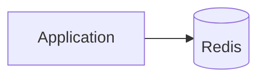
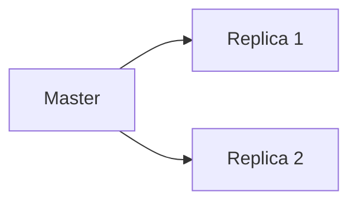
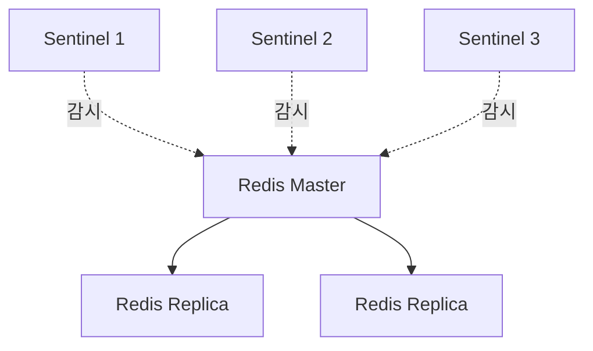
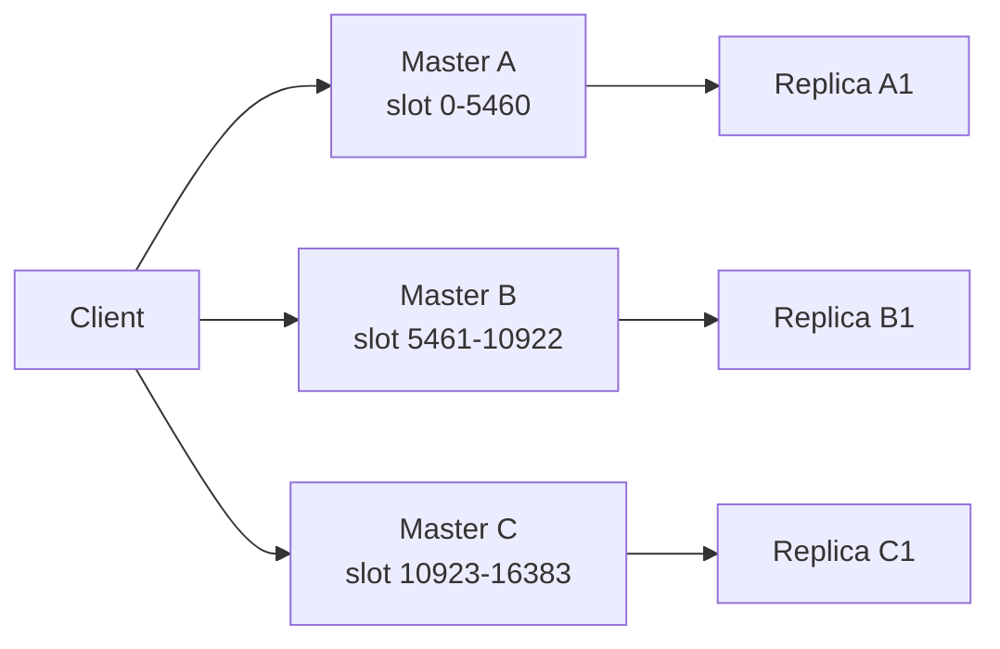

# Redis 운영 구조와 고가용성

Redis 운영 구조는 **단일 노드로 충분한지, 장애 시 자동 전환이 필요한지, 데이터를 여러 노드로 나누어야 하는지**에 따라 달라집니다.

## 용어

| 용어 | 의미 |
|------|------|
| Standalone | Redis 단일 인스턴스 |
| Replication | master 데이터를 replica로 복제 |
| Master-Replica | 쓰기는 master, 복제는 replica가 담당하는 구조 |
| Sentinel | master 장애 감지와 failover 자동화 |
| Failover | 장애 master 대신 replica를 새 master로 승격 |
| Cluster | hash slot 기반으로 데이터를 여러 master에 나누는 구조 |
| Hash Slot | Redis Cluster가 key를 배치하는 16384개 논리 슬롯 |
| Hash Tag | `{}` 안 문자열만 hash해 여러 key를 같은 slot에 배치하는 방법 |

## 질문

### Replication이 있으면 데이터가 절대 안 사라지나?

아닙니다. Redis replication은 기본적으로 비동기입니다. master가 쓰기 성공 응답을 보낸 직후 장애가 나고, 그 쓰기가 replica에 아직 복제되지 않았다면 failover 후 데이터가 사라질 수 있습니다.

### Sentinel과 Cluster는 같은가?

아닙니다.

| 구분 | Sentinel | Cluster |
|------|----------|---------|
| 목적 | 고가용성, failover | 샤딩 + 고가용성 |
| 데이터 분산 | 없음 | hash slot으로 분산 |
| client 요구 | Sentinel 지원 | Cluster mode 지원 |
| 언제 | 한 master의 용량으로 충분하지만 HA 필요 | 데이터·트래픽을 여러 master로 나눠야 함 |

## Standalone

가장 단순한 구조입니다.



| 장점 | 단점 |
|------|------|
| 구성과 운영이 단순 | 장애 시 단일 실패 지점 |
| 로컬 개발·작은 서비스에 적합 | 수평 확장 어려움 |

## Replication

master가 replica에 변경 명령을 전달합니다.



| 항목 | 설명 |
|------|------|
| master | 쓰기를 받는 노드 |
| replica | master 데이터를 복제 |
| async replication | master가 매 쓰기마다 replica 적용을 기다리지 않음 |
| replication lag | replica가 master보다 늦은 정도 |

replica read를 사용하면 읽기 부하를 나눌 수 있지만, 오래된 값을 읽을 수 있습니다.

## Sentinel

Sentinel은 master 장애를 감지하고 failover를 자동화합니다.



| 확인 | 이유 |
|------|------|
| Sentinel quorum | 장애 판단이 너무 쉽게/어렵게 되지 않게 함 |
| client Sentinel 지원 | 새 master 주소를 따라가야 함 |
| replica lag | 승격 시 데이터 유실 범위 |
| failover 시간 | 서비스 timeout과 재시도 정책에 영향 |

## Redis Cluster

Redis Cluster는 16384개의 hash slot을 여러 master에 나누어 저장합니다.



| 개념 | 설명 |
|------|------|
| `MOVED` | key의 slot 담당 노드가 바뀌었으니 새 노드로 가라는 응답 |
| `ASK` | slot 이동 중 임시로 다른 노드에 물어보라는 응답 |
| `CROSSSLOT` | 다중 key 명령의 key들이 서로 다른 slot에 있음 |
| Resharding | slot을 다른 master로 옮기는 작업 |

## Hash Tag

Cluster에서 다중 key 명령은 같은 slot에 있어야 합니다.

```text
가능:
cart:{user-1}:items
cart:{user-1}:summary

불가능할 수 있음:
cart:user-1:items
cart:user-1:summary
```

`{user-1}`처럼 같은 hash tag를 쓰면 여러 key가 같은 slot에 배치됩니다.

## Cluster 리밸런싱과 장애 처리

| 상황 | 확인 |
|------|------|
| 노드 추가 | slot 이동 계획, client topology refresh |
| 노드 제거 | slot migration, replica 재배치 |
| master 장애 | replica 승격, slot serving 상태 |
| replica 부족 | failover 불가 slot 확인 |

## Managed Redis 서비스

| 서비스 | 특징 |
|--------|------|
| AWS ElastiCache | Redis OSS/Valkey 계열 managed cache로 자주 사용 |
| Azure Cache for Redis | Azure 환경 통합 관리 |
| Google Memorystore | GCP managed Redis |

Managed Redis는 백업, failover, patching을 줄여주지만, 설정 제한·비용·버전 정책·네트워크 구성을 확인해야 합니다.

## Docker Redis 운영

```bash
docker run --name redis -p 6379:6379 redis:7
```

로컬 개발에는 편하지만 운영에서는 volume, persistence, network, resource limit, health check가 필요합니다.

## Kubernetes Redis 운영

Kubernetes에서는 StatefulSet, PVC, anti-affinity, readiness/liveness probe, PodDisruptionBudget을 함께 봐야 합니다. 단순 Deployment로 Redis를 띄우면 데이터와 장애 전환 요구를 놓치기 쉽습니다.

## 베스트 프랙티스

| 권장 방식 | 이유 |
|-----------|------|
| 단일 노드로 충분한지 먼저 판단 | 불필요한 Cluster 복잡도 방지 |
| Sentinel/Cluster client 지원 확인 | failover 후 자동 복구 |
| replication lag 알림 설정 | stale read와 유실 범위 확인 |
| hash tag 규칙 문서화 | CROSSSLOT 장애 예방 |
| failover 훈련 | client timeout, retry, 데이터 유실 범위 검증 |

## 실무에서는?

| 상황 | 선택 |
|------|------|
| 로컬 개발 | Docker Standalone |
| 작은 내부 서비스 캐시 | Standalone + 백업 또는 managed single node |
| 장애 자동 전환 필요 | Sentinel 또는 managed HA |
| 데이터·트래픽 분산 필요 | Cluster |
| 운영 인력이 적음 | Managed Redis 우선 검토 |

---

**관련 파일:**
- [Key 설계와 데이터 관리](./데이터관리.md)
- [장애 대응과 트러블슈팅](./장애대응.md)
- [모니터링과 보안](./모니터링보안.md)
