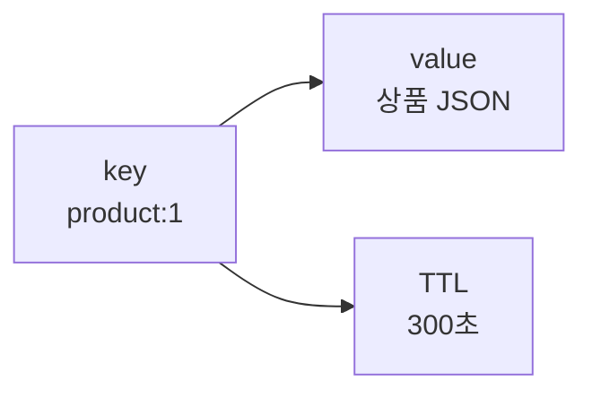

# Redis 기본 사용과 자료구조

Redis 기본은 **key 하나에 어떤 자료구조를 저장하고, 어떤 명령으로 꺼낼지**를 정하는 일입니다. 자료구조를 잘 고르면 애플리케이션 코드가 단순해지고, 잘못 고르면 큰 키·느린 명령·메모리 낭비로 이어집니다.

이 문서는 자료구조의 큰 그림을 다룹니다. 명령어, 시간 복잡도, 비교 기준, Java/Spring 예시는 [자료구조 심화](./자료구조심화.md)에서 더 자세히 정리합니다.

## 용어

| 용어 | 의미 |
|------|------|
| Key | Redis에서 값을 찾는 이름 |
| Value | key에 저장된 데이터 |
| TTL | key가 자동 삭제되기까지 남은 시간 |
| Data Type | String, List, Set, Sorted Set, Hash 같은 Redis 자료구조 |
| Command | `GET`, `SET`, `HGET`, `ZADD` 같은 Redis 명령 |

## 질문

### 자료구조는 무엇을 기준으로 고르는가?

Redis 자료구조는 "무엇을 저장하느냐"보다 **어떤 방식으로 꺼내고 바꿀 것인가**를 기준으로 고릅니다.

| 필요한 동작 | 먼저 볼 자료구조 |
|-------------|------------------|
| 값 하나를 빠르게 읽고 쓴다 | String |
| 객체의 일부 필드만 읽고 쓴다 | Hash |
| 중복 없이 포함 여부를 본다 | Set |
| 점수 기준으로 정렬한다 | Sorted Set |
| 이벤트를 순서대로 쌓고 읽는다 | Stream |

## 기본 명령

```bash
# 값 저장
SET user:1:name "kim"

# 값 조회
GET user:1:name

# TTL과 함께 저장
SET auth:token:abc "user-1" EX 3600

# 만료 시간 부여
EXPIRE user:1:name 60

# 남은 TTL 확인
TTL user:1:name

# 삭제
DEL user:1:name
```

| 명령 | 의미 | 주의 |
|------|------|------|
| `SET` | 값을 저장 | 기본은 TTL 없음 |
| `GET` | 값을 조회 | 없는 키는 `nil` |
| `EXPIRE` | 만료 시간 지정 | 값 갱신 시 TTL 유지 여부 확인 |
| `TTL` | 남은 만료 시간 확인 | `-1`은 TTL 없음, `-2`는 키 없음 |
| `DEL` | 키 삭제 | 큰 키 삭제는 지연을 만들 수 있어 `UNLINK` 고려 |

## 기본 구조: Key-Value



`key`는 사물함 번호, `value`는 사물함 안의 물건, `TTL`은 사물함을 자동으로 비우는 타이머라고 생각하면 됩니다. 캐시 key에는 기본적으로 TTL을 붙이는 습관이 좋습니다.

## Key 네이밍 컨벤션

```text
user:{userId}:profile
user:{userId}:sessions
order:{orderId}:summary
rate-limit:login:{userId}
lock:coupon:{couponId}
rank:daily:{yyyyMMdd}
```

| 규칙 | 예시 | 이유 |
|------|------|------|
| `:`로 계층 구분 | `user:10:profile` | 검색과 운영이 쉬움 |
| 식별자는 명확히 포함 | `order:9001:summary` | 충돌 방지 |
| 용도를 앞에 둠 | `lock:coupon:1` | 장애 시 키 성격 파악 |
| TTL 키는 도메인별로 통일 | `auth:token:*` | 만료 정책 관리 |
| Cluster 다중 키는 hash tag 사용 | `cart:{user-1}:items` | 같은 hash slot 배치 |

## 데이터 타입

| 자료구조 | 대표 명령 | 언제 쓰는지 | 예시 |
|----------|-----------|-------------|------|
| String | `GET`, `SET`, `INCR` | 단일 값, JSON 문자열, 카운터 | 조회 결과 캐시, 인증 토큰 |
| List | `LPUSH`, `RPOP`, `BRPOP` | 앞뒤로 넣고 빼는 목록 | 간단한 작업 큐 |
| Set | `SADD`, `SISMEMBER` | 중복 없는 집합 | 좋아요 사용자 목록 |
| Sorted Set | `ZADD`, `ZRANGE` | 점수 기반 정렬 | 랭킹, 우선순위 |
| Hash | `HGET`, `HSET`, `HINCRBY` | 한 객체의 여러 필드 | 사용자 프로필 일부 필드 |
| Bitmap | `SETBIT`, `GETBIT` | boolean 대량 저장 | 출석 체크 |
| HyperLogLog | `PFADD`, `PFCOUNT` | 대략적인 고유 수 | UV 추정 |
| Stream | `XADD`, `XREADGROUP` | 이벤트 로그 | 소규모 이벤트 처리 |
| Geospatial | `GEOADD`, `GEOSEARCH` | 좌표 기반 검색 | 주변 매장 찾기 |

## 자료구조별 핵심 명령과 비용

Redis 명령은 자료구조가 같아도 비용이 다릅니다. 운영 경로에서는 `O(1)`, `O(log N)` 중심으로 설계하고, `O(N)` 명령은 데이터 크기 제한이나 pagination이 있을 때만 사용합니다.

| 자료구조 | 명령 | 시간 복잡도 | 실무 판단 |
|----------|------|-------------|-----------|
| String | `GET`, `SET`, `INCR` | 보통 `O(1)` | 캐시, 토큰, 카운터 기본값 |
| List | `LPUSH`, `RPOP` | `O(1)` | 간단한 queue |
| List | `LRANGE start stop` | `O(S+N)` | 전체 조회 금지, 범위 제한 |
| Set | `SADD`, `SISMEMBER` | 보통 `O(1)` | 중복 제거, 포함 여부 |
| Set | `SMEMBERS` | `O(N)` | 큰 set에서는 `SSCAN` 고려 |
| Sorted Set | `ZADD`, `ZREM` | `O(log N)` | 랭킹 점수 갱신 |
| Sorted Set | `ZRANGE`, `ZREVRANGE` | `O(log N + M)` | 상위 N개 조회에 적합 |
| Hash | `HGET`, `HSET` | 보통 `O(1)` | 객체 필드 단위 조회 |
| Hash | `HGETALL` | `O(N)` | 필드가 많은 hash에서는 위험 |
| Stream | `XADD` | 보통 `O(1)` | 이벤트 추가 |
| Stream | `XREADGROUP` | 읽는 개수에 비례 | batch 크기 제한 |
| Geospatial | `GEOSEARCH` | 조건과 결과 수에 비례 | 반경과 반환 개수 제한 |

<div class="warning-box" markdown="1">

**주의**: `O(N)` 명령이 항상 나쁜 것은 아니지만, `N`의 최대값을 모르면 운영 장애로 이어질 수 있다. 큰 컬렉션은 `SCAN` 계열, 범위 제한, key 분할을 먼저 고려한다.

</div>

### String

가장 단순한 value입니다. JSON 문자열, 토큰, 카운터에 자주 씁니다.

```bash
SET product:1 "{\"name\":\"keyboard\",\"price\":39000}" EX 300
INCR view:product:1
MGET product:1 product:2 product:3
```

| 언제 좋은가 | 주의 |
|-------------|------|
| value 전체를 한 번에 읽고 쓸 때 | JSON String은 필드 일부만 바꾸기 어려움 |
| 인증 토큰, 인증번호처럼 TTL이 명확할 때 | TTL 없는 key가 쌓이지 않게 함 |
| 단순 카운터가 필요할 때 | DB 반영 전 유실 허용 범위 결정 |

### List

양쪽 끝에서 push/pop 하는 구조입니다.

```bash
LPUSH job:email "message-1"
RPOP job:email
BRPOP job:email 5
LLEN job:email
```

| 언제 좋은가 | 주의 |
|-------------|------|
| 간단한 FIFO/LIFO queue | ACK, 재처리, consumer group이 필요하면 부족 |
| 최근 N개 로그 보관 | `LTRIM`으로 길이 제한 필요 |

간단한 큐에는 쓸 수 있지만, 재처리·소비자 그룹·추적이 중요하면 Stream이나 Kafka 같은 메시징 도구를 검토합니다.

### Set

중복 없는 집합입니다.

```bash
SADD post:1:likes user-1
SISMEMBER post:1:likes user-1
SCARD post:1:likes
SREM post:1:likes user-1
```

| 언제 좋은가 | 주의 |
|-------------|------|
| 좋아요 여부, 태그, 권한 집합 | 원소 수가 커지면 big key 위험 |
| 중복 제거 | 전체 목록이 필요하면 pagination 전략 필요 |

### Sorted Set

점수(score)로 정렬되는 집합입니다.

```bash
ZADD rank:daily:20260427 1200 user-1
ZREVRANGE rank:daily:20260427 0 9 WITHSCORES
ZREVRANK rank:daily:20260427 user-1
ZINCRBY rank:daily:20260427 50 user-1
```

| 언제 좋은가 | 주의 |
|-------------|------|
| 랭킹, 우선순위, 시간 정렬 | score 갱신이 몰리면 hot key 위험 |
| 상위 N개 조회 | 기간별 key로 분리해 크기 제한 |

### Hash

한 객체를 필드 단위로 저장합니다.

```bash
HSET user:1 name "kim" grade "gold"
HGET user:1 grade
HINCRBY user:1 point 100
HMGET user:1 name grade point
```

| 언제 좋은가 | 주의 |
|-------------|------|
| 객체 필드 일부만 자주 바뀔 때 | 필드가 너무 많아지면 big key |
| 사용자 요약 정보, 설정 값 | 전체 `HGETALL` 남용 금지 |

### Bitmap

bit 단위 boolean 저장입니다.

```bash
SETBIT attendance:20260427 1001 1
GETBIT attendance:20260427 1001
BITCOUNT attendance:20260427
```

출석, 방문 여부처럼 true/false를 대량 저장할 때 메모리 효율이 좋습니다.

### HyperLogLog

고유 수를 근사치로 계산합니다.

```bash
PFADD uv:20260427 user-1 user-2
PFCOUNT uv:20260427
```

정확한 사용자 목록이 필요하면 Set을 써야 합니다. HyperLogLog는 “대략 몇 명인가”가 필요할 때 씁니다.

### Stream

append-only 이벤트 로그입니다.

```bash
XADD order-events * type ORDER_CREATED orderId 1001
XREAD COUNT 10 STREAMS order-events 0
XGROUP CREATE order-events order-service $ MKSTREAM
XREADGROUP GROUP order-service consumer-1 COUNT 10 STREAMS order-events >
```

Redis 안에서 가벼운 이벤트 처리를 할 때 유용하지만, 장기 보관·대규모 재처리·강한 운영 도구가 필요하면 Kafka와 비교해야 합니다.

### Geospatial Index

좌표를 저장하고 거리 기반 검색을 합니다.

```bash
GEOADD store:geo 127.0276 37.4979 store-1
GEOSEARCH store:geo FROMLONLAT 127.03 37.50 BYRADIUS 2 km
GEODIST store:geo store-1 store-2 km
```

주변 매장, 근처 사용자 같은 기능에 쓸 수 있습니다. 복잡한 공간 검색은 전용 검색 엔진을 검토합니다.

## 자료구조 선택 실수

| 실수 | 문제 | 대안 |
|------|------|------|
| 모든 객체를 String JSON으로만 저장 | 일부 필드 갱신에도 전체 직렬화 필요 | 필드 갱신이 많으면 Hash |
| 좋아요 사용자를 List에 저장 | 중복 제거와 포함 여부 확인이 어려움 | Set |
| 랭킹을 List로 직접 정렬 | 정렬 비용과 동시성 문제 | Sorted Set |
| 작업 큐를 List로 만들고 재처리 요구를 나중에 추가 | 실패 추적이 어려움 | 처음부터 Stream/Kafka 검토 |
| 하나의 Set/Hash에 무제한 저장 | big key 장애 | 기간별·샤딩 key 분리 |

## 주의할 점

| 주의 | 설명 |
|------|------|
| 큰 컬렉션 하나에 몰아넣지 않기 | 한 key가 커지면 조회·삭제·복제·failover가 느려짐 |
| 전체 조회 명령 조심 | `HGETALL`, `SMEMBERS`, `LRANGE 0 -1`은 큰 key에서 위험 |
| 자료구조를 조회 방식 기준으로 고르기 | 저장 형태보다 꺼내는 패턴이 더 중요 |
| TTL 기본값 정하기 | 캐시 key가 무기한 남으면 메모리 장애로 이어짐 |

## 베스트 프랙티스

| 권장 방식 | 이유 |
|-----------|------|
| key 이름에 도메인과 용도를 드러냄 | 장애 분석과 삭제 범위 판단이 쉬움 |
| 캐시 key에는 TTL을 기본으로 둠 | 무한 증가 방지 |
| 자료구조별 cardinality 제한을 둠 | big key 예방 |
| 운영 명령은 `SCAN` 계열 사용 | 전체 blocking 방지 |

## 실무에서는?

| 사용처 | 추천 자료구조 |
|--------|---------------|
| 상품 상세 캐시 | String 또는 Hash |
| 인증 토큰 | String + TTL |
| 좋아요 여부 | Set |
| 조회수 | String `INCR` |
| 랭킹 | Sorted Set |
| 출석 체크 | Bitmap |
| 대략적인 UV | HyperLogLog |
| 가벼운 이벤트 로그 | Stream |

---

**관련 파일:**
- [Redis란?](./redis란.md)
- [자료구조 심화](./자료구조심화.md)
- [Key 설계와 데이터 관리](./데이터관리.md)
- [캐시 전략과 정합성](./캐시패턴.md)
- [성능 최적화](./성능최적화.md)

--8<-- "includes/redis/core.md"
--8<-- "includes/redis/data-structures.md"
--8<-- "includes/redis/data-management.md"
--8<-- "includes/redis/performance.md"
--8<-- "includes/redis/messaging.md"
--8<-- "includes/redis/use-cases.md"
