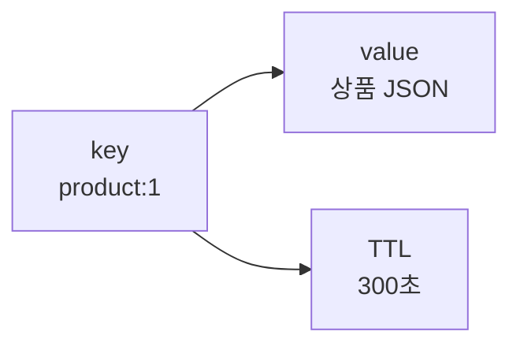
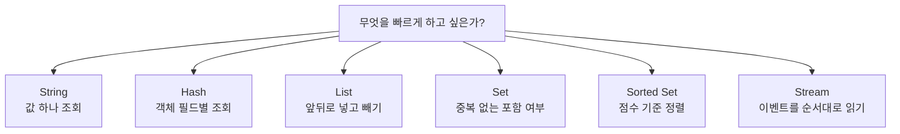

# Redis 기본 사용과 자료구조

Redis 기본 설계는 key, value, TTL을 어떻게 둘지에서 시작합니다. 자료구조는 "무엇을 저장하느냐"보다 **어떤 방식으로 꺼낼 것인가**를 기준으로 고르는 것이 좋습니다.

## 기본 명령

```bash
# 값 저장
SET user:1:name "kim"

# 값 조회
GET user:1:name

# TTL과 함께 저장
SET auth:token:abc "user-1" EX 3600

# 만료 시간 부여
EXPIRE user:1:name 60

# 남은 TTL 확인
TTL user:1:name

# 삭제
DEL user:1:name
```

| 명령 | 의미 | 주의 |
|------|------|------|
| `SET` | 값을 저장 | 기본은 TTL 없음 |
| `GET` | 값을 조회 | 없는 키는 `nil` |
| `EXPIRE` | 만료 시간 지정 | 갱신 시 TTL이 사라지는 명령이 있으므로 확인 필요 |
| `TTL` | 남은 만료 시간 확인 | `-1`은 TTL 없음, `-2`는 키 없음 |
| `DEL` | 키 삭제 | 큰 키 삭제는 지연을 만들 수 있어 `UNLINK` 고려 |

Redis의 저장 단위는 아래처럼 단순하게 보면 됩니다.



`key`는 사물함 번호, `value`는 사물함 안의 물건, `TTL`은 사물함을 자동으로 비우는 타이머라고 생각하면 됩니다. `TTL`이 없으면 누군가 지우기 전까지 계속 남을 수 있으니 캐시 키에는 기본적으로 TTL을 붙이는 습관이 좋습니다.

## 키 이름 규칙

Redis는 키 이름이 설계의 절반입니다. 키만 봐도 소유 도메인, 데이터 의미, 식별자, TTL 여부를 추측할 수 있어야 합니다.

```text
user:{userId}:profile
user:{userId}:sessions
order:{orderId}:summary
rate-limit:login:{userId}
lock:coupon:{couponId}
rank:daily:{yyyyMMdd}
```

| 규칙 | 예시 | 이유 |
|------|------|------|
| `:`로 계층 구분 | `user:10:profile` | 검색과 운영이 쉬움 |
| 식별자는 명확히 포함 | `order:9001:summary` | 충돌 방지 |
| 용도를 앞에 둠 | `lock:coupon:1` | 장애 시 키 성격 파악 |
| TTL 키는 도메인별로 통일 | `auth:token:*` | 만료 정책 관리 |
| Cluster 다중 키는 hash tag 사용 | `cart:{user-1}:items` | 같은 hash slot 배치 |

## 자료구조 선택

| 자료구조 | 대표 명령 | 언제 쓰는지 | 예시 |
|----------|-----------|-------------|------|
| String | `GET`, `SET`, `INCR` | 단일 값, JSON 문자열, 카운터 | 조회 결과 캐시, 인증 토큰 |
| Hash | `HGET`, `HSET`, `HINCRBY` | 한 객체의 여러 필드 | 사용자 프로필 일부 필드 |
| List | `LPUSH`, `RPOP`, `BRPOP` | 간단한 FIFO/LIFO 큐 | 짧은 작업 큐 |
| Set | `SADD`, `SISMEMBER` | 중복 없는 집합 | 좋아요 사용자 목록 |
| Sorted Set | `ZADD`, `ZRANGE` | 점수 기반 정렬 | 랭킹, 우선순위 |
| Stream | `XADD`, `XREADGROUP` | Redis 내부 이벤트 로그 | 소규모 이벤트 처리 |
| Bitmap | `SETBIT`, `GETBIT` | boolean 대량 저장 | 출석 체크 |
| HyperLogLog | `PFADD`, `PFCOUNT` | 대략적인 고유 수 | UV 추정 |

자료구조는 "무엇을 저장하느냐"보다 **어떤 방식으로 꺼낼 것인가**를 기준으로 고릅니다.



예를 들어 `user:1` 전체 객체를 매번 통째로 읽으면 String JSON도 괜찮습니다. 반대로 `name`, `grade`, `point`처럼 필드 일부만 자주 바꾸면 Hash가 더 읽기 쉽습니다. 랭킹처럼 "점수로 정렬해서 상위 100명"을 봐야 한다면 Sorted Set이 자연스럽습니다.

<div class="warning-box" markdown="1">

**주의**: Redis 자료구조는 편하지만 큰 컬렉션 하나에 데이터를 끝없이 넣으면 장애 지점이 된다. 한 키의 크기와 한 명령의 처리 시간이 커지는 순간 Redis 전체 지연으로 번질 수 있다.

</div>

---

**관련 파일:**
- [Redis 개요](../redis.md)
- [캐시와 락 패턴](./캐시패턴.md)
- [구조와 운영 특성](./구조와운영.md)
