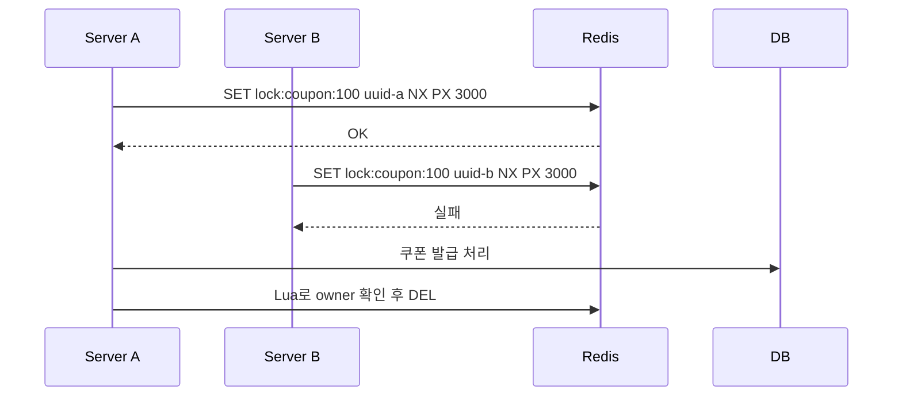
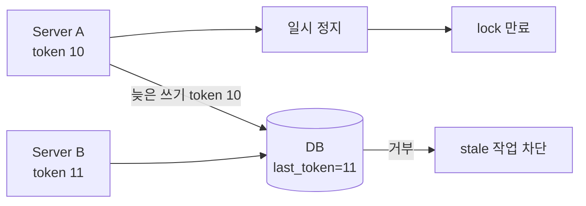

# Redis 트랜잭션과 동시성

Redis는 단일 명령 실행이 원자적이라 카운터, 중복 요청 방지, 짧은 락에 자주 사용됩니다. 여러 명령을 묶어야 할 때는 MULTI/EXEC, WATCH, Lua Script를 검토합니다.

## 용어

| 용어 | 의미 |
|------|------|
| Atomic Command | 한 명령이 중간에 끼어들지 않고 실행되는 성질 |
| MULTI / EXEC | 여러 명령을 queue에 쌓고 순서대로 실행하는 Redis transaction |
| DISCARD | MULTI로 쌓은 명령을 취소 |
| WATCH | key 변경을 감시해 낙관적 락처럼 사용하는 명령 |
| Lua Script | 여러 Redis 명령을 서버에서 원자적으로 실행하는 스크립트 |
| Distributed Lock | 여러 서버가 같은 자원을 동시에 처리하지 않도록 잡는 락 |
| Fencing Token | 락 획득 순서를 나타내는 단조 증가 토큰 |

## 질문

### Redis transaction은 RDB transaction과 같은가?

다릅니다. Redis의 MULTI/EXEC는 명령을 순서대로 실행하지만, RDB처럼 복잡한 rollback이나 격리 수준을 제공하지 않습니다.

| 구분 | Redis MULTI/EXEC | RDB Transaction |
|------|------------------|-----------------|
| 목적 | Redis 명령 묶음 실행 | 데이터 정합성 보장 |
| rollback | 제한적 | 일반적으로 지원 |
| 격리 수준 | RDB 격리 수준과 다름 | READ COMMITTED, REPEATABLE READ 등 |
| 사용처 | 카운터, 상태 변경, 간단한 원자 처리 | 원장성 업무 처리 |

## MULTI / EXEC / DISCARD

```bash
MULTI
INCR user:1:point
EXPIRE user:1:point 3600
EXEC
```

| 명령 | 의미 |
|------|------|
| `MULTI` | transaction 시작 |
| `EXEC` | queue에 쌓인 명령 실행 |
| `DISCARD` | queue에 쌓인 명령 취소 |

MULTI/EXEC 안에서 명령 결과를 읽고 그 값에 따라 다음 명령을 바꾸는 로직은 어렵습니다. 그런 Read-Modify-Write는 Lua가 더 적합합니다.

## WATCH와 Optimistic Locking

WATCH는 key가 바뀌었는지 감시하고, 바뀌었다면 EXEC를 실패시킵니다.

```bash
WATCH stock:coupon:100
GET stock:coupon:100
MULTI
DECR stock:coupon:100
EXEC
```

여러 클라이언트가 같은 key를 바꾸는 경쟁 상황에서 사용할 수 있지만, 충돌이 잦으면 재시도 비용이 커집니다.

## Lua Script

Lua Script는 여러 Redis 명령을 서버에서 한 번에 실행합니다.

```lua
local current = redis.call("INCR", KEYS[1])
if current == 1 then
  redis.call("EXPIRE", KEYS[1], ARGV[1])
end
return current
```

| 장점 | 단점 |
|------|------|
| Read-Modify-Write를 원자적으로 처리 | 스크립트가 길면 유지보수 어려움 |
| 네트워크 왕복 감소 | 오래 실행되면 Redis 전체 지연 |
| rate limit, 중복 요청 방지에 유용 | 복잡한 비즈니스 로직을 넣으면 위험 |

## Lua 실전 패턴

### 원자적 Read-Modify-Write

```lua
local value = redis.call("GET", KEYS[1])
if not value then
  return nil
end
local next = tonumber(value) + tonumber(ARGV[1])
redis.call("SET", KEYS[1], next)
return next
```

### 분산락 해제

락을 해제할 때는 반드시 내가 잡은 락인지 확인해야 합니다.

```lua
if redis.call("GET", KEYS[1]) == ARGV[1] then
  return redis.call("DEL", KEYS[1])
else
  return 0
end
```

### Rate Limiting

```lua
local current = redis.call("INCR", KEYS[1])
if current == 1 then
  redis.call("EXPIRE", KEYS[1], ARGV[1])
end
return current
```

### 재고 차감

```lua
local stock = tonumber(redis.call("GET", KEYS[1]) or "0")
if stock <= 0 then
  return -1
end
redis.call("DECR", KEYS[1])
return stock - 1
```

Redis 재고 차감은 빠르지만 원장성은 DB에서 보정해야 합니다. 쿠폰·재고·결제는 DB unique 제약, 상태 전이 검증, 이벤트 보정이 필요합니다.

### 중복 요청 방지

```bash
SET idempotency:payment:req-123 "processing" NX EX 300
```

`NX`로 처음 요청만 통과시키고, 같은 key가 있으면 중복 요청으로 처리합니다.

## 분산 락

```bash
SET lock:coupon:100 request-uuid NX PX 3000
```

| 옵션 | 의미 |
|------|------|
| `NX` | key가 없을 때만 저장 |
| `PX 3000` | 3초 뒤 자동 만료 |
| `request-uuid` | 락 소유자 구분 값 |

<div class="danger-box" markdown="1">

**위험**: 분산 락은 트랜잭션을 대신하지 않는다. 락 만료 시간이 작업 시간보다 짧으면 다른 서버가 같은 락을 다시 잡을 수 있다.

</div>

### 분산 락 기본 흐름



핵심은 락 획득보다 **락 해제**입니다. TTL이 지난 뒤 다른 서버가 새 락을 잡았는데, 이전 서버가 뒤늦게 `DEL`을 실행하면 다른 서버의 락을 지울 수 있습니다. 그래서 value에 owner token을 저장하고 Lua로 확인 후 삭제합니다.

### Fencing Token

Fencing Token은 락을 잡을 때마다 증가하는 번호를 함께 발급하는 방식입니다.

```text
1. Server A lock 획득, token = 10
2. Server A가 멈춤
3. lock TTL 만료
4. Server B lock 획득, token = 11
5. Server A가 뒤늦게 DB write 시도
6. DB는 token 10이 최신 token 11보다 작으므로 거부
```



| 구성 | 역할 |
|------|------|
| Redis `INCR lock:token` | 단조 증가 token 발급 |
| DB `last_token` | 가장 최신 작업 번호 저장 |
| write 조건 | 요청 token이 DB의 token보다 클 때만 반영 |

Fencing Token은 락이 깨지는 상황에서도 늦게 도착한 작업을 DB가 거부할 수 있게 합니다. 금전성 작업, 재고 차감, 외부 API 중복 호출처럼 결과가 민감한 곳에서 중요합니다.

## Lettuce, Redisson, Redlock

| 방식 | 특징 | 주의 |
|------|------|------|
| Lettuce 직접 구현 | `SET NX PX` 기반으로 단순 구현 가능 | 해제 Lua, timeout, 재시도 직접 관리 |
| Redisson | 락 API, watchdog 등 편의 기능 제공 | 라이브러리 동작 방식 이해 필요 |
| Redlock | 여러 Redis 노드에서 락 획득 시도 | 네트워크 분할·시계·운영 복잡도 논쟁 존재 |

실무에서는 단일 Redis 락만으로 금전성 정합성을 보장하기보다, DB unique 제약이나 fencing token을 함께 둡니다.

### Lettuce 직접 구현 시 체크

| 체크 | 이유 |
|------|------|
| `SET key value NX PX ttl` 사용 | 락 획득과 TTL 설정을 원자적으로 처리 |
| value는 요청별 UUID | 소유자 확인 |
| 해제는 Lua | 다른 요청의 락 삭제 방지 |
| 재시도는 제한적으로 | 락 대기 폭주 방지 |
| 작업은 멱등하게 | timeout, failover, 중복 실행 대비 |

### Redisson Watchdog

Redisson의 lock watchdog은 락을 잡은 스레드가 살아 있는 동안 락 TTL을 자동 연장해주는 기능입니다.

| 장점 | 주의 |
|------|------|
| 작업 시간이 예측보다 길어져도 락이 쉽게 만료되지 않음 | 프로세스 정지, GC stop-the-world, 네트워크 분리 상황을 완전히 해결하지는 못함 |
| 직접 TTL 연장 로직을 줄일 수 있음 | watchdog 동작 조건과 leaseTime 설정을 이해해야 함 |

명시적인 lease time을 지정하면 watchdog 자동 연장이 적용되지 않는 방식으로 동작할 수 있으므로, 라이브러리 사용 방식과 설정을 팀 표준으로 맞춰야 합니다.

### Redlock 한계

Redlock은 여러 독립 Redis 노드에서 과반수 락을 얻는 방식입니다. 단일 노드 장애에는 더 강할 수 있지만, 네트워크 지연, clock drift, 클라이언트 pause, 운영 복잡도 논쟁이 있습니다.

| 고려 | 설명 |
|------|------|
| Redis 노드 독립성 | 같은 장애 도메인에 있으면 의미가 줄어듦 |
| 시간 의존성 | TTL과 clock drift를 고려해야 함 |
| 구현 복잡도 | 단순 `SET NX PX`보다 운영 난도 증가 |
| 최종 보호 | DB unique, 상태 전이, fencing token이 여전히 필요 |

그래서 실무에서는 Redlock을 쓰더라도 "락을 잡았으니 절대 중복 실행이 없다"가 아니라, **중복 실행이 와도 DB가 막을 수 있는 구조**를 함께 둡니다.

## Rate Limiting

| 방식 | 설명 | 특징 |
|------|------|------|
| Fixed Window | 고정 시간 창마다 count | 단순하지만 경계 시점 burst 가능 |
| Sliding Window | 최근 N초 요청을 계산 | 정확하지만 비용 증가 |
| Token Bucket | 토큰을 일정 속도로 채움 | burst를 어느 정도 허용 |
| Leaky Bucket | 일정 속도로 처리 | 트래픽 평탄화 |

### Fixed Window Lua 예시

```lua
local current = redis.call("INCR", KEYS[1])
if current == 1 then
  redis.call("EXPIRE", KEYS[1], ARGV[1])
end
if current > tonumber(ARGV[2]) then
  return 0
end
return 1
```

| 인자 | 의미 |
|------|------|
| `KEYS[1]` | `rate-limit:login:user-1:202604271200` |
| `ARGV[1]` | window TTL |
| `ARGV[2]` | 허용 요청 수 |

## Redis와 격리 수준

Redis는 RDB의 격리 수준을 그대로 제공하지 않습니다. 명령 실행은 원자적이지만, 여러 key와 외부 DB까지 포함한 업무 트랜잭션은 애플리케이션과 DB 설계가 필요합니다.

## 베스트 프랙티스

| 권장 방식 | 이유 |
|-----------|------|
| 단일 명령으로 가능한 것은 단일 명령 사용 | 단순하고 빠름 |
| 여러 명령 원자 처리는 Lua 검토 | 네트워크 왕복과 race condition 감소 |
| Lua는 짧고 제한적으로 작성 | Redis event loop 점유 방지 |
| 분산 락은 소유자 확인 후 해제 | 다른 요청의 락 삭제 방지 |
| 락과 멱등성 같이 사용 | failover, timeout, 중복 실행 대비 |
| 원장성 데이터는 DB 제약과 함께 검증 | Redis 유실·중복 대비 |

## 실무에서는?

| 사용처 | 패턴 |
|--------|------|
| 로그인 실패 제한 | `INCR` + TTL Lua |
| 중복 결제 요청 방지 | idempotency key + DB unique |
| 쿠폰 중복 발급 방지 | Redis lock + DB 발급 이력 unique |
| 재고 빠른 차감 | Redis 선차감 + DB 보정/검증 |
| API rate limit | fixed/sliding/token bucket 선택 |

---

**관련 파일:**
- [캐시 전략과 정합성](./캐시패턴.md)
- [실무 유즈케이스](./실무유즈케이스.md)
- [동시성 제어](../../operations/concurrency.md)

--8<-- "includes/redis-abbreviations.md"
