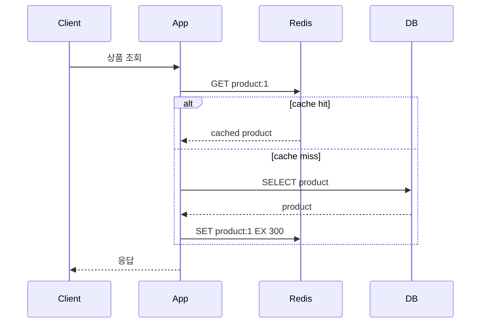
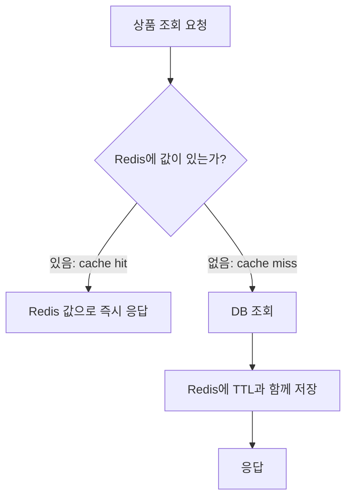
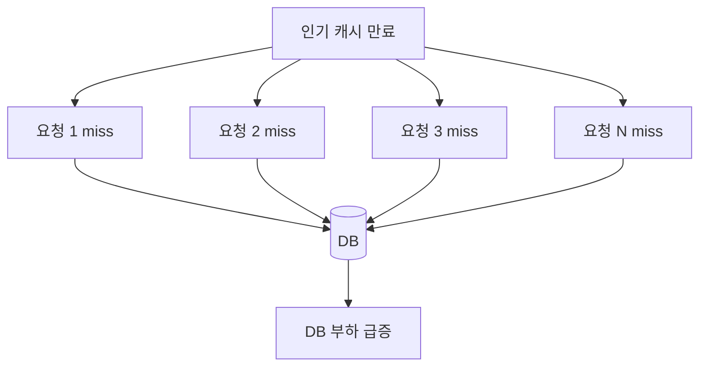

# Redis 캐시와 락 패턴

Redis는 반복 조회를 빠르게 만드는 캐시, 짧은 카운터, 단기 중복 실행 방지에 자주 사용됩니다. 다만 원본 저장소가 아니므로 **DB 기준 복구와 멱등성**을 함께 설계해야 합니다.

## 캐시 기본 용어

| 용어 | 의미 | 실무에서 보는 포인트 |
|------|------|----------------------|
| Cache Hit | Redis에 값이 있어 DB 조회 없이 응답하는 경우 | 응답 속도와 DB 부하 감소 |
| Cache Miss | Redis에 값이 없어 DB까지 조회하는 경우 | 첫 조회 또는 만료 직후에는 느릴 수 있음 |
| Cache Warming | 서비스 오픈·이벤트 전에 주요 데이터를 미리 Redis에 적재 | 대량 miss를 줄여 초기 트래픽을 완화 |
| Cache Penetration | 존재하지 않는 키 요청이 반복되어 매번 DB까지 가는 문제 | null cache, 입력 검증, Bloom Filter로 완화 |
| Cache Stampede | 인기 키 만료 직후 많은 요청이 동시에 DB로 몰리는 문제 | TTL jitter, mutex, stale cache가 필요 |
| Hit Ratio | 전체 조회 중 cache hit 비율 | 캐시가 실제로 효과를 내는지 보는 핵심 지표 |

## Cache Aside 패턴

가장 흔한 캐시 사용 방식입니다. 애플리케이션이 캐시를 먼저 보고, 없으면 DB에서 읽은 뒤 Redis에 저장합니다.



```text
1. Redis에서 조회한다.
2. 값이 있으면 그대로 응답한다.
3. 값이 없으면 DB에서 조회한다.
4. DB 결과를 Redis에 TTL과 함께 저장한다.
5. 다음 요청부터 Redis에서 응답한다.
```

캐시 무효화는 보통 쓰기 시점에 처리합니다.

```text
DB update 성공
-> 관련 Redis key 삭제
-> 다음 조회에서 DB 기준으로 다시 캐시 생성
```

조회 캐시의 핵심은 hit와 miss를 구분하는 것입니다.



처음 요청은 느릴 수 있습니다. 대신 다음 요청부터는 DB를 거치지 않습니다. 그래서 Redis 캐시는 "첫 요청을 빠르게"가 아니라 **반복 조회를 빠르게** 만드는 기술입니다.

### Redis와 DB를 둘 다 조회해도 쓰는 이유

Cache Miss가 나면 애플리케이션은 Redis 조회 후 DB까지 조회합니다. 이 경우 단순히 DB만 조회하는 것보다 네트워크 I/O가 한 번 더 생겨 첫 요청은 더 느릴 수 있습니다.

그럼에도 Redis를 쓰는 이유는 **첫 조회 비용을 감수하고 이후 반복 조회의 비용을 크게 줄이기 위해서**입니다.

| 구분 | 흐름 | 특징 |
|------|------|------|
| DB만 사용 | App -> DB | 매 요청이 DB 부하로 이어짐 |
| Cache Miss | App -> Redis -> DB -> Redis 저장 | 첫 조회는 느릴 수 있지만 다음 hit를 준비 |
| Cache Hit | App -> Redis | DB를 거치지 않아 빠르고 DB 부하가 줄어듦 |

<div class="tip-box" markdown="1">

**팁**: 첫 조회 지연이 부담되는 핵심 데이터는 Cache Warming으로 미리 Redis에 넣어둘 수 있다. 단, 워밍 대상과 주기를 과하게 잡으면 Redis 메모리와 DB 배치 부하가 늘어난다.

</div>

## Cache Warming

Cache Warming은 서비스 오픈, 배포 직후, 이벤트 시작 전에 예상되는 핵심 데이터를 미리 Redis에 적재하는 방식입니다.

```text
이벤트 시작 전
-> 인기 상품 ID 목록 조회
-> DB에서 상품 상세 조회
-> Redis에 TTL과 함께 저장
-> 이벤트 시작 후 첫 요청부터 cache hit 가능
```

| 언제 쓰는지 | 예시 |
|-------------|------|
| 트래픽이 몰릴 시간이 예측됨 | 특가 이벤트, 티켓 오픈, 공지 발송 직후 |
| 인기 데이터가 명확함 | 메인 페이지 상품, 카테고리 상위 목록 |
| 첫 요청 지연을 줄이고 싶음 | 앱 실행 직후 필요한 공통 설정 |

주의할 점은 워밍이 캐시 문제를 모두 해결하지는 않는다는 것입니다. 워밍한 키가 동시에 만료되면 다시 Cache Stampede가 생길 수 있으므로 TTL jitter와 함께 설계하는 것이 좋습니다.

## 카운터와 Rate Limit

`INCR`는 단일 명령으로 원자적으로 증가합니다. 로그인 실패 횟수, API 호출 횟수 같은 짧은 카운터에 적합합니다.

```bash
INCR rate-limit:login:user-1
EXPIRE rate-limit:login:user-1 60
```

다만 `INCR`와 `EXPIRE`를 따로 호출하면 중간 실패로 TTL 없는 키가 남을 수 있습니다. 실무에서는 Lua 스크립트나 트랜잭션으로 묶습니다.

```lua
local current = redis.call("INCR", KEYS[1])
if current == 1 then
  redis.call("EXPIRE", KEYS[1], ARGV[1])
end
return current
```

## 분산 락

여러 서버가 같은 자원을 동시에 처리하면 Redis의 `SET NX PX`를 이용해 짧은 락을 만들 수 있습니다.

```bash
SET lock:coupon:100 request-uuid NX PX 3000
```

| 옵션 | 의미 |
|------|------|
| `NX` | 키가 없을 때만 저장 |
| `PX 3000` | 3초 뒤 자동 만료 |
| `request-uuid` | 락 소유자를 구분하는 값 |

해제할 때는 반드시 **내가 잡은 락인지 확인한 뒤 삭제**해야 합니다.

```lua
if redis.call("GET", KEYS[1]) == ARGV[1] then
  return redis.call("DEL", KEYS[1])
else
  return 0
end
```

<div class="danger-box" markdown="1">

**위험**: 분산 락은 트랜잭션을 대신하지 않는다. 락 만료 시간이 작업 시간보다 짧으면 다른 서버가 같은 락을 다시 잡을 수 있고, 네트워크 지연·프로세스 정지·failover 상황에서는 중복 실행이 발생할 수 있다.

</div>

## Redis를 원본 저장소로 착각하지 않기

Redis가 장애로 비어도 다시 만들 수 있어야 안전합니다.

| 데이터 | Redis 단독 저장 가능성 | 이유 |
|--------|------------------------|------|
| 상품 상세 캐시 | 가능 | DB에서 다시 만들 수 있음 |
| 로그인 세션 | 조건부 | 로그아웃, 만료, 보안 정책 필요 |
| 쿠폰 발급 원장 | 낮음 | 유실되면 금전/재고 문제 |
| 결제 상태 | 낮음 | 강한 정합성과 감사 로그 필요 |
| 랭킹 중간 집계 | 조건부 | 재계산 가능하면 OK |

## Cache Stampede

인기 키가 동시에 만료되면 많은 요청이 한 번에 DB로 몰립니다.



```text
인기 상품 캐시 만료
-> 요청 1,000개가 동시에 miss
-> DB 조회 1,000번
-> DB 지연
-> 애플리케이션 타임아웃
```

대응 방법입니다.

| 방법 | 설명 |
|------|------|
| TTL jitter | TTL에 랜덤 값을 섞어 동시에 만료되지 않게 함 |
| mutex lock | miss 시 한 요청만 DB 조회, 나머지는 대기 또는 stale 응답 |
| stale cache | 만료된 값이라도 잠시 응답하고 백그라운드 갱신 |
| pre-warming | 배포·이벤트 전 인기 키 미리 적재 |

## Cache Penetration

존재하지 않는 값을 계속 조회해 캐시를 우회하는 문제입니다.

```text
GET product:-1 -> miss
DB 조회 -> 없음
다음 요청도 miss
DB 조회 반복
```

대응 방법입니다.

| 방법 | 설명 |
|------|------|
| null cache | 없는 결과도 짧은 TTL로 캐시 |
| 입력 검증 | 말이 안 되는 ID를 DB까지 보내지 않음 |
| Bloom Filter | 존재 가능성이 없는 키를 빠르게 차단 |

### Null Cache

Null Cache는 DB에 데이터가 없다는 사실도 Redis에 짧게 저장하는 방식입니다.

```text
GET product:-1 -> miss
DB 조회 -> 없음
SET product:-1 "__EMPTY__" EX 30
다음 요청 -> Redis에서 빈 결과를 바로 응답
```

| 장점 | 단점 |
|------|------|
| 존재하지 않는 값 조회가 DB까지 반복 도달하는 것을 막음 | 없는 값도 캐시에 저장하므로 메모리를 사용 |
| 공격성 요청이나 잘못된 ID 반복 조회에 효과적 | TTL이 너무 길면 나중에 실제 데이터가 생겼을 때 늦게 보일 수 있음 |

그래서 null cache는 보통 일반 데이터보다 TTL을 짧게 잡습니다. 데이터 생성 가능성이 거의 없는 ID는 조금 길게 둘 수 있지만, 상품·게시글처럼 나중에 생성될 수 있는 도메인은 짧은 TTL과 캐시 무효화 전략을 함께 둡니다.

## Cache Avalanche

많은 키가 비슷한 시간에 만료되어 DB로 트래픽이 쏠리는 문제입니다.

대응 방법은 TTL 분산, 대량 키 갱신 속도 제한, 사전 적재, fallback 응답입니다.

---

**관련 파일:**
- [Redis 개요](../redis.md)
- [동시성 제어](../../operations/concurrency.md)
- [장애 대응과 관찰 지표](./장애대응.md)
