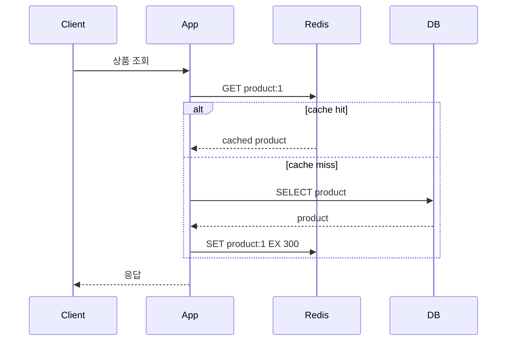
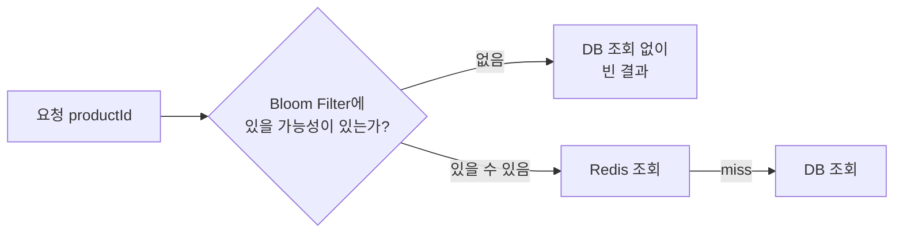
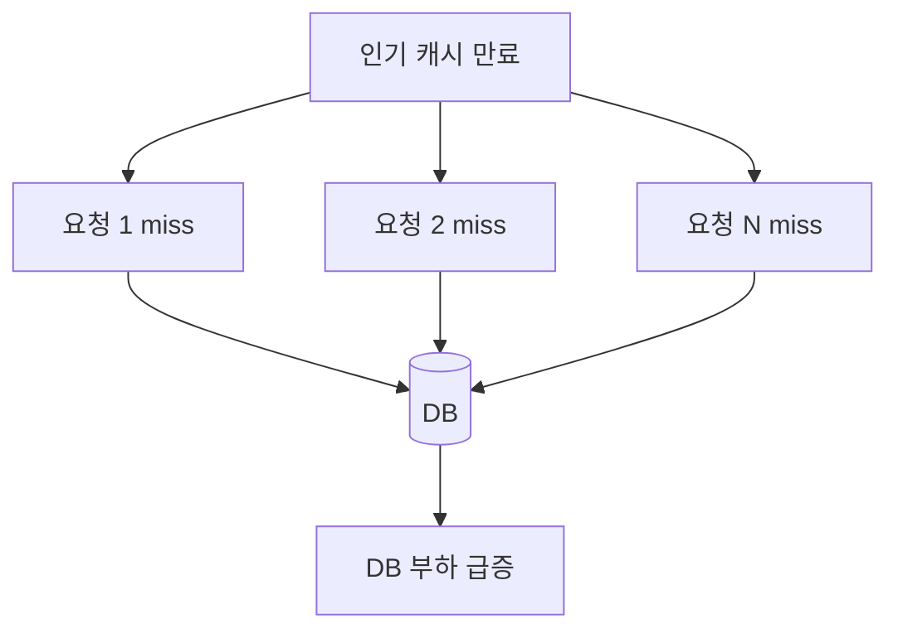
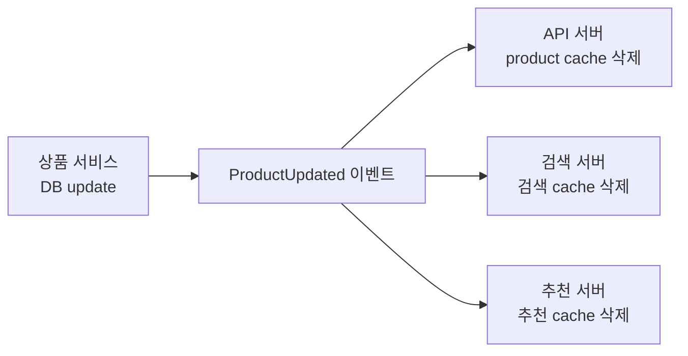

# Redis 캐시 전략과 정합성

Redis 캐시는 **DB 부하를 줄이고 반복 조회를 빠르게 만드는 기술**입니다. 대신 DB와 Redis 사이에 데이터 불일치가 생길 수 있으므로, 캐시 전략과 무효화 기준을 함께 설계해야 합니다.

## 용어

| 용어 | 의미 | 실무에서 보는 포인트 |
|------|------|----------------------|
| Cache Hit | Redis에 값이 있어 DB 조회 없이 응답하는 경우 | 응답 속도와 DB 부하 감소 |
| Cache Miss | Redis에 값이 없어 DB까지 조회하는 경우 | 첫 조회 또는 만료 직후에는 느릴 수 있음 |
| Cache Warming | 서비스 오픈·이벤트 전에 주요 데이터를 미리 Redis에 적재 | 대량 miss를 줄여 초기 트래픽 완화 |
| Cache Penetration | 존재하지 않는 key 요청이 반복되어 매번 DB까지 가는 문제 | null cache, 입력 검증, Bloom Filter |
| Cache Stampede | 인기 key 만료 직후 많은 요청이 동시에 DB로 몰리는 문제 | TTL jitter, mutex, stale cache |
| Cache Avalanche | 많은 key가 비슷한 시간에 만료되는 문제 | TTL 분산, pre-warming |
| Stale Data | Redis에 오래된 값이 남아 있는 상태 | TTL, 무효화 이벤트, 짧은 캐시 |
| Hit Ratio | 전체 조회 중 cache hit 비율 | 캐시 효과의 핵심 지표 |

## 질문

### Redis와 DB I/O가 두 번 생겨도 왜 쓰는가?

Cache Miss가 나면 애플리케이션은 Redis 조회 후 DB까지 조회합니다. 이 경우 단순히 DB만 조회하는 것보다 첫 요청은 느릴 수 있습니다.

그럼에도 Redis를 쓰는 이유는 **첫 조회 비용을 감수하고 이후 반복 조회의 비용을 크게 줄이기 위해서**입니다.

| 구분 | 흐름 | 특징 |
|------|------|------|
| DB만 사용 | App -> DB | 매 요청이 DB 부하로 이어짐 |
| Cache Miss | App -> Redis -> DB -> Redis 저장 | 첫 조회는 느릴 수 있지만 다음 hit 준비 |
| Cache Hit | App -> Redis | DB를 거치지 않아 빠르고 DB 부하 감소 |

### 캐시 정합성은 완벽히 맞춰야 하나?

업무에 따라 다릅니다. 상품 설명은 몇 초 stale을 허용할 수 있지만, 결제 상태·재고 원장은 Redis 캐시만 믿으면 위험합니다.

| 데이터 | stale 허용 | 기준 |
|--------|------------|------|
| 상품 설명 | 조건부 허용 | 짧은 TTL과 수정 시 삭제 |
| 가격 | 낮음 | 변경 시 즉시 무효화 필요 |
| 재고 | 낮음 | DB 원장과 상태 전이 기준 필요 |
| 공지 목록 | 비교적 허용 | TTL 캐시 가능 |

## 캐시 전략

### Cache Aside

애플리케이션이 캐시를 먼저 보고, 없으면 DB에서 읽은 뒤 Redis에 저장합니다.



| 장점 | 단점 |
|------|------|
| 구현이 단순하고 필요한 데이터만 캐시 | 첫 요청은 miss |
| Redis 장애 시 DB fallback 가능 | cache stampede 대비 필요 |

### Read Through

애플리케이션은 캐시 계층에만 요청하고, 캐시 계층이 DB 조회와 적재를 맡는 방식입니다. Spring Cache 같은 추상화가 일부 역할을 대신할 수 있습니다.

| 장점 | 단점 |
|------|------|
| 애플리케이션 코드가 단순해짐 | 캐시 계층 구현·추상화 이해 필요 |
| 캐시 정책을 중앙화하기 쉬움 | 복잡한 도메인 조회에는 부적합할 수 있음 |

### Write Through

쓰기 요청을 Redis와 DB에 동기적으로 함께 반영합니다.

| 장점 | 단점 |
|------|------|
| 쓰기 직후 cache hit 가능 | 쓰기 지연 증가 |
| 캐시와 DB 불일치를 줄임 | 둘 중 하나 실패 시 처리 복잡 |

### Write Behind

Redis에 먼저 쓰고, DB 반영은 나중에 비동기로 처리합니다.

| 장점 | 단점 |
|------|------|
| 쓰기 응답이 빠름 | Redis 장애 시 데이터 유실 위험 |
| 대량 쓰기 완충 가능 | 원장성 데이터에는 위험 |

<div class="danger-box" markdown="1">

**위험**: 결제, 포인트, 재고 원장처럼 유실되면 안 되는 데이터는 Write Behind를 Redis 단독으로 구현하지 않는다. DB, 메시지 브로커, outbox 같은 내구성 있는 경로가 필요하다.

</div>

## Cache Warming

Cache Warming은 서비스 오픈, 배포 직후, 이벤트 시작 전에 예상되는 핵심 데이터를 미리 Redis에 적재하는 방식입니다.

```text
이벤트 시작 전
-> 인기 상품 ID 목록 조회
-> DB에서 상품 상세 조회
-> Redis에 TTL과 함께 저장
-> 이벤트 시작 후 첫 요청부터 cache hit 가능
```

| 언제 쓰는지 | 예시 |
|-------------|------|
| 트래픽이 몰릴 시간이 예측됨 | 특가 이벤트, 티켓 오픈 |
| 인기 데이터가 명확함 | 메인 상품, 카테고리 상위 목록 |
| 첫 요청 지연을 줄이고 싶음 | 공통 설정, 앱 홈 데이터 |

워밍한 key가 동시에 만료되면 다시 Cache Stampede가 생길 수 있으므로 TTL jitter와 함께 설계합니다.

### TTL Randomization

TTL Randomization은 같은 종류의 key라도 만료 시간을 조금씩 다르게 주는 방식입니다.

```text
기본 TTL: 300초
실제 TTL: 300초 + random(0~60초)
```

```java
long ttlSeconds = 300 + ThreadLocalRandom.current().nextLong(0, 61);
redisTemplate.opsForValue().set(key, value, Duration.ofSeconds(ttlSeconds));
```

| 장점 | 주의 |
|------|------|
| 많은 key가 동시에 만료되는 문제를 줄임 | 데이터 stale 시간이 key마다 조금 달라짐 |
| Cache Avalanche 완화 | 너무 큰 random 범위는 최신성 요구와 충돌 |

## Cache Penetration

존재하지 않는 값을 계속 조회해 캐시를 우회하는 문제입니다.

```text
GET product:-1 -> miss
DB 조회 -> 없음
다음 요청도 miss
DB 조회 반복
```

| 방법 | 설명 |
|------|------|
| 입력 검증 | 말이 안 되는 ID를 DB까지 보내지 않음 |
| null cache | 없는 결과도 짧은 TTL로 캐시 |
| Bloom Filter | 존재 가능성이 없는 key를 빠르게 차단 |

### Null Cache

```text
GET product:-1 -> miss
DB 조회 -> 없음
SET product:-1 "__EMPTY__" EX 30
다음 요청 -> Redis에서 빈 결과를 바로 응답
```

없는 값도 캐시에 저장하므로 메모리를 사용합니다. 그래서 일반 데이터보다 TTL을 짧게 잡는 것이 보통입니다.

### Bloom Filter

Bloom Filter는 "확실히 없음"을 빠르게 판단하는 확률적 자료구조입니다. Cache Penetration 공격처럼 존재하지 않는 ID가 반복해서 들어올 때 DB 조회 자체를 줄이는 데 사용할 수 있습니다.



| 특징 | 설명 |
|------|------|
| false negative | 보통 없음. 없다고 판단하면 실제로 없음 |
| false positive | 있을 수 있다고 했지만 실제 DB에는 없을 수 있음 |
| 적합한 곳 | 상품 ID, 게시글 ID처럼 존재 후보가 명확한 도메인 |
| 주의 | 삭제가 잦은 데이터는 filter 갱신 전략 필요 |

## Cache Stampede

인기 key가 동시에 만료되면 많은 요청이 한 번에 DB로 몰립니다.



| 방법 | 설명 |
|------|------|
| TTL jitter | TTL에 랜덤 값을 섞어 동시에 만료되지 않게 함 |
| mutex lock | miss 시 한 요청만 DB 조회 |
| stale cache | 만료된 값이라도 잠시 응답하고 백그라운드 갱신 |
| pre-warming | 배포·이벤트 전 인기 key 미리 적재 |

### Mutex Lock

Cache Miss가 발생했을 때 모든 요청이 DB를 조회하지 않도록 짧은 Redis lock을 잡습니다.

```text
1. cache miss
2. SET lock:cache:product:1 uuid NX PX 3000
3. lock 획득 성공 요청만 DB 조회 후 캐시 적재
4. 나머지 요청은 잠깐 대기하거나 stale 값을 응답
```

lock TTL은 짧게 잡고, DB 조회 실패 시에도 lock이 풀리도록 해야 합니다. lock만 믿고 무한 대기하면 Redis 장애가 API 장애로 번질 수 있습니다.

### Stale-While-Revalidate

만료된 값을 바로 버리지 않고, 잠깐 오래된 값으로 응답하면서 백그라운드에서 갱신하는 방식입니다.

| 장점 | 단점 |
|------|------|
| 인기 key 만료 시 DB 폭주를 줄임 | 사용자가 오래된 값을 볼 수 있음 |
| p99 응답 시간을 안정화 | stale 허용 가능한 데이터에만 사용 |

공지, 상품 설명, 추천 목록처럼 잠깐 오래된 값이 허용되는 데이터에 적합합니다. 가격, 권한, 재고처럼 즉시성이 중요한 데이터에는 조심해야 합니다.

## Cache Avalanche

많은 key가 비슷한 시간에 만료되어 DB로 트래픽이 쏠리는 문제입니다.

| 원인 | 대응 |
|------|------|
| 같은 TTL 일괄 적용 | TTL randomization |
| 배포 후 캐시 초기화 | 단계적 warming |
| Redis 장애로 캐시 전체 소실 | DB fallback, rate limit, circuit breaker |

## Cache Invalidation

캐시 무효화는 보통 쓰기 시점에 처리합니다.

```text
DB update 성공
-> 관련 Redis key 삭제
-> 다음 조회에서 DB 기준으로 다시 캐시 생성
```

| 방식 | 장점 | 단점 |
|------|------|------|
| 삭제 | 단순하고 안전한 기본값 | 다음 조회 miss 발생 |
| 갱신 | 다음 조회가 빠름 | DB와 Redis 동시 갱신 실패 처리 필요 |
| 짧은 TTL | 구현 단순 | stale window 존재 |
| 이벤트 기반 무효화 | 서비스 간 확장 가능 | 메시지 유실·중복 처리 필요 |

### Update 후 Delete

가장 단순한 기본 패턴은 DB를 먼저 수정하고 캐시를 삭제하는 것입니다.

```text
1. DB update
2. Redis DEL product:1
3. 다음 조회에서 DB 기준으로 캐시 재생성
```

DB update 전에 캐시를 먼저 삭제하면, DB update가 끝나기 전 다른 요청이 DB의 옛 값을 읽어 다시 캐시에 넣을 수 있습니다. 그래서 일반적으로는 **DB update 성공 후 cache delete**를 기본값으로 둡니다.

### Double Delete

동시 요청이 많은 환경에서는 DB update 후 캐시를 삭제하고, 짧은 지연 뒤 한 번 더 삭제하는 패턴을 쓰기도 합니다.

```text
1. DB update
2. cache delete
3. 0.5~1초 뒤 cache delete 재시도
```

| 장점 | 단점 |
|------|------|
| DB update 중 옛 값이 다시 캐시되는 위험을 줄임 | 지연 삭제 작업 관리 필요 |
| 구현이 비교적 단순 | 완벽한 정합성을 보장하는 것은 아님 |

Double Delete는 임시 완화책입니다. 정합성이 더 중요하면 outbox 기반 무효화 이벤트, 짧은 TTL, 읽기 경로 검증을 함께 고려합니다.

### 이벤트 기반 무효화

여러 서비스가 같은 데이터를 캐시하면 DB 변경 서비스가 이벤트를 발행하고, 각 서비스가 자기 Redis key를 삭제할 수 있습니다.



이벤트는 중복으로 도착할 수 있으므로 delete 연산처럼 멱등한 처리를 선호합니다. 이벤트 유실이 걱정되면 Kafka와 outbox 패턴을 함께 검토합니다.

## Cache Consistency

DB와 Redis 데이터는 일시적으로 다를 수 있습니다. 중요한 것은 **어느 정도의 불일치를 허용할지**를 업무 기준으로 정하는 것입니다.

| 문제 | 설명 | 대응 |
|------|------|------|
| DB와 Redis 데이터 불일치 | DB는 변경됐지만 캐시가 오래된 상태 | update 후 delete, 짧은 TTL |
| Stale Data | 사용자가 옛 값을 조회 | TTL, stale 허용 범위 명시 |
| Read-After-Write | 쓰기 직후 내 조회에서 옛 값이 보임 | 쓰기 후 해당 key 삭제, 사용자별 캐시 우회 |
| 중복 무효화 | 이벤트 재처리로 delete가 여러 번 발생 | delete는 멱등하므로 안전한 편 |

### Read-After-Write 대응

사용자가 내 정보를 수정한 직후 다시 조회했는데 옛 값이 보이면 신뢰가 크게 떨어집니다.

| 대응 | 설명 |
|------|------|
| 쓰기 후 해당 key 삭제 | 다음 조회에서 DB 기준으로 재생성 |
| 쓰기 응답에는 DB update 결과 반환 | 바로 이어지는 화면은 cache를 거치지 않음 |
| 사용자별 짧은 cache bypass | 수정 직후 몇 초 동안 DB 직접 조회 |
| version key | cache value에 version/updatedAt 포함 후 검증 |

## Local Cache와 Redis Cache 조합

| 계층 | 장점 | 주의 |
|------|------|------|
| Local Cache | 가장 빠름, Redis 부하 감소 | 서버 간 정합성 문제 |
| Redis Cache | 여러 서버가 공유 | 네트워크 RTT 존재 |
| DB | 원본 데이터 | 부하와 지연 비용 |

자주 읽는 설정값처럼 짧은 stale을 허용할 수 있으면 Local Cache + Redis 조합이 효과적입니다. 사용자 권한, 가격처럼 변경 즉시 반영이 필요한 데이터는 무효화 전략이 필요합니다.

## 베스트 프랙티스

| 권장 방식 | 이유 |
|-----------|------|
| Cache Aside를 기본으로 시작 | 구현과 장애 fallback이 단순 |
| 모든 캐시에 TTL 부여 | 무한 증가 방지 |
| TTL jitter 적용 | stampede와 avalanche 완화 |
| null cache는 짧은 TTL | penetration 방지와 메모리 절충 |
| DB update 후 cache delete | stale data를 줄이는 안전한 기본값 |
| Hit Ratio를 API·prefix별로 관찰 | 캐시가 실제 DB 부하를 줄이는지 확인 |

## 실무에서는?

| 사용처 | 설계 기준 |
|--------|-----------|
| 상품 상세 | Cache Aside, 수정 시 삭제, TTL jitter |
| 메인 페이지 | Cache Warming, stale 응답 허용 검토 |
| 존재하지 않는 상품 ID | null cache, 입력 검증 |
| 설정 캐시 | Local Cache + Redis, pub/sub 무효화 가능 |
| 가격·재고 | 짧은 TTL, 원본 DB 기준, 강한 검증 |

---

**관련 파일:**
- [Key 설계와 데이터 관리](./데이터관리.md)
- [트랜잭션과 동시성](./동시성락.md)
- [모니터링과 보안](./모니터링보안.md)
