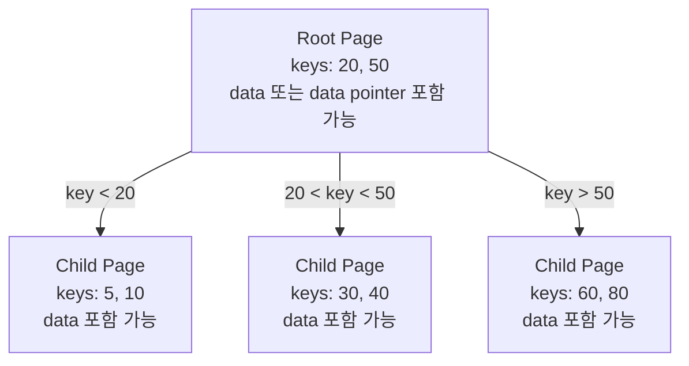
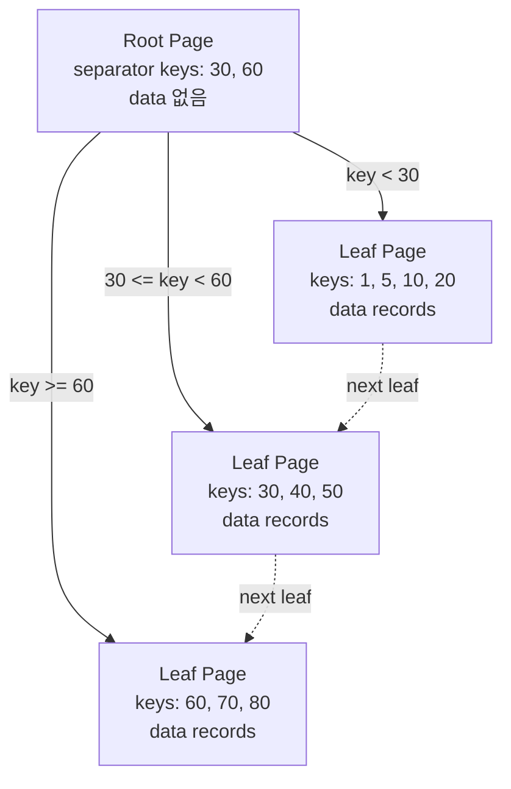
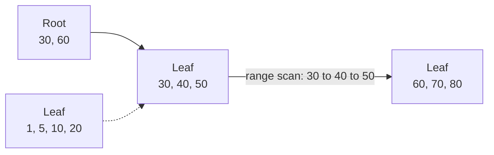
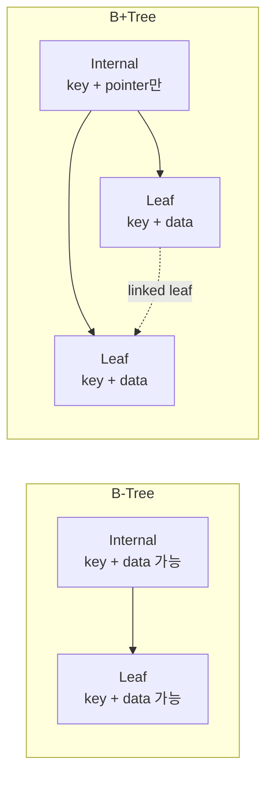

# B-Tree VS B+Tree

<div class="concept-box" markdown="1">

**B-Tree 계열 인덱스**: 디스크나 메모리 페이지 단위로 많은 키를 한 노드에 저장해, 적은 I/O로 원하는 데이터를 찾도록 설계된 균형 트리 자료구조다.

</div>

<div class="tip-box" markdown="1">

**용어 주의**: `B-Tree`의 `-`는 마이너스가 아니라 이름에 들어가는 하이픈이다. `B+Tree`는 B-Tree를 DB 인덱스에 더 잘 맞게 변형한 구조다.

</div>

| 바로가기 | 볼 내용 |
|----------|---------|
| [개요](../인덱스.md) | 인덱스 전체 지도, 상황별 바로가기 |
| [구조와 종류](./구조와종류.md) | B+Tree, 클러스터/보조 인덱스, 물리 동작 |
| [B-Tree VS B+Tree](./B-Tree.md) | B-Tree와 B+Tree 구조 차이, DB가 B+Tree를 쓰는 이유 |
| [설계와 사용법](./설계와사용법.md) | 커버링 인덱스, 카디널리티, CREATE/ALTER/DROP |
| [쿼리 패턴](./쿼리패턴.md) | 연산자별 동작, 복합 인덱스, ESR 규칙 |
| [운영과 튜닝](./운영과튜닝.md) | 고급 기법, 힌트, 통계, 모니터링, 베스트 프랙티스 |

---

## 왜 쓰는지

DB 인덱스는 메모리 안에서만 도는 자료구조가 아니라, 디스크의 페이지를 읽고 쓰는 구조다. 데이터가 커질수록 성능 병목은 CPU 비교 횟수보다 **몇 개의 페이지를 읽는가**에 가까워진다.

B-Tree 계열은 이런 문제를 줄이기 위해 만들어졌다.

| 문제 | B-Tree 계열이 해결하는 방식 |
|------|----------------------------|
| 데이터가 많아지면 선형 탐색이 느림 | 트리 높이를 낮춰 `O(log n)` 탐색 |
| 디스크 I/O가 비쌈 | 한 노드에 많은 키를 넣어 한 번의 페이지 읽기로 많은 분기 처리 |
| 삽입·삭제 후 정렬 유지가 필요 | 노드 분할·병합으로 균형 유지 |
| 범위 검색이 자주 발생 | B+Tree는 리프 노드를 연결해 순차 스캔 최적화 |

---

## 어떻게 쓰는지

개발자가 직접 B+Tree를 만드는 경우는 거의 없다. MySQL InnoDB에서 일반 인덱스를 만들면 내부적으로 B+Tree 계열 구조가 사용된다.

```sql
-- InnoDB의 일반 인덱스는 B+Tree 계열로 저장된다.
CREATE INDEX idx_member_email ON member (email);

-- PRIMARY KEY는 클러스터 인덱스 B+Tree가 된다.
CREATE TABLE member (
    id BIGINT AUTO_INCREMENT PRIMARY KEY,
    email VARCHAR(100) NOT NULL,
    name VARCHAR(50)
) ENGINE=InnoDB;
```

개발자가 알아야 할 포인트는 문법이 아니라, **이 인덱스가 어떤 방식으로 읽히는지**다.

```sql
-- 포인트 탐색: 루트 -> 내부 노드 -> 리프 노드
SELECT * FROM member WHERE id = 10;

-- 범위 탐색: 시작 리프를 찾은 뒤 리프 노드를 순서대로 스캔
SELECT * FROM orders
WHERE created_at >= '2026-01-01'
  AND created_at < '2026-02-01';
```

---

## 먼저 알아야 할 용어

| 용어 | 설명 |
|------|------|
| 노드(Node) | 트리에서 키를 담는 단위. DB에서는 보통 페이지와 연결해서 이해한다. |
| 페이지(Page) | DB가 디스크에서 읽고 쓰는 기본 단위. InnoDB 기본 페이지 크기는 16KB다. |
| 키(Key) | 인덱스에 정렬되어 저장되는 값. 예: `id`, `email`, `created_at`. |
| 포인터(Pointer) | 다음 자식 노드나 실제 데이터 위치를 가리키는 정보. |
| 팬아웃(Fan-out) | 한 노드가 가질 수 있는 자식 노드 수. 팬아웃이 클수록 트리 높이가 낮아진다. |
| 리프 노드(Leaf Node) | 트리의 가장 아래 노드. B+Tree에서는 실제 데이터가 리프 노드에 모인다. |

```text
한 페이지 안의 인덱스 노드 개념

┌──────────────────────────────────────────────┐
│ Page                                         │
│  key1 | pointer1 | key2 | pointer2 | key3    │
└──────────────────────────────────────────────┘

페이지 하나를 읽으면 여러 키를 한 번에 비교할 수 있다.
그래서 B-Tree 계열은 이진 트리보다 디스크 I/O에 유리하다.
```

<div class="tip-box" markdown="1">

**왜 이진 트리가 아닌가?** 이진 트리는 한 노드에서 왼쪽/오른쪽 2개로만 나뉜다. DB 인덱스는 디스크 페이지 하나를 읽는 비용이 크기 때문에, 한 페이지 안에 많은 키를 넣어 한 번에 여러 방향으로 분기하는 B-Tree 계열이 더 적합하다.

</div>

---

## B-Tree 구조

B-Tree는 하나의 노드에 여러 키와 여러 자식 포인터를 저장한다. 데이터 또는 데이터 포인터도 내부 노드와 리프 노드 모두에 저장될 수 있다.

```text
B-Tree 예시

            [20 | 50]
          /     |      \
   [5 | 10]  [30 | 40]  [60 | 80]
      데이터     데이터      데이터

내부 노드에도 키와 데이터가 함께 있을 수 있다.
검색은 내부 노드에서 끝날 수도 있고, 리프 노드까지 내려갈 수도 있다.
```



### 노드 안에는 무엇이 들어가나

```text
B-Tree 내부 노드 예시

┌────────────────────────────────────────────────────┐
│ child ptr │ key=20 │ data ptr │ child ptr │ key=50 │
└────────────────────────────────────────────────────┘

key와 함께 실제 데이터 또는 데이터 위치가 내부 노드에도 들어갈 수 있다.
따라서 검색 대상 key가 내부 노드에 있으면 아래로 더 내려가지 않아도 된다.
```

### 탐색 과정

```text
찾는 값: 50

1. 루트 [20 | 50] 확인
2. 루트 노드에서 50 발견
3. 검색 종료
```

B-Tree는 검색 대상이 내부 노드에 있으면 리프까지 내려가지 않아도 된다. 그래서 단일 키 조회만 보면 B+Tree보다 빠르게 끝나는 경우가 생길 수 있다.


### 범위 검색은 어떻게 되나

B-Tree도 키가 정렬되어 있으므로 범위 검색이 가능하다. 다만 데이터가 내부 노드와 리프 노드에 흩어질 수 있어, 범위 내 다음 데이터를 찾는 흐름이 B+Tree보다 단순하지 않다.

```text
범위: 30 ~ 70

1. 30이 있는 위치를 찾는다.
2. 현재 노드에서 다음 키를 확인한다.
3. 노드 안에 다음 키가 없으면 부모 또는 다른 자식 노드로 이동한다.
4. 70을 넘을 때까지 반복한다.

즉, 범위 검색 도중 트리 위아래 이동이 섞일 수 있다.
```

### B-Tree의 특징

- 모든 리프 노드의 깊이가 같다.
- 한 노드에 여러 키를 저장해 트리 높이를 낮춘다.
- 내부 노드에도 실제 데이터 또는 데이터 포인터가 들어갈 수 있다.
- 검색이 내부 노드에서 끝날 수 있다.
- 범위 검색 시 다음 값을 찾기 위해 트리를 다시 오르내리는 비용이 생길 수 있다.

---

## B+Tree 구조

B+Tree는 B-Tree와 다르게 **실제 데이터는 리프 노드에만 저장**한다. 내부 노드는 길 안내용 키와 자식 포인터만 가진다.

```text
B+Tree 예시

             [30 | 60]                 내부 노드: 길 안내
            /    |    \
 [1,5,10,20] -> [30,40,50] -> [60,70,80]
     데이터          데이터          데이터
         리프 노드끼리 연결 리스트로 이어짐
```



### 노드 안에는 무엇이 들어가나

```text
B+Tree 내부 노드

┌────────────────────────────────────────────┐
│ child ptr │ key=30 │ child ptr │ key=60    │
└────────────────────────────────────────────┘

내부 노드는 길 안내만 한다.
실제 데이터는 없다.

B+Tree 리프 노드

┌──────────────────────────────────────────────────────┐
│ key=30 + data │ key=40 + data │ key=50 + data │ next │
└──────────────────────────────────────────────────────┘

리프 노드에 실제 데이터가 모이고, 다음 리프 노드로 이어지는 포인터가 있다.
```

### 탐색 과정

```text
찾는 값: 40

1. 루트 [30 | 60] 확인
2. 30보다 크거나 같고 60보다 작으므로 가운데 리프로 이동
3. 내부 노드는 길 안내만 하므로 계속 리프까지 내려감
4. 리프 노드에서 40 확인
```

B+Tree는 검색이 항상 리프 노드에서 끝난다. 대신 내부 노드가 가벼워져 더 많은 키를 담을 수 있고, 리프 노드가 연결되어 범위 검색이 빠르다.


### 범위 검색은 어떻게 되나

B+Tree는 범위 시작점만 찾으면 이후에는 리프 노드를 옆으로 이동하면 된다.

```text
범위: 30 ~ 70

1. 루트에서 30이 있는 리프 노드를 찾는다.
2. 리프 노드 안에서 30부터 순서대로 읽는다.
3. 다음 리프 노드로 이동한다.
4. 70을 넘을 때까지 순차적으로 읽는다.
```



<div class="success-box" markdown="1">

**핵심**: B+Tree의 장점은 "한 건을 찾을 때 무조건 더 빠르다"가 아니라, **시작점을 찾은 뒤 정렬된 리프 노드를 옆으로 쭉 읽을 수 있다**는 점이다. 이 구조가 `BETWEEN`, `ORDER BY`, `LIMIT`, 페이징에 강하다.

</div>

### B+Tree의 특징

- 실제 데이터는 리프 노드에만 저장한다.
- 내부 노드는 키와 자식 포인터만 저장한다.
- 모든 검색은 리프 노드까지 내려간다.
- 리프 노드끼리 연결되어 있어 범위 검색과 정렬 조회가 빠르다.
- 내부 노드에 더 많은 키를 담을 수 있어 트리 높이가 낮아지기 쉽다.

---

## B-Tree VS B+Tree

| 비교 | B-Tree | B+Tree |
|------|--------|--------|
| 데이터 저장 위치 | 내부 노드와 리프 노드 모두 가능 | 리프 노드에만 저장 |
| 내부 노드 역할 | 키 + 데이터 또는 데이터 포인터 | 길 안내용 키 + 자식 포인터 |
| 검색 종료 위치 | 내부 노드 또는 리프 노드 | 항상 리프 노드 |
| 단건 조회 | 내부 노드에서 찾으면 빠를 수 있음 | 항상 리프까지 내려감 |
| 범위 조회 | 다음 값을 찾기 위한 이동이 복잡 | 리프 노드 연결로 순차 스캔이 쉬움 |
| 팬아웃 | 내부 노드가 상대적으로 무거움 | 내부 노드가 가벼워 팬아웃이 큼 |
| 트리 높이 | 상대적으로 높아질 수 있음 | 상대적으로 낮아지기 쉬움 |
| DB 인덱스 적합성 | 단건 조회 중심이면 가능 | 범위·정렬·대량 조회에 더 적합 |

<div class="success-box" markdown="1">

**핵심**: DB 인덱스에서는 단건 조회만큼이나 범위 조회, 정렬, 페이징, JOIN이 중요하다. 그래서 MySQL InnoDB는 B-Tree라고 통칭되지만 실제로는 B+Tree 계열 구조를 사용한다.

</div>



---

## 왜 DB는 B+Tree를 선호하는가

### 1. 트리 높이가 낮아진다

DB 인덱스 노드는 보통 페이지 단위로 저장된다. InnoDB 기본 페이지 크기는 16KB다. 내부 노드에 실제 데이터가 없고 키와 포인터만 있으면, 한 페이지에 더 많은 키를 담을 수 있다.

```text
한 내부 노드에 담을 수 있는 키가 많음
  -> 한 번의 페이지 읽기로 더 많은 분기 가능
  -> 트리 높이 감소
  -> 디스크 I/O 감소
```

```text
팬아웃이 100인 경우

높이 1: 100개 방향
높이 2: 100 * 100 = 10,000개 방향
높이 3: 100 * 100 * 100 = 1,000,000개 방향

실제 DB 인덱스는 한 페이지에 훨씬 많은 키를 담을 수 있다.
트리 높이가 낮다는 것은 곧 읽어야 하는 페이지 수가 적다는 뜻이다.
```

### 2. 범위 검색이 빠르다

```sql
SELECT *
FROM orders
WHERE created_at >= '2026-01-01'
  AND created_at < '2026-02-01'
ORDER BY created_at;
```

B+Tree는 시작 리프 노드만 찾으면, 이후에는 연결된 리프 노드를 순서대로 읽으면 된다.

```text
created_at 시작 지점 탐색
  -> 2026-01-01이 있는 리프 도착
  -> 다음 리프 -> 다음 리프 -> 다음 리프
  -> 범위가 끝날 때까지 순차 스캔
```


### 3. 정렬 조회와 페이징에 유리하다

인덱스 키가 정렬된 상태로 리프 노드에 저장되므로 `ORDER BY`, `LIMIT`과 잘 맞는다.

```sql
SELECT id, created_at
FROM orders
WHERE member_id = 10
ORDER BY created_at DESC
LIMIT 20;
```

복합 인덱스가 `(member_id, created_at)` 순서라면, 특정 회원의 주문을 이미 정렬된 인덱스 순서로 읽을 수 있다.

### 4. 디스크 I/O 패턴이 좋아진다

B+Tree는 리프 노드 연결 덕분에 범위 스캔이 순차 I/O에 가까워진다. 반면 보조 인덱스에서 `SELECT *`를 하면 리프에서 PK를 찾은 뒤 클러스터 인덱스를 다시 찾아가므로 랜덤 I/O가 늘 수 있다.

관련 내용은 [랜덤 I/O VS 순차 I/O](./운영과튜닝.md#랜덤-io-vs-순차-io)에서 이어서 보면 좋다.

---

## InnoDB에서 리프 노드는 무엇을 들고 있나

MySQL InnoDB에서는 같은 B+Tree라도 클러스터 인덱스와 보조 인덱스의 리프 노드 내용이 다르다.

### 클러스터 인덱스

```text
PRIMARY KEY(id) B+Tree

Leaf Page
┌──────────────────────────────────────────────────────┐
│ id=1 + row 전체 │ id=2 + row 전체 │ id=3 + row 전체 │
└──────────────────────────────────────────────────────┘
```

클러스터 인덱스의 리프 노드에는 실제 데이터 행 전체가 들어간다. 그래서 PK로 찾으면 리프 도착 즉시 행 전체를 얻을 수 있다.

### 보조 인덱스

```text
INDEX(email) B+Tree

Leaf Page
┌──────────────────────────────────────────────────────┐
│ email=a@test + PK=1 │ email=b@test + PK=2 │ ...      │
└──────────────────────────────────────────────────────┘
                         │
                         ▼
                  PRIMARY KEY B+Tree 재탐색
```

보조 인덱스의 리프 노드에는 실제 행 전체가 아니라 **인덱스 키 + PK 값**이 들어간다. 그래서 필요한 컬럼이 보조 인덱스에 없으면 PK로 클러스터 인덱스를 다시 조회한다. 이게 [Double Lookup](./구조와종류.md#double-lookup)이다.


---

## 언제 쓰는지

| 상황 | 봐야 할 관점 |
|------|--------------|
| 인덱스가 왜 빠른지 이해하고 싶을 때 | 트리 높이, 팬아웃, 페이지 I/O |
| 범위 검색이 많은 쿼리를 튜닝할 때 | B+Tree 리프 노드 연결 구조 |
| `ORDER BY`, `LIMIT` 성능을 볼 때 | 인덱스 정렬 순서와 리프 스캔 |
| `SELECT *`가 느릴 때 | 보조 인덱스 리프와 Double Lookup |
| PK 설계를 할 때 | 클러스터 인덱스 리프 노드의 물리 정렬 |

---

## 장점

### B-Tree 장점

- 내부 노드에서 검색이 끝날 수 있어 단건 조회가 빠르게 끝나는 경우가 있다.
- 내부 노드와 리프 노드에 데이터가 분산되어 중복 저장이 상대적으로 적을 수 있다.
- 일반적인 정렬 자료구조로도 이해하기 쉽다.

### B+Tree 장점

- 내부 노드가 가벼워 팬아웃이 커지고 트리 높이가 낮아진다.
- 리프 노드가 연결되어 범위 검색, 정렬 조회, 페이징에 유리하다.
- 모든 데이터가 리프에 모여 있어 순차 접근 패턴을 만들기 쉽다.
- DBMS가 페이지 캐시와 함께 최적화하기 좋다.

---

## 단점

### B-Tree 단점

- 내부 노드에 데이터가 들어가면 한 노드에 담을 수 있는 키 수가 줄어든다.
- 범위 검색 시 다음 데이터를 찾는 흐름이 B+Tree보다 복잡하다.
- DB의 `BETWEEN`, `ORDER BY`, `LIMIT` 같은 패턴에는 B+Tree보다 덜 적합하다.

### B+Tree 단점

- 단건 조회도 항상 리프 노드까지 내려간다.
- 내부 노드의 키가 리프 노드에도 다시 나타나므로 키 중복이 생긴다.
- 삽입·삭제 시 리프 노드 분할·병합과 부모 노드 갱신이 필요하다.

---

## 특징

| 특징 | 설명 |
|------|------|
| 균형 트리 | 삽입·삭제 후에도 모든 리프 깊이를 같게 유지한다. |
| 높은 팬아웃 | 이진 트리처럼 2개로만 갈라지지 않고, 한 노드에서 많은 자식으로 분기한다. |
| 페이지 친화적 | 노드 하나를 DB 페이지 하나처럼 다룰 수 있어 디스크 I/O를 줄인다. |
| 정렬 유지 | 키가 정렬된 상태로 저장되어 범위 조건과 정렬에 활용된다. |
| 쓰기 비용 존재 | 삽입·삭제 시 노드 분할, 병합, 재분배가 발생할 수 있다. |

---

## 주의할 점

<div class="warning-box" markdown="1">

**B-Tree라는 말이 항상 순수 B-Tree를 뜻하지는 않는다.** DB 문서나 실무 대화에서 "B-Tree 인덱스"라고 말해도, 실제 구현은 B+Tree인 경우가 많다. MySQL InnoDB도 일반적으로 B+Tree 계열로 이해하면 된다.

</div>

- `B+Tree라서 무조건 빠르다`가 아니라, 조건이 인덱스 순서와 맞아야 빠르다.
- 리프 노드가 연결되어 있어도 시작 지점을 못 찾으면 Full Scan이 될 수 있다.
- 보조 인덱스는 리프 노드에서 끝나지 않고 PK로 클러스터 인덱스를 다시 조회할 수 있다.
- UUID처럼 무작위 PK를 쓰면 클러스터 인덱스 리프 페이지 분할이 잦아질 수 있다.

---

## 베스트 프랙티스

<div class="success-box" markdown="1">

**B+Tree를 의식한 인덱스 설계**

- `WHERE`에서 등호 조건으로 좁히는 컬럼을 앞에 둔다.
- 범위 조건은 뒤쪽에 배치한다.
- `ORDER BY` 방향과 복합 인덱스 컬럼 순서를 맞춘다.
- `SELECT *`를 줄이고 필요한 컬럼만 조회해 커버링 인덱스를 노린다.
- PK는 가능하면 짧고, 변하지 않고, 순차 증가하는 값으로 둔다.

</div>

---

## 실무에서는?

| 실무 질문 | 판단 방법 |
|-----------|-----------|
| 왜 인덱스가 빠른가? | 트리 높이가 낮아 읽는 페이지 수가 줄어든다. |
| 왜 MySQL은 B+Tree를 쓰는가? | 범위 검색, 정렬, 페이징, JOIN에 유리하기 때문이다. |
| 왜 `LIKE '%값'`은 느린가? | B+Tree는 왼쪽부터 정렬되어 있어 시작 지점을 찾을 수 없다. |
| 왜 `SELECT *`가 문제인가? | 보조 인덱스만으로 끝나지 않고 클러스터 인덱스를 다시 조회한다. |
| 왜 UUID PK가 불리한가? | 무작위 삽입으로 B+Tree 리프 중간에 끼어들어 페이지 분할이 잦아진다. |

---

## 관련 문서

- [인덱스 구조와 종류](./구조와종류.md) — 클러스터 인덱스, 보조 인덱스, 물리 동작
- [인덱스 설계와 사용법](./설계와사용법.md) — 커버링 인덱스, 카디널리티, CRUD
- [인덱스 쿼리 패턴](./쿼리패턴.md) — 연산자별 인덱스 사용 여부와 복합 인덱스
- [인덱스 운영과 튜닝](./운영과튜닝.md) — 손익분기점, 랜덤 I/O, 모니터링
