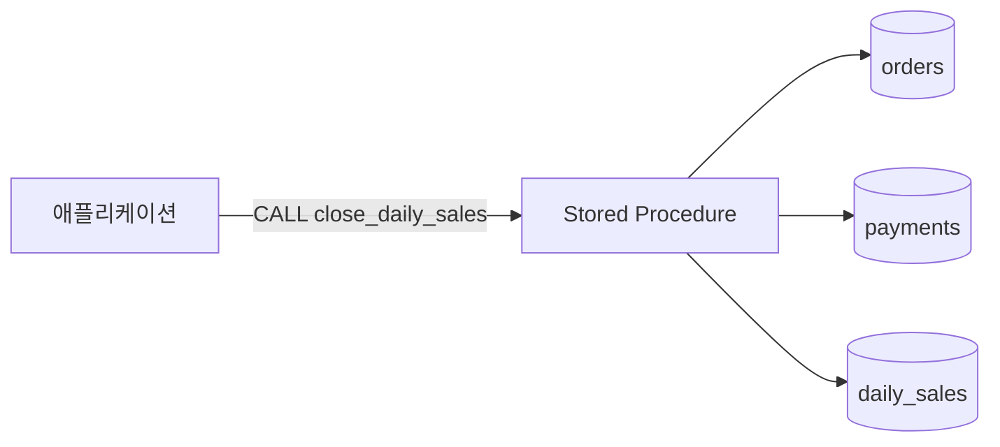
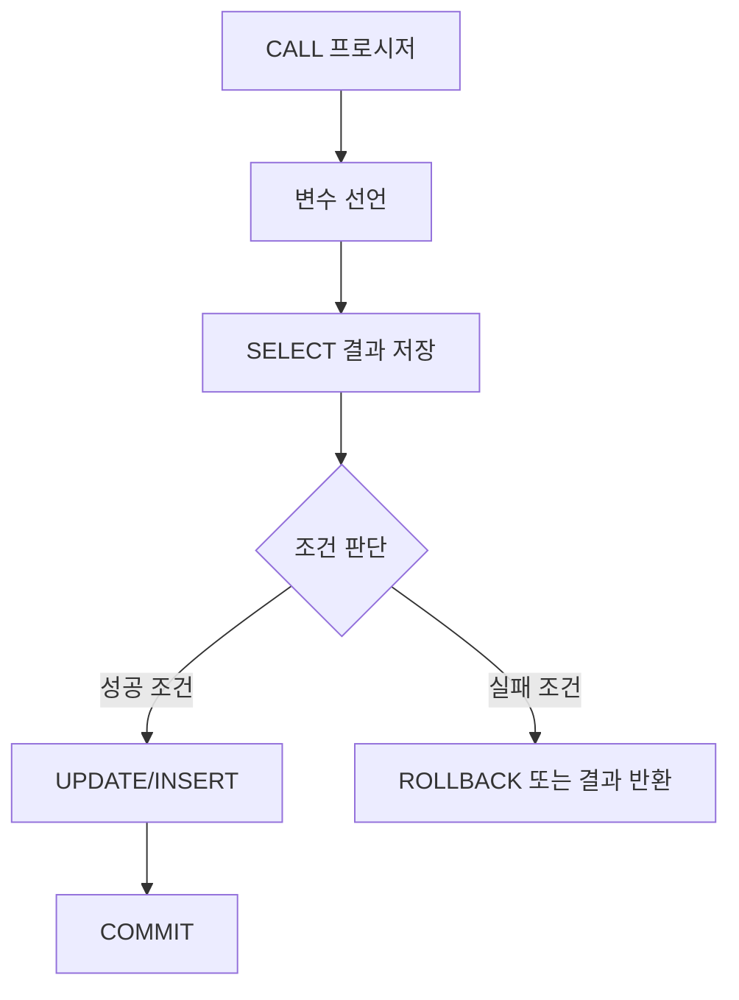
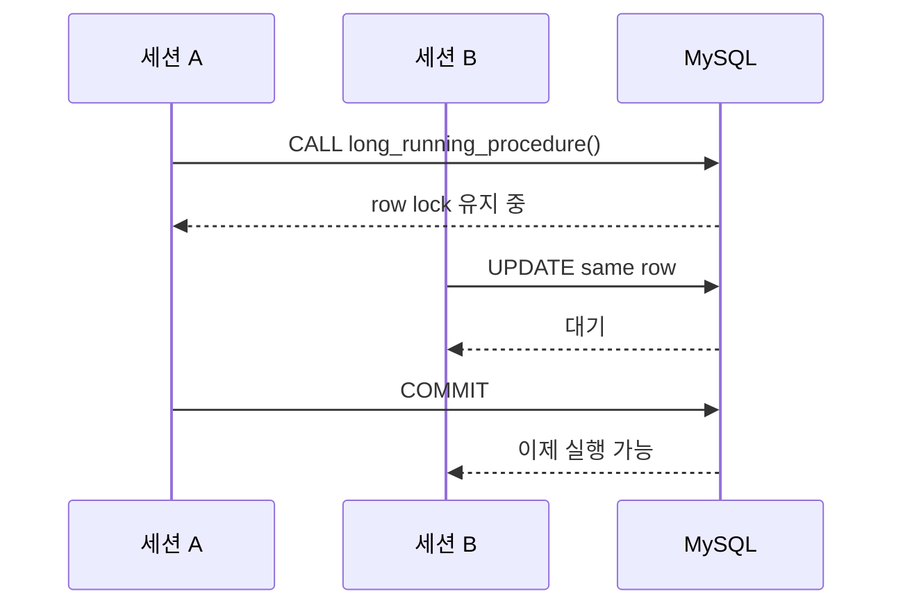

# 프로시저 (Stored Procedure)

## 왜 쓰는지

애플리케이션에서 여러 SQL을 순서대로 실행해야 하는 경우가 있다.

```text
1. 주문 상태 확인
2. 재고 차감
3. 결제 상태 변경
4. 이력 저장
5. 결과 반환
```

이 작업을 애플리케이션에서 SQL 여러 번으로 처리하면 DB와 애플리케이션 사이를 여러 번 왕복한다. 프로시저는 이런 여러 SQL과 제어 흐름을 DB 안에 저장해두고, 애플리케이션은 이름으로 호출한다.

<div class="concept-box" markdown="1">

**프로시저**: DB에 저장해두고 `CALL`로 실행하는 SQL 코드 묶음. 여러 SQL, 조건문, 반복문, 변수, 트랜잭션 처리를 하나의 이름으로 재사용할 수 있다.

</div>

프로시저는 "복잡한 로직을 무조건 DB에 넣는 기능"이 아니다. 실무에서는 **DB 안에서 처리하는 것이 더 단순하거나 안전한 작업**에 제한적으로 사용한다.



그림처럼 애플리케이션은 프로시저 이름만 호출하고, 프로시저 내부에서 여러 테이블을 읽고 변경한다.

## 어떻게 쓰는지

### 기본 생성과 호출

MySQL에서 프로시저를 만들 때는 `CREATE PROCEDURE`를 사용한다.

```sql
DELIMITER //

CREATE PROCEDURE get_member_orders(IN p_member_id BIGINT)
BEGIN
    SELECT
        o.id,
        o.status,
        o.total_amount,
        o.created_at
    FROM orders o
    WHERE o.member_id = p_member_id
    ORDER BY o.created_at DESC;
END //

DELIMITER ;
```

호출은 `CALL`로 한다.

```sql
CALL get_member_orders(1);
```

<div class="tip-box" markdown="1">

**DELIMITER는 MySQL 클라이언트 명령이다.**

프로시저 내부에는 `;`가 여러 번 들어간다. 그래서 클라이언트가 중간에 문장이 끝났다고 착각하지 않도록 임시로 종료 기호를 `//`로 바꾸는 것이다. 프로시저 문법 자체의 일부는 아니다.

</div>

### 수정과 삭제

MySQL은 프로시저 본문을 `ALTER PROCEDURE`로 직접 교체하는 방식이 제한적이다. 보통 삭제 후 다시 생성한다.

```sql
DROP PROCEDURE IF EXISTS get_member_orders;

DELIMITER //

CREATE PROCEDURE get_member_orders(IN p_member_id BIGINT)
BEGIN
    SELECT
        o.id,
        o.status,
        o.total_amount,
        o.created_at
    FROM orders o
    WHERE o.member_id = p_member_id
    ORDER BY o.created_at DESC
    LIMIT 100;
END //

DELIMITER ;
```

목록과 정의 확인은 아래처럼 한다.

```sql
SHOW PROCEDURE STATUS WHERE Db = DATABASE();
SHOW CREATE PROCEDURE get_member_orders;
```

### 파라미터: IN, OUT, INOUT

| 구분 | 의미 | 예시 |
|------|------|------|
| `IN` | 호출자가 값을 전달 | 회원 ID, 주문 ID |
| `OUT` | 프로시저가 값을 반환 | 처리 결과 코드 |
| `INOUT` | 값을 받고 변경해서 반환 | 누적 카운터 |

```sql
DELIMITER //

CREATE PROCEDURE calculate_order_total(
    IN p_order_id BIGINT,
    OUT p_total_amount DECIMAL(15, 2)
)
BEGIN
    SELECT COALESCE(SUM(oi.price * oi.quantity), 0)
    INTO p_total_amount
    FROM order_items oi
    WHERE oi.order_id = p_order_id;
END //

DELIMITER ;
```

호출 예시:

```sql
CALL calculate_order_total(1001, @total_amount);
SELECT @total_amount;
```

### 변수와 SELECT INTO

프로시저 내부 변수는 `DECLARE`로 선언하고, 조회 결과를 변수에 담을 때는 `SELECT ... INTO`를 사용한다.

```sql
DELIMITER //

CREATE PROCEDURE get_order_status(
    IN p_order_id BIGINT,
    OUT p_status VARCHAR(20)
)
BEGIN
    DECLARE v_exists_count INT DEFAULT 0;

    SELECT COUNT(*)
    INTO v_exists_count
    FROM orders
    WHERE id = p_order_id;

    IF v_exists_count = 0 THEN
        SET p_status = 'NOT_FOUND';
    ELSE
        SELECT status
        INTO p_status
        FROM orders
        WHERE id = p_order_id;
    END IF;
END //

DELIMITER ;
```

<div class="warning-box" markdown="1">

**주의**: `SELECT ... INTO`는 결과가 1행이어야 한다. 여러 행이 나오면 오류가 발생하고, 0행이면 `NOT FOUND` 상황을 고려해야 한다. 조건을 PK나 UNIQUE 기준으로 명확히 잡는 것이 안전하다.

</div>

### 조건문

프로시저에서는 `IF`, `ELSEIF`, `ELSE`를 사용할 수 있다.

```sql
DELIMITER //

CREATE PROCEDURE decide_member_grade(
    IN p_total_amount DECIMAL(15, 2),
    OUT p_grade VARCHAR(20)
)
BEGIN
    IF p_total_amount >= 1000000 THEN
        SET p_grade = 'VIP';
    ELSEIF p_total_amount >= 300000 THEN
        SET p_grade = 'GOLD';
    ELSE
        SET p_grade = 'BASIC';
    END IF;
END //

DELIMITER ;
```

### 반복문

MySQL 프로시저에서는 `WHILE`, `REPEAT`, `LOOP`를 사용할 수 있다. 다만 대량 데이터를 한 행씩 반복 처리하면 느려지기 쉽다.

```sql
DELIMITER //

CREATE PROCEDURE insert_test_numbers(IN p_count INT)
BEGIN
    DECLARE v_i INT DEFAULT 1;

    WHILE v_i <= p_count DO
        INSERT INTO test_numbers (number_value) VALUES (v_i);
        SET v_i = v_i + 1;
    END WHILE;
END //

DELIMITER ;
```

<div class="warning-box" markdown="1">

**주의**: SQL은 집합 처리에 강하다. 반복문으로 1건씩 처리하기 전에 `INSERT INTO ... SELECT`, `UPDATE ... WHERE`, `JOIN UPDATE` 같은 집합 기반 쿼리로 바꿀 수 있는지 먼저 확인한다.

</div>

### 트랜잭션 처리

프로시저 안에서도 `START TRANSACTION`, `COMMIT`, `ROLLBACK`을 사용할 수 있다.

```sql
DELIMITER //

CREATE PROCEDURE transfer_money(
    IN p_from_account_id BIGINT,
    IN p_to_account_id BIGINT,
    IN p_amount DECIMAL(15, 2),
    OUT p_result VARCHAR(20)
)
BEGIN
    DECLARE v_not_found BOOLEAN DEFAULT FALSE;
    DECLARE v_from_balance DECIMAL(15, 2);
    DECLARE v_to_account_id BIGINT;

    DECLARE CONTINUE HANDLER FOR NOT FOUND
        SET v_not_found = TRUE;

    DECLARE EXIT HANDLER FOR SQLEXCEPTION
    BEGIN
        ROLLBACK;
        SET p_result = 'FAILED';
    END;

    IF p_amount <= 0 THEN
        SET p_result = 'INVALID_AMOUNT';
    ELSE
        START TRANSACTION;

        SELECT balance
        INTO v_from_balance
        FROM accounts
        WHERE id = p_from_account_id
        FOR UPDATE;

        IF v_not_found THEN
            SET p_result = 'FROM_NOT_FOUND';
            ROLLBACK;
        ELSE
            SET v_not_found = FALSE;

            SELECT id
            INTO v_to_account_id
            FROM accounts
            WHERE id = p_to_account_id
            FOR UPDATE;

            IF v_not_found THEN
                SET p_result = 'TO_NOT_FOUND';
                ROLLBACK;
            ELSEIF v_from_balance < p_amount THEN
                SET p_result = 'NO_BALANCE';
                ROLLBACK;
            ELSE
                UPDATE accounts
                SET balance = balance - p_amount
                WHERE id = p_from_account_id;

                UPDATE accounts
                SET balance = balance + p_amount
                WHERE id = p_to_account_id;

                INSERT INTO account_transfer_history (
                    from_account_id,
                    to_account_id,
                    amount,
                    created_at
                ) VALUES (
                    p_from_account_id,
                    p_to_account_id,
                    p_amount,
                    NOW()
                );

                COMMIT;
                SET p_result = 'SUCCESS';
            END IF;
        END IF;
    END IF;
END //

DELIMITER ;
```

호출 예시:

```sql
CALL transfer_money(1, 2, 10000, @result);
SELECT @result;
```

이 예시에서 `FOR UPDATE`는 계좌 행을 잠근다. 동시에 같은 계좌에서 출금하는 요청이 들어오면 앞 트랜잭션이 끝날 때까지 기다린다. `NOT FOUND` 핸들러는 조회 대상 계좌가 없을 때 결과 코드를 세팅하기 위한 장치다.

### 예외 처리 HANDLER

프로시저 내부 오류는 `DECLARE ... HANDLER`로 처리할 수 있다.

```sql
DECLARE EXIT HANDLER FOR SQLEXCEPTION
BEGIN
    ROLLBACK;
    SET p_result = 'FAILED';
END;
```

| HANDLER | 의미 |
|---------|------|
| `EXIT HANDLER` | 오류 처리 후 현재 블록 종료 |
| `CONTINUE HANDLER` | 오류 처리 후 다음 문장 계속 실행 |
| `SQLEXCEPTION` | SQL 오류 전반 |
| `NOT FOUND` | 커서 fetch 결과가 없거나 SELECT 결과 없음 |

<div class="danger-box" markdown="1">

**위험**: `CONTINUE HANDLER`를 잘못 쓰면 오류가 났는데도 다음 로직이 계속 실행된다. 돈, 재고, 정산처럼 정합성이 중요한 작업은 실패 시 중단과 롤백이 기본이다.

</div>

## 언제 쓰는지

| 상황 | 프로시저 적합도 | 이유 |
|------|----------------|------|
| 여러 SQL을 항상 같은 순서로 실행 | 높음 | DB 내부에서 하나의 작업처럼 재사용 가능 |
| 대량 배치 집계 | 높음 | DB 가까이에서 집합 처리 가능 |
| 운영성 관리 작업 | 높음 | 관리자용 반복 작업을 표준화 |
| 트랜잭션과 잠금을 DB에서 명확히 제어 | 조건부 | 신중히 쓰면 정합성 확보에 도움 |
| 단순 CRUD | 낮음 | 애플리케이션 코드가 더 명확함 |
| 자주 바뀌는 비즈니스 정책 | 낮음 | 배포·버전 관리가 어려움 |
| 외부 API 호출이 필요한 로직 | 낮음 | DB가 담당할 일이 아님 |
| 복잡한 화면 조립 로직 | 낮음 | 애플리케이션 계층이 적합 |

## 장점

| 장점 | 설명 |
|------|------|
| 네트워크 왕복 감소 | 여러 SQL을 `CALL` 한 번으로 실행 |
| 재사용성 | 여러 애플리케이션에서 같은 DB 작업 사용 |
| 권한 제어 | 테이블 직접 권한 없이 프로시저 실행 권한만 줄 수 있음 |
| 트랜잭션 묶음 | DB 내부에서 여러 변경을 하나의 흐름으로 관리 |
| 데이터 가까운 처리 | 대량 집계나 보정 작업을 DB 내부에서 처리 |

## 단점

| 단점 | 설명 |
|------|------|
| 버전 관리 어려움 | 애플리케이션 코드보다 변경 이력 관리가 소홀해지기 쉬움 |
| 디버깅 어려움 | 로그, 테스트, 추적이 애플리케이션보다 불편 |
| DB 의존성 증가 | MySQL 문법에 묶여 다른 DB로 옮기기 어려움 |
| 확장성 한계 | DB CPU에 로직이 몰리면 DB가 병목이 됨 |
| 락 장기 보유 위험 | 프로시저가 길어질수록 트랜잭션과 락도 길어질 수 있음 |

## 특징

### 1. SQL + 절차형 로직

일반 SQL은 "무엇을 조회할지"를 선언적으로 작성한다. 프로시저는 여기에 변수, 조건문, 반복문을 더해 절차형 흐름을 만든다.



### 2. 결과 반환 방식이 여러 가지

프로시저는 결과를 여러 방식으로 돌려줄 수 있다.

| 방식 | 예시 | 사용 기준 |
|------|------|-----------|
| SELECT 결과셋 | `SELECT * FROM orders` | 목록 조회 |
| OUT 파라미터 | `OUT p_result` | 상태 코드, 계산 결과 |
| 테이블 변경 | `INSERT`, `UPDATE` | 배치, 정산, 이력 저장 |

### 3. 실행 권한과 SQL SECURITY

프로시저는 실행 권한을 따로 줄 수 있다.

```sql
GRANT EXECUTE ON PROCEDURE shop.transfer_money TO 'app_user'@'%';
```

`SQL SECURITY` 설정에 따라 실행 권한 기준이 달라진다.

| 설정 | 의미 |
|------|------|
| `SQL SECURITY DEFINER` | 프로시저를 만든 사용자 권한으로 실행 |
| `SQL SECURITY INVOKER` | 호출한 사용자 권한으로 실행 |

기본값은 보통 `DEFINER`다. 운영 DB 이관이나 계정 삭제 후 `DEFINER` 계정이 없어 문제가 생기는 경우가 있으므로 확인이 필요하다.

### 4. 성능이 자동으로 좋아지는 것은 아니다

프로시저를 쓰면 네트워크 왕복은 줄어들 수 있다. 하지만 내부 SQL이 느리면 프로시저도 느리다.

```text
느린 쿼리 10개를 프로시저에 넣는다
-> CALL 한 번으로 호출은 간단해진다
-> DB 내부에서는 여전히 느린 쿼리 10개가 실행된다
```

프로시저 성능은 결국 내부 SQL의 인덱스, 실행 계획, 처리 건수, 잠금 범위에 의해 결정된다.

## 주의할 점

### 프로시저에 비즈니스 로직을 과하게 넣지 않기

<div class="danger-box" markdown="1">

**위험**: 주문 정책, 할인 정책, 포인트 정책처럼 자주 바뀌는 비즈니스 규칙을 프로시저에 깊게 넣으면 애플리케이션 코드와 DB 코드가 서로 다른 방향으로 진화한다.

</div>

프로시저는 아래처럼 경계가 분명한 작업에 두는 편이 안전하다.

| 적합 | 부적합 |
|------|--------|
| 정산 집계 | 화면별 응답 조립 |
| 데이터 보정 | 자주 바뀌는 할인 정책 |
| 반복 운영 작업 | 외부 API 호출 흐름 |
| 권한 제한용 작업 | 복잡한 도메인 의사결정 |

### 긴 트랜잭션 만들지 않기

프로시저 안에서 트랜잭션을 열고 오래 실행하면 락이 오래 유지된다.



대량 작업은 한 번에 전부 처리하기보다 범위를 나누어 처리하는 것이 안전하다.

### 반복문으로 대량 처리하지 않기

```sql
-- ❌ 1건씩 반복 처리
WHILE v_i <= 100000 DO
    UPDATE orders SET status = 'EXPIRED' WHERE id = v_i;
    SET v_i = v_i + 1;
END WHILE;
```

```sql
-- ✅ 집합 기반 처리
UPDATE orders
SET status = 'EXPIRED'
WHERE status = 'PENDING'
  AND expired_at < NOW();
```

DB는 행 단위 반복보다 집합 기반 쿼리에 강하다.

### DDL을 프로시저에 섞지 않기

MySQL에서 `CREATE`, `ALTER`, `DROP`, `TRUNCATE` 같은 DDL은 암묵적 커밋을 만들 수 있다. 트랜잭션 안에서 DDL을 섞으면 롤백 기대와 실제 동작이 어긋날 수 있다.

### 배포 순서를 관리하기

프로시저는 DB 객체다. 애플리케이션 배포와 따로 움직이면 문제가 생긴다.

```text
앱은 new_procedure()를 호출하도록 배포됨
하지만 운영 DB에는 아직 프로시저가 없음
-> 런타임 오류
```

프로시저 변경은 마이그레이션 스크립트로 관리하고, 애플리케이션 배포 순서와 호환성을 확인해야 한다.

## 베스트 프랙티스

| 권장 방식 | 이유 |
|-----------|------|
| MySQL 기준 문법으로 작성 | 저장소 DB 기준을 통일 |
| 프로시저 이름에 동사 포함 | `close_daily_sales`, `transfer_money`처럼 목적 명확 |
| 입력 검증을 초반에 수행 | 잘못된 파라미터로 변경 작업 방지 |
| 내부 SQL 실행 계획 확인 | 프로시저도 결국 SQL 성능에 좌우됨 |
| 트랜잭션 범위를 짧게 유지 | 락 대기와 데드락 감소 |
| 대량 작업은 배치 단위로 분할 | undo/redo, 락, 복제 지연 완화 |
| `OUT` 결과 코드를 명확히 정의 | 호출자가 성공/실패 원인을 판단 가능 |
| 오류 처리 HANDLER를 명시 | 실패 시 롤백과 결과를 예측 가능하게 함 |
| 마이그레이션 파일로 관리 | 운영 DB와 코드의 버전 불일치 방지 |
| 권한은 최소화 | 테이블 직접 권한 대신 필요한 실행 권한만 부여 |

## 실무에서는?

### 자주 쓰이는 사용처

| 사용처 | 예시 |
|--------|------|
| 정산 | 일별 매출 집계, 수수료 계산 |
| 데이터 보정 | 잘못 들어간 상태값 일괄 수정 |
| 운영 도구 | 특정 회원 탈퇴 처리, 휴면 전환 |
| 마이그레이션 | 과거 데이터 변환 |
| 권한 제한 | 앱 계정이 특정 작업만 실행하도록 제한 |

### 선택 기준

프로시저를 만들기 전 아래 질문에 답할 수 있어야 한다.

| 질문 | 판단 |
|------|------|
| 애플리케이션 코드보다 DB 내부 처리가 더 단순한가? | 아니면 앱 코드가 낫다 |
| 내부 SQL의 실행 계획을 확인했는가? | 아니면 성능을 예측하기 어렵다 |
| 실패 시 롤백 범위가 명확한가? | 아니면 장애 대응이 어렵다 |
| 프로시저 변경을 배포 스크립트로 관리하는가? | 아니면 운영 DB와 코드가 어긋난다 |
| 호출 권한과 `DEFINER` 문제가 정리됐는가? | 아니면 운영 이관 때 문제가 생긴다 |

### 프로시저 vs VIEW vs 함수 vs 트리거

| 구분 | 목적 | 호출 방식 | 주의 |
|------|------|-----------|------|
| 프로시저 | 여러 SQL 작업 실행 | `CALL procedure()` | 변경 작업과 트랜잭션 포함 가능 |
| VIEW | SELECT 쿼리 재사용 | `SELECT * FROM view` | 결과를 저장하지 않음 |
| 함수 | 값을 계산해 반환 | `SELECT function()` | 부작용 없는 계산에 적합 |
| 트리거 | 테이블 변경 시 자동 실행 | 자동 실행 | 흐름이 숨겨져 디버깅 어려움 |

## 정리

| 항목 | 설명 |
|------|------|
| 프로시저 | DB에 저장해두고 호출하는 SQL 작업 묶음 |
| 핵심 용도 | 반복 작업, 배치, 정산, 데이터 보정, 권한 제한 |
| 장점 | 네트워크 왕복 감소, 재사용, DB 내부 트랜잭션 처리 |
| 단점 | 디버깅·버전 관리 어려움, DB 의존성, 락 장기화 위험 |
| 실무 기준 | 자주 바뀌는 비즈니스 로직은 피하고, 경계가 명확한 DB 작업에 사용 |

---

**관련 파일:**
- [SQL](../기초/SQL.md) — SQL 기본 명령과 실행 순서
- [트랜잭션](./트랜잭션.md) — COMMIT/ROLLBACK과 작업 단위
- [격리 수준](./격리수준.md) — 동시성 문제와 잠금 영향
- [VIEW](../쿼리/VIEW.md) — 조회 쿼리 재사용
